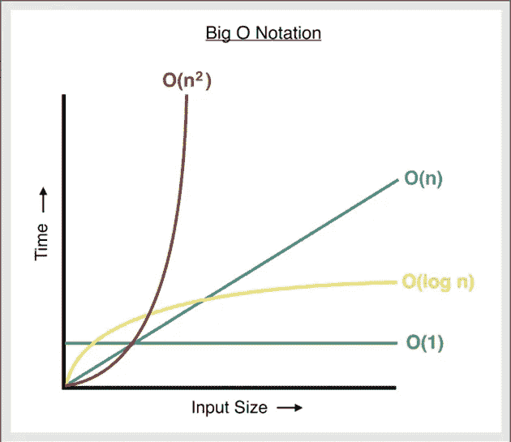

# 时间和空间复杂性

> 原文：<https://medium.com/analytics-vidhya/time-and-space-complexity-3b8016c0f3ae?source=collection_archive---------17----------------------->

**什么是时间复杂度？**

通过观察运行时间如何根据输入增长，时间复杂度可以用来确定我们的算法是否能够在要求的时间内运行。我们不以秒来衡量运行时间，因为它取决于我们不想考虑的各种因素。我们对大量输入的算法行为感兴趣。

**我们如何测量时间复杂性？**

Big-O 符号给出了算法时间复杂度的上限。

假设我们有一个函数 T(n ),它给出了一个算法的运行时间，其中 n 是输入的数量。如果我们能找到一个函数 f(n ),当它乘以 c 时大于 T(n ),那么我们可以说 f(n)是 T(n)的上界。

这在数学上可以表示为 T(n) <= c * f(n). And we write it as O(f(n)).

**如何计算大 O**

I)将你的算法分解成单独的操作。
ii)计算每个操作重复的次数。
iii)把所有东西加在一起。
iv)去掉常数的倍数。
v)去掉低阶项。

我们去掉了所有的常数倍数和低阶项，因为它们对输入的大值贡献不大。我们将在下面的例子中看到这些步骤。

**有哪些不同的时间复杂度？**

**1。恒定时间**

```
int average(int a, int b) { 
   int avg = (a+b)/2; // occurs once 
   return avg; // occurs once }
```

将所有值相加后，我们得到:
1 + 1 = 2

在这个函数中，每一步都出现一次，所以在将所有步骤相加之后，我们得到 2。可以写成 O(1 ),因为我们会去掉所有的常数倍数。

因此，随着输入的增加，算法所用的时间保持不变。

**2。线性时间**

```
int find(int arr[], int key) {
    int n = sizeof(arr);         // 1
    for(int i = 0; i < n; i++) { // n
        if(arr[i] == key)        // 1
            return i;            // 1
    }
    return -1;                   // 1
}
```

将所有值相加后，我们得到:
1 + n * (1 + 1)+1
= 2 + 2n

我们将 for 循环中的值(即 1 + 1)乘以循环发生的次数(即 n ),因为 for 循环中的步骤将重复 n 次。

去掉低阶项 2，我们得到 2n。那我们就把常数乘以 2。所以时间复杂度由 O(n)给出。

因此，随着输入的增加，算法所用的时间线性增加。

**3。二次时间**

```
int findDuplicates(int array[]) {
    int n = sizeof(array);                        // 1
    for (int i = 0; i < n; i++){                  // n
        for (int j = 0; j < n; j++){              // n
            if (i !==j && array[i] == array[j]){  // 1
                return i;                         // 1
            }
        }
    }
    return -1;                                    // 1
}
```

将所有值相加后我们得到:
1+n *(n *(1+1))+1
= 2+2n^2

去掉低阶项和常数倍数，我们得到 O(n^2).

因此，随着输入的增加，算法所用的时间以二次方式增加。

**4。对数时间**

日志被写成日志ₓ y

对数₂ 8 = 3
你可以把它想成我们把多少个 2 相乘得到 8。答案是 3。

现在我们来看看二分搜索法。该算法的运行方式类似于我们在字典中搜索单词的方式。假设我们在中间的某个地方打开字典。如果我们要找的单词在左半部分，我们忽略右半部分，然后再把左半部分分成两半。

如果我们继续这样做，我们最终会找到我们要找的单词，因为字典里的单词是按字母顺序排列的。类似地，如果我们有一个排序的数组，我们想寻找一个值 x，我们可以应用二分搜索法。

```
int binarySearch(int arr[], int x) {

    int l = 0;
    int h = sizeof(arr)-1;

    while (r >= l) {
        int mid = l + (r - l) / 2;

        // If the element is present at the
            // middle itself
            if (arr[mid] == x)
            return mid;

            // If element is smaller than mid, then
            // it can only be present in left subarray
            if (arr[mid] > x)
        h = mid - 1;

            // Else the element can only be present
            // in right subarray
    	if (arr[mid]<)x
    		l = mid + 1;
    }

    // We reach here when element is not present
    // in array
    return -1;
}
```

在这种算法中，我们必须处理的数据量随着每次迭代减少了一半。

n/2，n/4，n/8 …

因此，在最坏的情况下，我们将在最后一次迭代中找到元素，也就是说，我们继续划分，直到只剩下一个元素。

这在数学上可以用 n/n = 1 来表示。分母可以用 2 的幂来表示，因为我们每次迭代都要除以 2。

因此我们可以把它写成 n/2^k = 1，其中 k 是我们除以 2 的次数。∴ n = 2^k

因为 k 是我们除以 2 的次数，所以 k 将给出在最坏情况下得到该数所需的迭代次数。方程 n = 2^k 可以写成 k =对数₂(n).因此时间复杂度为 O(log n)。

因此，随着输入的增加，算法所用的时间以对数方式增加。

因此，如果循环变量除以或乘以一个常数，则循环的时间复杂度被认为是 O(logn)。

```
for (int i = 1; i <=n; i *= c) {
    // some O(1) expressions
}
for (int i = n; i > 0; i /= c) {
    // some O(1) expressions
}
```



在这里，我们可以看到我们上面讨论的不同时间复杂性，以及它们之间的相互比较。O(1)最快，O(n 2)最慢。

还有其他的时间复杂度，比如 O(nlog n)，O(c n)，O(n！)我们将在以后的帖子中讨论这个问题。在那之前，你可以[注册](https://tinyletter.com/rohitdhatrak)来获得新帖子的通知。

需要注意的一个有趣的事情是，对于较小的值，O(log n)比 O(n)慢。但是我们并不真正关心小值，当输入很大时，我们检查算法的行为。

**什么是空间复杂性？**

它与时间复杂度相同，但我们不是看我们的算法随着输入的增长花费了多少时间，而是看我们的算法随着输入的增长消耗了多少空间。

我们经常优化时间而不是空间，因为通常空间不是问题，但我们希望我们的算法更快。然而，在像使用嵌入式系统这样内存有限的场景中，空间复杂度变得同样重要。

如果你喜欢这个帖子，或者有任何问题/建议，请随时在任何社交媒体平台上联系。

*原发布于*[*https://rohitdhatrak . netlify . app*](https://rohitdhatrak.netlify.app/time-space-complexity/)*。*