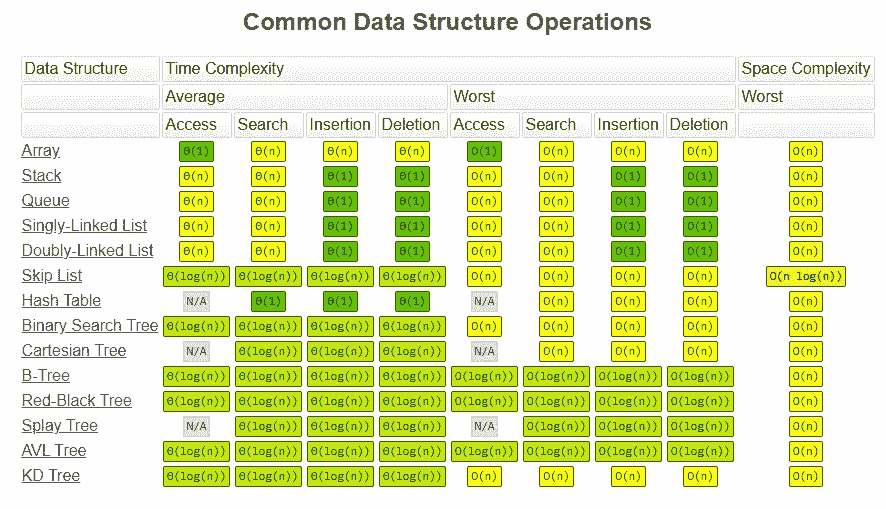
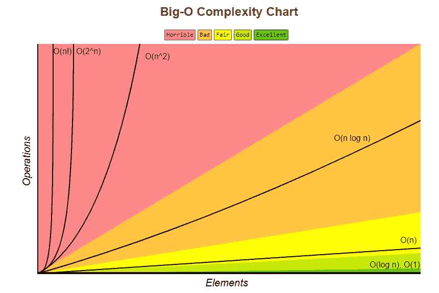
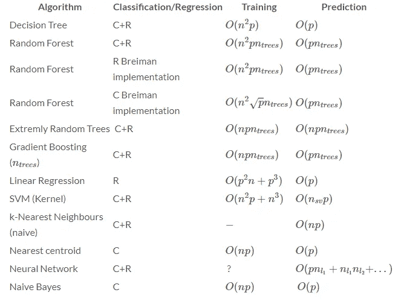

# 简化了时间和空间复杂度。如何降低它的可扩展性？

> 原文：<https://medium.com/analytics-vidhya/time-and-space-complexity-simplified-how-to-reduce-it-for-scalability-435304f64191?source=collection_archive---------7----------------------->


在 [Unsplash](https://unsplash.com?utm_source=medium&utm_medium=referral) 上由 [Aron 视觉](https://unsplash.com/@aronvisuals?utm_source=medium&utm_medium=referral)拍摄的照片

> **为什么这很重要？**

作为数据科学家，总有人问我们代码或模型的时间和空间复杂度是多少？

低时间和空间复杂度对于代码的可伸缩性非常重要。

> **它到底是什么？**

今天，我们来看看它到底是干什么的，怎么计算的。

如果我们考虑一个顺序搜索的例子。

```
list=[1,2,3,4,5,6,7,.......,n]
```

因此，在上述列表中搜索特定元素所需的时间取决于列表的长度(n)。在上面的列表中，要搜索第 7 个元素，需要 7 次迭代。类似地，搜索列表中的最后一个元素，需要 n 次迭代。

**所以这里的时间复杂度是 O(n)，即 n 的阶**

但是程序所需的空间是常数，所以空间复杂度是 O(1)。



信用:[https://www.bigocheatsheet.com/](https://www.bigocheatsheet.com/)

这就是数据结构操作的时间和空间复杂度。数组的时间复杂度是 O(n)，而哈希表(字典)的时间复杂度是 O(1)。

通过这样做，让我们降低代码的时间复杂度。

> **任务**

这里我们的任务是找到并计算两个列表中的公共元素。

首先，我们将使用传统的方法，通过使用 for 循环来比较两个列表。

```
l1=[2,4,6,8,10,12,14,16,18,20]
l2=[3,6,9,12,15,18,21,24,27,30]
common_element=[]
count=0
for i in l1:
    for j in l2:
        if j==i:
            common_element.append(j)
            count+=1
print('common elements:', common_element)
print('number of common elements are:',count)----------------------------------------------------
output
----------------------------------------------------
common elements: [6, 12, 18]
number of common elements are: 3
```

在这里，我们一个接一个地检查列表 l1 中列表 l2 的元素。

**所以时间复杂度为 O(长度(L1)*长度(l2))，空间复杂度为 O(1)。**

我们知道数组的时间复杂度是 O(n ),但是哈希表(字典)的时间复杂度是 O(1 ),这意味着查找任何元素只需要一次迭代。

所以，让我们使用哈希表来降低时间复杂度。

```
l1=[2,4,6,8,10,12,14,16,18,20]
l2=[3,6,9,12,15,18,21,24,27,30]
dict={}
common_element=[]
for i in l1:
    dict[i]=1
count=0
for j in l2:
    if dict.get(j) == 1:
        common_element.append(j)
        count+=1
print('common elements:', common_element)
print('number of common elements are:',count)
----------------------------------------------------
output
----------------------------------------------------
common elements: [6, 12, 18]
number of common elements are: 3
```

这里我们创建了一个字典，它有一个列表元素的键，值为 1。我们不关心值，因为我们已经将值 1 赋给了列表 l1 的元素。
如果我们得到列表 l2 的元素的相同值(1 ),那么我们认为这个元素是公共的。

**该码的时间复杂度为 O(长度(L1)+长度(l2))。**

哇，我们把时间复杂度从 O(l1*l2)降低到 O(l1+l2)。

> 这种策略将帮助我们在处理大型数据集时减少运行时间。



信用:[https://www.bigocheatsheet.com/](https://www.bigocheatsheet.com/)

> **奖金:**

机器学习模型的训练和运行时间复杂性。



信用:thekerneltrip.com

```
n : number of training sample
p : number of features
ntrees : number of trees
nsv : Number of support vectors.
nli : number of neurons at layer i in a neural network
```

希望这个博客能帮到你。

[https://forms.gle/3QE4Kb4AMLDjwTK78](https://forms.gle/3QE4Kb4AMLDjwTK78)

我很乐意在 [Linkedin](https://www.linkedin.com/in/prafulla-dalvi-417708104/) 上与你联系。

谢谢你，❤️