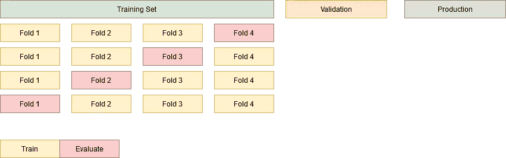
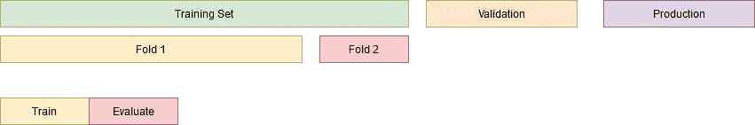
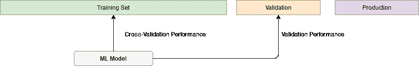
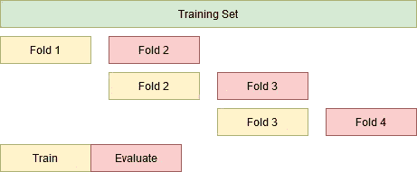
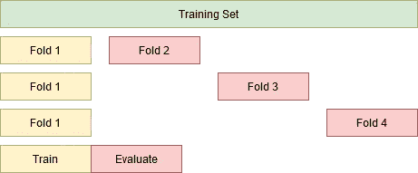
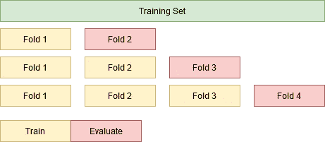
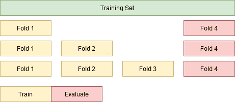

# 时间感知交叉验证

> 原文：<https://medium.com/analytics-vidhya/time-aware-cross-validation-a39ec079fa11?source=collection_archive---------14----------------------->

如何运用交叉验证的概念来提取对时间敏感数据的洞察。

在这篇文章中，我们提出了交叉验证技术的高层次概述，以及我们如何使它适应时间敏感的数据。这些技术并不新颖，可以在现有文献中找到。这里的目标是以一种易于理解、直观和简洁的方式呈现它们。

在 [Unsplash](https://unsplash.com?utm_source=medium&utm_medium=referral) 上由 [Ishant Mishra](https://unsplash.com/@ishant_mishra54?utm_source=medium&utm_medium=referral) 拍摄的照片

# 评估性能

> 在训练和部署机器学习模型时，估计泛化**性能是至关重要的一步。数据科学家的最终目标是建立数据管道，训练机器学习模型，这些模型能够进行归纳，并在生产中获得良好、一致的结果。**

在一个典型的现实场景中，我们有 3 个数据源(在培训阶段有相应的可用性):

1.  训练，*用于训练和优化模型，可用；*
2.  验证，*通常作为源 1 的保持。，用于估计部署性能，可用*；
3.  生产，*直到模型部署后才能看到，不可用。*

我们专注于在训练阶段尽可能达到最佳表现，而不丧失概括能力；最大化训练集的性能，并在验证和*(希望)*生产中保持这样的性能。

因此，了解模型在这些多个阶段的表现非常关键，确保我们的模型不会过度适应训练数据，并且仍然能够在生产中正确预测。评估这种模型泛化能力的一种常用技术是**交叉验证**。

# 古典环境

C ross validation 是一种标准的重采样技术，用于在大小受限的数据集下评估机器学习模型的泛化性能。通过将数据集分成几个折叠(即数据块)，我们可以迭代地去掉一个折叠，用剩余的折叠进行训练，并评估样本外折叠的性能。这一过程俗称 **K 倍交叉验证**，其中 K 代表折叠次数。

K 倍交叉验证(K=4)

你可以把更简单的**训练/测试分割**想成 K 倍，K=2。

训练/测试分割(K=2)

应用 K 倍将为我们提供 K 个性能指标样本(如召回率、精确度)，我们不仅可以计算它们的典型行为(如平均值、中值)，还可以计算它们的可变性(如标准差)。

> 根据具体情况，可以根据模型的稳定性(即 K 倍分数的低可变性)而不是绝对性能(即较高的平均值)来决定选择哪些模型投入生产。

# 测量交叉验证

良好的交叉验证设置应该能够对验证数据集和生产数据集的泛化性能提供良好的评估。**验证性能**可定义为根据从未见过但在训练阶段可用的数据评估模型。理想情况下，它应该对我们的概括能力提供一个无偏的估计。因此，如果我们观察到*验证绩效*和*交叉验证绩效*之间非常不同的结果，我们需要重新评估我们对训练中绩效评估技术(即交叉验证)的依赖。

比较交叉验证和验证性能

# 时间敏感数据

> 使用 K-Fold 交叉验证的一个主要缺点是它不足以衡量时间敏感数据的性能，因为用未来训练和评估过去可能会导致我们对自己的预测能力过于自信。

当数据的特征(如值、模式)与时间的流逝直接相关时，我们说数据是**时间敏感的**。常见的例子有股票价格、传感器数据监控或欺诈检测。
*举例:如果我们已经在数据中看到，那么很容易说传感器会有缺陷或股票价格会在未来上涨。*

我们将考虑一个用时间敏感数据衡量绩效的黄金法则:**用过去训练，用未来评估**。这种简单的启发防止我们过于自信地估计我们的模型的推广能力。

尽管不能使用经典的 K-Fold 交叉验证，但有一些交叉验证的变体，这里表示为**时间感知交叉验证**技术，允许利用子集化训练数据的概念来更好地估计我们模型的泛化性能。

我们现在将放弃验证和生产数据集，因为我们将专注于根据训练数据集评估性能。

# 洞察力#1 —时间敏感性

O 评估时间敏感数据的泛化性能的一个关键方面是了解时间的变化如何影响我们模型的性能。如果我们面临**概念漂移**，即输入和输出之间的潜在关系随时间推移而变化，我们可能会从模型训练中观察到不同的性能指标，这些模型具有相同的训练和验证集大小，只是随时间向前移动。

洞察力# 1——相同的褶皱尺寸，不同的时代

# 洞察力# 2——模型衰退

当处理时间敏感数据时，我们可以观察到用于训练阶段的模式可能不适用于未来的预测。在这种情况下，我们将观察到**模型衰减**，这意味着我们模型的性能将随着时间的推移而下降，导致后续折叠中的性能不断下降。

洞察力# 2——相同的培训倍数，不同的评估倍数

# 洞察# 3—训练集规模的影响

D 根据你用之前的见解估计的模型性能，你可能需要为这个模型使用不同的替代方案。这里的基本练习是评估增加训练集大小如何影响模型的性能。

## 洞察力#3.1

*如果模型性能对时间高度敏感，应谨慎处理(参见洞察#1)。*

在这种替代方案中，我们增加数据集训练大小，以在每个步骤中包括一个以上的折叠，并在下一个折叠上进行评估。*例子:Train(Fold1)&Evaluate(Fold2)，Train(Fold1+Fold2)&Evaluate(Fold3)等等。*

洞察#3.1 —增加折叠，评估下一次

## 洞察力#3.2

*如果模型性能出现严重衰退，应谨慎处理(参见洞察#2)*

以前方法的一个主要问题是，我们在每一步都基于不同的数据(即不同的评估倍数)来比较性能。这不允许我们理解增加数据集大小对于在相同数据中进行预测有什么影响。

因此，对于这种见解，我们将修复评估折叠，并迭代地增加训练集的大小。我们现在将在相同的规则下竞争，即相同的评估数据折叠，但模型衰减现在可能会影响我们的预测。

洞察#3.2 —相同的评估倍数，增加培训规模

# 结论

我们提出了**交叉验证**的概念，特别是 **K 倍交叉验证、时间敏感数据**及其不兼容性。为了实现时态数据的交叉验证，我们描述了 3 个主要观点及其适用性，以更好地估计和理解模型泛化性能。

> 没有哪种观点比其他观点更好/更可取(因为它们服务于不同的目的),它们都应该捆绑在一起分析。