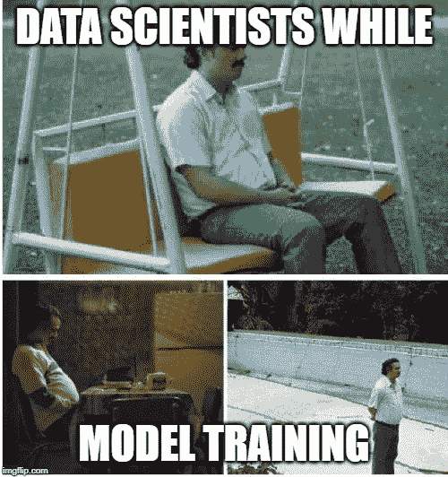
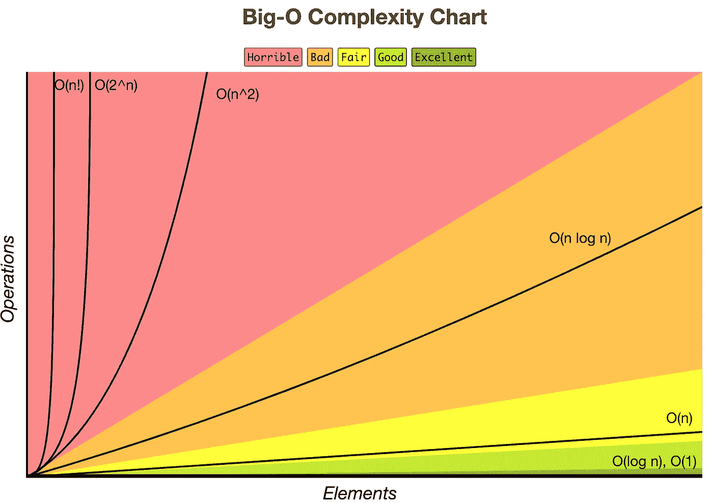

# ML 模型的计算复杂性

> 原文：<https://medium.com/analytics-vidhya/time-complexity-of-ml-models-4ec39fad2770?source=collection_archive---------2----------------------->

如果你曾经面临这样的场景，恭喜你，这意味着你有大量的数据:D :D.
知道计算的复杂性在机器学习中非常重要。

所以我的题目是，**“ML 模型的计算复杂性是什么”**

**时间复杂度**可以被视为对输入大小的算法执行快慢的度量。时间复杂度总是相对于某个输入大小(比如 n)给出的。
**空间复杂度**可以看做是你执行算法所需要的额外内存量。像时间复杂度一样，它也是相对于某个输入大小(n)给出的。

算法/模型的复杂性通常用**大 O 符号表示，**定义了一个算法的上界，它只从上面限制一个函数。
下图显示了算法复杂性的不同情况。

[http://bigocheatsheet.com/](http://bigocheatsheet.com/)

为了写出计算复杂度，我们假设，
n=训练样本的数量，d=数据的维数，
k=邻居的数量

> ***K 近邻的复杂度*** 寻找 K 近邻

***训练时间复杂度*** *= O(knd)*
循环通过每个训练观测，并计算训练集观测和新观测之间的距离 *d* 。

时间与实例数量(n)和维度(d)成线性关系。

***空间复杂度****= O(nd)*
K 个最近邻存储数据。测试需要更长的时间，因为你必须将每个测试实例与整个训练数据进行比较。

> ***逻辑回归的复杂性***

训练时间复杂度意味着在逻辑回归中，它意味着求解最优化问题。
***列车时间复杂度=****【O(nd)*

***空间复杂度****= O(d)*
**注:**逻辑回归对于低延迟应用非常好。

> ***SVM 的复杂性***

***训练时间复杂度*** =O(n )
注意:如果 n 较大，避免使用 SVM。

*= O(K * d)
K =支持向量的数量，d =数据的维数*

> ****决策树的复杂性****

****训练时间复杂度*** = O(n*log(n)*d)
n=训练集中的点数
d =数据的维数*

****运行时复杂度*** = O(树的最大深度)
**注:**当我们有大量低维数据时，我们使用决策树。*

> ****随机森林的复杂性****

****训练时间复杂度***= O(n * log(n)* d * k)
k =决策树数量
注:当我们有大量特征合理的数据时。然后我们可以使用多核来并行化我们的模型，以训练不同的决策树。*

****运行时复杂度*** = O(树的深度* k)
***空间复杂度*** = O(树的深度*k)
注意:随机森林相对其他算法要快一些。*

> ***朴素贝叶斯的复杂性***

****训练时间复杂度*** = O(n*d)
***运行时间复杂度****=*O(c * d) *我们必须为每个类检索特征‘c’**

***结论:** 如果你的数据量很大，选择算法是基于你要解决的业务问题。如果需要降低计算的复杂性，尽量减少数据的维数。如果你们有任何疑问，请随时在下面评论。
跟我连线-[https://www.linkedin.com/in/paritosh-kumar-3605a913b/](https://www.linkedin.com/in/paritosh-kumar-3605a913b/)*

***参考文献:** [https://www.appliedaicourse.com/](https://www.appliedaicourse.com/)
[https://stats . stack exchange . com/questions/96995/machine-learning-classifiers-big-o-or-complexity](https://stats.stackexchange.com/questions/96995/machine-learning-classifiers-big-o-or-complexity)
[https://imgflip.com/](https://imgflip.com/)*