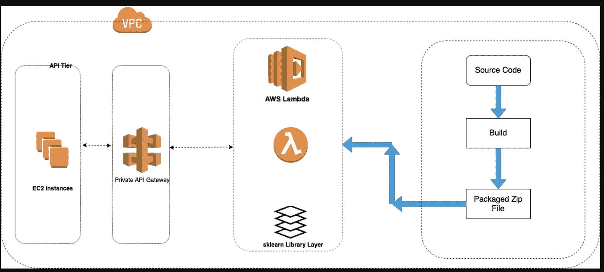

# 使用 AWS Lambda 进行省时高效的 ML 模型部署

> 原文：<https://medium.com/analytics-vidhya/time-cost-effective-ml-model-deployment-using-aws-lambda-8d60d8854e8e?source=collection_archive---------20----------------------->

# 介绍

在本文中，我将介绍在 AWS lambda 上部署 ML 模型的两种不同方法。

AWS Lambda 总是第一选择，因为它便宜，可自动扩展，我们只为我们提出的请求付费。

第一种方法是从 s3 bucket 读取 ML 模型的经典方式，对于第二种方法，ML 模型将与 lambda 函数代码一起压缩，并直接上传到 Lambda。

## 方法 1

在 Lambda 上部署 ML 模型，并将 ML 模型放在 s3 存储桶中。


> S *步骤#1* ***创建压缩层***

层是包含库、自定义运行时或其他依赖项的 ZIP 存档。

对于我的模型，sklearn 和 pandas 库都是必需的，因此我使用 Docker 创建了一个 Lambda 层(sklearn 和 pandas 库)。

创建一个文件，将其命名为“createLayer.sh ”,并将下面的代码复制到其中。

```
if [ "$1" != "" ] || [$# -gt 1]; thenecho "Creating layer compatible with python version $1"docker run -v "$PWD":/var/task "lambci/lambda:build-python$1" /bin/sh -c "pip install -r requirements.txt -t python/lib/python$1/site-packages/; exit"zip -r sklearn_pandas_layer.zip python > /dev/nullrm -r pythonecho "Done creating layer!"ls -lah sklearn_pandas_layer.zipelseecho "Enter python version as argument - ./createlayer.sh 3.6"fi
```

现在，在同一个目录中，创建另一个文件‘requirements . txt’来存储您想要为其创建层的库的名称和版本。在我的例子中，我将为 pandas 和 sklearn 库创建一个层，包括下面提到的版本。

```
pandas==0.23.4
scikit-learn==0.20.3
```

接下来，转到你已经放置了 2 个以上文件的终端，运行下面的命令为 lambda 层生成一个压缩文件夹。

要运行的命令:

```
./createlayer.sh 3.6
```

生成的图层是 zip 格式，适合上传到 s3。这个 zip 文件的内容应该是这样的:


步骤#2 **放置 ML 模型和 Lambda 层在 S3**


步骤#3 **配置λ函数&λ层**

在这里，我们已经准备好了模型和 lambda 层。让我们通过创建一个新的 lambda 函数来开始配置 lambda。将步骤#1 中的 lambda 层添加到 s3 bucket 的函数中。

为 lambda 函数添加层，点击层→创建层。如下所示定义层的配置。


当层被创建时，你在屏幕上得到下面的成功信息。


关于λ层的一些要点:-

1.  Lambda 层需要是压缩文件
2.  对于给定的 lambda 函数，最多可以有五个 lambda 层
3.  lambda 层不能大于 250MB(总计，解压缩后)

现在，转到 Lambda function，点击“层”添加一个 Lambda 层。


选择自定义层选项，并选择新创建的 lambda 层及其特定版本。单击“添加”将其添加到 Lambda 函数中。


在 lambda 处理函数中编写以下代码

```
import json
import pickle
import sklearn
import boto3
import pathlib
import jsons3 = boto3.resource('s3')
filename = 'ml_model.pkl'
file = pathlib.Path('/tmp/'+filename)
if file.exists ():
    print ("File exist")
else :
    s3.Bucket('deployingmlmodel').download_file(filename, '/tmp/ml_model.pkl')
def lambda_handler(event, context): model = pickle.load(open('/tmp/'+filename, 'rb'))
y    print("provide input here")
    #pred = model.predict(""provide input here"")
```

总的来说，lambda 现在应该有 1 层和上面提到的 Lambda 函数中的代码。


我们已经成功地添加了所需的依赖项(sklearn 和 pandas ),并在 AWS Lambda 上部署了 ML 模型。现在可以测试和查看 ML 模型预测了。

## 方法 2

通过用 lambda 函数压缩 ML 模型，将它直接上传到 Lambda



首先在 Predict.py 中创建一个模型文件& lambda 处理程序代码的压缩文件，然后将这个压缩文件(ml model 和 Predict.py 的)上传到 lambda 的 *upload a .zip file* 选项。


使用下面突出显示的选项*上传. zip 文件*将其上传到 Lambda


如果你的压缩文件小于 10MB，你可以直接从这里上传，或者先保存在 s3 中，然后从那里引用压缩文件。


一旦上传成功，你的 Lambda 函数应该是这样的。


我们已经成功地部署了 zip 格式的 ML 模型以及 LambdaHandler 代码。

从两个方面检查您的响应时间。对我来说，我的第一个电话在 10-12 秒内得到了回复，接下来的电话不到 1 秒。

# **使其生效**

虽然 Lambda 方法具有成本效益，但对于第一次调用，如果 Lambda 容器没有运行，那么当 Lambda 函数被调用时，它必须在 Lambda 运行时环境中下载 Lambda 容器，这是一个耗时的过程。

所以这里的问题是，如何从第一次调用开始就使 Lambda 逼近时间有效？

按照下面解释的过程添加 lambda 触发器，在使用 lambda 方法进行 ML 模型部署时，可以节省一些时间。

**添加 lambda 触发器的步骤:**添加一个 CloudWatch 事件来保持 lambda 的热度，并确保 Lambda 容器一直在运行。在下面的截图中，我创建了一个新的规则来触发 Lambda 函数' DeployMlModel '每 5 分钟触发一次，这样它就会不断地检查模型是否可用，否则就下载它。因此，它将使 ML 模型始终可用，而不是在 api 调用期间下载模型。它还可以被配置为在特定的时间段运行，例如营业时间或非营业时间。


创建规则后，您可以查看它，如下所示。


在下面的截图中，你还可以看到一个触发器被添加到 Lambda 中。


在 CloudWatch 日志中，您可以验证 Lambda 每 5 分钟调用一次，因此它将从 s3 下载模型，响应时间将大大减少。


现在有了 CloudWatch event，即使是第一次调用的响应时间也不到 1 秒。

# 最终注释

lambda 的唯一缺陷是它的部署包大小限制为 250MB。这意味着您可以压缩到一个部署包中的代码/依赖项的大小仅限于 250MB。因此，如果你的代码和 lambda 层的大小超过了大小限制，你会收到下面的错误。


我希望你喜欢这篇文章，下面是我写这篇文章时提到的几个链接:

# 参考

创建 lambda 层

[https://AWS . Amazon . com/premium support/knowledge-center/lambda-layer-simulated-docker/](https://aws.amazon.com/premiumsupport/knowledge-center/lambda-layer-simulated-docker/)

Lambda 的云观察事件

[https://docs . AWS . Amazon . com/Amazon cloud watch/latest/events/runlambdaschedule . html](https://docs.aws.amazon.com/AmazonCloudWatch/latest/events/RunLambdaSchedule.html)