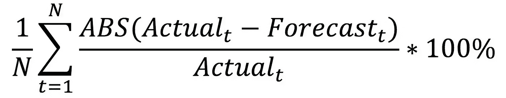
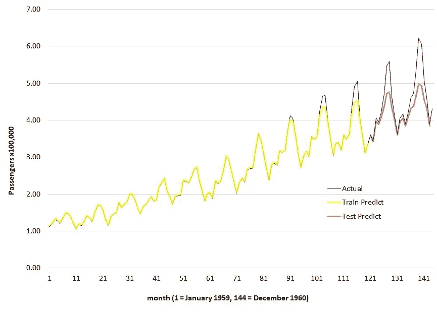
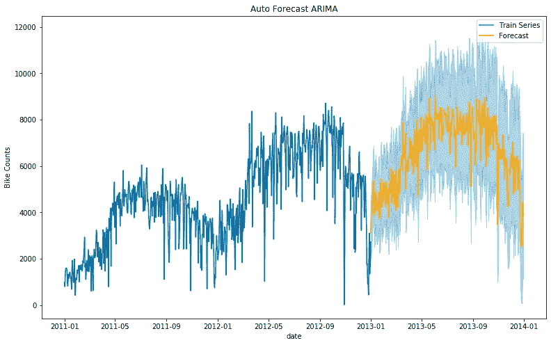
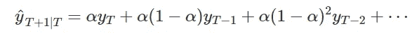
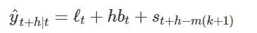
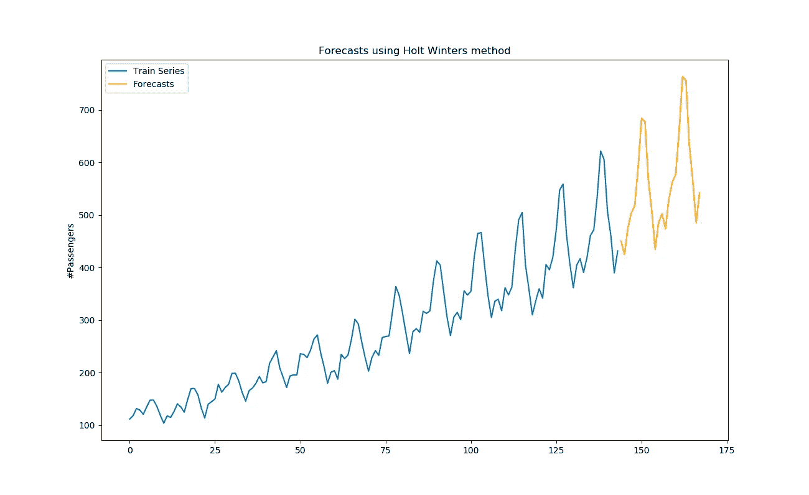
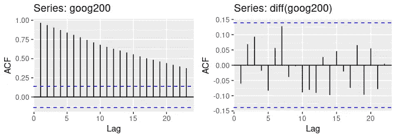
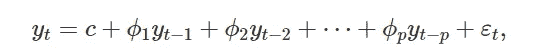
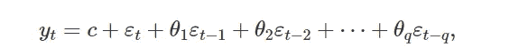

# 时间序列分析 102

> 原文：<https://medium.com/analytics-vidhya/time-series-analysis-102-fffe567c12a?source=collection_archive---------2----------------------->

对预测的深入研究

[https://redesulconsorcios . com . br/prev isao-para-o-cenario-economico-em-2019/](https://redesulconsorcios.com.br/previsao-para-o-cenario-economico-em-2019/)

在[第一部分](/analytics-vidhya/time-series-analysis-101-41273c277233)中，预测作为一种为时间序列数据建立未来基线的有用技术被简要介绍。虽然阅读简单的预测看起来很简单，但要正确使用这些预测，需要理解一些实际的细微差别。这篇文章将涵盖一些预测过程中最重要的警告。遵循上一篇文章的先例，即使是这次讨论也将是对编码部分的轻描淡写，更多地关注概念的整理。

## **预测实际上是如何工作的？**

时间序列预测主要包括两个阶段。首先训练阶段用于学习过去时间序列的行为。然后，预测阶段应用此学习行为来预测未来值。

让我们用一个例子来理解幕后发生的事情。

我们有一家商店过去两年的每月销售数据。设 X =[x1，x2，x3，x4…，x24]代表我们的月销售额。我们可能需要预测未来 6 个月的销售额。

**训练阶段** —包括学习一个函数 F(X)，该函数在给定所有过去销售值的情况下输出一个未来值。这个函数可以简单地认为是预测模型。

x+1 = F(x，x-1，x-2，…x1)

**预测阶段** —学习到的函数可用于计算未来销售值，如下所示，
x25 = F(x24，x23，…..x1)
x26 = F(X25，x24，… x1)以此类推…

训练阶段是一个经典的优化问题，我们学习代表我们的时间序列的模型。

## **如何衡量预测的准确性？**

在构建预测模型时，可用数据通常分为两组—训练集和验证/测试集。

训练集用于学习模型。然后，学习的模型被用于预测测试集周期。然后使用测试集的实际值和预测值计算准确度。使用了许多分数[但是为了便于理解，可以使用平均绝对百分比误差来计算准确度，如下所示:](https://otexts.com/fpp2/accuracy.html)

根据看不见的数据计算出的精度提供了一个关于模型在现实世界中根据未来数据表现如何的想法。下图显示了航空公司销售数据集的预测过程。黑线代表实际数据。橙色线代表学习模型，红色线代表测试期间的预测。

## **什么是预测预报区间？**

预测几乎总是伴随着一个预测区间。为每个预测值计算预测区间，该预测值表示实际值将位于所述置信百分比内的范围(下限和上限)。

例如，回想一下我们在[上一篇文章](/analytics-vidhya/time-series-analysis-101-41273c277233)中对自行车共享的预测，橙色预测周围的蓝色阴影区域表示 95%的预测区间。这意味着基于学习的模型，可以说实际的未来值将位于预测周围的阴影区域中，置信度为 95%。

## ***用于预测的模型有哪几种？***

如前所述，时间序列有许多组成部分，如趋势、季节性、不规则周期、噪声等。可以使用以不同方式学习这些特征的不同模型来进行预测。因此，预测的质量也将取决于选择哪种模型，以及它是否能捕捉到我们数据中的模式。虽然有许多类型的模型，如平滑，ARIMA，回归，基于深度学习等，这篇文章将简要讨论 2 个最广泛使用的模型——指数平滑和 ARIMA 模型家族。

## **指数平滑**

使用这种方法生成的预测只是过去观测值的加权平均值，随着观测值变老，权重呈指数衰减。换句话说，观察越近，相关的权重越高。例如，从时间 T+1 到时间 T 的给定数据的预测可以想象如下，其中α项表示模型学习的系数。

这是一个非常简单的发展直觉的模型，在现实生活中，数据会更复杂，我们将使用更复杂的平滑方程。例如，甚至 Excel 也在其预测功能中提供了平滑的变体。让我们看看更具体的**三重指数平滑**或**霍尔特温特斯季节性**方法。

霍尔特温特斯法由三个部分组成的预测方程组成，每个部分对应一个水平 **ℓt** ，趋势 **bt** 和季节性 **st** 。该模型具有如下形式，

在不深入实际平滑方程及其系数的细节的情况下，关键的一点是，这种方法分别学习趋势、水平和季节性，然后将它们结合起来生成预测。需要注意的一点是，每个平滑分量在其等式中都有相应的平滑系数 **α、β和γ** 。平滑系数由模型在训练过程中学习，不需要提供。下面是这种技术的一个简单用例，用于预测航空公司乘客的销售额

霍尔特温特斯法通常是一种快速简单的预测方法，只要您的数据具有趋势、季节性或某些模式，并且没有太多数据可供 ARIMA 等其他技术使用。

## ARIMA

与平滑不同，这种方法生成的预测依赖于时间序列之间的自相关。ARIMA 模型建立在以下三个组成部分之上:

***AR 模型— A*** uto ***R*** 离场(顺序 p)

***I*** 积分差分(d 阶)

***MV 型号— M*** 移动 ***A*** 平均值(顺序 q)

因此，ARIMA 模型是用这三个顺序 **(p，d，q)** 来描述的。对于模型的季节变化，同样的概念被扩展到季节周期，我们得到模型 **(P，D，Q)** 的季节顺序

> ***什么是差异？***
> 
> 一个时间序列叫做**平稳**它的值不依赖于时间。例如，随机噪声可以称为平稳噪声。
> 
> 另一方面，任何具有趋势或季节性的序列都是**非平稳的**，其值被称为具有**自相关性**。例如，如果我们考虑一个城市的温度值，今天的值在某种程度上与昨天的值相关，等等。
> 
> 我们可以通过**差分**来消除自相关并使时间序列平稳，其中我们用过去的值减去时间序列的当前值。
> 有统计测试来确定差分的**阶 d** (需要应用多少次差分来使序列稳定)。
> 
> ACF 图用于显示时间序列值之间的自相关。下图显示了谷歌股票价格的自相关性。第一个图显示原始序列的自相关性很高，对于过去的值逐渐降低。第二个图显示差分后的自相关性降低，并且序列几乎是稳定的。为了计算差分的顺序，我们通常选择具有最高自相关的滞后值，在第一个图中为 1，在第二个图中为 7。

> ***什么是自回归？***
> 
> 自回归是利用平稳时间序列本身的过去值来预测未来值的回归。这意味着序列的当前值被视为目标，滞后的过去值被视为回归变量来建立回归模型。回归方程具有以下形式，并且被认为要构建的分量(过去值)的数量被称为模型的**阶 p** 。

> 什么是移动平均线？
> 
> 在移动平均模型中，类回归模型建立在平稳时间序列的过去值的预测误差上，而不是值本身。下面是它的方程形式，从中可以看出，时间序列中的每个值 y(t)都表示为过去预测误差的加权移动平均值。模型中包含的误差项决定了**阶 q**

下面的代码片段使用一个基于 ARIMA 模型家族的基本[自动预测项目](https://github.com/prashantnbangar/pyforesight)来预测上面看到的自行车共享预测。

## **转换**

最后，时间序列预测中经常需要的一个重要的预处理步骤是使时间序列具有恒定的方差，因为大多数模型不会很好地处理数据中的增加/减少方差。这是通过对时间序列应用 box-cox 或双曲正弦等变换，对变换后的数据构建预测模型，进行预测，然后将预测逆变换到原始尺度来实现的。

通过研究一些广泛使用的技术和预测过程的内部原理，这篇文章让消费预测变得更加容易。然而，仍然有许多细节被跳过，以保持讨论的规模较小。

## 参考

 [## 时间序列分析 101

### 时间序列分析入门指南

medium.com](/analytics-vidhya/time-series-analysis-101-41273c277233)  [## 当霍尔特-温特斯比机器学习更好的时候

### 机器学习(ML)得到了大量的宣传，但它的经典前辈仍然非常强大，特别是在…

thenewstack.io](https://thenewstack.io/when-holt-winters-is-better-than-machine-learning/)  [## 预测:原理与实践

### 购买印刷版或下载版欢迎来到我们的预测在线教材。这本教科书旨在提供…

otexts.com](https://otexts.com/fpp2/)  [## prashantnbangar -概述

### 从事机器学习和深度学习的工作。对 rnn 和自动编码器感兴趣。取消注册您自己的…

github.com](https://github.com/prashantnbangar?tab=repositories)