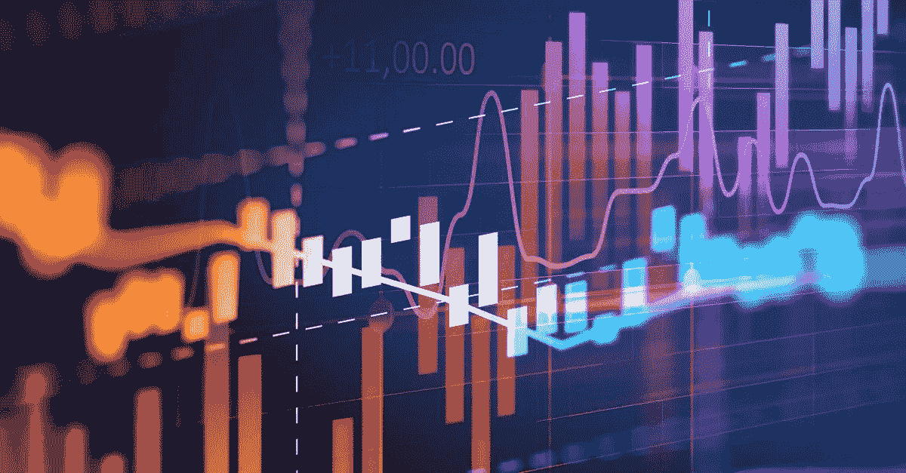
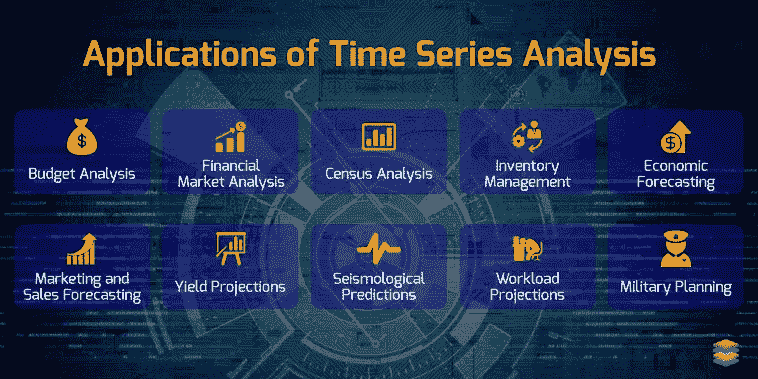
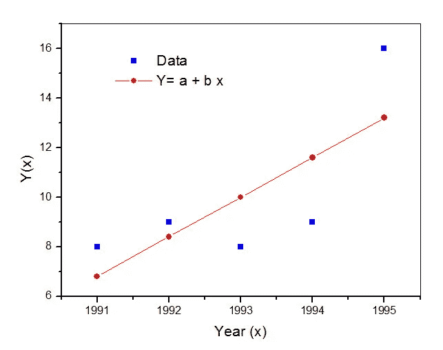
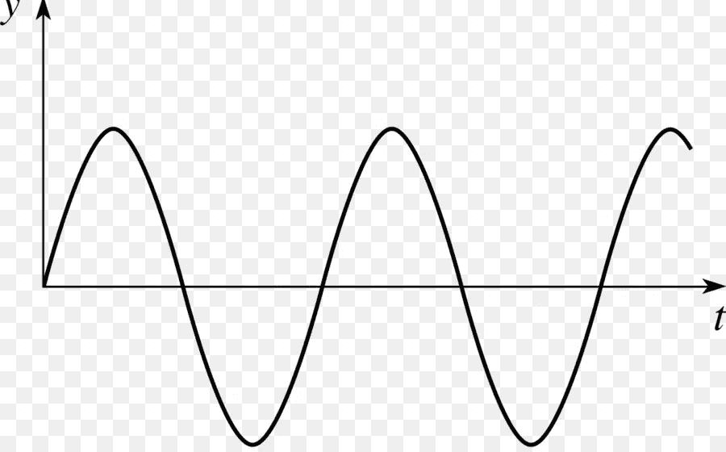
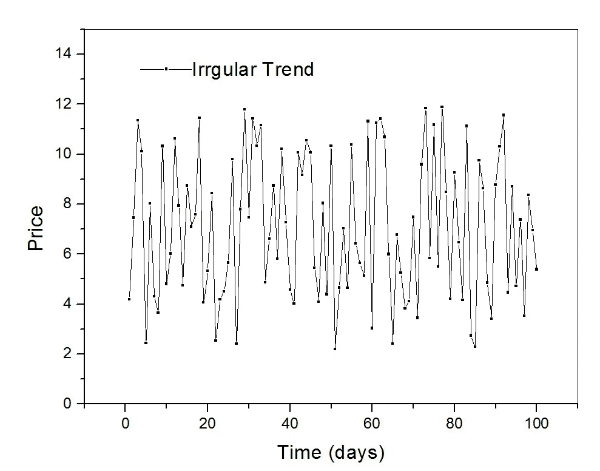

# 时间序列分析

> 原文：<https://medium.com/analytics-vidhya/time-series-analysis-84126c2f3097?source=collection_archive---------11----------------------->

**时间序列分析**是*一个***有序** ***序列*** *中一个变量的值以相等的* ***间隔时间*** *间隔时间*

时间序列分析

为什么它如此重要

这可能是迄今为止机器学习中使用的最强大的技术之一，因为它使用时间维度作为输入参数，而大多数数据模型在这样做时并没有考虑到这一点..至少不明确。

目前在工业中，由于它从医学到农业的广泛实际应用，它是当务之急。

**简史**

时间序列分析的理论发展很早就开始于随机过程。自回归模型对数据的首次实际应用可以追溯到 20 世纪 20 年代和 30 年代 G. U Yule 和 J. Walker 的工作。

**时间序列的应用**

时间序列的一些重要应用

1.  经济预测(股票市场价格预测)
2.  产量预测(找出农作物在农业市场上的预期产量)

3.普查分析(从人口预测到未来的性别普查)

4.天气预报(预测一个地方或地区的未来天气)

…等等等等

**时间序列的实际意义**

它实际上只是使用用于训练目的的过去数据来预测未来数据趋势或数据点，但它从其他机器学习模型中分支出来的地方是，它可以使用时间作为数据分析的维度，而其他模型不使用这一功能，它可以理解趋势。

**时间序列的组成部分**

1.  长期趋势

在这个图中，数据点有点分散，但仍然画了一条线显示图形的方向

在这种情况下，数据沿着特定的方向前进，我们可以在这个方向上画一条直线，但数据可能会显示随机变化，如上下波动，但最终它要么向上移动，要么向下移动，永远不会大幅偏离这个方向。

2.季节性波动

数据受到季节参数的影响

在这种情况下，数据会受到一年中季节的影响。

最好用一个例子来解释

羊毛衫的销售在较冷的月份会增加，在较热的月份会减少。或者像苹果或橙子这样的季节性水果的销售。

它相对容易发现和预测，并且不需要先进的数据缩放或操作

3.周期性变动

循环数列图应该是这样的(正弦波)

在这种情况下，图形会以类似(上-下-上)或(下-上-下)的模式上下波动，这种模式很大程度上是遵循的，它看起来像一个粗略的正弦波，但这有一个问题，即我们无法预测图形下一次何时上下波动，即下一个模式何时出现，这可能需要几个月或几天甚至几年的时间。

4.不正常变动

这在本质上是完全随机的，也是最难预测的

在这种情况下，图表在本质上几乎是随机的，是时间序列中最难预测的。这是因为市场崩溃或暴乱等外部因素。

一个例子是，在选举期间，印度市场开始随机波动。

**时间序列的基本模型**

有两种基本的模型加法和乘法模型，在这两种模型中所有的变化参数分别被相加和相乘，在哪里使用哪一种取决于我们想如何显示模型所预测的变化。

*一)***加法模型**

**Y=T+S+C+I**

其中，Y =原始数据，T =趋势数据，S =季节波动，C =周期波动，I =**加法**模型误差

"**这是用于预测绝对单位变化的模型**"

*b)* ***乘法模型***

**Y=T*S*C*I**

其中，Y =原始数据，T =趋势数据，S =季节波动，C =周期波动，I=乘法**模型误差**

**此模型用于预测%** 的变化