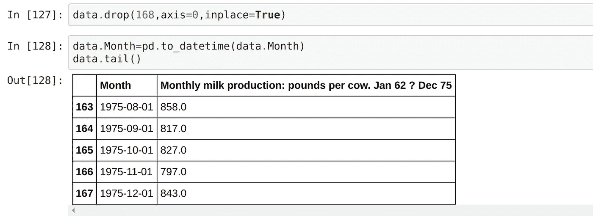
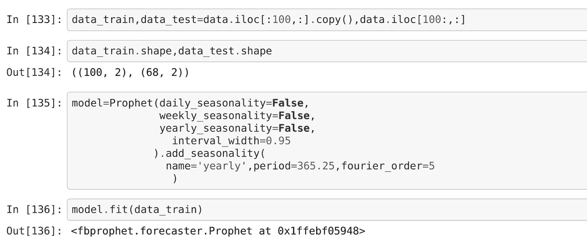

# 时间序列分析 fbProphet 快速浏览

> 原文：<https://medium.com/analytics-vidhya/time-series-analysis-a-quick-tour-of-fbprophet-cbbfbffdf9d8?source=collection_archive---------1----------------------->

相对于时间绘制的一系列数据点被称为*时间序列。*这是一种用于市场评估和天气预报的事实分析技术。这是一个令人兴奋的研究主题，因为它在某种程度上倾向于预测未来，这是我们一直感兴趣的。

有两种类型的机器学习(ML)模型用于时间序列分析:

1.  时间依赖模型
2.  一般可加模型

# 时间依赖模型

通过观察过去几天的天气，我们可以预测明天的天气。如果过去 4-5 天天气晴朗，那么明天天气晴朗的可能性很大。这是理解时间依赖模型的直观方式。过去值和现在值之间的相关性显示了时间依赖性。在这个模型中，我们给予最近的数据比旧的数据点更大的权重。这类模型的一些例子有 ARIMA *(自回归综合移动平均)、S* 、ARIMA *(季节性自回归综合移动平均)、*、LSTM *(长短期记忆)、*。

ARIMA 要求数据具有恒定的均值和方差，并且没有季节性。如果数据不满足上述条件，比方说，如果我们有一个有上升趋势的数据点，那么要使用 ARIMA，我们首先需要对它进行变换，并使它保持平稳。另一方面，LSTM 是一个强大的循环神经网络。LSTM 的预测非常准确，但是由于神经网络缺乏可解释性，导致预测的网络成分仍然未知。

# 一般可加模型

我们可以根据总体趋势训练我们的模型，并添加一些季节效应，而不是使用来自相似时间戳的值之间的相关性。GAM 背后的原理类似于*回归*模型。与使用单个预测因子来预测结果的回归不同，GAM 使用平滑函数的和来预测结果。这里的平滑函数包括描述趋势分量、季节分量、假日分量等的函数。由于 GAM 由函数组成，我们可以分离出单个函数并评估其在预测中的作用，这使得 GAM 更具可解释性。GAM 的一个例子就是 fbProphet。

## FB 先知

FbProphet 是脸书核心数据科学团队发布的一个强大的时间序列分析包。这是一个简单易用的软件包，用于执行时间序列分析和 ***规模预测*** 。

根据官方[先知网站](https://facebook.github.io/prophet/):

> Prophet 是一种基于加法模型预测时间序列数据的过程，在该模型中，非线性趋势与每年、每周和每天的季节性以及假日影响相适应。它最适用于具有强烈季节效应的时间序列和几个季节的历史数据。Prophet 对缺失数据和趋势变化非常稳健，通常能够很好地处理异常值。

一个没有时间序列培训专业知识的分析师可以调整一些可解释的参数，并在 Prophet 中获得一个好的预测模型。

脸书大学的数据科学团队发现，通过将自动预测与分析师在回路中对特殊情况的预测相结合，有可能涵盖各种各样的业务用例。下图说明了 prophet 中使用的预测流程:


Prophet 使用一个可分解的时间序列模型，它有三个主要的模型组件:趋势、季节性和假日。它们在以下等式中合并:

**y(t) = g(t) + s(t) + h(t) + e(t)**

这里，

*   g(t)是对非周期性变化建模的趋势函数。它可以是线性函数，也可以是逻辑函数。
*   s(t)代表周期性变化，即每周、每月、每年。使用傅立叶级数模拟每年的季节性成分，使用虚拟变量模拟每周的季节性成分。
*   h(t)是一个函数，表示不规则时间表中出现的节假日的影响。(n≥1 天)
*   e(t)项表示模型不适应的误差变化。

先知的研究论文可以在这里找到[](https://peerj.com/preprints/3190.pdf#section.1)**。**

# *装置*

*Prophet 有 python 和 r 两种版本。这个故事涵盖了 Prophet 的 Python 安装和实现。*

*可以使用 Python 中的 pip 安装 Prophet，如下所示。Prophet 依赖于一个名为`pystan.`的 Python 模块，这个模块将在我们安装 Prophet 时自动安装。*

```
*pip install fbprophet*
```

# *例子*

*因为 prophet 最适合处理季节性数据，所以我在这里使用了简单的年度季节性数据。*

*让我们导入必要的库以及 fb prophet 并读取数据集。*

**

*虽然 prophet 可以处理丢失的值，但是最好删除 NaN 值。数据集只有一个缺失值。删除缺少值的行，并将*月*列转换为日期时间类型。*

**

*Prophet 要求数据集的列有正确的命名约定。因此，根据 prophet 的要求，这些列被重命名为 *ds* 和 *y* 。现在，让我们可视化数据集。*

**

*数据集被分成训练集和测试集。prophet 模型根据每年的季节性进行实例化，并适合训练数据集。*

**

*现在，使用 prophet 的*make _ future _ data frame()*函数创建一个 68 个月(测试数据计数)的数据框架，模型在该数据框架中进行预测。*

**

*如果我们将上面的图表与实际数据进行比较，它们看起来非常相似。因此，该模型运行良好。*

*Fbprophet 提供了一个 *plot_component()* 函数，可以用来可视化时间序列的整体趋势和分量。*

**

*我相信我能够用一个强大的 prophet 包的简短演示来很好地描述用于执行分析和预测的时间序列分析和 ML 模型。如果您希望了解如何使用 prophet 对非周期性数据进行时间序列分析，您可以通过下面的链接访问我的 github repo。在那里，我也实现了 ARIMA 模型。*

*[](https://github.com/samiptimalsena/Time_Series_Analysis) [## samiptimalsena/时间序列分析

### 时间序列分析和预测。解散 GitHub 是超过 5000 万开发者的家园，他们一起工作来托管和…

github.com](https://github.com/samiptimalsena/Time_Series_Analysis)*