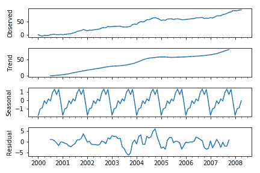
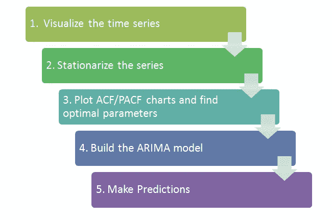

# 时间序列分析:导论

> 原文：<https://medium.com/analytics-vidhya/time-series-analysis-an-introduction-953241a03637?source=collection_archive---------29----------------------->

([来源](https://images.app.goo.gl/gaAKdTv3vwADe2Bu8))

无论是在销售预测、金融市场、经济预测、预算分析、股票市场分析还是电力消耗中,“时间”都是一个重要因素。

*时间*是时间序列分析中的演员之一。

**时间序列是在特定时间通常以相等的间隔进行的一组观测*。*** 时间序列预测是利用一个模型，根据以前观察到的值来预测未来的值。

例如，一个人拥有一家鞋店，并跟踪每月的销售额，如果他/她想预测下个月或明年的销售额，时间序列分析将方便他/她的预测。

> 在时间序列分析中，时间被作为一个独立变量。

# 时间序列的组成部分:

1.  **趋势:**趋势是时间序列的长期模式。趋势可以是正的，也可以是负的，这取决于时间序列显示的是增长的长期模式还是下降的长期模式。如果一个时间序列不显示增加或减少的模式，那么该序列是平稳的。
2.  **季节性:**当时间序列在每年的同一个月(或几个月)或同一个季度出现有规律的波动时，就会出现季节性。例如，冰淇淋的销售量在夏季会比冬季高。
3.  **不规则性:**捕捉数据中无法提前预测的随机变化，通常是由短期的、未预料到的、随时间推移出现的偶然因素引起的。
4.  **周期性:**任何围绕给定趋势上下波动的形态都被认定为周期性形态。一个周期的持续时间取决于被分析的企业或行业的类型。

## 何时不使用时间序列分析？

1.  当值不变时
2.  当值是函数的形式时

***平稳性*** *是时间序列*的重要特征。如果一个时间序列的统计特性不随时间变化，则称该时间序列是平稳的。它有**常数均值和方差**，协方差与时间无关。平稳性检验允许验证一个序列是否平稳。有两种不同的方法:平稳性检验，如 **KPSS 检验**，它认为 H0 数列是平稳的零假设；单位根检验，如**迪基-富勒检验**及其扩展版本**扩展迪基-富勒检验(ADF)。**

# 用于时间序列数据的模型:

1.  自回归模型
2.  移动平均模型
3.  自回归移动平均(ARMV)模型
4.  自回归综合移动平均模型
5.  自回归分数积分移动平均模型

# 框架:

([来源](https://images.app.goo.gl/aK4BPmpc7seuZcJ57))

利用时间序列分析预测飞机客运量的一个例子: [GitHub Link](https://github.com/anjaliverma17/Forecasting-Passenger-Traffic-in-Airplanes.git)

# 时间序列的应用:

时间序列分析用于许多应用，例如股票市场分析、过程和质量控制、库存研究、工作量预测、效用研究、产量预测、人口普查分析、金融市场、经济预测等。

# 结论:

时间序列分析不仅是一项重要的任务，而且是一项基本的任务。每个公司都必须了解销售和其他属性的趋势、季节性、周期性和随机性。