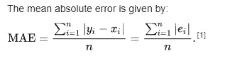
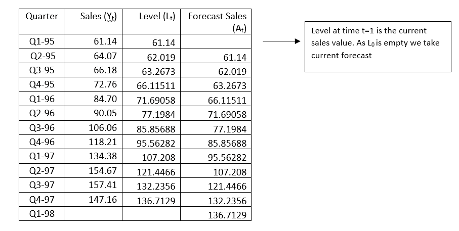

# 时间序列分析和预测

> 原文：<https://medium.com/analytics-vidhya/time-series-analysis-and-forecasting-a24873fafe8a?source=collection_archive---------4----------------------->

## **HARRAH 的收入管理**

**切诺基赌场&酒店**

预测的实际应用几乎从来不是孤立进行的。它们通常是业务问题整体定量解决方案的一部分，也是关键部分。正如 Metters 等人(2008)在一篇文章中所解释的那样，北卡罗来纳州的 Harrah's Cherokee Casino & Hotel 就是这种情况。这家赌场每天都使用收入管理(RM)来增加来自赌博客户的收入。当顾客打电话要求预订赌场的酒店时，关键问题是决定接受和拒绝哪些预订。

整体 RM 解决方案包括

> 数据收集和客户细分
> 
> 预测每个客户群的预订需求
> 
> 一种线性规划(LP)优化模型，经常运行以决定接受哪些预订
> 
> 一个客户关系管理模型，吸引忠诚的客户在需求较低的晚上预订房间

因此，如果我们要预测数据，温特斯的指数平滑模型是一个很好的预测技术。具体来说，该模型使用大量历史数据来预测每个客户群在未来任何特定夜晚的客户需求。这些预测包括与时间相关的信息或季节模式(例如，周末更繁忙)以及任何预定的特殊事件。

# **1。简介**

许多决策应用都依赖于对某一数量的预测。这里有几个例子。

> 当一个服务机构，比如一家快餐店，计划一段时间内的人员配备时，它必须预测顾客需求随时间的变化。这可以在非常详细的级别上完成，例如连续 15 分钟周期内的需求，或者在更汇总的级别上完成，例如连续几周内的需求。
> 
> 当一家公司为其销售给公众的产品计划订购或生产时间表时，它必须预测客户对该产品的需求，以便它可以储存适当的数量——既不太多也不太少。
> 
> 当一个组织计划投资股票、债券或其他金融工具时，它通常试图预测股票价格和利率的变动。
> 
> 当政府官员计划政策时，他们试图预测宏观经济变量的变动，如通货膨胀、利率和失业率。

# **2。** **预测方法**

预测方法通常可分为三类:

> 判断方法
> 
> 外推或时间序列方法
> 
> 计量经济学方法

其中的第一个基本上是非定量的，这里不做讨论。后两种是定量的。在这一节中，我们概括地描述外推法和计量经济学方法。

# **2.1** **外推法或时间序列法**

**外推法**方法是一种定量方法，使用时间序列变量的过去数据——除了时间本身之外，没有其他东西——来预测变量的未来值。

这个想法是，一个变量过去的变动，如公司销售额或美国对日本的出口，可以用来预测该变量的未来值。

许多外推方法是可用的，包括基于趋势的回归、自回归、移动平均和指数平滑。

# **2.2** **计量经济学方法**

**计量经济学**模型，也称为因果或基于回归的模型，使用回归通过使用其他解释性时间序列变量来预测时间序列变量。例如，一家公司可能使用因果模型来回归其广告级别的未来销售额。

假设一家公司希望使用回归模型来预测某产品的月销售额，并使用另外两个时间序列变量作为预测值:该产品的月广告水平及其主要竞争对手的竞争产品的月广告水平。得到的回归方程具有以下形式

> **预测 Yt = a + b1* X1t + b2 * X2t**

这里， **Yt** 是公司在 **t1** 月份的销售额， **X1t** 和 **X2t** 分别是公司和竞争对手在 **t** 月份的广告水平。

回归模型中有一个问题，上面的模型预测公司当月的销售额。

这个月的销售额是否只取决于这个月的广告水平，如等式中所规定的，还是也取决于上个月、前两个月等等的广告水平？

> **答案是否定的**

还有一个问题叫做相关性，意思是两个广告变量 **X1t** 和 **X2t** 是相关的。

这些都是难题，解决它们的方式会对回归模型的有用性产生很大的影响。我们将在这里考察几个基于回归的模型。

# **3。** **时间序列数据的组成**

## **趋势分量**

如果观察值随着时间有规律地增加或减少，我们说时间序列有一个趋势。

## **(一)** **线性趋势**

如果一家公司的销售额在不同时期增长相同的数量，就会出现线性趋势。

## ****(b)指数趋势****

**它发生在销售以惊人的速度增长的商业中，如个人电脑业。**

## ****(c) S 形趋势****

**这种类型的趋势适用于新产品，这种新产品需要一段时间才能流行起来，然后随着公众意识到这一点而表现出销售的快速增长，最后由于市场饱和而逐渐减少到一个相当稳定的水平。**

## ****季节性成分****

**许多时间序列都有季节性成分。例如，一家公司的游泳池设备销售额每年春天都会增加，然后在夏季保持相对较高的水平，然后下降，直到明年春天，每年的模式都会重复。季节性因素的一个重要方面是它从一年到下一年都是可以预测的。**

****

## ****循环分量****

**时间序列的第三个组成部分是循环部分。例如，在经济衰退期间，房屋开工率普遍下降，失业率上升，股价下跌，等等。但当衰退结束时，所有这些变量都倾向于向相反的方向移动。不幸的是，周期性因素比季节性因素更难预测。**

****

# ****4。** **测量精度****

## ****平均绝对误差:****

**在统计学中，**平均绝对误差(MAE)** 是两个连续变量之间差异的度量。**

****

**平均绝对误差是绝对误差的平均值，其中 yi 是预测值，xi 是真实值。**

## ****均方根误差:****

****RMSE** 类似于标准差，因为误差是平方的；由于平方根的原因，它与预测变量的单位相同。**

****

## ****平均绝对百分比误差:****

**它是绝对误差的百分比。**

****

**其中处的**为实际值，**英尺**为预测值。****

# ****5。** **基于回归的趋势模型****

## ****线性趋势:****

**线性趋势意味着时间序列变量在每个时间段都有恒定的变化。**

****线性趋势方程:****

> ****Yt = a + bt + et****

**这里 a 是截距， **b** 是斜率， **et** 是误差项。**

**对 b 的解释是，它代表系列从一个时期到下一个时期的预期变化。如果 b 为正，趋势向上；如果 b 为负，趋势是向下的。**

**下图中从 1952 年 1 月到 2009 年 10 月的人口图表(以千计)显示了一个明显的上升趋势，几乎没有弯曲。**

**因此，这是一个线性趋势。**

****

**计算后的回归方程为:**

> ****预测人口= 157003.69 + 211.55 *时间****

**这个等式暗示人口趋向于每月增加 21.155 万人。**

## ****指数趋势:****

**与线性趋势相反，指数趋势适用于时间序列在每个周期以恒定的百分比变化(相对于恒定的金额)的情况。**

**那么合适的回归方程为，其中 **c** 和 **b** 为常数， **et** 代表乘法误差项。**

> ****Yt = c * e^bt * et****

**正如我们将要讨论的，上面的等式对于理解指数趋势是如何工作的是有用的，但是对于估计是没有用的。为此，需要一个线性方程。**

**等效线性趋势方程是方程:**

> ****Ln(Yt) = a + bt + et****

**例如，给定一家大型 PC 设备制造商从 1995 年第一季度到 2009 年第四季度的季度销售数据(以百万美元计)。公司的销售额在这段时间里呈指数增长吗？**

****

**我们首先估计并解释 1995 年到 2005 年的指数趋势。然后我们看看这一趋势对未来的预测与 2005 年后的数据吻合程度如何。**

**举个例子，**

**2006 年第二季度的预测是**

> ****06 年第二季度预测销量= 61.376 * e^0.0663(46)= 1295.72****

# ****6。** **移动平均预测法****

**最简单也是最常用的外推方法之一是移动平均法。**

**移动平均线是过去几个时期观察值的平均值，其中平均值中的项数是跨度。**

**程序步骤:**

**要实现这种方法，你首先选择一个跨度，即每条均线的项数。**

**假设数据是每月的，你选择了六个月的时间跨度。那么下个月数值的预测就是最近六个月数值的平均值。**

**例如，对一月到六月求平均值来预测七月，对二月到七月求平均值来预测八月，依此类推。这个过程就是移动平均线这个术语的由来。**

****考虑季度销售数据，取最近 3 个季度的跨度:****

****

**95 年第 4 季度的预测销售额是过去 3 个季度的平均值，因为跨度是 3，以此类推。**

> **Q4–95 =(61.14+64.07+66.18)/3 = 63.80**
> 
> **Q4–96 =(64.07+66.18+72.76)/3 = 67.67**
> 
> **Q1 98 年的天气预报是**
> 
> **Q1–98 =(154.67+157.41+147.16)/3 = 153.08**

**现在计算给定数据集的精确度。**

****

**现在，**

> **平均绝对百分比误差(MAPE) =平均值(绝对百分比误差)= 16.92**

**百分比误差为 16.92 %，不好也不坏。通过将跨度从 3 增加到 4 及以上，我们可以使误差百分比接近于 0。**

# ****7。** **指数平滑预测法****

**对移动平均法有两种可能的批评。**

> **在典型的移动平均线中，它对每个值赋予相等的权重。如果下个月的天气预报是基于前 12 个月的观测数据，那么更近的观测数据应该占更大的比重。**
> 
> **移动平均法需要大量的数据存储。如果 12 个月的移动平均值用于 1000 个项目，那么下个月的预测需要 12，000 个值。**

**指数平滑是解决这两种批评的方法。它的预测基于过去观测值的加权平均值，更多的权重来自最近的观测值，并且它需要很少的数据存储。**

## ****简单指数平滑****

****

> **a =和 1 之间的平滑常数**
> 
> **Lt =时间 t 时系列的水平**
> 
> **Yt =当前观察值**
> 
> **Ft+k =时间 t 的预测**

**让我们考虑前面的例子季度销售数据，取α**(a)**为 **0.3** :**

****

> **Q1 1998 年的预测销售额与前一时期持平。**
> 
> **Q1–98 = Lt = 136.7129**

**现在计算给定数据集的精确度。**

****

**现在，**

> **平均绝对百分比误差(MAPE) =平均值(绝对百分比误差)= 13.86**

**百分比误差为 13.86 %，不好也不坏。通过增加阿尔法值，我们可以最小化 MAPE。最好将 alpha 值保持在最小值 0.1 到 0.3 之间。**

# ****8。** **霍尔特的趋势模型****

**如果序列中没有明显的趋势，简单的指数平滑模型通常可以很好地工作。但如果有趋势，这种方法始终落后于趋势。例如，如果序列不断增加，简单的指数平滑预测将持续走低。霍尔特的方法通过明确处理趋势纠正了这一点。**

**除了级数的水平， **Lt** ，霍尔特的方法还包括一个趋势项， **Tt** ，以及相应的平滑常数。**

****

> **a，b =和 1 之间的平滑常数**
> 
> **Lt =时间 t 时系列的水平**
> 
> **Tt =时间 t 时序列的趋势**
> 
> **Yt =当前观察值**
> 
> **Ft =时间 t 的预测**
> 
> **k= k 期提前预测**

**让我们考虑以 Alpha **(a)** 和 Beta **(b)** 为 **0.2** 的房屋销售数据为例:**

****

> **预测 91 年 3 月、91 年 4 月和 91 年 5 月售出的房屋为:**
> 
> **mar-91 = Lt-1+k * TT-1 = 417.20+1 * 3.24 = 420.45**
> 
> **apr-91 = Lt-1+k * TT-1 = 437.76+1 * 6.71 = 444.46**
> 
> **91 年 5 月= Lt-1+k * TT-1 = 457.17+1 * 9.25 = 466.42**

**— — — — — — — — — — — — — —**

**到 1991 年 12 月，我们预测。接下来，我们将从 91 年 12 月预测 92 年 1 月和 92 年 2 月。**

> **Jan-92 = Lt-1+kTt-1 = 352.20+1 * 2.12 = 354.32，k=1**
> 
> **92 年 2 月= Lt-1+kTt-1 = 352.20+2 * 2.12 = 356.44，k=2(预测前的 k 期)**

**现在，**

> **平均绝对百分比误差(MAPE) =平均值(绝对百分比误差)= 5.944**

**百分误差为 5.944 %，不好也不坏。**

# **9。 **季节性车型****

**到目前为止，我们几乎没有谈到季节性。季节性是每年发生的持续的逐月(或逐季)差异。(也可能是每周发生的日常差异。)**

**例如:**

> **啤酒销售有季节性——夏季几个月销量高，其他几个月销量低。**
> 
> **玩具销售也是季节性的，圣诞节前几个月是一个巨大的高峰。**

**基本上，有三种处理季节性的方法。**

> **1.温特斯指数平滑模型**
> 
> **2.去季节性和重新季节性**
> 
> **3.多次回归**

## ****温特的指数平滑模型****

**它与霍尔特的模型非常相似，但它也有水平和趋势项以及相应的平滑常数 **a** 和 **b** ，但它也有季节指数和相应的平滑常数 **g** (伽马)。这个新的平滑常数控制着该方法对观察到的季节性模式变化的反应速度。**

****

> **St =时间 t 的季节指数**
> 
> **M=季节数(季度数据 M = 4，月数据 M = 12)**

****让我们考虑一个软饮料销售数据的例子，α(a)为 1.0，β(b)和(g)(γ)为 0.0:****

**该数据代表了一家大型软饮料公司从 1994 年第 1 季度到 2009 年第 4 季度的季度销售额(以百万美元计)。**

****

> **预测 Q1 2008 年售出的房子是 k=1:**
> 
> **F(t+k) = (Lt + k* Tt) S(t + k-M)**
> 
> **F(15+1) = (L15 + 1 * T15) S(15+1-4)**
> 
> **= (5224.0 + 1 * 56.65) 0.88**
> 
> **= 4646.972**
> 
> **对于 Q2–2008 年，k=2**
> 
> **f(15+2)=(L15+2 * T15)S(15+2–4)**
> 
> **= (5224.0 + 2 * 56.65) 1.1**
> 
> **= 5871.03**

**现在，**

> **平均绝对百分比误差(MAPE) =平均值(绝对百分比误差)= 6.55**

**百分误差为 6.55 %，不好也不坏。**

# **结论:**

**通过各种方法我们可以解决时间序列问题。**