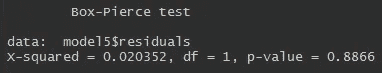

# 中国 PM10(空气污染)变量的时间序列分析(ARIMA 模型)

> 原文：<https://medium.com/analytics-vidhya/time-series-analysis-arima-model-for-the-pm10-air-pollution-variable-in-r-822f3a6291d2?source=collection_archive---------27----------------------->

PM10 是一种存在于大气污染中的可吸入微粒。它可以穿透我们的呼吸器官和血液流动，导致严重的疾病。


公共领域[[https://en.wikipedia.org/wiki/Time_series](https://en.wikipedia.org/wiki/Time_series)

在这项研究中，我们将对这个粒子进行时间序列分析。该数据集具有 PM10 1997 年全年的集中度。我真的不知道用于构建数据集的比例，也不知道收集数据的城市/位置。我刚刚找到了一个. xls 文件，里面有我在大学时的数字，我决定与社区分享这些知识。

这个故事的数据和代码可以在:【https://github.com/nascimento1195/time-series-analysis-PM10[找到。](https://github.com/nascimento1195/time-series-analysis-PM10)

我们将使用以下步骤进行分析:

1 —检查平稳性的级数性质；

2 —决定我们是使用加法模型还是乘法模型；

3 —调整模型；

4-检查残差属性。

第一步是读取数据，为第一次可视化绘制数据，然后将其转换为时间序列对象。

```
# Reading data
library(readxl)
dados<-read_excel("basepoluicao.xls")
attach(dados)# Plotting data
library(ggplot2)
theme_set=(theme_minimal())ggplot(data = dados, aes(x = DATA, y = PM10))+
  geom_line(color = "#00AFBB", size = 1)# Transforming data into a time series object
POL<-ts(PM10)
```


图 1:系列的初始情节。

为了用 ARIMA(p，d，q)对序列建模，我们需要检查平稳性。这可以通过绘制自相关和部分自相关值或使用适当的统计测试来完成。我更喜欢用测试。通常，我会执行两次或更多次，以确定这个超级重要的特性。

在这里，我将向你展示两个测试，扩大迪基-富勒测试和 KPSS 测试。在第一种假设中，替代假设代表序列的平稳性，而在另一种假设中，零假设是我们不想拒绝的假设。

```
# Augmented Dickey-Fuller Test for stationarity
library(tseries)
adf.test(POL)# KPSS Test for stationarity
kpss.test(POL)
```

执行这两种测试后，扩展的 Dickey-Fuller 测试指向一个显著性水平为 5%的平稳序列(p 值< 0.05), while the KPSS disagreeded with that decision (p-value < 0.05)*.

*Remember the hypotheses are inverted from one test to another.

When I come across divergence between the tests, I prefer to apply the first difference of the series in order to get the stationarity factor confirmed. To do that, we reapply the tests in the differentiated series.

```
first_difference<-diff(POL)adf.test(first_difference)
kpss.test(first_difference)
```

Checking the results, it is possible to observe that now both point to a stationary series (this time the null hypothesis is not rejected for the KPSS Test).

The next step is to decide if our series has a multiplicative or additive characteristic. One way to do this is grouping the series into minor groups of
任何大小(此处的数字一般不会产生太大影响，我们将使用 2 个一组的方法)，计算该小组内的平均值和标准差，然后绘制计算平均值与计算标准差的图形。

```
# Calculating mean
mean_vector<-vector()
j<-1
vet<-POL
for(i in 1:(length(first_difference)/2)){
  mean_vector[i]<-(vet[j]+vet[j+1])/2
  j<-j+2
}# Calculating standard deviation
std_deviation_vector <- vector()
z<-1
for(i in 1:(length(first_difference)/2)){
  std_deviation_vector[i]<-sd(c(vet[z],vet[z+1]))
  z<-z+2
}plot(mean_vector, std_deviation_vector)
cor(mean_vector, std_deviation_vector)
```


图 2:色散图。

这两个向量之间的相关性约为 0.3388。由于在生成的两个向量之间似乎没有很强的相关系数，我们可以调整 ARIMA 加法模型。如果此处的系数或图形表明了强相关性，我们将有证据表明该系列中存在乘法因子，并且有必要应用一些变换来去除该因子(对数函数使用效果良好)，以便我们可以调整 ARIMA 模型。

最后，我们似乎准备调整我们的模型。对于如何调整 ARIMA 模型的参数，没有明确的规则。有一些技巧，如绘制自相关函数和偏相关函数。我更喜欢测试一些参数组合，并选择一个对它们都有意义的组合。如果有一个以上的系列满足这个条件，那么我们可以采用更简单的一个(较少的参数)或具有较小 AIC 的一个(较低的 AIC 值表示更好的拟合)。

由于我们将模拟系列的第一个差异，我们的中间参数‘d’(ARIMA(p，d，q))必须是 1。这样，我们将只从 0 到 2 改变“p”和“q”。

```
# ARIMA(0,1,1) 
model1<-arima(POL, order = c(0,1,1)) 
t1<-0.1645/0.0776
dt(t1, length(POL)) 
# Model is a candidate, since all parametes are significative (5% significance).# ARIMA(0,1,2) 
model2<-arima(POL, order = c(0,1,2))
t1<--0.2161/0.0588
t2<--0.5556/0.0615
dt(t1, length(POL)) 
dt(t2, length(POL)) 
# Model is a candidate, since all parametes are significative (5% significance).# ARIMA(1,1,0) 
model3<-arima(POL, order = c(1,1,0)) 
t1<-0.0562/0.0523
dt(t1, length(POL))
# Model is not a candidate, since at least one of the parametes are not 
# significative (5% significance).# ARIMA(1,1,1) 
model4<-arima(POL, order = c(1,1,1)) 
t1<--0.4332/0.1264
t2<-0.6101/0.1062
dt(t1, length(POL))
dt(t2, length(POL)) 
# Model is a candidate, since all parametes are significative (5% significance).# ARIMA(1,1,2) 
model5<-arima(POL, order = c(1,1,2)) 
t1<-0.4113/0.0692
t2<--0.4975/0.064
t3<--0.4334/0.0554
dt(t1, length(POL))
dt(t2, length(POL)) 
dt(t3, length(POL)) 
# Model is a candidate, since all parametes are significative (5% significance).# ARIMA(2,1,0)
model6<-arima(POL, order = c(2,1,0)) 
t1<-0.0781/0.0486
t2<--0.3746/0.0485
dt(t1, length(POL))
dt(t2, length(POL))
# Model is not a candidate, since at least one of the parametes are not 
# significative (5% significance).# ARIMA(2,1,1)
model7<-arima(POL, order = c(2,1,1)) 
t1<-0.8161/0.0528
t2<--0.2878/0.0516
t3<--0.94/0.0226
dt(t1, length(POL))
dt(t2, length(POL)) 
dt(t3, length(POL)) 
# Model is a candidate, since all parametes are significative (5% significance).# ARIMA(2,1,2)
model8<-arima(POL, order = c(2,1,2)) 
t1<-0.4864/0.124
t2<--0.0743/0.0999
t3<--0.5645/0.1156
t4<--0.3643/0.1126
dt(t1, length(POL))
dt(t2, length(POL)) 
dt(t3, length(POL)) 
dt(t4, length(POL)) 
# Model is not a candidate, since at least one of the parametes are not 
# significative (5% significance).
```

无论何时运行命令来模拟系列(例如:model1

这里满足这个条件的模型是“模型 1”、“模型 2”、“模型 4”、“模型 5”、“模型 7”。我们将对“模型 5”进行残差分析，因为它是 AIC 值最小的模型。


图 3: AIC 价值观。

```
# Let's check for normality and independency of the residuals.
hist(model5$residuals)
Box.test(model5$residuals, type=c("Box-Pierce"))
```


图 4:残差直方图。



图 5:残差独立性的盒-皮尔斯检验。

我们可以观察到残差的直方图在 0 附近呈正态分布，Box-Pierce 检验没有拒绝残差独立性的零假设。最后，我们实现了满足可信预测模型所需的主要统计特性的最终模型。