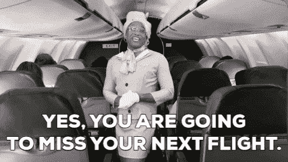

# 时间序列分析-预测出发延误

> 原文：<https://medium.com/analytics-vidhya/time-series-analysis-forecasting-departure-delays-776d22636179?source=collection_archive---------16----------------------->

当莱特兄弟发明第一架飞机时，他们根本没有想到 21 世纪的人们会多么依赖他们的革命性发明。快进到今天:便利是有代价的，人们只能希望不要成为受害者。提前几个月预订的航班出现任何形式的延误都不是好消息，但这是无法避免的。

我现在是在沃尔瑟姆的本特利大学学习商业分析的最后一年，我想为我的时间序列项目探索这个臭名昭著的情况。我和其他 3 名团队成员计划将这个过程分解成简单的步骤，试图缩小原因范围并预测未来的航班延误。

# **问题**

如前所述，该项目的讨论主题是关注航班延误的原因，并建立一个时间序列预测模型来预测未来的延误。在这次分析中，选择的数据集是从美国运输部运输统计局(STS)提供的 [Kaggle](https://www.kaggle.com/) 下载的。数据集看起来像这样:

数据集中在 2008 年所有国内航班记录的几个不同方面(其中几个后来被用作时间序列模型的回归变量)。下面显示了一个简短的快照:

# **数据清理**

为了便于理解，变量“广播时间”被用来将航班分为 3 个不同的类别:广播时间< 4hours; 4 hours < Airtime <10 hours; Airtime > 10 小时。

为了避免混淆和不必要的延长，将只讨论广播时间**低于 4 小时**的航空公司类别。

下一步是使数据高效和可用，这涉及到移除异常值和缺失值。在少数情况下，变量“飞行时间”的值甚至是负值，这将表明航班在计划的起飞时间之前离开。这种值的存在对于分析可能是混乱的，并且需要被解决。例如，绘制了一个箱线图来识别变量“出发延误”中的异常值。

显而易见，与其他航空公司相比，达美航空公司(DL)和长荣航空公司(EV)的离群值明显更高。因此，这些异常值被从数据中剔除。

# **聚类分析**

一旦数据可用，下一步就是选择要工作的航空公司。该数据集由 20 个不同的航空公司的记录组成，总共产生 1，936，758 个观察值。对于那些不熟悉典型数据分析过程的人来说，如果我们实际上得出一个结果，那么如此庞大的样本量会对我们的发现产生负面影响。

因此，首先使用以下代码汇总每个航空公司的数据:

为了对每家航空公司进行单独分析，我们没有在混乱的过程中浪费时间和资源，而是求助于一位无名英雄——聚类分析。

聚类分析根据一些相似性对不同的时间序列对象进行分组。在这种情况下，我们使用一种叫做“**欧几里德距离**的方法对对象进行分组，因为变量的单位(分钟)始终保持不变。(在单位不同的情况下，使用一种称为“相关距离”的方法。)聚类分析的结果是如下所示的树状图:

树突图中的对象越接近，相似性就越多。换句话说，对西南航空公司(WN)执行的分析结果可以映射到边疆航空公司(F9)，以及梅萨航空公司(YV)。

出于一致性考虑，西南航空公司(WN)和美国航空公司(AA)被排除在上述集群之外。(在 2008 年也分别保持了最大飞行次数的第一和第二名)。下面的方框图强调了这两个航班的飞行时间和起飞延迟分布的差异。

时间序列对象

一旦要进行的飞行最终确定，我们为两次飞行中的每一次都创建了一个时间序列对象，其绘图如下所示:

# 为了比较这些物体的行为，我们观察了**熵值。**较高的熵值会降低模型的预测精度，但在预测出发延误时会出现这种情况是正常的(因为它们往往会波动)。虽然西南航空(WN)可能看起来有点混乱，但它的熵值为 1.94，而美国航空(AA)的熵值为 1.96。

芝加哥拥有西南航空公司最多的乘客，在冬季(芝加哥经历大雪时)向西飞行的趋势显示了西南航空公司年底延误的高峰。美国航空公司显示了年中某处延误的多次高峰，这可能归因于暑假期间旅行的增加。

模型结构

至此，我们已经具备了开始构建模型所需的所有要素。对于那些不熟悉这一过程的人来说:有各种类型的模型可以用来预测，每一种都有其优缺点。这种类型的问题有时可能更容易决定一个模型，但在大多数情况下(包括这个问题)，在最终确定一个单一的，有效的模型之前，要建立和测试几个模型。

# 构建并测试了以下模型:

**状态空间模型**

为以下各项选择的最佳状态空间模型:

> **美国航空:** ETS(AAN)【误差和趋势:加性、季节性:不存在】

**西南航空:** ETS(AAdN)【误差:加性，趋势:阻尼加性，季节性:不存在】

为了检查模型的有效性，我们执行了 Ljung-Box 测试，根据 p 值检查残差[如果模型的 p 值高于 0.05 (5%显著性水平)，则模型通过测试]

这两个模型都通过了测试，美国航空的 p 值为 0.104，西南航空的 p 值为 0.934。

获得上述内容的代码运行如下:

**ARIMA 模式**

**美国航空:** ARIMA(5，1，0) [取最近过去的 5 个值，差的顺序= 1]

> **西南航空:** ARIMA(3，1，0)【取最近过去的 3 个值，差的顺序=1】

再一次，模型的有效性通过 Ljung-Box 检验进行了检验。

西南地区的 ARIMA(3，1，0)通过测试，p 值为 0.32(显著高于 0.05)。然而，ARIMA(5，1，0)未能通过 5%显著性水平的测试，p 值为 0.017(尽管它通过了 1%的显著性:p 值为 0.01 的测试)

以下代码用于查找模型:

**ARIMA 模型:有回归变量**

一个好的模型具有某些特征，这些特征使它能够可靠地进行预测。在各种不同的模型中，模型稳定性是最重要的。粗略地说，当一个额外的参数(或者甚至是样本数据之外的)被添加到模型中时，模型的行为不应该有所不同。这些参数被称为“回归量”。

> 在我们的例子中，我们添加的回归量是:“广播时间”、“到达延迟”和“承运人延迟”。计算这些回归变量的显著性:它们是否显著不同于 0。如果为真，则将它们添加到模型中。

**美国航空:**

注意最后一个回归变量。比率(实际/预计)应> 1.96 或< -1.96 for it to be considered significantly different than 0.

For the above model the ratio comes out to be 1.78, rendering the regressors ineffective.

**西南航空:**

最后一个回归量的比率计算为 7.548，因此被添加到西南航空公司的模型中。

型号选择

此时，模型已经建立，测试已经完成，剩下的就是选择最佳模型。听起来很容易，是吗？

# 挑选最有效的模型几乎类似于在苹果园的 10 棵不同的树上找到最好的苹果。每个模型都有其优点和缺点，选择有效模型的决定主要取决于问题的背景，在某些情况下，甚至取决于用户。

对于图中的模型，每个模型的精度测量值计算和比较如下:

美国航空公司

美国航空公司的精确度测量[熵:2.107]

经验法则:一个好的、精确的模型有一个低的 MAPE(误差)值。

我们注意到，带有回归变量的 ARIMA 模型导致最低的 MAPE 值(在训练和测试中都是如此)。然而，ETS 和 ARIMA 模型(没有回归变量)在测试数据上表现更好(MAPE 测试< MAPE train), whilst opposite is the case with ARIMA (with regressors).

**西南航空**

西南航空公司的准确性测量[熵:2.058]

ARIMA 回归模型再次抢尽风头，在所有其他模型中 MAPE 值最低。然而，与我们在美国航空公司注意到的相反，西南航空公司的所有模型在测试数据中表现不佳(较高的 MAPE 值)。

两个航空公司的误差值在 ARIMA 模型(带有回归变量)中急剧下降的原因之一可能是过度拟合。添加参数是有代价的:模型被迫低于测试数据。

在这种情况下，模型构建的过程被搁置一旁，引入了一个新术语:块引导

袋装模型

让我们回顾一下这个问题:我们正试图预测某些航空公司的起飞延误。为此，我们构建并验证了几个不同的模型。建模过程本身就为错误和各种其他预测问题敞开了大门:

# **不确定性**

真正的模式真的是 ARIMA 模式吗？这真的是 ETS 模型吗？

> **参数不确定性**

即使模型是 ARIMA 模型，斜率系数(回归量)有多可靠？

> **随机噪声**

如果选择的模型不正确，产生的随机噪声(反过来提供 MAPE 和类似的误差值)变得不可靠。

> 为了克服这些问题，需要依赖不同的预测方法。这一次，我们让数据决定预测应该是什么样子。这种预测将是“数据依赖的”，而不是“模型依赖的”。

该过程概述如下:

自举过程

该过程可以大致描述如下:

选择一个时间序列，进行 Stl/Lowess 分解:将时间序列分解为趋势、季节性和噪声成分。

噪声分量被置换，即，选择纯噪声的**个小块**并在块中重新排序/混洗。

1.  噪声被添加回趋势和季节分量，导致几乎相似的时间序列(因为只有随机噪声分量被打乱)。
2.  这个过程被重复几次(由用户决定)，产生各种各样的，几乎与原始序列相似的时间序列。
3.  自举模型(原始时间序列用黑色表示)
4.  如上所述，这一过程产生了 15 个不同的时间序列，与原始序列非常相似。然后随机挑选一个字符串，并根据该特定字符串的数据拟合一个模型。这样一来，选择准确模型的**不确定性**就被**消除了**:数据决定哪个模型最适合那个特定的字符串，从而产生几个不同的模型。

然后从所有这些模型中选择预测，最后进行平均，为我们提供基于数据的预测，而不是用户选择的模型。该过程因此被称为 Bagging(引导+聚集)。创建袋装模型的代码如下:

**注意:**选择了各种不同的模型，最终预测是这些模型预测的结果平均值。因此，这增加了训练和测试数据的 MASE 脉塞值。

袋装模型的精度测量(美国航空公司)

显而易见，袋装模型导致显著更高的 MAPE 值(然而在测试数据上表现更好)。这看起来确实是一笔艰难的交易，但最终还是有利可图的。由于袋装模型为我们提供了更准确的预测，MAPE 值可以包括在内。

因此，西南航空公司和美国航空公司都选择了袋装模型。

结论

该项目试图建立复杂的模型来解决乘客在日常生活中面临的简单问题。希望你喜欢阅读它！

# 有关时间序列模型构建的更多信息，请访问:[https://www . analyticsvidhya . com/blog/2015/12/complete-tutorial-Time-Series-modeling/](https://www.analyticsvidhya.com/blog/2015/12/complete-tutorial-time-series-modeling/)

The project was an attempt at building complex models to solve a simple problem faced by passengers in their everyday life. Hope you enjoyed reading it!

Further information on Time Series Model Building can be found at: [https://www.analyticsvidhya.com/blog/2015/12/complete-tutorial-time-series-modeling/](https://www.analyticsvidhya.com/blog/2015/12/complete-tutorial-time-series-modeling/)