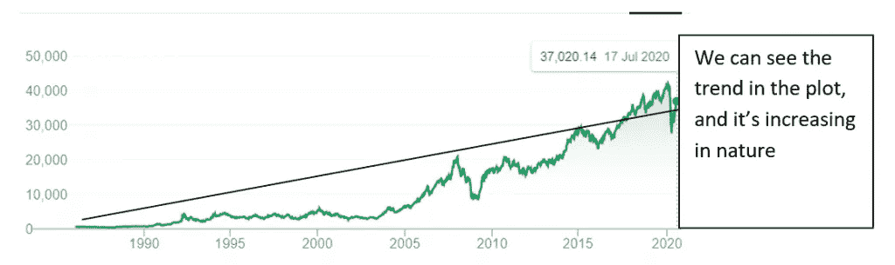
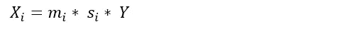
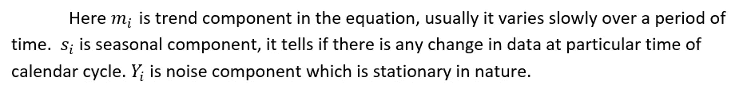

# 时间序列分析:需求预测第一部分

> 原文：<https://medium.com/analytics-vidhya/time-series-analysis-forecasting-the-demand-part-1-25063eb66811?source=collection_archive---------26----------------------->

**本故事最初发表于******。****

****

**图片来源 [Nucleusbox](https://www.nucleusbox.com/time-series-analysis-forecasting-the-demand-part-1/)**

**欢迎来到关于时间序列分析的新博客系列。在之前的博客中，我们看到了 [**如何使用 python**](https://www.nucleusbox.com/building-a-logistic-regression-model-in-python/) 构建逻辑回归。**

**时间序列分析是预测建模技术之一。它在各种商业应用中用于预测未来的数量和需求。这也有助于理解企业的历史模式。**

**这些是时间序列分析的几个用例**

1.  **预测销售**
2.  **库存计划**
3.  **股票市场分析**
4.  **对一年中任何特定项目的需求/价格突然飙升的理解。等等**

**现在我们来看看时间序列的定义。 ***“时间序列是以等间距时间间隔排列的数据点的有序序列”。*****

**在定义中，它表示有序的数据序列。这意味着如果数据序列的顺序发生变化，那么预测也会发生变化。但这并不是大多数其他数据分析的情况。在时间序列中，模型不仅根据数值进行预测，还根据数据序列进行预测。这就是为什么在时间序列分析中不应该使用改变的数据序列。**

# **时间序列的特征**

**这些是时间序列分析展示的几个特征**

## **趋势**

**趋势可以通过观察折线图来观察(通常在很长一段时间内观察)。它可以减少，也可以增加。在少数情况下，它可以保持不变。如果我们以过去几年的股票交易数据为例，那么我们可以说有增长的趋势，反之亦然。**

****

**增长趋势-图像源([核框](https://www.nucleusbox.com/time-series-analysis-forecasting-the-demand-part-1/))**

## **季节性**

**它在日历周期中表现出有规律的重复模式。如节日期间销量增加，其他时间保持正常。另一个例子可能是季风季节的降雨。季节性模式通常是周期性的，并且是可预测的。**

## **自相关**

**相似相关度量两个变量之间线性关系的程度。自相关测量时间序列滞后值之间的线性关系。使用 AR ( **自回归**)和 MA(移动平均线)可以观察到。**

## **长期周期性**

**当数据表现出非固定频率的上升和下降时，就会出现这种情况。经济衰退、萧条和复苏是周期性的非典型例子。循环变化可以是规则的，但可以不是周期性的。**

## **平稳性**

**平稳时间序列是统计特性保持不变的序列。换句话说。我们可以说均值、方差、自协方差是时不变的(几乎不随时间变化)。预测平稳序列变得很容易。因为它假设从过去的数据中观察到的统计特性在未来也是成立的。纯噪声本质上是稳定的。**

# **时间序列的数学表示**

**一个简单的数学时间序列方程可以是**

****

****加法模型**:加法模型假设时间序列的所有三个组成部分相互独立。**

****

****乘法模型**:乘法模型中，所有组件的行为彼此成比例。**

****

**混合模型是加法模型和乘法模型的组合。**

****

# **时间序列建模方法**

**任何建模技术的第一步都是通过可视化来理解数据。以时间序列为例，我们通常用线图/散点图来形象化。**

## **[阅读更多](https://www.nucleusbox.com/time-series-analysis-forecasting-the-demand-part-1/)**