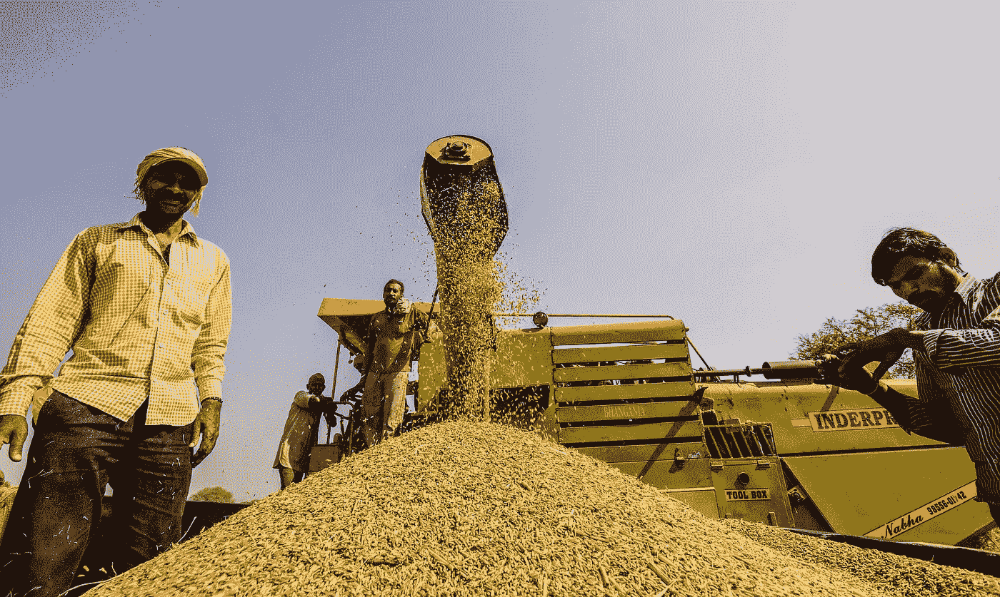

# 印度农产品价格的时间序列分析

> 原文：<https://medium.com/analytics-vidhya/time-series-analysis-of-agricultural-prices-in-india-47e7ebebd8b4?source=collection_archive---------7----------------------->

来源:The Wire

农业是印度经济的核心，该行业的任何重大变化都会对整个经济产生乘数效应。它对国内生产总值(GDP)的贡献约为 17%，为超过 50%的劳动力提供就业。该国最大的工业，如制糖、纺织、食品加工等。依赖于农业和相关的服务…