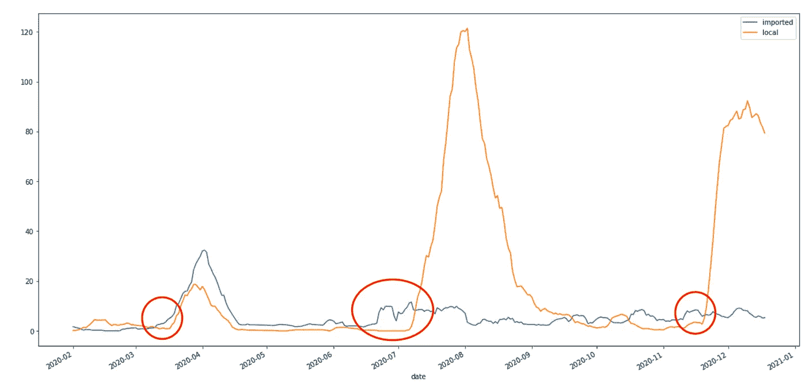
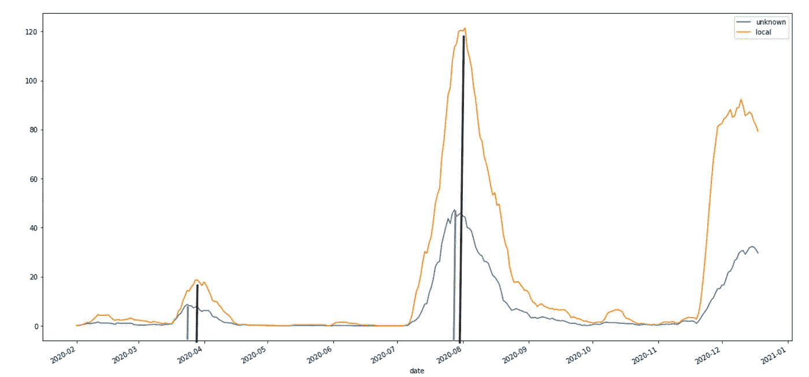
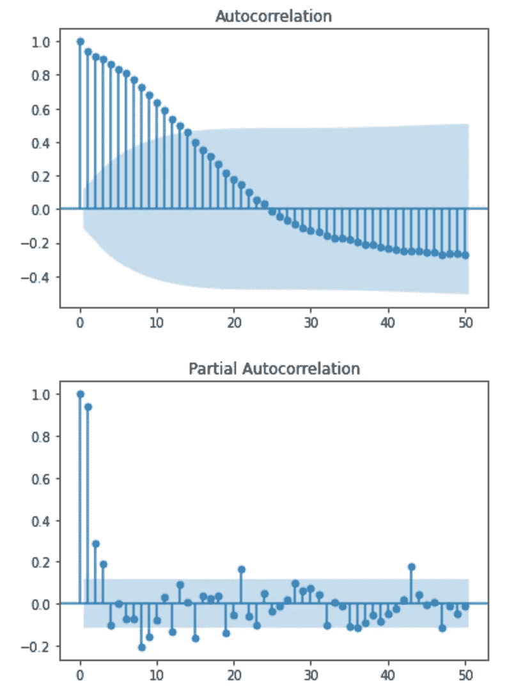
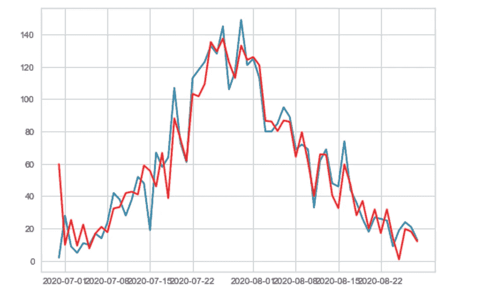
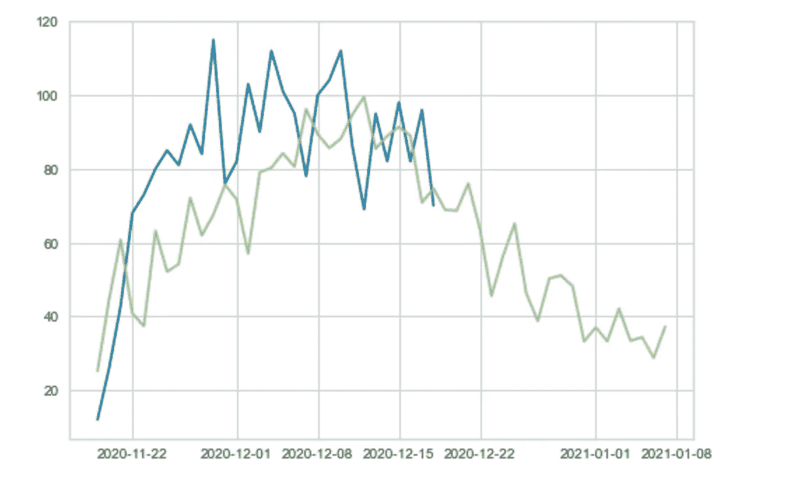
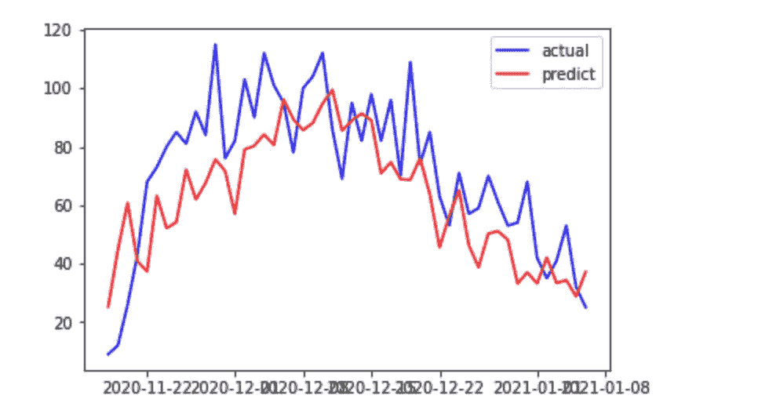

# COV-19 个香港案例的时间序列分析

> 原文：<https://medium.com/analytics-vidhya/time-series-analysis-on-cov-19-hk-cases-cad1e466049a?source=collection_archive---------21----------------------->

在[data.gov.hk](https://data.gov.hk/en-data/dataset/hk-dh-chpsebcddr-novel-infectious-agent)可以找到 COV 19 例的统计数据。我放下 csv，进行了一些简单的时间序列分析。由于原始数据的波动，我使用 7 天滚动平均来平滑曲线，以便观察模式。

1.  比较输入性病例和本地病例的数量。我发现输入性病例的上升往往发生在本地病例上升之前。



2.如果以输入性病例的急剧上升作为领先指标，我们可以为即将到来的本土病例扩散做好准备。

3.还可以推断，输入性病例的增加增加了移民引起当地人感染并引发当地广泛传播的机会。虽然当地的广泛传播可能有多种根本原因，但对移民的检疫不力很可能是其中之一。

4.不明原因病例比当地总病例早达到高峰。这意味着当不明原因病例的数量开始下降时，它可以帮助减少整体病例。这是因为如果病人不能尽快被隔离，它会继续感染其他人。根本原因的痕迹，以及病人的历史活动是非常关键的。



5.总病例数的时间序列是稳定的，因为 ADF 统计小于 5%临界值，p 值为< 0.05.

```
ADF Statistic: -2.911707
p-value: 0.044003
Critical Values:
	1%: -3.454
	5%: -2.872
	10%: -2.572
```

6\. Since the time series is stationary, we can use time series model to simulate. Here, we choose ARIMA. Although we cannot predict the kick off the wave of the widespread, we can use the previous wave to predict when will the current wave end, by assuming the current wave will follow similar pattern of the previous wave.

To use ARIMA model, I need to determine the AR and MA terms. The follow code plot the ACF and PACF, which helps to determine the two terms, which are 25 and 4\. As there is no need for differencing, the ARIMA parameters are: (25,0,4).

```
from statsmodels.graphics.tsaplots import plot_acf
from statsmodels.graphics.tsaplots import plot_pacf
X = data['total']
plot_acf(X, lags=50)
plot_pacf(X, lags=50)
plt.show()
```



Using the previous wave data (X[120:180]) as the training data, we plotted of the fitting values (red line) of the ARIMA, which showed that the model fits it very well.

```
from statsmodels.tsa.arima.model import ARIMAx_train = X[120:180]
model = ARIMA(x_train, order=(25,0,4))
model_fit = model.fit()
```



7\. We use the ARIMA model to forecast the current wave. The green line is the predicted values. It showed that the total cases count will come down below 40 after 2021–01–01\. Good news!



> Post 1 月 7 日注:

上面的帖子写于 12 月 20 日。今天是 1 月 7 日。让我们做一个帖子来回顾一下 12 月 20 日的预测。下图描绘了实际数字(蓝色)与 12 月 20 日的预测(红色)。总的来说，它成功地预测到 1 月份第四波已经降到 40 以下，接近第四波的尾声。



这是因为每当有一个广泛的，政府将收紧社会距离，然后案件将逐渐下降。每一波都遵循相似的模式。