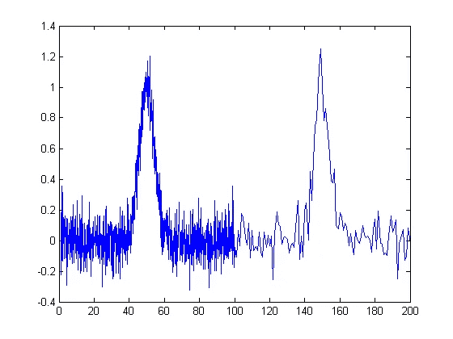
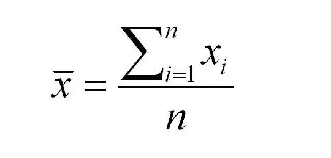
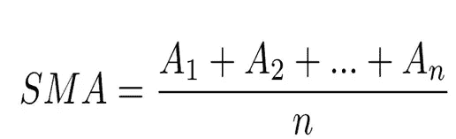
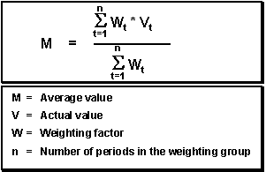
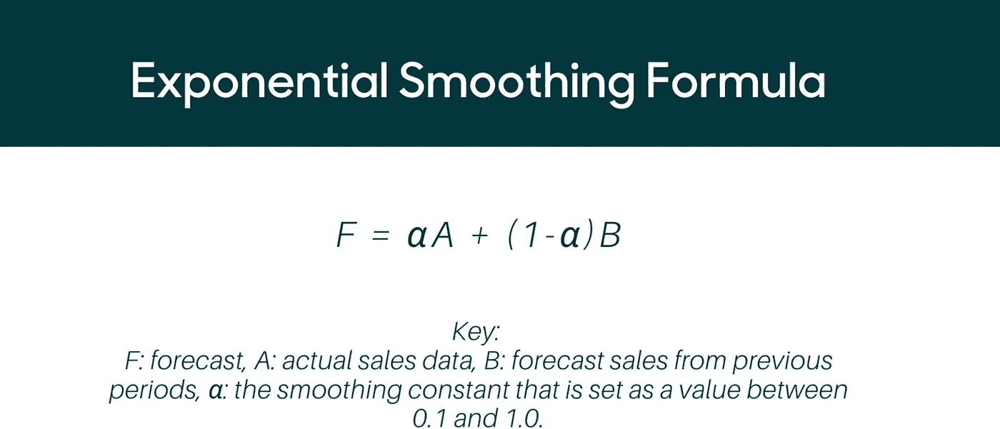
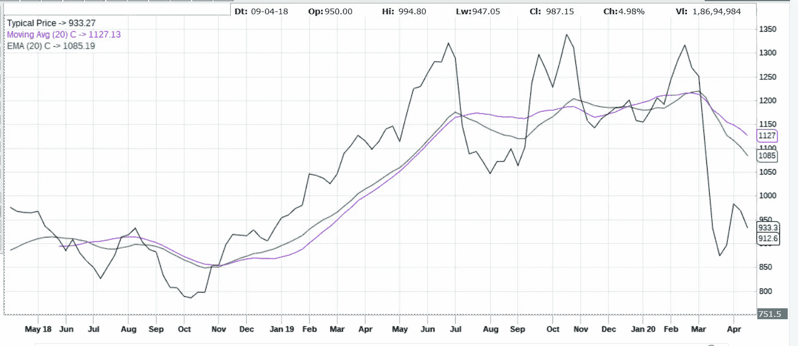

# 时间序列分析(第二部分)

> 原文：<https://medium.com/analytics-vidhya/time-series-analysis-pt-ii-649d58338929?source=collection_archive---------41----------------------->

> 在本文中，我们将深入探讨数据平滑模型

# 数据噪声

原始数据的中途去噪。

> 数据噪声是额外的无意义的信息，我们不能处理这种类型的数据，因为它是无用的，会妨碍数据分析和预测。

作为一名数据科学家，我们的工作是识别数据噪音并将其从数据中移除，以便从我们将使用的模型中获得更清晰的理解和预测。

一个有趣的注意事项是，在许多情况下，模型的数据噪声识别被用作确定模型准确性的度量。

因为，

**数据=预测+噪声**

**噪声=数据-预测**

如果我们的模型能够正确区分提供的数据中有多少是有用的，有多少是造成噪声的，那么该模型在现实生活场景中是高度可靠和准确的。这就是为什么大多数数据科学团队，尤其是时间序列模型团队，将此作为模型准确性测试特性。

有许多强大的算法和库来处理数据噪声。一个人可以使用任何他想使用的数据，但唯一的问题是我们应该对数据特征有一些基本的了解才能使用正确的算法，否则我们可能会把实际的数据当成噪音。

# 缓和

去掉毛边会更好，啊，咖啡的香味..

> 平滑意味着使数据不那么尖锐，这是一种有趣的解释方式，但也有一定的意义。

平滑可以作为一种过滤掉数据中噪声的方法，使其更加“平滑或流线型”。它在数据科学和市场研究中被大量使用，尤其是在股票市场预测和价格分析中。

> **通过去除数据集中的噪声，它揭示了重要的潜在模式，即趋势、季节和周期成分。**
> 
> 虽然数据平滑可以帮助预测某些趋势，但它可能会导致某些数据点被忽略。

所以应该谨慎使用。

有两组不同的平滑:-

*   简单平均法
*   指数平均法

# 平滑技术

# 1.简单平均

数据平均值公式。

这是最基本的平均技术。它在大多数高中统计学中被称为“数据的平均值”。

当你取一个平均值时，你最终得到的是数据的单值估计，它只应用于一些基本的数据分析。因为它会破坏任何底层的数据模式。

# 2.简单移动平均线

A=观察窗口，n=总窗口数。

它是简单平均值的更高级版本，因为它随数据移动。

> 在这种方法中，我们在连续的集合或窗口中取平均值，并在这样做的同时不断推进数据。

在这种情况下，我们能够以比简单平均更好的方式平滑数据。优点是它随数据移动，即它可以显示数据的情绪(数据是向上还是向下移动)，并且可以显示数据中的模式。

但是它有缺陷。

其反应性或波动性较慢，或者反映数据变化较慢。

它给予每个数据点相同的优先级或权重。过去的数据以与最近的数据点相同的优先级进行评估，这可能导致固有数据模式的丢失。

# 3.加权移动平均数

加权移动平均公式。

这是移动平均线的最高级形式，它通过给数据分配权重来解决移动平均线的所有问题。

它为最近的数据赋予一个权重，并随着数据的回溯(即及时)不断降低权重

> 因此，更新的数据优先于旧数据，这意味着它将更加不稳定，并将能够更好地洞察简单移动平均线难以发现的内在模式，此外，与移动平均线相比，该模型能够更快地对数据趋势做出反应，因为它更加强调最近的数据。

重量由用户确定，或者任何模块都可以用于自动计算重量。

注意:-在公式中，我们将分子除以权重之和，因为我们通过乘以权重移动了数据点，所以我们需要相应地调整函数。

这个的主要缺点是它也有一个尖尖的性质。

# 4.指数移动平均线

指数移动平均公式。

指数移动平均与加权移动平均相同，但权重是通过类似于展开式的指数函数(e)来计算的。

## 这是最广泛使用的平滑技术，因为与加权平均相比，它具有更快的响应时间。

在这个模型中，与移动平均相比，最近的数据被赋予了更高的优先级/权重(因为通常发现 e 更大)，所以在进行数据模式分析时，它更好。当我们回到过去时，重量呈指数下降

这个模型的唯一缺陷是，有时我们不需要给过去的数据任何权重，这样做我们就偏向了数据。

你可能会想到一个有趣的问题:

**公式没有(e)符号为什么叫指数？**

这个问题的答案是大多数人都没有的，甚至我不得不深入挖掘，以找到一个合理的和符合逻辑的解释。

> 解释是，当我们展开公式时，(1-α)因子开始遵循几何级数，该几何级数遵循指数函数的****泰勒级数展开**。**

**我知道没有数学知识有点难以理解，所以我推荐你去这个神奇的[网站](https://www.itl.nist.gov/div898/handbook/pmc/section4/pmc431.htm)看看，我在那里找到了答案。这是一个政府网站，所以我没有以任何方式获利(快乐学习)。**

# **E.并购与并购:同期比较**

****

**这是一个股票交易者整天看到的。整天排队。**

**上面显示的是 TITAN 在三年内的周收盘价，用黑色**绘制。****

**用**紫色绘制的**是初始数据的简单移动平均线(SMA)，周期(n)为 20 周。例如，从 2019 年 6 月到 10 月，泰坦股票的价值大幅下跌。然而，SMA 或移动平均线(20)忽略了这种变化，看起来像水平方向的直线。**

**在**绿色**中绘制的是 20 周的指数移动平均线(EMA ),我们可以观察到它对市场趋势的反应比 SMA 快得多。对于上面提到的相同数据，均线向下移动，对数据的大幅下跌做出反应。**

**因此，EMA 20 比 SMA 20 对更近的数据变化做出反应。**

**关键是，当数据下跌时，SMA 甚至没有显示任何变化，而 EMA 在其图中显示了下降，所以我们可以看到波动性是如何成为一个重要因素的。**

**最后，我们不应该把 EMA 作为数据平滑的万能解决方案，但是我们应该考虑 EMA 和 SMA，必要时甚至是 WMA。**

**因为在数据科学和市场预测中，分析师寻找平均方法的组合来预测数据的模式和最终的未来。**

## ****脚注****

**在下一期，我们将学习各种自回归模型。**