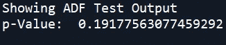
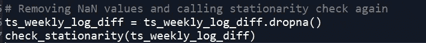
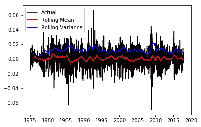

# 时间序列分析—使用统计测试进行平稳性检查

> 原文：<https://medium.com/analytics-vidhya/time-series-analysis-stationarity-check-using-statistical-test-f106e9045370?source=collection_archive---------7----------------------->

> 本文将集中讨论进行统计检验的过程，特别是为了检验一个给定的时间序列是否平稳而进行的扩展的 Dickey Fuller 检验。

确保时间序列数据平稳与否，是时间序列建模的重要预处理方法。在时间序列中，增加趋势、季节性和其他依赖于时间的结构很容易违反平稳性假设。

趋势可以导致随时间变化的平均值，而季节性可以导致随时间变化的方差，这两者都将时间序列定义为非平稳的。

因此，我们分析的第一步应该是检查是否有任何趋势或季节效应的证据，如果有的话，消除它们。

# 增强迪基富勒试验

*Augmented Dickey-Fuller* 是我们用来确定时间序列是否平稳的统计测试。

扩展的 Dickey Fuller 检验检验时间序列样本中存在单位根的零假设。另一个假设通常是平稳性或趋势平稳性。

测试中使用的增强 Dickey-Fuller(ADF)统计量是一个负数。越是否定，就越是强烈的拒绝在某个置信水平上存在单位根的假设。

如果*p>0.05，那么零假设成立，说明时间序列不是平稳的。*

否则如果， *p < =* 0.05，那么零假设被拒绝，时间序列是平稳的。

*p* 此处，表示滞后的顺序或当前数据和过去数据之间的差异。例如，今天和昨天的数据之间的差异。

我们的主要目的是**拒绝零假设。**

在数学上，通过在模型中包括***t-p****输出值，增强的 Dickey-Fuller 检验允许更高阶的自回归过程。*

# *举例说明*

*让我们用一小块数据来举例。*

**

*滞后阶数= 1 意味着将 Y 列移动 1 位，如下所示。*

**

*上面还显示了上周的数值( *t-1* )。*

*类似地，滞后阶数= 2 意味着进一步微分或转移到下一个级别。*

**

*接下来，我们删除缺少值的行以获得下面的结果。*

****

*在每个分化水平，我们试图找出 p 值，并检查它是否小于或等于临界值(0.05)。*

*移位或微分将继续进行，直到我们得到小于或等于 0.05 的 p 值。*

# *纲领性解释*

*让我们通过几行代码实现同样的事情。*

******

*从上面的图中，我们可以看到，即使方差变化不大，平均值在整个数据中也会变化很大。计算的 p 值也是 0.19，大于 0.05。*

*因此，我们需要执行一个级别的微分，或者换句话说，移动滞后阶数=1 的时间序列数据*

****

*现在，让我们再次执行*check _ stationary*函数来检查 p 值。*

******

*我们可以注意到，平均值现在在整个数据中几乎保持不变。新的 p 值为 0.0，小于 0.05。*

*上面告诉我们，我们现在已经达到了平稳，在 *k=1* 。*

## *取对数有什么好处？*

*   *它将给出滞后阶数较少的时间序列的平稳性。基本上，它试图降低季节性的幅度。*
*   *线性数据比指数数据的时间序列更精确。*

*我希望您现在对使用 ADF 检验来检查时间序列数据的平稳性有了清楚的了解。在我的[下一篇文章](/@souvikmajumder31/time-series-modelling-arima-82453bac7de)中，我已经解释了 ARIMA 在数据建模中的用途。*