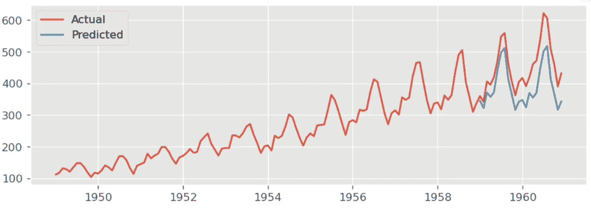

# 使用 ARIMA 和 LSTM 的时间序列分析(Python 和 Keras 版)-第 1 部分

> 原文：<https://medium.com/analytics-vidhya/time-series-analysis-using-arima-and-lstm-in-python-and-keras-part1-f987e11f9f8c?source=collection_archive---------4----------------------->

## 时间序列分析的统计方法:ARIMA

> [【链接到第二部分】](https://medium.com/p/74a79636568/edit)

## 介绍

时间序列是一种序列数据，要通过统计方法(如 ARIMA)或深度学习技术(如 RNN、LSTM)对其进行分析，在这两种情况下都需要保持序列。具体来说，在分离训练集和测试集之前，不允许随机洗牌，不像非顺序类型，例如回归和分类。例如，如果我们正在处理 2018 年 4 月至 2020 年 9 月的 Spotify 每周股票数据(日期与开盘价:图 1)，我们可以将 2018 年 4 月至 2020 年 3 月的数据范围作为建立模型的训练集，并将 2020 年 4 月至 2020 年 9 月作为预测(或验证)的测试集。如果我们打乱数据，序列信息就会丢失，分析算法就不会像预期的那样工作。我们总是根据过去的数据做一个训练模型，预测未来的数据。


图 1: Spotify 每周股票

## 数据集和时间序列相关术语

在本文中，选择了三个不同的数据集来展示不同的时间序列类型:

1.  Spotify 股票:


图 1a: Spotify 每周股票(2018 年 4 月至 2020 年 9 月)

选择这个数据集的原因是向您展示一个既没有趋势也没有季节性的序列。我当时正在寻找这样一个新的数据集，不过让我检查一下 Spotify，因为它是一家非常年轻的公司，可能还没有形成任何趋势(股票数据通常没有任何季节性)

2.谷歌股票:


图 2:谷歌每周股票(2015 年 1 月-2020 年 9 月)

你可能已经猜到了，它有上升的趋势。我分享了[谷歌工作表链接](https://docs.google.com/spreadsheets/d/1g8VDtUefw3pmfjCkpyQ_LU16WCl4MM2Lt4E3bqaA2ek/edit?usp=sharing)，这样你就可以更改日期并获得新的数据系列，以防你想做一些实验。

3.来自 Kaggle( [数据集链接](https://www.kaggle.com/andreazzini/international-airline-passengers))的航班乘客数据集:


图 3:1949 年 1 月至 1960 年 12 月每月国际航线乘客数量

这是我们将应用 ARIMA 和 LSTM 的主要数据集。我选择它是因为它既有趋势性又有季节性。

一个成熟的时间序列有三个组成部分:趋势、季节性和噪声(或残差)。

趋势是序列平均值遵循的路径模式。在上面的图中，如果你想象一条线总是穿过时间序列的中间(像蓝色的虚线)，并问，我得到了任何一致的上升或下降模式吗？这足以想象出一种趋势。是啊！在这种情况下，这是一个上升趋势，但 Spotify 数据没有显示任何这样的一致趋势(另请注意图 1a 中的蓝色虚线。)

季节性是在一个时间序列中观察到的一系列相似的峰值或峰值。发生的*周期可以是每周、每月或每年*。在图 3 中，每年的峰值出现在每年的年中——是的！你猜对了；人们在夏天去度假:)

如果趋势和季节性从时间序列中分离出来，剩下的就是噪声或残差。

让我们来看一个航空公司数据的独立曲线图(也称为*分解*曲线图):

```
components = seasonal_decompose(df, model='additive')
components.plot()
plt.show()
```


图 4:航空公司数据的分解图

基于序列趋势，分解可以通过两种方式完成:加法和乘法。如果趋势是线性的，我们选择加法，否则对于非线性趋势，选择乘法分解。

加法模型:Y[t] = T[t] + S[t] + e[t]

乘法模型:Y[t] = T[t] * S[t] * e[t]

(Y=系列值，T =趋势，S =季节性，e=残差)

上面讨论的所有这些序列都是单变量的，即股票价格或乘客数量只取决于时间。本文将只讨论*单变量分析*。如果我们需要考虑除时间之外影响序列值的任何外部变量，那么它被称为外生变量，同时考虑外生变量的分析技术被称为外生时间序列分析。

> 不要错过疫情迅速传播后谷歌股票的暴跌，以及我们开始花更多时间在家时 Spotify 股票的飙升。这些都是外生效应。如果我们可以用数学方法转换这种影响，我们就可以在分析中应用它们。

本文分为两部分。在第一部分，最流行的时间序列分析统计方法，ARIMA 将被详细讨论。在第二部分中，将讨论用于时间序列分析的最流行的深度学习方法 LSTM，并将其应用于航空公司数据，并将结果与从 ARIMA 获得的结果进行比较。还将讨论 LSTM 的超参数调谐。

MAE(平均绝对误差)和 MAPE(平均绝对百分比误差)将是两种分析技术考虑的误差度量。RMSE 的使用率也很高。

```
# Error functiondef errors(prediction,actual):

    mae = np.mean(np.abs(prediction - actual))

    mape = np.mean(np.abs(prediction - actual)/np.abs(actual))

    rmse = np.mean((prediction - actual)**2)**0.5

    return({'mae':mae,'mape':mape,'rmse':rmse})
```

我分享了 Kaggle 内核和的链接，可以在每个主题的开头找到。如果你在浏览相应的文章(或一部分)时浏览(或执行)一个内核，那将是最好的——你也可以同时跟随写在笔记本上的笔记。

## ARIMA 和萨里玛

[【ARIMA 内核】](https://www.kaggle.com/parijat2018/airline-passanger-sarima)

ARIMA 的基础条件是时间序列应该是*平稳的，*即不应该有任何趋势或季节性。当一个时间序列具有恒定的均值和相对恒定的方差时，即这些参数不随时间变化时，该时间序列称为平稳序列。

我们已经讨论过时间序列可能由三部分组成:趋势、季节性和噪声。如果一个时间序列有趋势和季节性，那么它就不是一个平稳的时间序列，要将其转换为平稳的，必须通过*差分技术去除趋势和季节性。*差分技术有两种，分别是*常规(或简单)*和*季节性*。通常的差异仅消除趋势，但是如果序列具有季节性，则需要季节差异来消除趋势和季节性。

通常的区别是从时间 t 的值(即当前周期的值)中减去时间 t-1 的值(即前一周期的值)。季节性差异是指减去当时的值 t-s(其中 s 是季节性的周期，例如，对于该航空公司数据，我们应该选择 t-12 的滞后，因为它显示的是每年的季节性，而数据集时间线是每月的)

> 差分的顺序用字母表示， *d 在 ARIMA* 中，即 d，表示必须应用差分以使序列平稳的次数。有时，需要不止一次差分运算才能使序列平稳。

作为做 ARIMA 的第一步，我们需要在应用差分之前确定一个序列是否已经是平稳的。如果它已经是一个稳定的，那么差分是不需要的，在这种情况下 d=0。

我们会用两种方式测试它。首先，通过观察线和序列的 ACF(自相关函数或简称自相关)图，其次，通过执行检查平稳性的流行统计方法，即 ADF(增强的 Dickey-Fuller)测试。ADF 检验的零假设 h0 是*时间序列是非平稳的*。因此，如果测试的 p 值小于显著性水平α(比如α=0.05)，那么我们可以拒绝零假设，并推断该时间序列是平稳的。相反的情况，当 p 值>α时，我们需要求 d 的值使时间序列平稳。

ACF 图只是相关系数与序列自身滞后的关系图。通过观察原图，我们已经知道该序列不是稳定的(即，同时具有趋势性和季节性)。现在，是时候应用统计工具来再次确认了。

让我们研究这两个图并进行 ADF 测试。

```
#ADF Test function
def adf_test(series):
 result = adfuller(series.dropna())
 print(‘ADF Statistic: %f’ % result[0])
 print(‘p-value: %f’ % result[1])
 return result
```


图 5:原始系列的线条和 ACF 图

ACF 图中要检查的要点是，对于大量滞后，它是否显示正自相关(即，系数的正值)，那么可能需要更高阶的差分。在图 5 中，很明显需要一个差异，因为我们只能看到在滞后-13 之前的正相关系数(在触及显著性带之前)。请注意，滞后从 lag-0 开始。


另一方面，ADF 测试也显示 p 值远大于 0.05 的显著性水平。所以，我们不能拒绝零假设。那么，让我们做第一个通常的区别。


图 6:第一次差分后原始系列的线、ACF 和图

在系列的第一次常规差异(图 6)之后，你还能注意到一些季节性吗？是啊！可以注意到。因此，在这种情况下，如果我们只进行通常的差分是不够的。我们还需要做季节差异。

在这里，我应该提到季节性 ARIMA 结构，通常称为萨里玛，然后再进行季节性分析。

结构为:**萨里玛(P，D，q) X (P，D，Q，s)**

其中 P，D，Q 是 P，D，Q 和 s 的季节对应，是周期性。

我还应该提到，偏自相关图或 PCF 图(参见图 6)与 ACF 图类似。y 轴代表偏自相关系数，仅此而已。

现在，让我们应用每年(s=12，因为时间线在数据集中是每月，季节性是每年)，第一个季节差异，并再次检查图和 ADF 测试结果。


图 7:第一次季节差异后原始系列的线、ACF 和图

第一个季节差异图(图 7)显示，在系列中没有留下趋势和季节性的痕迹。ACF 图显示了显著的自相关系数，直到滞后-3(从滞后-4 开始，它触及红色显著带)。


ADF 测试也显示 p 值小于 0.05 的显著性。

所以我们可以选择 D=1 和 d=1。

有时可能还需要第二个差异。在二阶和高阶差分中要检查什么？如果第二次差分显示过度差分，则需要将其恢复到第一次差分。我们如何识别过度差异？如果在第二次差分之后，lag-1 自相关系数为零或负值，或者系数接近零且无模式，则该序列不需要任何进一步的差分，但是如果 lag-1 自相关系数为-0.5 或更负，则该序列遭受过差分。它需要恢复到先前的低阶差分。

现在我们来探究一下 p 和 q，试着找出它们在这个问题中的值。首先，我们需要了解是将模型构建为 AR、MR 还是组合 AR-MR，然后还需要找到自回归(AR)的阶数，即参数 p 的值，以及(或)移动平均(MR)的阶数，即参数 q 的值。

> p 的值表示响应变量的先前值的滞后次数，而 q 的值表示预测时要考虑的误差项的滞后次数。


纯 AR 模型

在纯 AR 模型 Yt 中，响应变量在时间 t 处的值仅取决于响应变量在滞后-1 至滞后-p 处的值。在上述等式中，єt 表示根据时间 t-1 至 t-p 处的滞后值预测值 t 处的误差项


纯磁共振模型

在纯移动平均模型 Yt 中，响应变量 t 的值仅取决于 AR 模型的误差值，而预测则基于滞后值。


AR-MR 模型

这是组合 AR-ARIMA 先生模型。这是一个线性回归模型，如果自变量与因变量高度相关，但彼此不相关，它就能很好地工作。

作为一个例子，如果最终模型是 ARIMA(1，1，4)，即 ARMR 模型，则该等式看起来像:


> 一个平稳时间序列的 ARIMA(p，d，q)组合模型具有一个差分阶 d，可以用文字描述为:
> 
> 当时的预测值 Yt，t =常数+y 先前值的线性组合(最多，p 个滞后值)+误差的线性组合，єs，由滞后预测生成(最多，q 个滞后值)

既然我们已经理解了 P 和 q 代表什么，下一个明显的步骤是找到 P，q，P 和 q 的值。

这一步是通过研究 PACF(部分自相关系数与滞后)来找到 P(和 P)值，并研究 ACF(自相关系数与滞后)图来找到 Q(和 Q)值。记住，对于两个图，滞后从滞后-0(零)开始。

首先，让我们从图 6 中找到 p 和 q 值:

通过观察 PACF 图(图 6 ),可以发现系数高于显著性带，直到第一个滞后，在这种情况下，p=1。

通过观察 ACF 图(图 6 ),可以发现系数在第一个滞后之前都高于显著性带，因此，在这种情况下，q=1。

其次，让我们从图 7 中找到 P 和 Q 值:

通过观察 PACF 图(图 7 ),可以发现系数高于显著性带，直到第一个滞后，在这种情况下，P=1。

通过观察 ACF 图(图 7 ),可以发现系数高于显著性带，直到第三个滞后，因此，在这种情况下，Q=3。

记住，我们已经找到了 d=1 和 D=1。

干得好！我们已经找到了我们的最终模型: **SARIMA(1，1，1)X(1，1，3，12)**

现在，让我们对数据进行顺序分割并执行 SARIMA。

```
series=df['No of Passangers'] # Creating the Seriestrain=series[:-24]
test=series[-24:]mod = sm.tsa.statespace.SARIMAX(series, order=(1,1,1), seasonal_order=(1,1,3,12))
res=mod.fit()
# validating on the last 24 months of test dataforecast=res.predict(start=120,end=143,dynamic=True)
```

让我们看看这种手动分析方法中的验证错误:

```
#Validation Error in the manual technique 
errors_manual=errors(forecast,test) #test=series[120:]
errors_manual
```

验证 MAPE 为 13.85%


下图 8 显示了验证结果的曲线图。



图 8:验证结果图

## 自动 Arima

在实际分析之前，你一定在想有很多工作要做:)你是绝对正确的。我第一次做的时候也是这么想的，但是总有更聪明的技巧，你可能已经猜到了。

让我让你们熟悉一下 ARIMA 分析中的网格搜索技术，叫做自动 ARIMA。它会自动查找 P、D、q、P、D 和 q 的值。有两个 Python 库可用于 Auto Arima，即 pmdarima 和 pyramid.arima。我将使用 pmdarima 进行此分析。自动 ARIMA 通过选择具有最小 AIC(赤池信息标准)值的模型来寻找最佳模型，与网格搜索通过选择误差最小或精度最高的生产模型来寻找最佳模型的方式类似。

```
! pip install pmdarimaimport pmdarima as pm
model = pm.auto_arima(train, start_p=1, start_q=1,
                      test='adf',       
# use adftest to find optimal 'd'
                      max_p=3, max_q=3, 
# maximum p=3 and q=3
                      m=12,              
# periodicity of 12 months as the data timeline is in months
                      d=None,           
# let the model determine 'd'
                      seasonal=True,   # Seasonality
                      start_P=0, 
                      D=1, 
                      trace=True,
                      error_action='ignore',  
                      suppress_warnings=True, 
                      stepwise=True)print(model.summary())
```


请注意，所选最佳模型的 AIC 值(=803.281)是所有组合中最小的。

现在，让我们根据训练数据训练模型，并根据测试数据对其进行验证。

```
model.fit(train)
val_forecast=model.predict(n_periods=len(test))#Note:
In case of Auto Arima the model has to be supplied with n_periods for prediction but for normal ARIMA is has to be supplied with (start,end,dynamic=True)# creating series from the prediction array
val_forecast=pd.Series(val_forecast,index=test.index)# Errors
errors_auto=errors(val_forecast,test)
errors_auto
```

验证 MAPE 为 14.93%


下图 9 显示了验证结果的曲线图。


图 9:验证结果图-自动 ARIMA

## 预测

现在是有趣的部分！让我们在整个数据集上训练整个模型，并预测接下来的 24 个月。让我们使用自动 ARIMA。

```
from pandas.tseries.offsets import DateOffset
n_periods=24 # Forecasting next 24 months
fc= model.predict(n_periods=n_periods)#Creating index for the forecast period
fc_index=[series.index[-1]+DateOffset(months=x) for x in range(1,n_periods+1)]
fc_series = pd.Series(fc, index=fc_index)
```

下面的图 10 显示了预测的图表。


图 10:未来 24 个月的预测图

在这一部分中，我们讨论了不同的时间序列项，尝试了经典的 ARIMA 方法、自动 ARIMA 方法，最后做了预测。我们发现自动 ARIMA 方法可以更快地获得基本结果。在下一部分中，我们将讨论 LSTM 深度学习技术并将其应用于同一飞机时间序列数据集，并将 MAPE 与我们从 ARIMA 分析中获得的结果进行比较。

> [【链接到第二部分】](https://medium.com/p/74a79636568/edit)

**参考文献:**

[](https://www.machinelearningplus.com/) [## 机器学习增强版——R & Python 中的简化教程

### Machine Learning Plus 是为那些寻求人工智能/数据科学/ ML 相关知识的人提供的教育资源。这里…

www.machinelearningplus.com](https://www.machinelearningplus.com/) [](https://online.stat.psu.edu/) [## 在线统计|在线统计

### 今天就在宾夕法尼亚州立大学世界校区注册，获得统计学认证学位或证书。

online.stat.psu.edu](https://online.stat.psu.edu/) 

[https://www.stata.com/](https://www.stata.com/manuals13/tsarima.pdf)

[https://www.statsmodels.org/](https://www.statsmodels.org/)