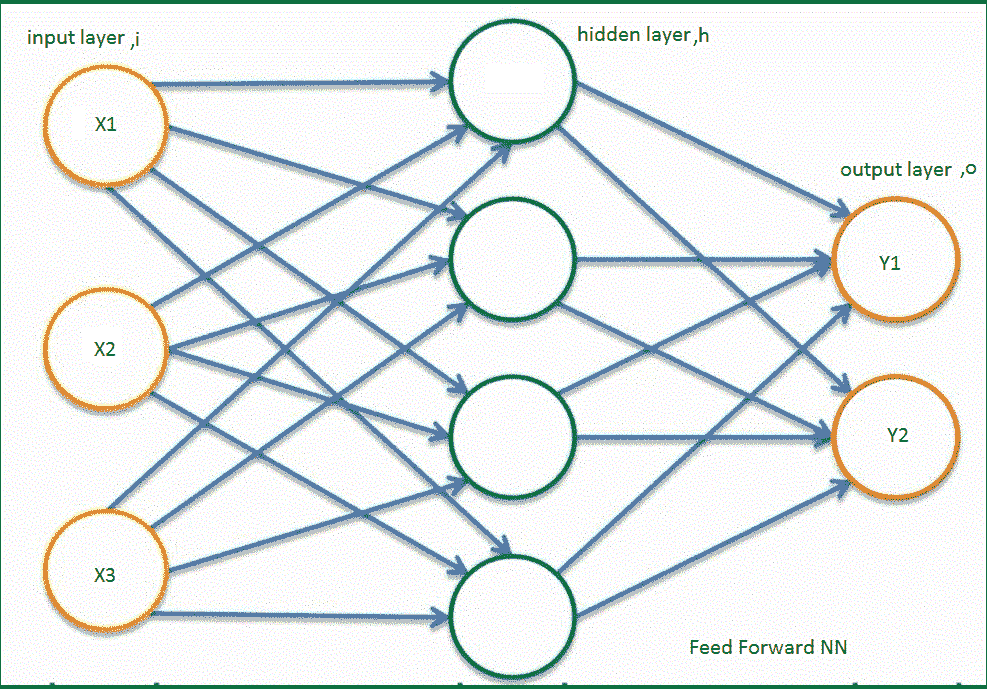
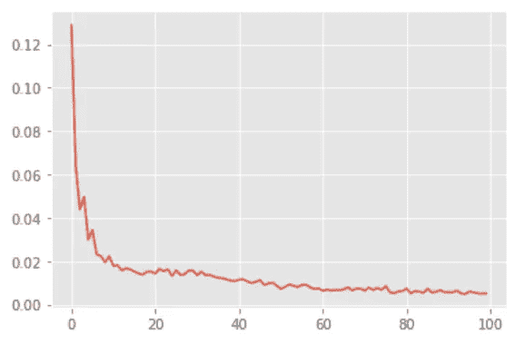

# 使用 ARIMA 和 LSTM 的时间序列分析(Python 和 Keras 版)-第二部分

> 原文：<https://medium.com/analytics-vidhya/time-series-analysis-using-arima-and-lstm-in-python-and-keras-part2-74a79636568?source=collection_archive---------5----------------------->

## 时间序列分析的深度学习方法:LSTM RNN

> [【链接到第一部分】](https://medium.com/p/f987e11f9f8c/edit)

## 介绍

[【LSTM 内核】](https://www.kaggle.com/parijat2018/airline-passenger-lstm)

LSTM(长短期记忆)是 RNN(递归神经网络)的一种特殊类型，而 RNN 是具有反馈(即，来自先前步骤的递归输入)的 FFNN(前馈神经网络)。让我们首先了解 RNN 是如何从 FFNN 进化而来的。我只是假设你理解一个 FFNN 和休息，我们将从那里建立。

## FFNN 到 RNN 跃迁



图 30:典型的 FFNN

图 30 显示了一个典型的 FFNN。

让我们在图 31 的动画中看到整个变换(FFNN->FFNN 折叠模型->RNN 折叠模型)。


图 31: FFNN 折叠模型和 RNN 转换

现在让我们一部分一部分来看。

首先，让我们画出并讨论一个 FFNN 的折叠模型。它将类似于图 32a 中的结构。

x 代表输入向量，Y 代表输出向量，h 代表隐藏层。Wx 表示将输入层连接到隐藏层的矩阵，Wy 表示将隐藏层连接到输出层的矩阵。


图 32a: FFNN 折叠模型/图 32b: RNN 折叠模型

FFNN 的公式为:


b 代表偏见，而

ф，代表 NLFs(非线性函数)

ф2 对于回归问题可以是 nothing，对于二进制问题可以是 Sigmoid，对于多类分类问题可以是 SoftMax。时间序列分析是一个回归问题，我们在输出层不需要 NLF。

如果我们用 FFNN 连接一个反馈环路，它将看起来像图 32b 中的结构，形成一个 RNN。简单！

注意，在图 32b 中，X、Y 和 h 标有 t，这表示在序列 t(在时间 t 的时间序列中)的输入、输出和隐藏层。存在附加矩阵 Wh，将序列 t(即 ht)处的隐藏层连接到序列 t+1(即 ht+1)处的隐藏层

> ht 是我们从序列 t 到 t+1 传递的短期记忆或反馈。

RNN 的方程式是:


ф2，同 FFNN 中提到的。

最重要的是，与 RNN 的 FFNN 不同，在序列中，Yt 不仅依赖于 Xt，而且从先前序列 t-1 结转的记忆 ht-1，即 Yt，依赖于来自所有先前步骤的所有输入，即


让我们更详细地了解一下 RNN。


图 33: RNN 详细视图

图 33a 表示 RNN 中信息的顺序转换。

RNN 层也可以堆叠。在图 33a 中，红线显示了 L1 层和 L2 层之间的分界线。图层“L2”堆叠在 L1 的顶部。也可以堆叠更多层。所有层都独立工作，除了上层的输入来自其下一层。这里，Y 从 L1 到 L2，反过来，L2 生产 O。

基于问题的基数，Y 是被采用还是被忽略。如果需要，Keras API 可以输出所有的 Y。如果问题是多对一的，如情感分析，那么只需要最后的 Y(即，基于给定的句子，情感是积极的还是消极的)。这里，句子是顺序数据)。时间序列通常是多对多类型的，因为我们通常被给定一个数据跨度(许多)，我们希望预测一个即时跨度(许多)。此后，我们将把序列看作时间，就像我们在这里处理时间序列一样。现在，让我们把图 33a 中的黄色块(代表当时 RNN 的一切，t)转换成图 33d 中的 FFNN 等价物。输入层的蓝色圆圈(图 33d)代表从时间 t-1 开始的记忆(或反馈),我们将它与输入 Xt 一起输入到隐藏层 ht，最后得到 Yt (=ht)。该 ht 作为短期记忆被传递到下一个时间步骤 t+1(参见图 33a)。隐藏层的每个绿色圆圈代表一个神经元(带 NLF，tanh)，如图 33c 所示。简单 RNN 的箱形模型如图 33b 所示。

## RNN 到 LSTM 的过渡

> 现在，下一个问题是，如果 RNN 带着记忆前进，那么为什么不在这里停下来，为什么需要一个先进的 LSTM 模型？

原因是当我们使用梯度下降(或小批量梯度下降)在每个时期或小批量之后更新 W 和 b 时，我们需要在更新 Wh 时通过时间反向传播。由于 RNN 的数学构造，可以看出网络不能记住大约 10 步以上的后退，并开始遗忘。在反向传播过程中(求导时)，Wh 的系数变得接近于零，我们很久以前获得的信息丢失了。这被称为*消失梯度问题*，正因为如此，RNN 人无法进行长期记忆。RNN 只能对后退几步进行短期记忆。确切地说，RNN 的这个问题已经在 LSTM 解决了。在 LSTM，长期记忆贯穿始终。


图 34: LSTM 详细视图

要将图 33a 中的 RNN 网络转换为 LSTM，我们需要将隐藏层中的 RNN 单元转换为 LSTM 单元(参见图 34a)。RNN 细胞仅由一个双曲正切 NLF 组成，但 LSTM 细胞有σ(*3)、双曲正切(*2)、乘法(*3)和加法(*1)，这就形成了四个门，即遗忘、学习、记忆和使用。

> ht 是短期记忆，Ct 是长期记忆。

如图 34b 所示，当 Ct-1 和 ht-1 进入 LSTM 单元时，遗忘门遗忘一些东西，学习门学习一些东西，然后使用遗忘门和学习门更新记忆门和使用门。使用门提供短期记忆，记忆门在时间 t 向 LSTM 网络提供长期记忆。LSTM 的数学构造允许携带长期记忆，并且在反向传播期间不会遭受消失梯度问题。为了让文章不那么数学化和直观，我没有加入方程式。图 34c 显示了一架 LSTM 的箱形模型。

现在，让我们将 LSTM 应用于飞机数据集。这里应该提到的是，在 LSTM 分析中，不需要特别考虑季节性。

让我们将数据集分为训练和测试(类似于 ARIMA 分析)

```
df_train = df[:-24]
df_test=df[-24:]
trainset=df_train.iloc[:,1:] 
# only taking the NOP (No.of passangers)column
```

接下来，让我们对训练数据执行特征缩放，并查看缩放后的数据

```
from sklearn.preprocessing import MinMaxScaler
sc = MinMaxScaler(feature_range = (0,1))
training_scaled = sc.fit_transform(trainset)fig, (ax0,ax1) = plt.subplots(ncols=2, figsize=(20,8))
ax0.set_title('Original Distributions')
ax1.set_title('Distributions after MinMax scaler')
sns.kdeplot(df_train['Nop'], ax=ax0)
sns.kdeplot(pd.DataFrame(training_scaled,columns=['Nop'])['Nop'], ax=ax1)
```


图 35:缩放前后的列车数据分布

很高兴看到缩放后数据分布仍然完好无损。

在特征缩放的拟合和变换操作结束时，我们得到了 training_scaled 数组。

现在我们导入 Tensorflow 和 Keras。

```
import tensorflow as tf
keras=tf.keras    
from keras.models import Sequential
from keras.layers import Dense
from keras.layers import LSTM
from keras.layers import Dropout
```

我保留了 LSTM 内核的结构，使其可以在脚本和笔记本模式下运行，并对滑动窗口做了更多的实验。我们稍后将讨论窗口大小实验。

```
window_max=4 # is the sliding window size  
# Tune this Hyper-parameter #  It's a monthly dataset
trainError_MAPE=[]
testError_MAPE=[]
```

我说的滑动窗口是什么意思？我们来讨论一下:

我们的*单变量时间序列*数据如下所示:

[(t0，x0)，(t1，x1)，(t2，x2)，(t3，x3)，……………。，(tn，xn)]

其中 tn =第 n 个时间点，xn =第 n 个时间点的变量值(在我们的例子中为 NOP)

现在，为了训练 LSTM 算法，数据应该转换如下:

[(x0，x1，x2，x3)，(x4)]

[(x1，x2，x3，x4)，(x5)]

[(x2，x3，x4，x5)，(x6)]

………………….

[(xn-3，xn-2，xn-1)，(xn)]

现在，x_train =[(x0，x1，x2，x3)，(x1，x2，x3，x4)，(x2，x3，x4，x5)，…………，(xn-4，xn-3，xn-2，xn-1)]

y_train=[x4，x5，x6，…..，xn]

这里，窗口大小是 4(实际上是 5，因为 Python 索引是从 0 开始的)，我们以 1 的步幅滑动它。在窗口中，前 4 个元素进入 x_train，最后一个进入 y_train。我们将(x0，x1，x2，x3)反馈给 LSTM，并尝试预测 x4；我们将(x1，x2，x3，x4)反馈给 LSTM，并尝试预测 X5；我们馈(xn-4，xn-3，xn-2，xn-1)来预测 xn。在每个时段(或小批量)中，该算法利用预测值和实际值(y_tarin)计算误差，并使用梯度下降(或小批量梯度下降)进行反向传播，以更新 Wx、Wy 和 Wh，从而最小化下一个时段(或小批量)中的误差。这里我们将使用一个 32 的小批量，并在每个小批量后反向传播以更新 W。

我们正在从 training_scaled 数组构建 x_train 和 y_train。

```
# Preparing the training data for LSTM

    x_train = []
    y_train = []# %% [code]
    for i in range(window,len(df_train)):
        x_train.append(training_scaled[i-window:i, 0])
        y_train.append(training_scaled[i,0])
    x_train,y_train = np.array(x_train),np.array(y_train)
```

此外，请注意 x_train 的维度:

x _ train . shape[0]=[len(training _ scaled)-window _ max+1](行数)，以及

x_train.shape[1]=[window_max](列)

y_train 的大小:x_train.shape[0] x 1(行 x 列)

这里讨论维度是有原因的，LSTM 以 3D 矩阵的形式接受输入。我们得到了一个 2D 训练矩阵。让我们把它转换成 3D:

```
x_train = np.reshape(x_train, (x_train.shape[0],x_train.shape[1],1))
```

现在形状是:(x_train.shape[0]，x_train.shape[1]，1)

这里，当前的窗口大小是 4。因此，我们借助前三个月的 NOP 值来预测每个第四个月的 NOP 值。您可以增加 window_max 变量，并注册测试和训练的映射，并决定窗口大小，因为较大的窗口大小意味着 LSTM 的较高内存保持力。达到一定的窗口大小后，它可能不会像预期的那样运行。这里还有一件事要提一下:

```
keras.backend.clear_session()
```

当运行 for 循环时(在窗口实验期间)，我们将在每次运行中进行不同的训练，并且忘记除了期望的 MAPE 变量和循环计数器之外的一切。上面的代码块将在每次运行时释放内存。

现在，让我们进入神经网络的主干，并通过执行一些超参数调整使其变得更强。首先，让我们建立神经网络。

```
# %% [code]
    regressor = Sequential()
    regressor.add(LSTM(units = 50,return_sequences = True,input_shape = (x_train.shape[1],1)))
    regressor.add(Dropout(0.2))# %% [code]
    regressor.add(LSTM(units = 50,return_sequences = True))
    regressor.add(Dropout(0.2))# %% [code]
    # regressor.add(LSTM(units = 50,return_sequences = True)) # Activate it to see effect
    # regressor.add(Dropout(0.2))# %% [code]
    regressor.add(LSTM(units = 50))
    regressor.add(Dropout(0.2))# %% [code]
    regressor.add(Dense(units = 1)) 
# only one output for regression value with NO Activation Function# %% [code]
    regressor.summary()
```

虽然我假设对 FFNN 的基本知识是先决条件，但我想在这里讨论一些事情。让我们从头开始浏览上面的代码块。第一个 LSTM 隐藏层有 50 个 LSTM 单元。我们通过仅提供 x_train 的最后两个维度来提及输入形状。需要注意的最重要的事情是，我们通过提供 return_sequences=True 来添加/堆叠 3 个以上的 LSTM 层。注意，最后一个 LSTM 层有一个*默认 return_sequences=False* 。为每层增加 20%的下降，作为过度拟合的预防措施。倒数第二个 LSTM 图层在您的实验中被禁用。

最后，我们附加一个稠密层，它没有任何激活函数，只有一个输出作为它的回归问题。的。summary()函数汇总网络信息。


35a: NN 摘要

现在，下一步是引入优化器，声明学习率的初始值(学习率的合适值 lr，在拟合期间通过超参数调整找到)，并编译 NN 模型。Adam 在这里被用作优化器。

使用下面的 bcode 块，通过 Keras*learning-rate-schedular 函数进行 lr 调谐。*初始值是 1e-07，对于后续批次，它将被重新计算并通过 lr_schedule 变量传递给优化器。

```
# %% [code]
#     lr_schedule = keras.callbacks.LearningRateScheduler(   
#         lambda epoch: 1e-7 * 10**(epoch / 20))# activate this code during lr tuning# %% [code]
#     opt = keras.optimizers.Adam(lr=1e-7) 
# use this code during lr tuning
```

现在需要对模型进行编译，并提供优化器、损失类型和期望的指标(在我们的例子中是 MAPE)

```
regressor.compile(optimizer = opt, loss = 'mse',metrics=['mae','mape'])# %% [code]
    early_stopping = tf.keras.callbacks.EarlyStopping(monitor='loss',mode='min',patience=20)# %% [code]
    mc = tf.keras.callbacks.ModelCheckpoint('best_model.h5', monitor='loss', mode='min', verbose=0, save_best_only=True)# %% [code]
    hist = regressor.fit(x_train, y_train, epochs=150, batch_size=32,callbacks=[mc, lr_schedule,early_stopping])
```

我还使用了 Keras，如果在 20 次以上的迭代中损失值没有变化，就终止拟合过程的提前停止功能。它一直等到 20 次迭代后才终止。

模型检查点功能保存损失最小的最佳模型，就像网格搜索一样。

在拟合期间，early_stopping、lr_schedule 和模型检查点作为列表传递给回调参数。

最后，将训练数据、时期和小批量大小传递给。fit()方法。

拟合后，我们可以获得所有用于训练和验证(在此测试)的指标，如下所示:

```
hist.history.keys()
```

我们可以绘制一些指标:纪元与损失图。

```
plt.plot(hist.history['loss'])
plt.show()
```



时代与损失图

调谐 lr 时，我们还可以绘制 lr 与损耗的关系图。

```
%% [code]
    ##use this part during lr design only
    plt.semilogx(hist.history["lr"], hist.history["loss"])
    plt.show()
```

我们可以保持窗口大小为 2、4 和 8，并比较每种情况下的最佳学习率值。

```
window_max=4
for window in range(4,window_max+1):
```


图 36:损耗与 lr 值的关系(左:窗口大小=8，右:窗口大小=4)

我对 4 和 8 进行了实验，发现在这两种情况下，1e-03 和 1e-02 之间都有一个稳定的区域。显然，lr 值取决于窗口大小。我保持窗口大小为 4，因为它给出了从 1e-03 到 1e-01 的宽稳定区域。我冻结 lr 值为 0.5e-02(这将导致窗口大小为 8 的坏结果，这是我的意图。)

一旦确定了最佳 lr 值，就用下面的代码替换相应的代码。您可以保留这两项，并禁用其中一项。

```
opt = keras.optimizers.Adam(lr=0.5e-2)
hist = regressor.fit(x_train, y_train, epochs=100, batch_size=32,callbacks=[mc,early_stopping],verbose=0)
```

现在，编译并拟合最佳 lr 值和窗口大小为 4 的模型。

得到最终拟合的模型后，让我们检查火车 MAPE。

```
# %% [code]
    from keras.models import load_model
    regressor=load_model('best_model.h5')# %% [code]
    prediction_train=regressor.predict(x_train)# %% [code]
    prediction_train = sc.inverse_transform(prediction_train)
    #prediction_train# %% [code]
    prediction_train.shape# %% [code]
    #y_train# %% [code]
    y_train=sc.inverse_transform(y_train.reshape(-1,1))# %% [code]
    y_train.shape# %% [code]
    #metrics= regressor.evaluate(x_train,y_train)# %% [code]
    #metrics# %% [code]
    train_errors=errors(y_train,prediction_train)
    train_errors
```

在上面的代码块中，我们导入了最佳模型‘best _ model . H5’，用 x_train 进行预测。我们已经得到预测作为预测训练，并且逆变换预测训练和 y 训练，并且发现 8.756%的 MAPE

```
# Error Function
def errors(actual,prediction):m=keras.metrics.MeanAbsolutePercentageError()
    n=keras.metrics.MeanAbsoluteError()m.update_state(actual,prediction)
    n.update_state(actual,prediction)error=m.result().numpy() #  MAPE   
    error1=n.result().numpy() # MAEreturn ({'MAE':error1 ,'MAPE':error})
```


图 37:列车数据的实际和预测图

图 37 显示了列车数据的实际和预测图。

下一步是检查验证 MAPE。

让我们准备好测试数据，并提供给 LSTM。

我们从训练集的后面获取一个窗口大小的数据，并将其附加到测试集的开头，以根据训练数据的最后三个值预测第一个测试数据点。

```
# %% [code]
inputs=pd.concat((df_train[-(window):],df_test),axis=0,ignore_index=True)
```

让我们绘制测试数据。


图 38:原始训练和测试数据


图 38a:(右:原始测试数据，左:为 LSTM 准备的测试数据)

其余过程与训练数据相同。

```
# %% [code]
    testset=inputs['Nop'].values# %% [code]
    testset = testset.reshape(-1,1)# %% [code]
    testset_scaled = sc.transform(testset)
    testset_scaled.shape# %% [code]
    x_test=[]
    y_test=[]# %% [code]
    for i in range(window,len(inputs)):
        x_test.append(testset_scaled[i-window:i,0])
        y_test.append(testset_scaled[i,0])
    x_test,y_test = np.array(x_test),np.array(y_test)# %% [code]
    x_test = np.reshape(x_test, (x_test.shape[0],x_test.shape[1],1))
    x_test.shape# %% [code]
    prediction_test = regressor.predict(x_test)# %% [code]
    prediction_test = sc.inverse_transform(prediction_test)
    prediction_test.shape# %% [code]
    y_test = sc.inverse_transform(y_test.reshape(-1,1))# %% [code]
    test_errors=errors(y_test,prediction_test)
    test_errors
```

让我们看看验证图(图 39)。


图 39:验证图

> LSTM 的验证 MAPE 为 8.763%。这比我们从 ARIMA 模型获得的 14.93%的 MAPE 好得多，但是 Auto Arima 技术是一种更快的方法来创建基线结果。

现在，该做窗口大小变化实验了(保持 lr 常数的最佳值为 0.5e-02)。让我们为一个范围(1，13)运行循环，并绘制结果。

```
plt.plot(*zip(*trainError_MAPE),label='Train Error')
plt.plot(*zip(*testError_MAPE),label='Test Error')
plt.legend(['Train Error', 'Test error'], loc='upper left')
plt.xlabel('window size')
plt.ylabel('MAPE')
plt.title('Error')
plt.show()
```


图 40:窗口大小与 MAPE 图

我们可以从图 40 中观察到，在窗口大小(WS)区域 1–4 中，模式是期望的，即验证损失>训练损失。同样，在区域 6–8 中，它是一致的，并遵循所需的模式，但从 WS=9 开始，它迅速上升(尽管遵循所需的模式)。WS=5 和 10 显示了相似性，尽管幅度不同。WS=12 时，训练损失很小，验证损失很大。可能是太合身了。这些结果完美地证明了图 36 中的曲线，即，对于不同的窗口大小，我们得到不同的稳定 lr 区域，并且应该相应地选择优化的 lr 值，然后只决定最终的窗口大小。

我希望你喜欢它，谢谢你的时间。

***参考文献:***

Udacity 免费课程:[深度学习张量流介绍](https://classroom.udacity.com/courses/ud187)