# 用 Python 进行时间序列分析

> 原文：<https://medium.com/analytics-vidhya/time-series-analysis-with-python-3a86baa78770?source=collection_archive---------2----------------------->

## 特斯拉股票价格的案例研究

[来源](https://encrypted-tbn0.gstatic.com/images?q=tbn%3AANd9GcR4iIplt9jkStHY5yQHtEeUS1QETURMYCJZlvjdlAS4F7wM5TS7)

# 1.什么是时间序列

时间序列是按连续的时间顺序排列的数据序列**。当与时间结合时，数据的价值通常变得更加有用。我们可以通过时间序列分析获得更多的信息，这通常会导致预测。让我们来看看最常见的时间序列数据，股票数据。**

**前几天(准确的说是 2020 年 1 月 25 日)看了一篇文章，说特斯拉已经超越大众成为通用汽车之前第二大最有价值的汽车公司。大众还称赞了特斯拉，并开始其可再生能源(电动汽车)之路。这是一个伟大的消息，因为我是特斯拉的粉丝(来源: [bbc](https://www.bbc.com/news/business-51214824) ， [wsj](https://www.wsj.com/articles/tesla-tops-volkswagen-to-become-second-most-valuable-auto-maker-11579709320) )。所以现在，让我们试着把他们的股价从雅虎。**

**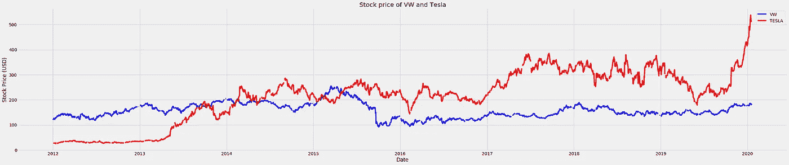**

**如果看到 intersect，其实特斯拉在 2015 年底就已经战胜了大众，为什么现在才报道？良好的..上图是股价图。**不代表**一个公司的价值。一家公司的真正价值是市值，用*𝑠𝑡𝑜𝑐𝑘𝑝𝑟𝑖𝑐𝑒*×*𝑠ℎ𝑎𝑟𝑒𝑠*表示。特斯拉的股价确实在年前战胜了大众。但是特斯拉的股份没有大众那么多，这使得它不那么值钱了。**

# **2.时间序列中的缺失值**

**在继续之前，我们需要先清理数据。如你所见，有些日期有漏洞。这可能是由于市场误差，或我们还没有检查的东西。我们需要修复它，否则预测模型不能正常工作。**

**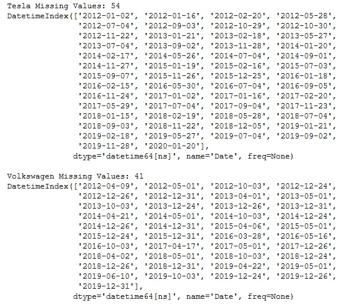**

**有许多方法可以填充这些`nan` -s。如果您有一个好的预测模型，您可以预测每个缺失的值。但这不是我们要做的，因为我们还没有建模。所以让我们从最简单的方法开始，做一个`ffill`或`bfill`来复制前一个/后一个数据值。**

# **3.时间序列成分**

**时序数据有三个组成部分:**

*   **趋势:数据在更大范围内的移动(移动平均线)**
*   **季节性:反复的季节性波动**
*   **残差:没有从趋势或季节性中捕捉到的任何波动(应该是随机的)**

**根据趋势和季节性的性质，时间序列可以建模为**加法**或**乘法**时间序列。**

*   ****加法时间序列****

**观察值=趋势+季节性+残差**

*   ****乘法时间序列****

**观察值=趋势×季节×残差**

***资料来源:Hyndman，R.J .，& Athanasopoulos，G. (2018)《预测:原理与实践》，第二版，2020 年 1 月 22 日获取。***

**那么，如何区分加法和乘法时间序列，请看下面的一个例子图片([来源](https://kourentzes.com/forecasting/2014/11/09/additive-and-multiplicative-seasonality/))**

**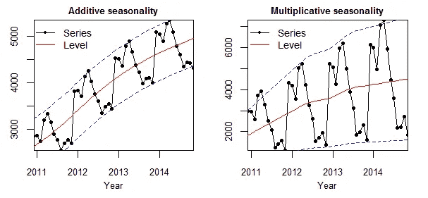**

**根据数据值，如果季节性的大小随时间而变化(见右图)，那么数据是倍增的。然而，我们的数据并没有显示出季节性增加或减少的明显证据，所以我们假设这是一个附加的时间序列。请再看一眼。**

**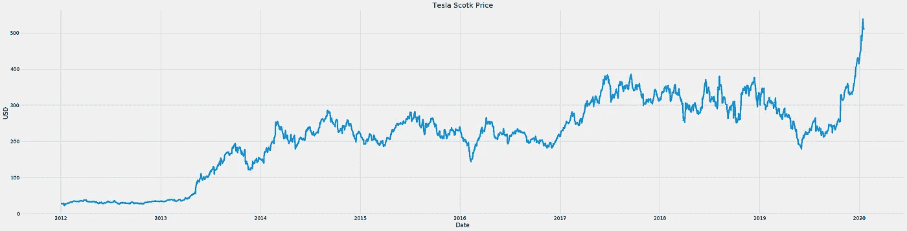**

**现在让我们尝试提取子组件。**

**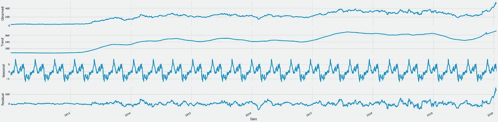**

**在上面的例子中，我们使用`freq= 7*4*3` (~3 个月)来模拟我们的数据。你可以通过保持`trend`可视化来调整它。如果趋势的可视化是平滑的，季节有模式，那么继续是好的。
`extrapolate_trend='freq'`将通过处理序列开始时的任何缺失值，使残差、趋势和季节的长度相同。
现在我们已经分解了数据，让我们试着重构一下，看看公式是否正确。**

**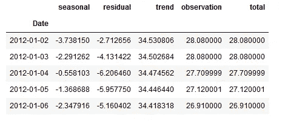**

**试着自己检查一下值是否相同，这样我们就有一个公式为真的证据。**

# **4.平稳时间序列**

**平稳时间序列是数值不遵循时间函数的时间序列数据。**

**平稳时间序列和非平稳时间序列之间的差异在这些例子中是显而易见的([来源](https://towardsdatascience.com/stationarity-in-time-series-analysis-90c94f27322)**

**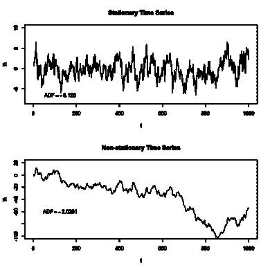**

**通过上面的例子，我们可以得出结论，对于每个窗口，平稳时间序列的方差可能是常数。为什么我们需要平稳的时间序列？这是因为平稳时间序列更容易分析，而且大多数预测算法对平稳时间序列都适用。让我们再次看看我们的数据**

****

**通过研究我们的数据，数据似乎不是静止的。如果你对此有点怀疑，有几种测量方法可以测试数据的平稳性:
-增强的迪基富勒(ADF)测试
-科维亚特科夫斯基-菲利普斯-施密特-申-KPSS 测试(趋势平稳)**

**让我们尝试使用 ADF 来检查我们的数据的平稳性，这是测试平稳性最常用的方法。**

**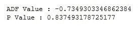**

**当您运行 ADF 测试时，结果应该是负值，并且 P 值应该低于某个阈值。比如我们会用 p 值< 5%. Based on the result, the ADF Value is -0.7 wich means our data is not stationary enough. This result also show that p-value > 5%，甚至远远超过 10%。这表明我们数据在统计上不是稳定的。**

## **4.1 将时间序列转换为平稳序列**

**有一些方法可以让一个数列变成平稳的:
-求数列的差
-把数列转换成它的对数
-把数列转换成它的根
-其他组合**

**首先，让我们尝试最简单的方法，使用 log。对数据应用对数将有效地消除变化的幅度，也可以使时间序列从乘法变为加法。现在让我们看看它有多稳定**

**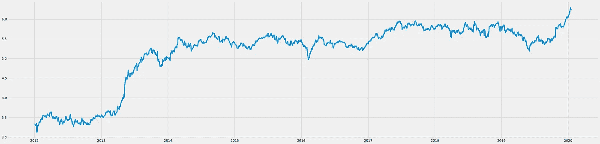****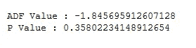**

**看来把我们的数据转换成它的日志并不足以让它静止。让我们试着改变方法，区别对待。差分数据是数学上应用的函数**

**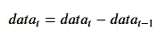**

**对于`t`从数据长度移动到 2。**

**你必须意识到这样一个事实，做差分会使第一个数据成为`nan`，因为事先没有数据。这意味着，做一次差分就会删除第一个数据，我们必须处理它(使用 fillna 或 dropna)。进行两次差分将删除两个第一数据，依此类推。现在让我们看看做一次差分是否会使数据成为平稳的时间序列。**

**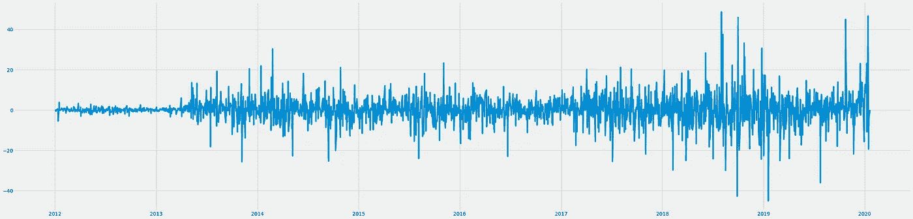****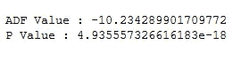****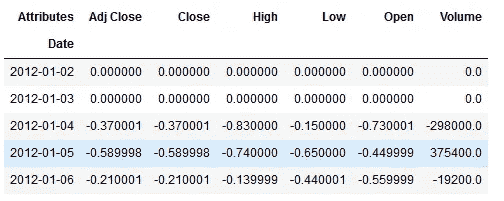**

**进行转换意味着我们改变数据。不过别担心，我们还是可以把它重建成原来的形态。但是，这取决于您如何更改数据。由于我们使用的是导致当前数据和先前数据之间差异的 diff，因此累积和(`cumsum`)将作为一种解决方法。**

**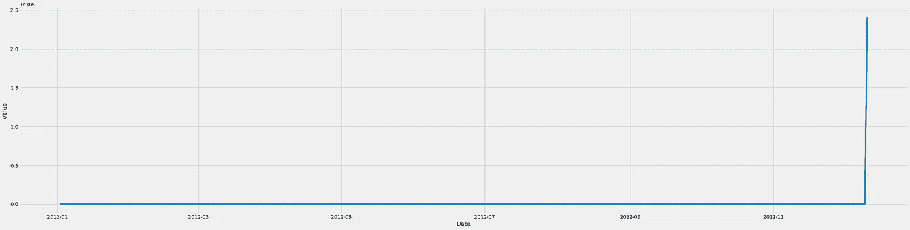**

**然而，进行累积求和不会将数据重新转换为其原始值。这是由于数据的第一个值为零(以前为 nan，改为零)造成的。我们需要初始数据，以便它可以转换为原始值。**

**现在让我们检查它是否与原始数据相同**

****

**根据图表和人工检查，两个数据帧(原始的和重建的)是相同的。既然我们知道差分一次将使我们的数据变成静态的，我们将在稍后的建模中使用差分数据。下一步，我们将把它分成一个训练验证集**

# **5.列车测试分离**

# **6.自相关和偏自相关**

**自相关是时间序列数据与其自身滞后的相关性。如果相关性很高，这意味着以前的数据将有助于预测未来。虽然部分自相关可能是相同的，但它衡量的是序列及其滞后之间的纯相关性。**

**我们可以使用来自`statsmodel`的 acf 和 pacf 图来帮助我们测量几个滞后上的序列之间的相关性**

**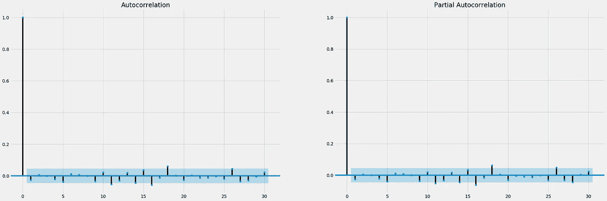**

**如果我们看到自相关和部分自相关值，这些值形成了 ACF 和 PACF 结果的截止模式。这表明我们可以使用自回归及其移动平均来模拟数据。请查看每个图中几乎越过或越过蓝色阈值的滞后。在 PACF，几乎越过蓝色阈值的第一个滞后是 5，所以我们将使用 P=5。
另一方面，ACF 图上跨越/几乎跨越蓝色阈值的第一个滞后也是 5，因此我们将使用 q=5。**

# **7.利用 ARIMA 进行时间序列预测**

## **7.1 建模**

**ARIMA 模型将需要(p，d，q)个自变量作为其阶数，
其中:
- p:模型中包含的滞后数，也称为滞后阶数。先前通过查看 PACF 可视化定义
- d:差分顺序。在上一节中，我们知道做一个差异曾经使数据稳定。因此，我们将对原始数据使用 d=1。
-问:移动平均线窗口的大小，或者也叫移动平均线顺序。先前通过观察 ACF 可视化来定义**

**我们再看一遍剧情，建立模型。**

**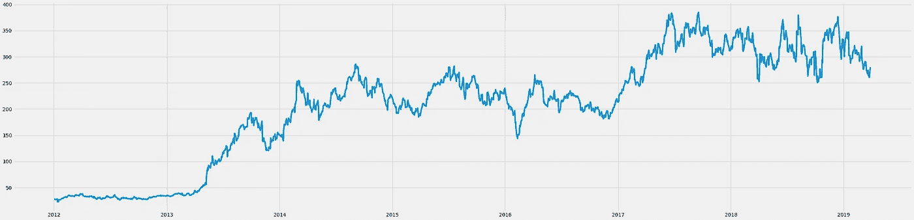****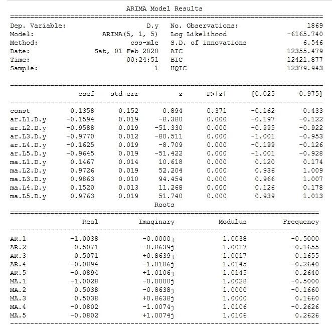**

**基于模型总结，所有变量(ar 和 ma)都有一个 p 值<5%. This means that our model really fits into the train data. The AIC, BIC, and HQIC is a score to measure the goodness of our model based on the train data.**

**Akaike Information Criterion (AIC) tests how good your model fits the train data without over-fitting it. AIC Score rewards the model if it has a good fit, and penalizes the model if it becomes overfit. The model with a lower AIC score is supposed to have a balance between its ability to fit and avoid overfitting.**

**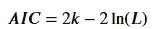**

**where *𝑘* 是模型参数的个数， *𝐿* 是模型的似然函数的最大值。要了解更多信息，你可以访问我在 Research Gate 上找到的这篇论文，它可以帮助你更好地了解 AIC。**

**贝叶斯信息准则(BIC)非常接近 AIC。事实上，BIC 的建立是为了改善 AIC。主要的想法是惩罚更多的过度拟合。这是公式**

**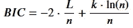**

**其中:**

*   ***𝑛* 是数据或观测值的数量**
*   ***𝑘* 是模型参数的个数**
*   ***𝐿* 是模型的似然函数的最大值**

**汉南-奎因信息准则(HQIC)是前两个准则的替代。根据 R 的[文档](https://www.rdocumentation.org/packages/qpcR/versions/1.3-7.1/topics/HQIC)，对于 n>∞20 左右，BIC 在惩罚自由度损失方面最严格，在拟合模型中有更多的参数。对于 n>∞40，AIC 是三个国家中最不严格的，而 HQIC 处于中间位置，或者说对于 n<∞20 是惩罚最少的。HQIC 如下所示:**

**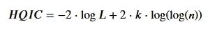**

**但最重要的是，那些测量是没有用的，除非我们把它和其他模型进行比较。那么现在让我们试着比较一下我们模型的几种可能性。我们将使用 AIC，因为我们的数据> 40。**

## **7.2 型号选择**

**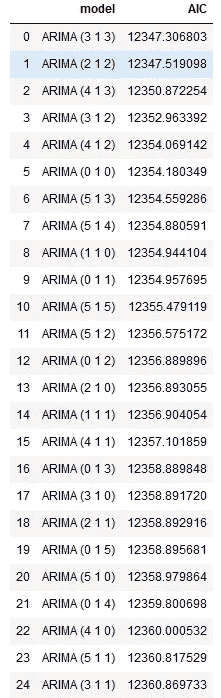**

**从上面 AIC 的结果，我们知道 ARIMA(3 1 3)和(2 1 2)有最好的 AIC 站在前 2 名。显然，ARIMA(0 1 0)也比我们的模型 ARIMA (5 1 5)要好。在计算上，p 和 q 越低，复杂度成本就越低。让我们比较一下我们的模型的最终结果(ARIMA (5 1 5)后)与其余三个**

**现在我们有了模型，我们不希望残差有自相关。因此，让我们来看看每个剩余滞后的 ACF-PACF 值。**

**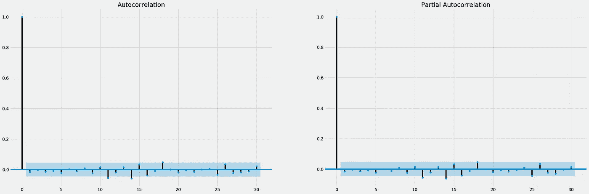**

**我们还想确保残差是随机的，集中在零，**

**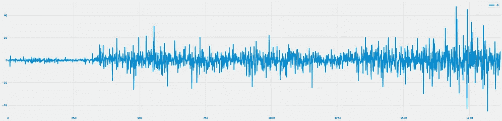****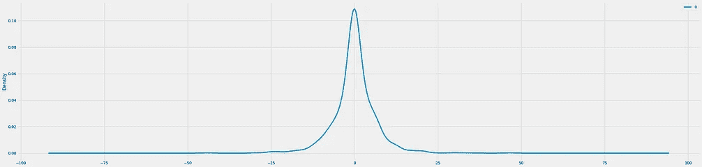**

## **7.3 模型评估**

**让我们先来看看我们的模型的预测(ARIMA (5 1 5))**

**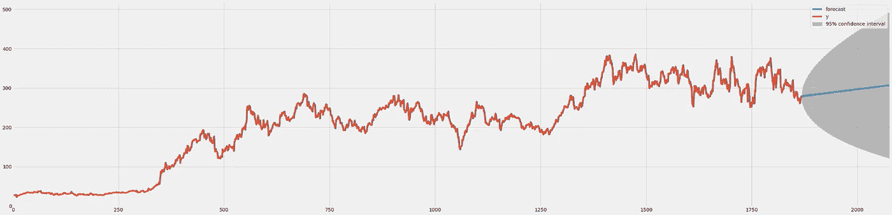**

**然后让我们比较每个模型的预测**

**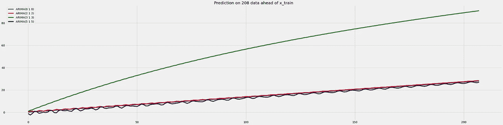**

**总的来说，所有的模型都有相似的预测，除了 ARIMA (3 1 3)**

**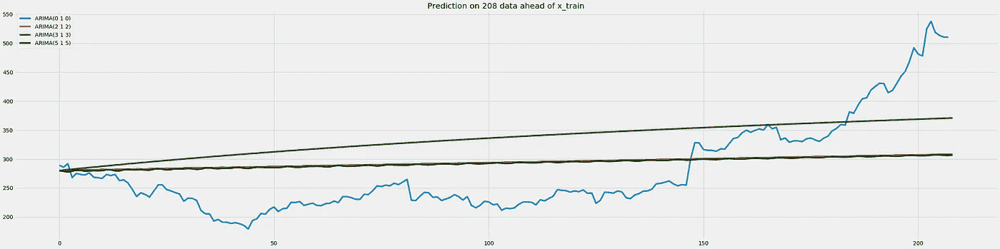**

**如果以前我们根据 ACF 和 PACF 的结果定义我们的模型，AIC 却有不同的说法。让我们从另一个角度来看，RMSE**

**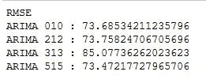**

# **8.结论**

**根据结果，ARIMA (5 1 5)给出了最好的表现(对 RMSE)。尽管如此，这个模型发现很难预测长期数据。这可能是因为 ARIMA 是敏感的，而不是用于预测的通用算法。另一方面，股票数据通常没有 ARIMA 模型所能观察到的季节性。**

**如果我们在每个时间段都有一个清晰或隐藏的重复模式，那么做预测应该会更容易。但是从本质上讲，股票价格太复杂了，很难建模。影响价格的外部动态因素很多。**

**对于未来的工作，我们将尝试使用更复杂的机器学习方法对其建模。**

**我的 [github](http://github.com/iqbalbasyar) 上有完整的代码**