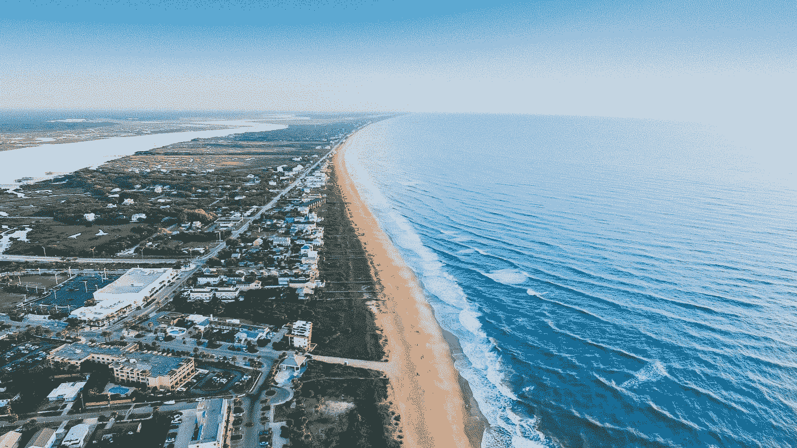
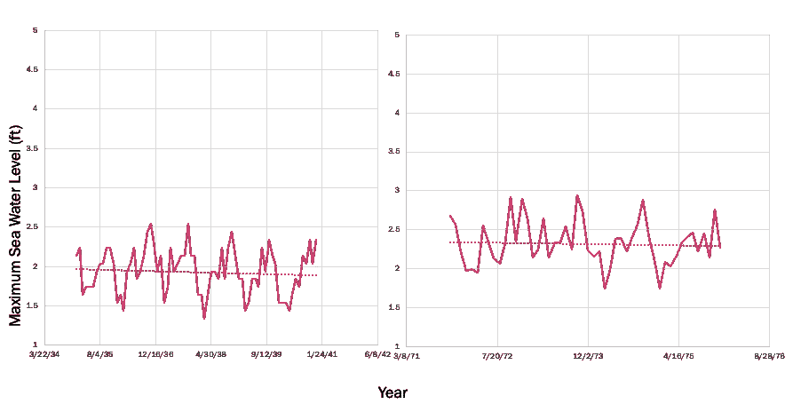
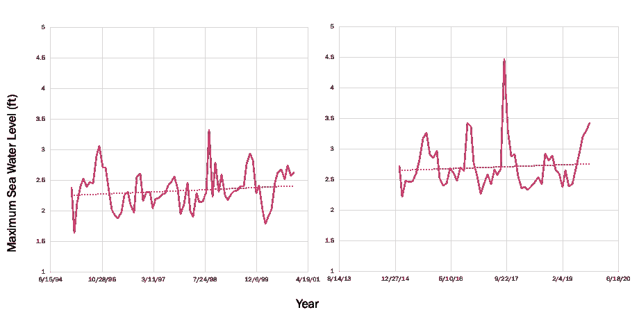
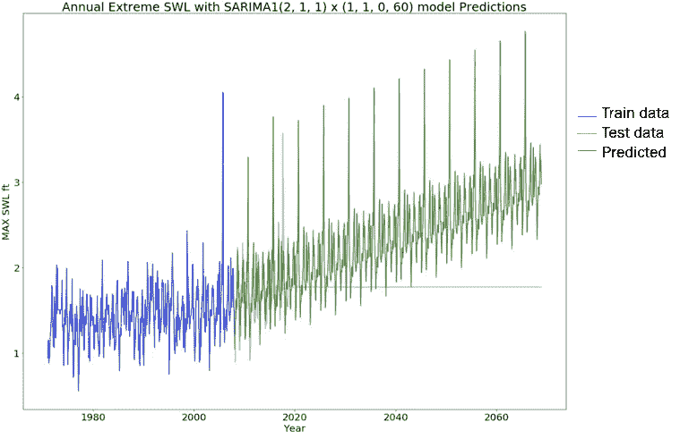

# 基于 SARIMA 模型的时间序列分析

> 原文：<https://medium.com/analytics-vidhya/time-series-analysis-with-sarima-model-26ed620bbc0f?source=collection_archive---------5----------------------->

## *佛罗里达基韦斯特最高月海平面高度*

由[兰斯·阿斯佩](https://unsplash.com/@lance_asper?utm_source=medium&utm_medium=referral)在 [Unsplash](https://unsplash.com?utm_source=medium&utm_medium=referral) 上拍摄的照片

时间序列是指按时间索引的数据集。换句话说，时间序列是一系列连续的数字数据点。时间序列分析有助于了解给定变量如何随时间变化。以下是对时间序列特征的一些解释，在选择用于未来预测的模型之前，理解这些特征很重要。

*   **自回归(AR)**

自回归(AR)是时间序列的一个特征，当所考虑的值与它们之前和之后的值之间存在某种相关性时。对于这种类型的时间序列，我们只使用过去的数据来模拟序列的行为。

*   **移动平均线**

移动平均(MA)时间序列是那些可以使用移动平均建模的时间序列。例如，12 个月气温的移动平均值可以通过从 1 月到 12 月，然后从 2 月到 1 月的月平均值来计算，依此类推。它通过丢弃最早的值并添加最新的值来进行。

*   **自回归移动平均(ARMA)**

从它的名字我们可以清楚的看到，ARMA 时间序列是那些具有自回归和移动平均特性的时间序列。在 ARMA 中，假设序列是平稳的，并在特定时间附近波动。

*   **自回归综合移动平均线(ARIMA)**

这是 ARMA 模型的推广。我们可以将 AR 模型或 MA 模型或两者都应用到 ARIMA 模型中。在数据显示非平稳性证据的一些情况下，应用 ARIMA 模型，其中可以应用差分步骤来消除非平稳性。

*   **季节性自回归综合移动平均线**

这是对 ARIMA 模型的扩展，适用于显示季节模式的 ARIMA 时间序列。在地球科学中，这个模型被广泛用于预测未来的气候变量。

*   **萨里马克斯**

更进一步，SARIMAX 模型应用于具有 SARIMA 特征的时间序列，增加了外生预测变量。例如，我们试图使用 SARIMA 来预测华盛顿西雅图未来的公交乘客量。基于公共汽车乘客量和降雨量之间的密切关系，我们可能希望添加降雨量数据作为我们的外生变量，以将 SARIMA 模型改为 SARIMAX 模型，从而获得更好的预测。

# 佛罗里达基韦斯特未来最高月海平面预测

*   **数据解释**

美国国家海洋和大气管理局(NOAA)公布了 1913 年至 1940 年以及 1971 年至 2019 年的最高月海平面记录数据。下图显示了四年和五年期间(1935 年至 1940 年、1971 年至 1976 年、1995 年至 2000 年和 2014 年至 2018 年)最高海平面趋势的变化。

佛罗里达基韦斯特周围最高月海平面的四&五年周期趋势

从上述数字中可以得出的重要结论是:

*   趋势变化，从 30 年代的下降，到 2018 年 90 年代的显著倾斜。
*   10 年间最小值的变化，从低于 1.5 英尺到高于 2.0 英尺。

我们应该问自己为什么会发生这种情况？请观看由 NASSA 发布的关于常年北极融冰模拟的[视频](https://www.youtube.com/watch?v=7Hl9y6cJIeU)。北极冰川融化和基韦斯特海平面上升有什么关系吗？这个问题我就让读者来回答吧。

*   **用 SARIMA 模型预测未来最高月海平面**

基于我对上述趋势的观察，我把我的预测集中在过去 5 年的季节性模式上。此外，从上图可以清楚地看出，数据是不稳定的(趋势变化)。在时间序列未来预测中，无论如何，目标不是复制观察到的数据，而是预测未来的状况。因此，我们没有理由去捕捉四十年代甚至七十年代的数据趋势。最近五年的记录更重要。考虑到这一点，我选择了我的模型，以便它能够捕捉最新的趋势和极值，以及从 1971 年到 2018 年整个数据群体的一般统计数据。

我预测的结果呈现在下图中。

佛罗里达州基韦斯特最高月海平面的 SARIMA 模型预测结果(水平橙色线显示无未来数据)

可以看出，预测的趋势相当好。迄今为止，记录的最高水位为 4.47 英尺，发生在 2017 年 9 月 10 日。预测最高水位为 4.76 英尺，预测平均最高水位为 2.33 英尺。2019 年最高记录水位为 2。98 英尺。

我将以一条小小的信息来结束这个博客:“海平面正在上升”。

来源和参考资料:

*   NOAA([https://tidesandcurrents.noaa.gov/waterlevels.html?id = 8724580&units = standard&time zone = GMT&datum = MLLW&interval = m&mm = MHHW&bdate = 2019 01 10&edate = 2019 12 10](https://tidesandcurrents.noaa.gov/waterlevels.html?id=8724580&units=standard&timezone=GMT&datum=MLLW&interval=m&mm=MHHW&bdate=20190110&edate=20191210)
*   [NASA 科学可视化工作室](https://www.youtube.com/channel/UCM2GOiW_Dxn1D7HHP80IrBg)
*   http://www.statslab.cam.ac.uk/~rrw1/timeseries/t.pdf

*注:本分析中使用的海水水位数据基准为 MLLW(平均低低水位)。*