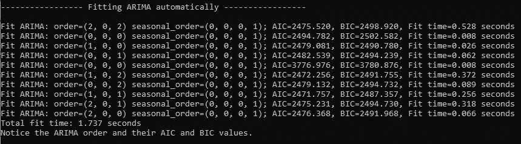
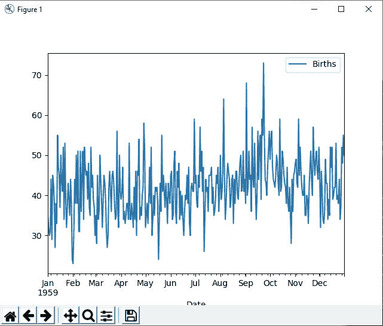
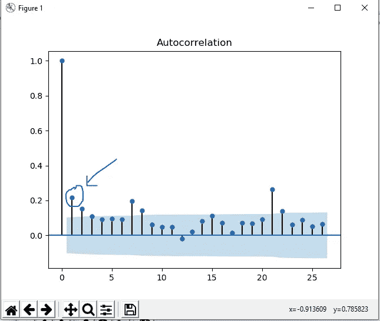
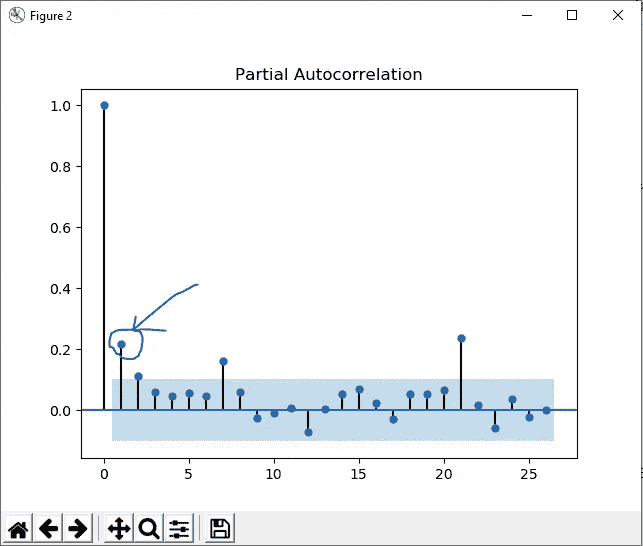
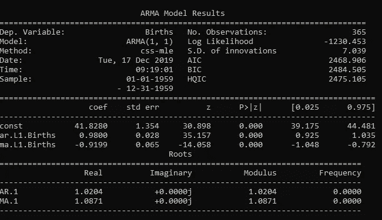

# 使用 Python 实现时间序列和 ARIMA

> 原文：<https://medium.com/analytics-vidhya/time-series-and-arima-using-python-bb8563ea29e3?source=collection_archive---------6----------------------->

在本帖中，我们将使用 python 模块进行时间序列分析和预测。


照片由[克里斯·利维拉尼](https://unsplash.com/@chrisliverani?utm_source=medium&utm_medium=referral)在 [Unsplash](https://unsplash.com?utm_source=medium&utm_medium=referral) 上拍摄

对于我们开始，我们需要一个数据集来玩。我们选择了一个数据集来描述 1959 年加利福尼亚每天的女性出生人数。它包含 365 个条目。

数据集可以在这里找到—[https://raw . githubusercontent . com/jbrownlee/Datasets/master/daily-total-female-births . CSV](https://raw.githubusercontent.com/jbrownlee/Datasets/master/daily-total-female-births.csv)

我们将从导入必要的模块开始—

```
import pandas as pd
import matplotlib.pyplot as plt from statsmodels.tsa.stattools import adfullerfrom # to do ADF test
from statsmodels.graphics.tsaplots import plot_acf, plot_pacf 
from statsmodels.tsa.arima_model import ARIMA # to do predictionsfrom sklearn.model_selection import train_test_splitfrom pmdarima.arima import auto_arima # a wrapperimport requests, io
```

我们将继续解释模块和代码。

# ARIMA 自动

我们现在需要从 url 获取数据集，并使用 pandas 读取它。由于我们只有 365 个条目，我们可以一次读完。

```
url = "https://raw.githubusercontent.com/jbrownlee/Datasets/master/daily-total-female-births.csv"
s = requests.get(url).contentdef parser(x):    
    return pd.datetime.strptime(x,'%Y-%m-%d')birth = pd.read_csv(io.StringIO(s.decode('utf-8')), index_col=0, parse_dates=[0], date_parser=parser)
```

我们必须在这里索引日期，因为这是时间序列分析所必需的。

注意——如果有一个很大的 csv 文件，无法在内存中加载，那么我们通过传递参数`chunksize`来读取该 csv 文件。

太好了！我们已经把数据转换成可用于分析的数据图表。

首先，我们将尝试安装`auto_arima`，看看它的表现如何，然后我们将尝试如何手动安装 ARIMA。

```
model = auto_arima(birth, trace=True, error_action='ignore', suppress_warnings=True,stationary=True)
model.fit(birth)
```

现在注意由`auto_arima`生成的 AIC 和 BIC 值。



auto_arima 结果

对于 ARIMA 阶(1，0，1)，AIC 和 BIC 值最低。这是最适合 ARIMA 的。

# 手动 ARIMA

对 ARIMA 的详细解释超出了本文的范围。对于本教程的唯一目的，我们需要了解在 ARIMA 需要三个订单。

p = AR 的阶数

d =使时间序列数据稳定的差值

q =毫安的顺序

我们首先将所有数据绘制成线图，看看是否有可以观察到的趋势。

```
birth.plot()
plt.show()
```



这里没有观察到趋势

通过观察图表，我们可以说数据看起来是稳定的。

现在我们将做一个扩展的 Dickey Fuller 测试，以确保数据是稳定的。

```
result = adfuller(birth.Births) # ADF is less than 1% value. print('ADF Statistic: %f' % result[0])# p-value < 0.05, hence we reject the null hypothesis that data has unit root# It means data is stationary.# Hence d = 0print('p-value: %f' % result[1])for key, value in result[4].items(): 
    print('\t%s: %.3f' % (key, value))
```

很好，现在我们知道数据是静态的。因此“d”的值将为零`(d=0)`。

现在我们绘制 pacf 图和 acf 图，分别求出 AR 和 MA 的阶数。

```
plot_acf(birth)
plot_pacf(birth)
plt.show()
```

这是各自输出的样子——



左图为 ACF 图，右图为 PACF 图

我们可以观察到只有一个明显高于 p 值区的滞后点。

因此“p”和“q”的值是 1 和 1。

```
p = 1
d = 0
q = 1
```

现在我们已经得到了 ARIMA 所需的所有订单。让我们现在适合 ARIMA。

```
url = "https://raw.githubusercontent.com/jbrownlee/Datasets/master/daily-total-female-births.csv"s = requests.get(url).contentseries = pd.read_csv(io.StringIO(s.decode('utf-8')), index_col=0, parse_dates=[0], squeeze=True, date_parser=parser)model = ARIMA(series, order=(2,0,2))model_fit = model.fit()print(model_fit.summary())
```

上述代码的输出将是—



输出

我们可以观察到，这里观察到的 AIC 和 BIC 值与`auto_arima`给出的最低值相似。

我希望这篇文章能帮助你理解如何自动和手动地将 arima 与 python 相结合。

*我希望你喜欢这篇文章！不断学习，分享知识。关注我*[*github*](https://github.com/vaibhawvipul)*[*LinkedIn*](https://www.linkedin.com/in/vipulvaibhaw/)*或*[*Twitter*](https://twitter.com/vaibhaw_vipul)*。**