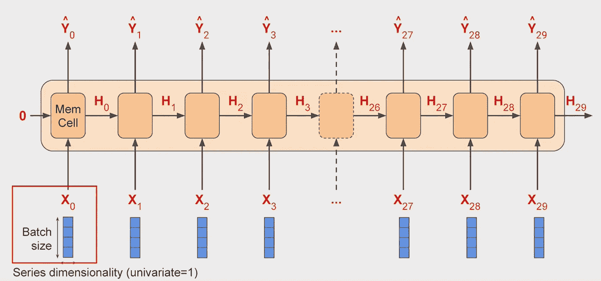

# 时间序列与预测(下)

> 原文：<https://medium.com/analytics-vidhya/time-series-and-prediction-part-2-84f674803c03?source=collection_archive---------29----------------------->

## 有无深度学习算法的时间序列和预测综合研究。

干杯！你终于来了。这是我关于时间序列和预测的第二篇文章。如果你没有读过第一篇，那么请阅读那篇文章 [***这里***](/@tirth.stu/time-series-and-prediction-part-1-4a9b55c85276) 。在这一部分中，我们将对我们的时间序列应用一些深度学习算法。首先，我们必须将数据分为特征和标签。

# 准备要素和标签


功能和标签(来源— [Coursera](https://www.coursera.org/learn/tensorflow-sequences-time-series-and-prediction)

在这种情况下，我们的特征实际上是系列中的几个值，我们的标签是下一个值。我们将把作为我们的特征的值的数量称为窗口大小，在这里我们获取数据的窗口，并训练 ML 模型来预测下一个值。例如，如果我们获取时间序列数据，比方说，一次 30 天，我们将使用 30 个值作为特征，下一个值是标签。然后，随着时间的推移，我们将训练一个神经网络，将 30 个特征与单个标签进行匹配。

准备窗口数据集

例如，让我们使用 **tf.data.Dataset** 类为我们创建一些数据，我们将创建 10 个值的范围。我们将使用 **dataset.window** 通过窗口来扩展我们的数据集。它的参数是窗口的大小和我们每次想要移动的量。因此，我们将窗口大小设置为 5，偏移量为 1。我们可以在窗口上添加一个名为 **drop_remainder** 的参数。如果我们将此设置为 true，它将通过丢弃所有余数来截断数据。也就是说，这意味着它将只给我们五个项目的窗口。好消息是转换成 NumPy 数组非常容易，我们只需调用。 **numpy** 方法对数据集中的每一项。好了，下一个任务是将数据分为要素和标注。对于列表中的每一项，将除最后一项之外的所有值作为特征是有意义的，然后最后一项可以作为标签。此外，你会在训练前打乱他们的数据。这可以通过使用**随机播放方法**来实现。最后，我们可以看看数据的批处理，这是通过**批处理方法**完成的。它需要一个大小参数，在这个例子中，是 2。我们会看到这个输出。

```
OUTPUT :
x =  [[1 2 3 4]  [0 1 2 3]] y =  [[5]  [4]] 
x =  [[3 4 5 6]  [4 5 6 7]] y =  [[7]  [8]] 
x =  [[2 3 4 5]  [5 6 7 8]] y =  [[6]  [9]]
```

**应用我的合成数据**——第一步是使用 **tf.data.dataset** 从系列中创建数据集。我们将使用它的 **from_tensor_slices** 方法把这个序列传递给它。然后，我们将基于我们的 **window_size** 使用数据集的**窗口方法**来将数据分割成适当的窗口。每一个移位一次。我们将通过将 drop remainder 设置为 true 来保持它们的大小不变。然后，我们将数据展平，使其更容易处理。一旦压平了，就很容易洗牌了。你调用一个 shuffle 并传递给它 shuffle 缓冲区。使用随机缓冲区可以加快速度。例如，如果您的数据集中有 100，000 项，但您将缓冲区设置为 1000。它会用前一千个元素填充缓冲区，随机选择其中一个。然后它会用 1000 和第一个元素替换它，然后再随机选取，依此类推。这样，对于超大数据集，随机元素选择可以从较小的数字中选择，从而有效地加快速度。然后，经过混洗的数据集被分成' **x** '，即除最后一个元素之外的所有元素，以及' **y'** ，即最后一个元素。

从我们的合成数据生成 window_datset 的代码

# 预言；预测；预告

我们创建一个空的预测列表，然后迭代序列，获取切片和窗口大小，预测它们，并将结果添加到预测列表中。我们将时间序列分成训练和测试数据，在某个时间之前获取所有数据，然后进行训练，剩下的就是验证。因此，我们将在分割时间后获取预测，并将其加载到 NumPy 数组中进行图表制作。

预测下一个值的代码

1.  **使用单层神经网络—** 现在我们有了一个窗口数据集，我们可以开始用它来训练神经网络。让我们从一个非常简单的开始，它实际上是一个线性回归。我们将测量它的准确性，然后我们将在此基础上改进它。

用**单神经网络** (window_size=20)训练我们的模型

```
Layer weights [array([[-0.05013938],        [-0.01954073],        
[ 0.0709962 ],        [-0.04240771],        [ 0.04903989],        
[ 0.0161289 ],        [ 0.01836954],        [ 0.04157093],        [-0.09568894],        [-0.01370953],        [ 0.0600764 ],        [-0.01854219],        [ 0.02502013],        [-0.03948223],        
[ 0.0480251 ],        [-0.00747724],        [ 0.11437633],        
[ 0.22616488],        [ 0.23641631],        [ 0.41190135]], dtype=float32), array([0.0148659], dtype=float32)]Model: "sequential_1" _________________________________________________________________ Layer (type)                 Output Shape              Param #    ================================================================= dense_1 (Dense)              (None, 1)                 21         ================================================================= Total params: 21 Trainable params: 21 Non-trainable params: 0 _________________________________________________________________ None
```


预测**使用单层神经网络**

然后我们将定义模型，编译它，并使它适合我们生成的数据。完成后，它会打印出层的重量。您可以在此处看到图层权重，它为线性回归的 x 值提供了系数，以及回归的偏差值。我们通过调用层上的**获取权重方法**来实现这一点。我们现在可以为系列的验证拆分中的每个元素绘制预测，预测用橙色表示，实际值用蓝色表示。最后，我们可以测量有效数据和预测结果之间的平均绝对误差。我得到了平均绝对误差 **5.2505198** 。

**2。使用深度神经网络(DNN)** —现在让我们用 DNN 进行下一步，看看我们是否可以提高我们的模型精度。和我们之前看到的线性回归模型没有太大区别。这是一个相对简单的深度神经网络，有三层。所以让我们一行一行地解开它。我用三层 **10、10 和 1 个神经元**保持了我的模型的简单。输入形状是窗口的大小，我们将使用 relu 函数激活每一层。然后，我们将像以前一样用**均方误差损失函数**和**随机梯度下降优化器**编译模型。最后，我们将在 **100 个时期内拟合模型，**经过几秒钟的训练后，我们将看到类似这样的结果。还是挺好的。当我们计算平均绝对误差时，即 **4.567452** ，我们比之前更低，因此这是朝着正确方向迈出的一步。
参考关于 [DNN](https://towardsdatascience.com/a-laymans-guide-to-deep-neural-networks-ddcea24847fb) 的更多探索。

用具有 3 层的**深度神经网络**训练我们的模型

但是这也有点像瞎猜，特别是对于优化器函数。如果我们可以选择最佳的学习速度，而不是我们选择的速度，这不是很好吗？我们可能会更有效地学习，并建立一个更好的模型。现在让我们来看看使用回调的技术。我已经添加了一个**回调**来使用一个**学习速率调度器**调整学习速率。您可以在下面看到代码。这个函数将在每个时期结束时的回调中被调用。它要做的是根据纪元编号将学习速率更改为一个值。所以在**纪元 1** 中，学习率为 **1e-8 * 10**(1/20)** 。而当我们到达 **100 纪元**的时候，就是 **1e-8 * 10**(100/20)** 。这将在每次回调时发生，因为我们在 **model.fit** 的回调参数中设置了它。

在每个时期后改变学习率的代码


每个时期的损失相对于每个时期的学习率

在完成训练后，我们可以使用下面的代码绘制每个时期的损失和每个时期的学习率，我们会看到这样的图表。y 轴显示该时期的损失，x 轴显示学习率。然后，我们可以尝试选择曲线的最低点，它仍然像这样相对稳定，就在 **7 * (10 **-6)** 附近。

绘制不同学习率下的损失

因此，让我们将它设定为我们的学习率，然后我们将重新培训。这是相同的神经网络代码，我们已经更新了学习率，所以我们也将训练它一段时间。我们来看看训练 500 个纪元后的结果。


每个历元相对于历元数量的损失

第一次检查看起来我们可能只是在浪费时间训练超过 10 个纪元，但是事实上早期的损失是如此之高。如果我们将它们切掉，并绘制 10 个时期后的时期损失，那么图表将告诉我们一个不同的故事。


缩放图像

我们可以看到，即使在 500 个时代之后，损失仍在继续减少。这表明我们的网络确实学得很好。并且平均绝对误差即 **4.48277** 明显低于先前。

**3。使用递归神经网络(RNN)** —一种递归神经网络，或 RNN 是一种包含递归层的神经网络。这些设计用于顺序处理输入序列。rnn 非常灵活，能够处理各种序列，包括预测文本。这里我们将使用它们来处理时间序列。我们将构建一个包含两个循环图层和一个最终密集图层的 RNN，作为输出。有了 RNN，你可以成批地给它输入序列，它就会输出一批预测。一个区别是，当使用 RNNs 时，完整的输入形状是三维的。第一个维度是批量大小，第二个维度是时间戳，第三个维度是每个时间步的输入维度。想了解更多关于 RNN 的信息，请点击这里[](https://www.coursera.org/learn/nlp-sequence-models/lecture/ftkzt/recurrent-neural-network-model)*。*

*要了解更多参考这些文章: [*Article1*](https://towardsdatascience.com/understanding-rnn-and-lstm-f7cdf6dfc14e) ， [*Article2*](https://www.analyticsvidhya.com/blog/2017/12/introduction-to-recurrent-neural-networks/) 。
参考这个 [*链接*](https://www.tensorflow.org/guide/keras/rnn) 在 TensorFlow 中实现 RNN。*

**

*RNN 细胞(来源— [Coursera](https://www.coursera.org/learn/tensorflow-sequences-time-series-and-prediction) )*

*例如，如果我们有 30 个时间戳的窗口大小，我们将它们以 4 的大小进行批处理，形状将是 4 乘 30 乘 1，每个时间戳，存储单元输入将是一个 4 乘 1 的矩阵，如上所示。该单元还将从上一步中获取状态矩阵的输入。当然在这种情况下，在第一步，这将是零。现在，在某些情况下，你可能想输入一个序列，但是你不想输出，你只是想为批处理中的每个实例获取一个向量。这通常被称为引导 RNN 的**序列。但实际上，你所做的就是忽略所有的输出，除了最后一个。在 TensorFlow** 中使用 **Keras 时，这是默认行为。因此，如果您希望递归层输出一个序列，您必须在创建层时指定**returns sequences equals true**。当您将一个 RNN 图层叠加到另一个图层上时，您需要这样做。***

**

*来源— [Coursera](https://www.coursera.org/learn/tensorflow-sequences-time-series-and-prediction)*

*所以在我的 RNN 中，有两个递归层，第一个设置了 **return_sequences=True** 。它将输出一个序列，该序列被馈送到下一个循环层。下一个图层没有设置为 True 的 return_sequence，因此该图层将向我们提供单个密集图层的输出。*

*此外，我想添加一些新的层，这些层使用了**λ**类型。因此，第一个λ层将用于帮助我们的维度。如果你记得 RNN 期望三维:**批量大小，时间戳的数量，和序列维度。**使用 Lambda，我们只需将数组扩展一维。类似地，如果我们使用 lambda 函数将输出放大 100 倍，我们可以帮助训练。RNN 层中的默认激活函数是 **tanh()** 双曲正切激活。这会输出-1 和 1 之间的值。由于时间序列值通常在 10 秒左右，如 40 秒、50 秒、60 秒和 70 秒，因此将输出放大到相同的范围可以帮助我们学习。*

*使用**递归神经网络(RNN)** 的训练模型*

**

*预测**使用递归神经网络(RNN)***

*这是训练神经网络的代码。我已经设定了最佳的学习速度，并挑选了 400 个时期进行训练。一旦训练好了，我就可以用它来预测验证范围并绘制结果。在我所有的图中，我可以看到我的预测并不太坏，除了这个平台，这将对我的 MAE 产生不好的影响。但尽管如此，我的 MAE 只有大约 **6.41** ，所以还不算太差。*

***4。使用长短期记忆(LSTM)——**lst ms 是在训练的整个生命周期中保持状态的单元状态，以便状态从单元传递到单元，从时间戳传递到时间戳，并且可以更好地维护它。这意味着，与 RNNs 的情况相比，来自窗口早期的数据对整体预测具有更大的影响。状态也可以是双向的，以便状态可以向前和向后移动。要了解更多关于 LSTMs 的信息，请点击 [*此处*](https://www.coursera.org/lecture/nlp-sequence-models/long-short-term-memory-lstm-KXoay) 。*

*参考使用 [*张量流*](https://www.tensorflow.org/api_docs/python/tf/keras/layers/LSTM) 实现 LSTMs。
参考这篇 [*文章*](/mlreview/understanding-lstm-and-its-diagrams-37e2f46f1714) 了解 LSTMs 的结构。*

*使用**长短期记忆(LSTM)** 训练模型的代码*

**

*预测**利用长短期记忆(LSTM)***

*首先是**TF . keras . back end . clear _ session**，这个清除任何内部变量。这使得我们可以很容易地进行实验，而不会影响模型的后续版本。在为我们扩展维度的 Lambda 层之后，我添加了一个有 32 个单元格的 **LSTM 层。我还做了一个双向分析，来看看它对预测的影响。现在，我们将添加第二层，注意，我们必须在第一层上将返回序列设置为 true，这样才能工作。我们在这方面进行了训练，现在我们可以看到图表。现在它跟踪得更好，更接近原始数据。也许跟不上急剧增长的速度，但至少接近了。它还给出了我们的平均误差 **5.28722** ，这是一个很好的结果，表明我们正朝着正确的方向前进。***

***5。使用卷积—** 这是一种深度学习算法，可以接受输入图像，为图像中的各种对象/方面分配重要性，如可学习的权重和偏差，并能够区分它们。*

*要深入卷积，请看这个 [***视频***](https://www.youtube.com/playlist?list=PLkDaE6sCZn6Gl29AoE31iwdVwSG-KnDzF) 。*

*要不然参考这个 [***条***](https://towardsdatascience.com/a-comprehensive-guide-to-convolutional-neural-networks-the-eli5-way-3bd2b1164a53#:~:text=A%20Convolutional%20Neural%20Network%20(ConvNet,differentiate%20one%20from%20the%20other.) 。*

*使用**卷积和 lstm**训练模型的代码*

**

*使用卷积的预测*

***一个重要的注意事项是，我们摆脱了 Lambda 层，重塑了我们与 LSTM 的工作输入。所以我们在 1D 曲线上指定一个输入形状。这需要我们更新我们一直在使用的 **windowed_datasetet** 助手函数。我们将简单地在助手函数中使用 **tf.expand_ dims** 来扩展序列的维度，然后再对其进行处理。现在，在卷积层上添加两个双向 LSTMs 层，然后将输出序列传递到密集层，我们得到大约 **4.985901** 的平均绝对误差。***

***现在，为了进一步减少损失，一个建议是探究批量大小，并确保它适合您的数据。因此，在这种情况下，值得尝试不同的批量大小。因此，举例来说，用比原来的 32 个更大和更小的不同批量进行实验，你可以得到更好的结果。要了解更多关于合适批量的信息，请参考本 [***视频***](https://www.youtube.com/watch?v=4qJaSmvhxi8) 。***

***因此，通过结合 CNN 和 LSTMs，我们已经能够建立我们迄今为止最好的模型，尽管有些粗糙的边缘可以改进。***

# ***使用真实数据(太阳黑子)***

******

***来源— [cosmos.esa](https://www.cosmos.esa.int/web/cesar/rotation-period-and-sunspot-activity)***

***我已经借助 Kaggle 上的 CSV 数据预测了太阳黑子。在 Github 上查看我的全部代码。***

# ***tirth Patel——Nirma 大学计算机科学与工程专业学生。***

***[LinkedIn](https://www.linkedin.com/in/tirth-patel-861303171/)|[insta gram](https://www.instagram.com/__txrth__/)|[Github](https://github.com/Tirth1306/)***