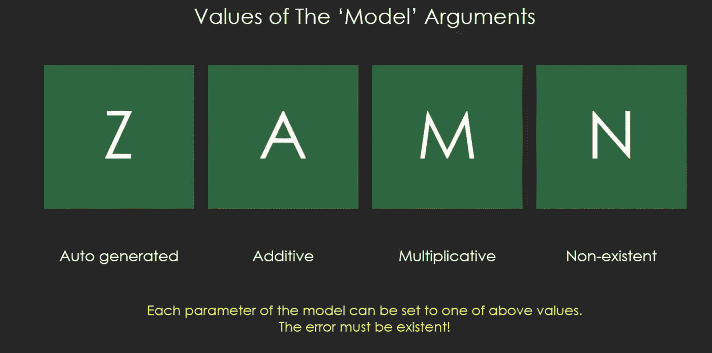

# 时间序列简介以及如何使用 dygraphs 使用交互式时间序列图

> 原文：<https://medium.com/analytics-vidhya/time-series-brief-introduction-and-how-to-use-interactive-time-series-graph-using-dygraphs-9c61fa435504?source=collection_archive---------25----------------------->

在这里，我们将处理一个关于德国通货膨胀率的时间序列数据集，我们将在这里做一些 EDA 工作，然后尝试拟合一个时间序列模型，并使用 dygraphs 绘制一个交互式时间序列图。

内容:

1.  关于来源和数据集的介绍
2.  熟悉数据
3.  工作大纲
4.  Arima 与 ETS 方法(选择最佳方法)
5.  dygraphs 简介
6.  用最佳方法绘制交互式时序图。

通货膨胀率:衡量单位货币购买力变化的指标

2017 年 12 月通胀率被认为是德国最低的。

**通货膨胀数据经常用于时间序列分析，因为它:**

1.  影响投资机会
2.  影响股票价格
3.  就业率
4.  石油和其他。

**数据集来源:**

**这个数据集取自**[**https://www.statbureau.org/**](https://www.statbureau.org/)

#德国每月通货膨胀率。

如果有人想尝试和分析其他国家的数据，可以下载。

***熟悉数据集:***

一旦我们对数据集进行 EDA，我们就会了解到许多事情:

获取数据集中的前 5 个值。

我们可以看到，它不是时间序列格式，R package 允许我们使用其内置包制作时间序列，该包根据用户输入的频率将数据转换为时间序列:

我们可以看到，现在我们有一个从 2008 年开始的时间序列，并以月度数据表示。

a)数据排列不当。

b)不存在趋势。

c)季节性存在。

d)存在负值

***EDA 后的工作概要:***

由于给出了月度数据的频率，我们可以看到没有趋势，只有季节性:

a)季节分解

b)Arima 方法

c)ETS 方法

d)交叉验证

e)根据误差选择最佳方法并绘制图表。

a)季节分解:

这种技术将数据分成几个部分:

1.  趋势
2.  季节性
3.  白噪声

几个有趣的点/猜测，季节性正在形成一种模式:我们可以看到，在年底(假期时间)，通货膨胀率突然上升，然后在夏季缓慢上升，之后在 12 月再次下降并再次上升。

但季节性分解模型有几个缺点，比如它们捕捉快速上涨的速度很慢。

更新的季节分解方法:(如果你们想看的话，可以提供链接)

1.  X11:[https://otexts.com/fpp2/x11.html](https://otexts.com/fpp2/x11.html)
2.  座位:[https://otexts.com/fpp2/seats.htm](https://otexts.com/fpp2/seats.html)

B)Arima 模型:

手动和自动 arima 方法的区别。

这里，我们可以使用 Arima 的手动方法来检查序列的平稳性并进行 dickey fuller 测试，也可以使用 auto arima 方法来计算最佳模型，因为它是一个较小的数据集。

季节性 Arima 和非季节性 Arima 的区别:季节性 Arima 模型有两个参数:一个常规参数集和用于季节性部分的第二个参数集。

**推论**:

## 最佳模型:ARIMA(1，0，2)(0，1，1)[12]

1.  (1，0，2):对于非季节性部分，我们有 1 阶自相关、差分和 2 阶移动平均。
2.  (0，1，1):对于季节部分，我们有一步差分和移动平均，以及
3.  12–每间隔一年的观察值，与它们一起，我们有进行预测的系数。

接下来，我们将预测剩余时间，并存储该值以对照 ETS 进行检查。

C)ETS 模型:

正如我们看到的，我们正在自动生成 ETS 时间序列来预测我们的值，然后我们将它与 arima 模型进行比较。

d)时间序列交叉验证和误差:

我们必须使用误差度量来比较不同的模型，这里我们使用函数:ts.cv()

后退:对于更长的数据，计算错误率需要大量的计算时间。

计算错误率时，我们将选择最佳模型:

arima 模型与 ets 模型的误差比较

可以看出，Arima 模型的误差低于 ETS，因此我们将使用该模型预测下一年的通货膨胀。

E) DYGraphs:

用于时间序列模型的交互式绘图工具是 [dygraphs](http://dygraphs.com/) :一种基于 JavaScript 的绘制时间序列数据的方法。dygraphs 也作为 R 的一个包提供，因此您可以在基于 R 的数据探索工作流中生成交互式输出。

R 中的`dygraphs`函数处理时间序列对象，将 ts 数据集作为第一个参数。在本文中，我们将为我们处理过的德国通货膨胀创建一个数据集:

为了完成工作，请登录我的 Github 账户:[https://github.com/kailash14/Time-Series](https://github.com/kailash14/Time-Series)

参考资料:

1.  [https://www . r-graph-gallery . com/316-possible-inputs-for-the-dy graphs-library . html](https://www.r-graph-gallery.com/316-possible-inputs-for-the-dygraphs-library.html)
2.  [https://otexts.com/fpp2/](https://otexts.com/fpp2/)
3.  [http://r-tutorials.com/](http://r-tutorials.com/)
4.  [https://codepen.io/](https://codepen.io/)