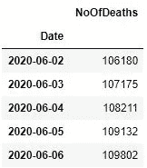

# 美国新冠肺炎死亡人数的时间序列聚类分析

> 原文：<https://medium.com/analytics-vidhya/time-series-cluster-analysis-of-us-covid-19-deaths-b31da03000b7?source=collection_archive---------21----------------------->

本练习旨在通过时间序列聚类分析，了解哪些州以类似的方式发生了与新冠肺炎相关的死亡。

新冠肺炎出乎意料地在美国经济增长的高峰期袭击了美国。本练习旨在获得一些关于哪些州以类似的方式发生新冠肺炎相关死亡的见解。我们将使用 KMeans 聚类方法。

让我们首先加载这个分析所需的包。

```
# Importing libraries
import numpy as np 
import pandas as pd
import matplotlib.pyplot as plt
from tqdm import tqdm# Hide unnecessary warnings
import warnings
warnings.filterwarnings('ignore')# Clustering
from sklearn.cluster import KMeans
from yellowbrick.cluster import KElbowVisualizerpd.plotting.register_matplotlib_converters()
```

1.  **读入数据**

我们将使用来自约翰·霍普金斯大学(JHU·CSSE)系统科学与工程中心的新冠肺炎数据集，该数据集作为 Github 库免费提供。特别是，我们使用美国死亡人数时间序列数据，每天更新。

***克隆 JHU CSSE 的新冠肺炎储存库***

```
!git clone [https://github.com/CSSEGISandData/COVID-19.git](https://github.com/CSSEGISandData/COVID-19.git)
```

***读入死亡人数时序数据***

```
data = pd.read_csv("COVID-19/csse_covid_19_data/csse_covid_19_time_series/time_series_covid19_deaths_US.csv")
data.head()
```


美国新冠肺炎死亡数据

每行代表美国一个省/州的一个 FIPS 地区。列包含从 2020 年 1 月 22 日到 2020 年 6 月 6 日新冠肺炎死亡人数的累积增长。

为了检查数据，我们首先创建一个国家级的聚合时间序列数据。

```
us_ts = data.iloc[:,12:]
us_ts = pd.DataFrame(us_ts.sum(axis=0)).reset_index()
us_ts.columns = ["Date","NoOfCases"]
us_ts["Date"] = pd.to_datetime(us_ts["Date"])
us_ts.set_index('Date', inplace=True)
us_ts.tail()
```



截至 2020 年 6 月的第一周，美国的新冠肺炎死亡人数接近 11 万。

```
us_ts.plot()
```


***按状态*** 创建死亡时间序列数据

```
data_by_state = data.groupby("Province_State").agg(’sum’).reset_index() # Data grouped by states to create clusters at state level
data_by_state = data_by_state.drop(columns=[’UID’, 'code3’, 'FIPS’, 'Lat’, 'Long_’, 'Population’])
data_by_state.head()
```


**2。时间序列聚类模型**

现在，我们将使用 KMeans 聚类算法来开发州级死亡时间序列数据的聚类模型。KMeans 聚类是一种无监督学习算法，用于将项目分组到 k 个聚类中。在 k-means 中，每个项目都被放置在其最近的聚类中。计算聚类中心，作为聚类成员的平均值。重复执行该程序，直到中心稳定。k-means 聚类算法的基本概念是这样的:结果分两部分产生:首先产生聚类中心作为输出，然后每个实体被分配到特定的聚类。最近的聚类通常取决于与欧几里德的距离，但也使用其他距离度量(例如曼哈顿、闵可夫斯基距离)。k-means 程序迭代运行，直到达到指定的终止条件(例如中心移动小于 1e-10)。

***2a。选择最佳集群数***

在 KMeans 聚类中，需要在计算之前指定要形成的聚类数。我们可以使用 yellowbrick 包中的 KElbowVisualizer 类来找到这个最佳数字。KElbowVisualizer 应用“肘”方法，通过用一系列 K 值拟合模型来帮助数据科学家选择最佳聚类数。如果图表看起来像一只手臂，那么“肘”(曲线上的拐点)是从属模型的最佳排列的基础的良好指示。可视化工具中的“肘部”用虚线标记。

```
model = KMeans(init='k-means++')
visualizer = KElbowVisualizer(model, k=(4,12),metric="distortion") 
visualizer.fit(data_by_state.iloc[:,1:])
visualizer.show()
```


上面由 KElbowVisualizer 类生成的图表明最佳的集群数量是 6。

***2b。拟合 KMeans 聚类算法***

通过指定 n_clusters=6，我们用最佳的分类数来拟合 KMeans 分类模型，并将分类数分配给每个州。

```
# Clustering with 6 clusters
kmeans = KMeans(n_clusters=6,init='k-means++',random_state=0)  
y_kmeans = kmeans.fit_predict(data_by_state.iloc[:,1:])  
data_by_state["Cluster"] = y_kmeans
```

***2c。集群的分布***

```
for i in range(1,6):
    print("States in cluster {} are {}".format(i,list(data_by_state[data_by_state.Cluster==i]["Province_State"].unique())))
```


我们马上创建集群标签以供使用。

```
cluster_labels =['Cluster0 - Other', 'Cluster1 - NY', 'Cluster2 - CA-CT-LA', 'Cluster3 - IL, MA, MI, PA','Cluster4 - CO-FL-GA-IN-MD-OH-TX-VA-WA', 'Cluster5 - NJ']
```

**3。集群的可视化**

可视化这些集群有助于更好地理解集群的相似性。可视化这些聚类的一个好方法是绘制一个时间序列，该时间序列聚集了指定聚类中所有州每天的平均死亡人数，置信区间为 95%。

```
## For generating 95% confidence interval 
def get_cluster_intervals(cluster):
    df = pd.DataFrame() 
    df["mean"] = cluster.mean(axis=0)
    df["lower_bound"] = df["mean"] - (1.96 * cluster.std(axis=0))/np.sqrt(len(df["mean"]))
    df["upper_bound"] = df["mean"] + (1.96 * cluster.std(axis=0))/np.sqrt(len(df["mean"]))
    df.index = us_ts.index
    return dfclusters = [get_cluster_intervals(data_by_state[data_by_state["Cluster"]==n].iloc[:,1:-1]) for n in range(6)]K = 6
cols = 2
rows = int(math.ceil(K / cols))gs = gridspec.GridSpec(rows, cols)
fig = plt.figure( figsize=(18, 12))
for n in range(K):
    ax = fig.add_subplot(gs[n])
    ax.plot(clusters[n].index,clusters[n]["mean"],label=cluster_labels[n])
    ax.fill_between(clusters[n].index, clusters[n]["lower_bound"], clusters[n]["upper_bound"], alpha=.4)
    plt.legend()

plt.xlabel('Date')
plt.ylabel('Number of Deaths')
plt.show()
fig.tight_layout()
```


*   聚类 1 仅包括纽约州，截至 2020 年 6 月 6 日，该州已有超过 30，000 人死亡。
*   第二组包括“加利福尼亚”、“康涅狄格”、“路易斯安那”三个州，截至 2020 年 6 月 6 日，平均死亡人数为 3862 人。
*   四个州(“伊利诺伊州”、“马萨诸塞州”、“密歇根州”和“宾夕法尼亚州”)属于同一个聚类(聚类 3)，截至 2020 年 6 月 6 日，该聚类平均有 6000+例死亡。
*   九个州(“科罗拉多”、“佛罗里达”、“佐治亚”、“印第安纳”、“马里兰”、“俄亥俄”、“得克萨斯”、“弗吉尼亚”、“华盛顿”)形成另一个聚类(聚类 4)，截至 2020 年 6 月 6 日，该聚类为大约 2000+死亡。
*   “新泽西州”单独形成一个聚类(聚类 3)，截至 2020 年 6 月 6 日，该州约有 12，000 人死亡。
*   其余 40 个州/地区成为一个群集(群集 0)，每个州/地区的死亡人数少于 350 人。

**4。进一步工作**

可以通过以下方式扩展这一练习:

*   按人口标准化时间序列数据
*   将这些星团在地图上可视化。
*   开发时间序列预测模型