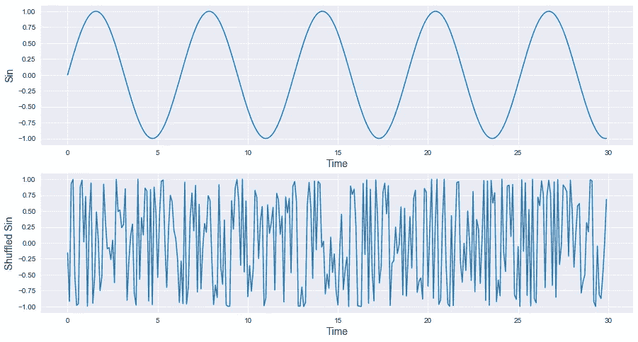
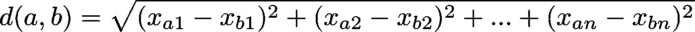
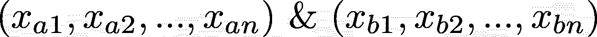
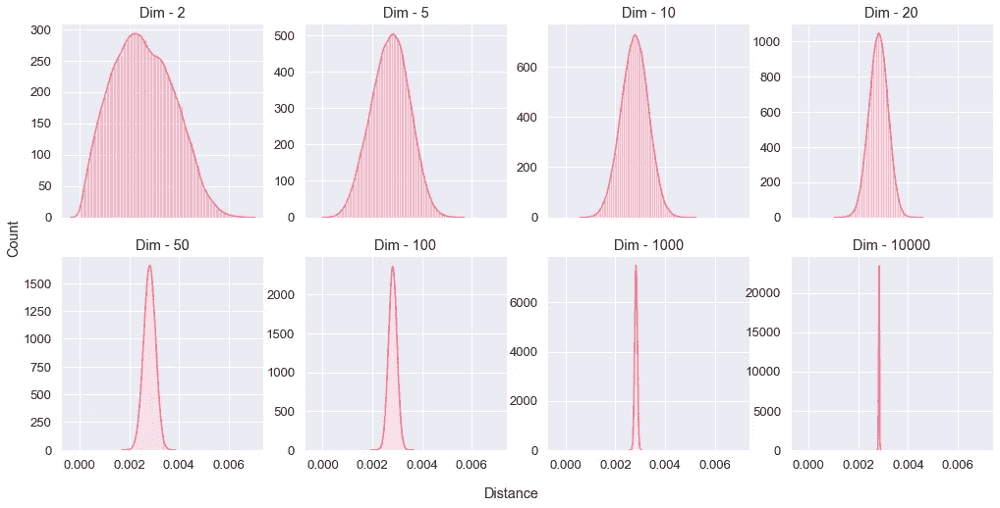
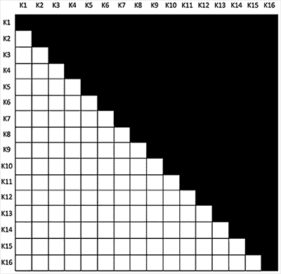

# 时间序列聚类&维数灾难

> 原文：<https://medium.com/analytics-vidhya/time-series-clustering-the-curse-of-dimensionality-c0d837f00415?source=collection_archive---------17----------------------->

因此，想象一下，你有一堆代表相同类型观察的时间序列，比如零售日销售额、慢跑者的心跳或一些模糊的传感器。在数据发现过程中或对数据集本身建模时应用聚类有很大的好处，这种好处主要与了解数据集的某些部分之间的现有相似性有关，例如将夏季繁荣的零售点与圣诞节期间繁荣的零售点聚集在一起，或者寻找正确的解释来解释为什么 1，000 名慢跑者被视为同一群体的一部分，他们是否有任何共同的健康问题，或者是否与高海拔生活有关，例如。你已经猜到了，聚类时间序列可以产生很多积极的结果，因此通过避免一些可能导致无效或绝对错误的陷阱来正确处理时间序列是非常重要的。

在继续之前，让我们花几秒钟时间问一个基本问题:是什么让时间序列与其他类型的数据集相比如此特殊？主要是两件事，第一个是“系列”部分，这意味着每个观察都与一个序列、某种频率、一次心跳、一个脉冲或类似的东西相关联。第二件事，表现在“时间”和“年表”部分，是观察的顺序，改变顺序将被认为是产生一个完全不同的时间序列。在下图中，即使数据集是相似的(当然不考虑顺序)，混洗 ***sin*** 信号也会产生除了 ***sin*** 之外的信号，因为每个观察的时间位置对于定义我们的时间序列非常重要。

另外要提到的是，时间序列一般是在高维空间中定义的。如果您碰巧记录了一家冰淇淋店一年中的日销售额，那么这个维度的基数等于 365，所以想象一下，如果我们有十年的数据。

# 维度的诅咒

## 一两句关于距离的话

当我们谈到距离时，我们往往会马上想到欧几里得距离。简单提醒一下，欧几里德距离在[欧几里德空间](https://en.wikipedia.org/wiki/Euclidean_space)中定义为:

其中 ***a*** 和 ***b*** 是空间中的两个点，具有各自的空间坐标

并且 *n* 是一个严格的正整数，意味着 *n* ∈ ℕ*.

事实是，距离的概念是一个更加抽象和普遍的概念，欧几里得距离只是许多现存距离中的一个。我们可以称任何满足一组数学条件的东西为距离:如果我们考虑函数 d 在集合 e 中运算，其中 d: E× E→ℝ⁺，如果它满足下列条件，则 d 称为距离:

*   **对称性** : ∀ (a，b) ∈ E，d(a，b)=d(b，a)
*   **巧合** : ∀ (a，b) ∈ E，d(a，b)=0 ⇔ a=b
*   **三角形不等式** : ∀ (a，b，c) ∈ E，d(a，c)≤ d(a，b)+d(b，c)

因此，如果您碰巧创建了一个满足这三个约束的函数，那么恭喜您创建了一个距离度量！

但是我为什么要说这些呢？这和我想说的有什么关系？事实上，我在这里的主要观点是，我们本能地使用的欧几里德距离并不是唯一存在的距离，还有一堆其他的距离，比如[曼哈顿距离](https://en.wikipedia.org/wiki/Taxicab_geometry)、[余弦距离](https://en.wikipedia.org/wiki/Cosine_similarity)、[切比雪夫距离](https://en.wikipedia.org/wiki/Chebyshev_distance)、[闵可夫斯基距离](https://en.wikipedia.org/wiki/Minkowski_distance)等等。并且聚类算法强烈地基于距离度量，空间中的相似点意味着它们碰巧彼此靠近，因此改变距离度量可以在很大程度上改变我们的聚类算法的行为。事实上，这适用于一大块机器学习概念。

## 高维&诅咒！

到目前为止，一切都很好，我们对我们的距离指标很满意。这里要问的一个大问题是，距离在高维空间中的表现是否相似？我们能相信一些距离度量来区分吗，这意味着知道我们数据集上人口的相似性和非相似性，在高维空间中？

我不会马上回答，而是做一个简单的实验。让我们生成 500 个均匀分布的随机点，然后计算所有可能对(124，750 对)之间的欧几里德距离，然后我们将绘制这些距离的分布。我们将通过增加我们空间的维度来做到这一点，看看在高维度下到底会发生什么。

您可以使用以下代码自行测试:

我们观察到，在高维空间中，距离方差减小，在 10，000 维的极端情况下，成对距离收敛到一个非常窄的值，这就像空间中的所有点都处于墨西哥式的对峙状态，没有真正的赢家。事实上，我们失去了成对距离的方差，这意味着我们不能区分人口或找到任何重要的相似性，因此聚类的努力注定要失败。

在时间序列聚类的背景下，很多人倾向于使用最经典的聚类算法，即 K-Means 聚类。在其最经典的形式中，它基于欧几里德距离，并将它应用于时间序列，如十年间冰淇淋店的日销售额，相当于在高维空间中使用欧几里德度量，这肯定会导致维数灾难。

# 那我们该怎么办？

所以现在我已经告诉了你坏消息，不要认为你没救了…我将与你分享两个主要策略来对抗时间序列聚类时维数灾难的影响。

## 通过特征提取减少空间！

如果您想保持对时间序列进行聚类的方式，而不使用花哨的技术，最好的方法是减少定义时间序列的空间。事实上，我所说的“减少”指的是通过计算你的时间序列上观察到的一些相关特征，如趋势、均值、某些天的最大值或熵，将你的时间序列转移到一个完全不同的空间(这里列出了一个非穷举的[相关特征](https://tsfresh.readthedocs.io/en/latest/text/list_of_features.html)待计算)。因此，如果我们想象你只需要 10 个特征来描述你的时间序列，当然，这取决于你的背景，它肯定会比十年期间的每日值更好(大约 3650 个特征)。

*有一个非常有用的库可以用来计算这些特性，这个库叫做* [*TSFRESH*](https://github.com/blue-yonder/tsfresh) *。*

## 改变我们衡量相似性的方式

第二个策略是完全改变度量标准，因为我们之前已经看到有许多现有的距离度量标准，我们需要选择一个能够减少影响的度量标准，不幸的是，这不是一个安全的赌注。

也就是说，最好的测量方法是使用[动态时间扭曲](https://en.wikipedia.org/wiki/Dynamic_time_warping)(或 DTW)，即使从数学上来说，它不是一个[距离度量](https://www.sciencedirect.com/science/article/abs/pii/0167639385900585)。DTW 是一种测量两个时间序列之间相似性的算法，我们可以将其用作一种 [K 均值聚类](https://tslearn.readthedocs.io/en/latest/auto_examples/plot_kmeans.html)的测量方法，并且在我们的环境中，它不受维数灾难的影响，因为其核心算法在二维空间中运行。

DTW 可以是一个很好的解决方案来对抗诅咒，但它在处理具有太多时间序列的数据集时有两个主要问题。第一个问题是需要计算所有现有时间序列的成对距离，这相当于创建一个对角线全为零(时间序列到其自身的 DTW 为零)的上三角矩阵(我们考虑对称 DTW)。为此，我们需要计算(m -m)/2 个 DTW(其中 m 是我们拥有的时间序列的数量)，因此对于 1，000 个时间序列，我们必须计算 499，500 个 DTW 值。下图显示了 16 个时间序列的 DTW 距离矩阵形状。

第二个问题是算法性能:DTW 算法是 O(n ),所以对于 1，000 个时间序列计算 DTW 499，500 次可能要花很长时间！

我希望您在处理聚类时间序列时能记住这篇文章，并且我希望它能让您更好地理解维数灾难的影响。

您可以在 [Twitter](https://twitter.com/ALemaizi) 上关注我，以便在有新帖子发布时得到通知！