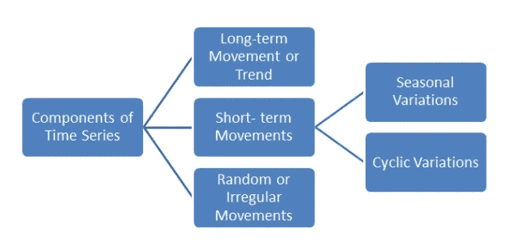

# 时间序列数据挖掘

> 原文：<https://medium.com/analytics-vidhya/time-series-data-mining-3d2fe7ffb82f?source=collection_archive---------2----------------------->

时间序列表示从一段时间的逻辑测量顺序中获得的值或数据的集合。时间序列数据挖掘使我们能够直观显示实时数据的形状。它是以均匀时间间隔排列的有序数据点序列。

时间序列分析包括分析时间序列数据的方法，以提取有意义的*统计数据*、*规则*和*模式*。这些规则和模式可以用来建立能够预测未来发展的预测模型。

**数据库在时间序列挖掘中起着至关重要的作用吗？** 数据库是从不同来源检索到的数据的集合，其中数据以结构化、非结构化的格式存储在各自的列上。
*时间序列*数据库由一系列随时间变化的数值或事件组成。数据是定期记录的。

时间序列挖掘的应用:
1。**财务** :
1.1 用于股票价格评估
1.2 用于通货膨胀的测量

2.**行业** :
2.1 确定功耗

3.**科学** :
3.1 用于实验结果

4.**气象** :
4.1 与大气过程和现象有关，主要用于预报天气

时间序列成分特征:
1。趋势
2。周期
3。季节性
4。不规则的

**时序运动的类别:**
1。*长期或趋势运动* :
时间序列在一段长时间间隔内运动的总体方向。它显示了数据在很长一段时间内增加或减少的一般趋势。

2.*周期运动或周期变化:* 围绕趋势线或曲线的长期振荡。例如，商业周期。这种振荡运动有一年多的振荡周期。

3.*季节性运动或季节性变化:* 时间序列在连续几年的相应月份中似乎遵循的几乎相同的模式。如果每小时、每天、每周或每月记录数据，这种变化将出现在时间序列中。

4.*不规则或随机的运动:* 这些波动是不可预见、不可控、不可预测的。它们不是规则的变化，纯粹是随机的或不规则的。

用于时间序列分析的组件