# 时间序列:分解(第一部分)——趋势周期计算

> 原文：<https://medium.com/analytics-vidhya/time-series-decomposition-part-i-trend-cycle-computation-29fac227896a?source=collection_archive---------6----------------------->

我们已经在之前的博客中讨论过趋势、季节性和周期性模式。任何时间序列都可以分解成 3 个部分:趋势周期、季节性和残差。由于很难分别估计趋势和周期分量，我们将趋势和周期合并成一个趋势-周期分量。

我们从时间序列数据中提取成分，以便我们可以更好地理解潜在的模式，并且这些成分可以用于改进预测。

有两种方法可以分解时间序列:

1.  **乘法** : *y(t) = T(t) * S(t) * R(t)*
2.  **加法** : *y(t) = T(t) + S(t) + R(t)*

其中 y(t)是原始序列，T(t)是时间 T 的趋势周期分量，S(t)是时间 T 的季节性分量，R(t)是时间 T 的残差分量。

当季节变化与趋势无关时，通常使用加法分解，而当季节变化与趋势成比例时，则使用乘法分解。

让我们试着想象使用乘法和加法分解的场景。

**场景 1:乘法分解**

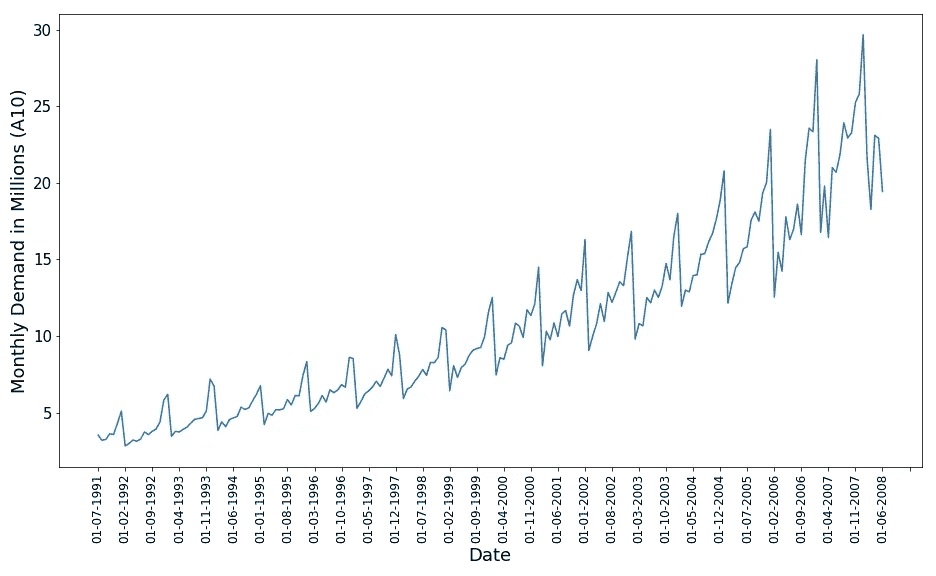

在上面的图中(A10 数据集，Rob J Hyndman)，我们可以看到季节性变化与趋势成比例地持续增加。在这种情况下，我们更喜欢乘法分解。

**场景 2:加法分解**

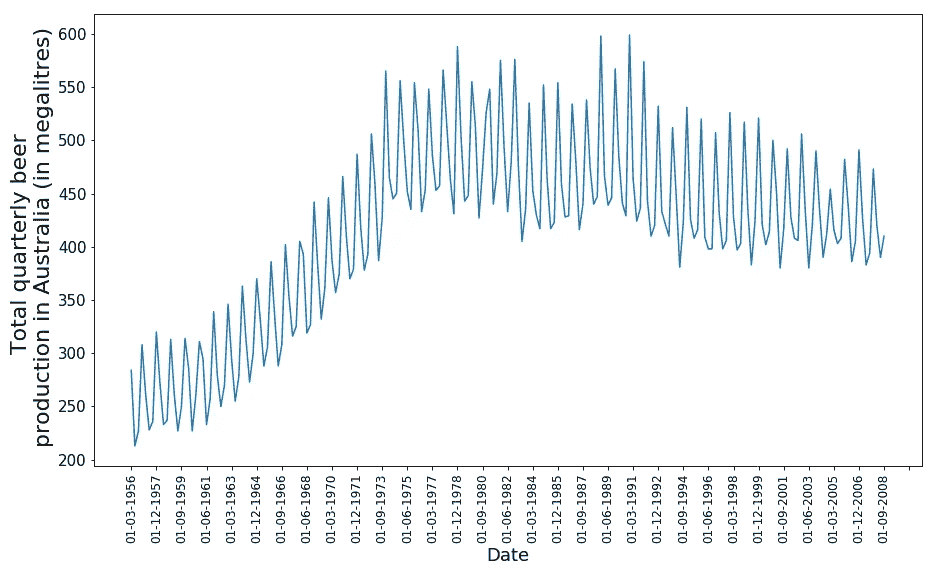

在上图中，我们可以看到季节变化不受趋势的影响，并且始终几乎相同，在这种情况下，建议使用加法分解。

现在，我们知道了加法分解和乘法分解的区别，让我们试着找出第一个分量，趋势周期分量。对于两种分解方法(加法和乘法)，计算趋势周期分量的算法是相同的。

**趋势周期计算**

为了提取趋势周期成分 T(t ),许多组织(例如:加拿大统计局[仍然使用经典 m-移动平均(m-MA)方法的一些变体。](https://www.statcan.gc.ca/eng/dai/btd/trend-cycle)

我们来讨论一下 m-MA(m-移动平均线)算法，

用数学术语来说，趋势分量可以写成:

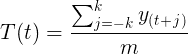

经典分解的趋势方程

在哪里，

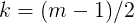

k 和 m 之间的关系。

简而言之，我们可以说时间 t 的时间序列的趋势分量是 k 个窗口内所有点的平均值，包括该点。

让我们尝试使用 a10 数据集来更好地理解这一点(Rob J Hyndman fpp CRAN)，

这是一个数据集 a10(Rob J . hynd man)，澳大利亚 1990 年至 2008 年的抗糖尿病药物月需求量为百万。

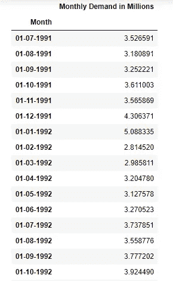

图:a10 数据集的快照

我们将使用下面的 python 代码来查找该数据集的 5 毫安、7 毫安、9 毫安、11 毫安和 13 毫安。

让我们尝试改变上述函数的 m，并查看前几行:

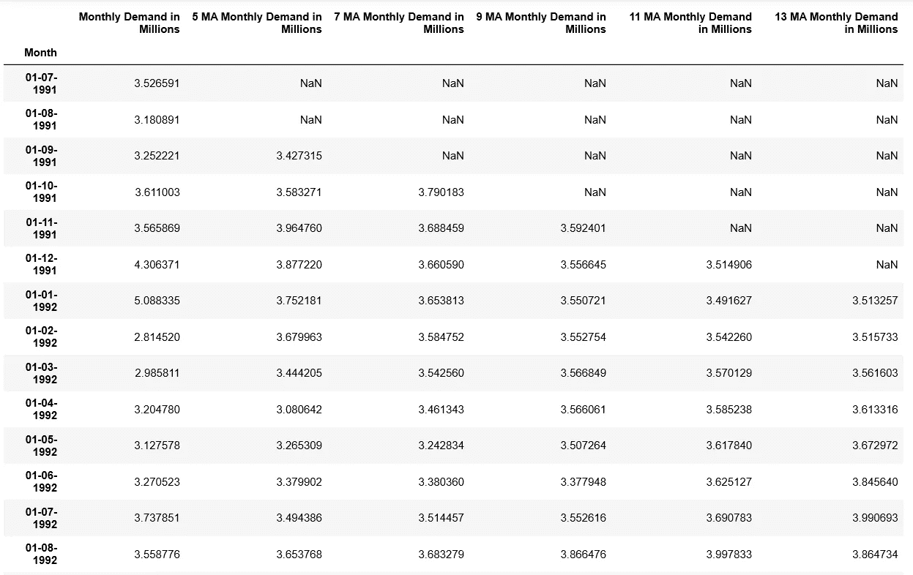

澳大利亚抗糖尿病月度需求数据中 5 MA、7 MA、8 MA、11 MA 和 13 MA 成分的值。

我们可以看到，每个 m 移动平均分量的前 k 行没有值。这是因为这些行没有足够的点数来计算移动平均分量。我们可以使用像 cut 和 normalize 方法这样的方法来处理这些值，但是为了保持博客简单，我们在这里不讨论它。

让我们看看 m 的不同值的曲线图。

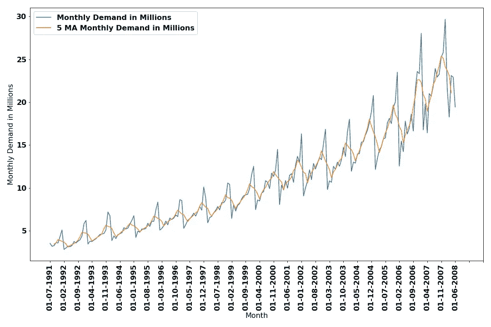

澳大利亚每月抗糖尿病药物需求数据的 5 MA 成分。

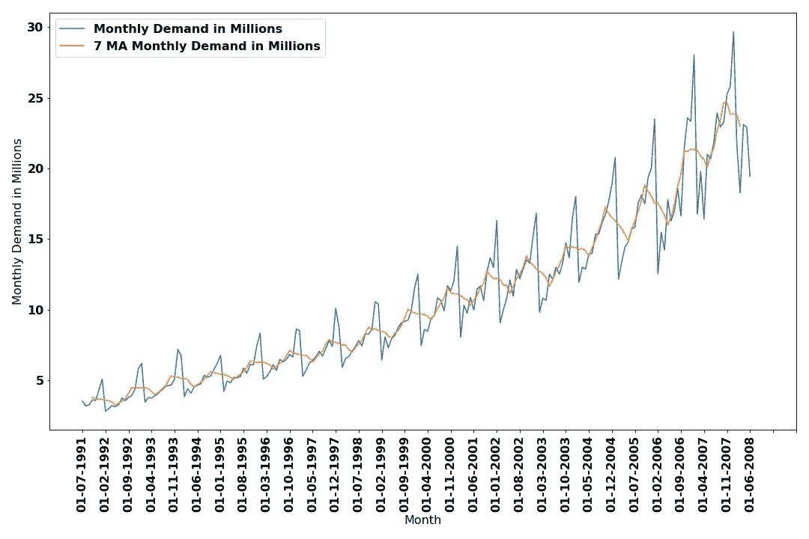

澳大利亚每月抗糖尿病药物需求数据的 7 毫安组成部分。

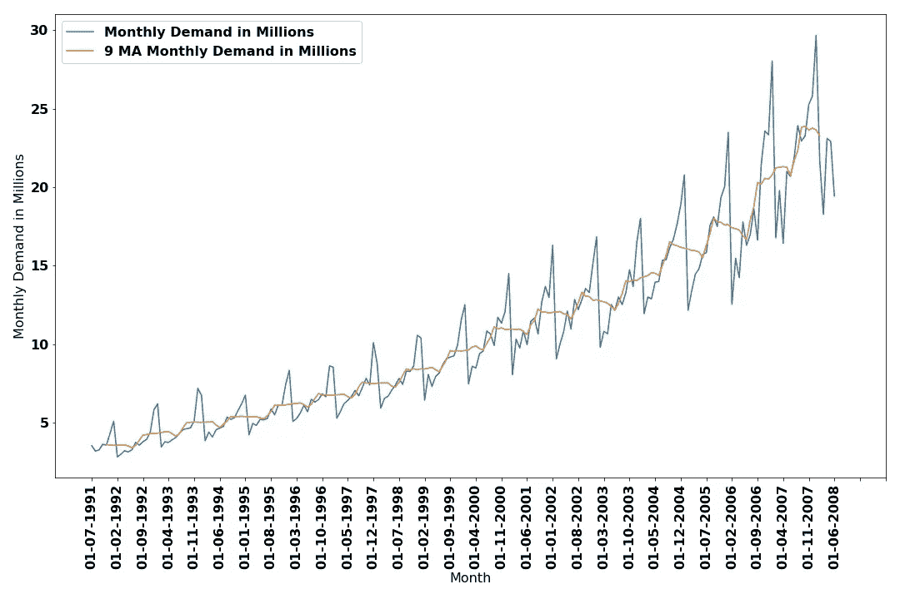

澳大利亚每月抗糖尿病药物需求数据的 9 毫安组成部分。

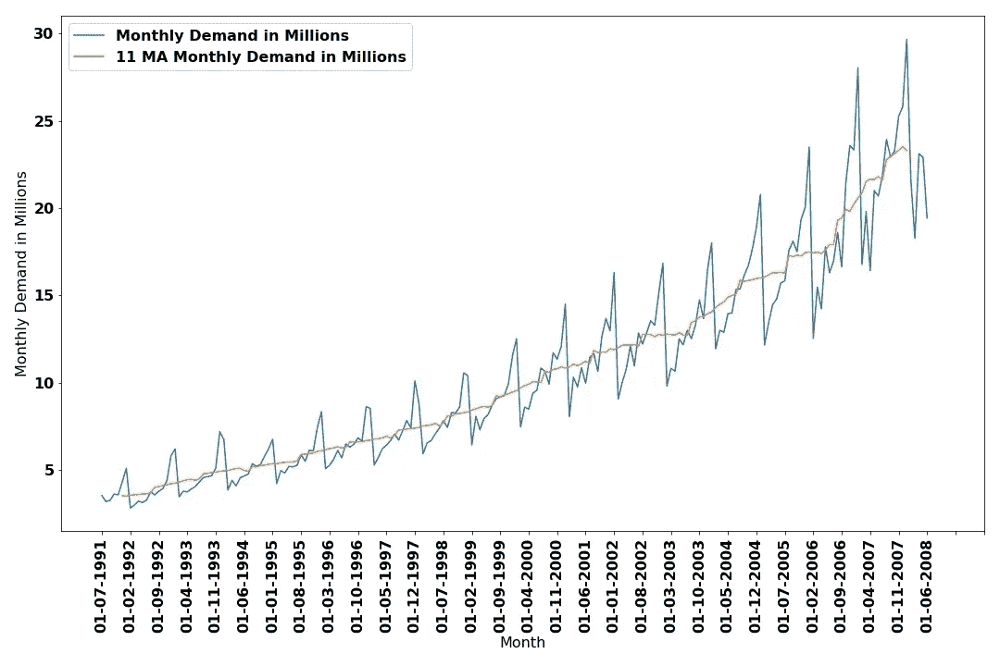

澳大利亚每月抗糖尿病药物需求数据的 11 毫安组成部分。

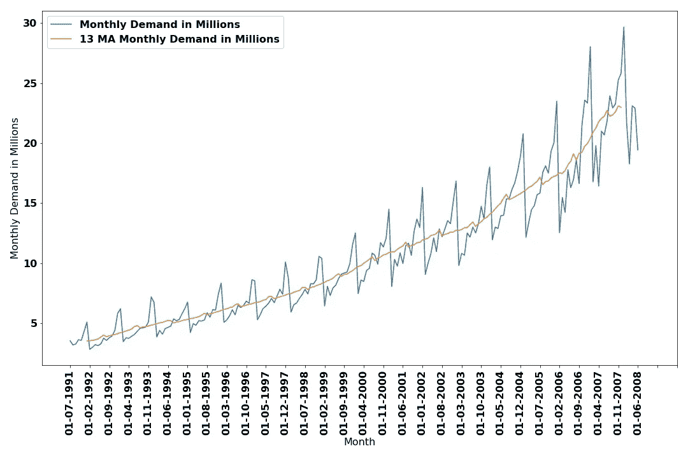

澳大利亚每月抗糖尿病药物需求数据的 13 毫安组成部分。

我们可以看到，随着 m 的增加，趋势分量变得更加平滑。

这里我们只取了 m 的奇数值{5，7，9，11，13}。当 m 是奇数时，例如在每周数据中(m = 7)，这是有帮助的，但是在 m 是偶数的情况下，例如每个月记录的数据(m=12)，我们使用 2*m MA 方法。(也称为中心移动平均线)。

我们一直使用的 a20 数据集是按月记录的，因此集中移动平均线非常适合这里。

基本上，我们找到数据的 12 毫安，然后对从 12 毫安方法获得的序列应用 2 毫安。

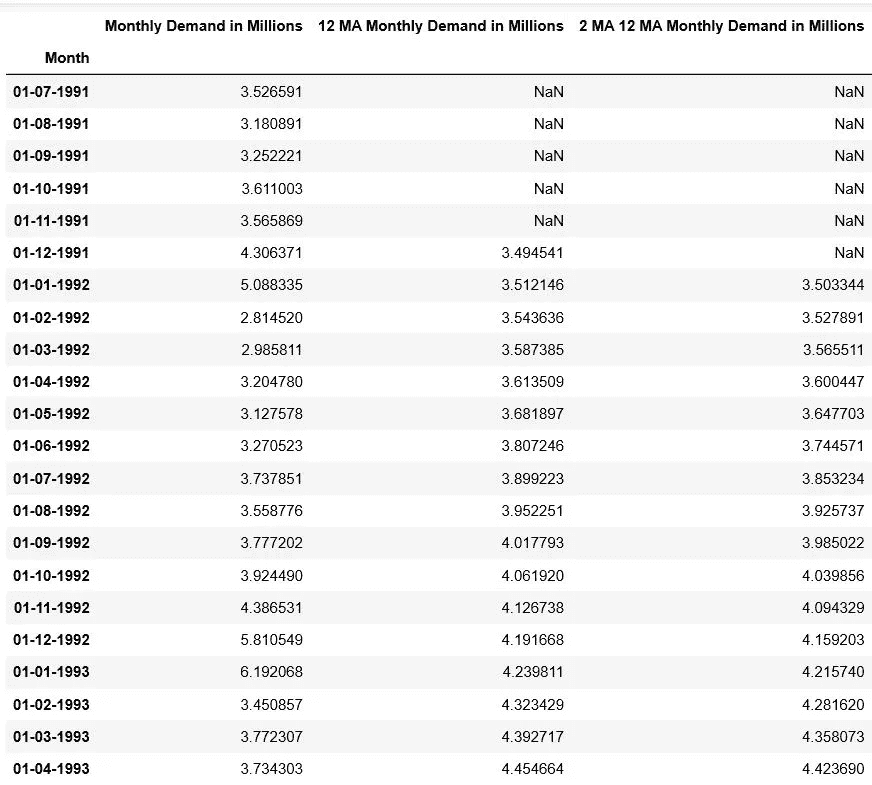

月度需求数据中 12 毫安和 2 X 12 毫安分量的值。

让我们想象一下 2*12 毫安的元件。

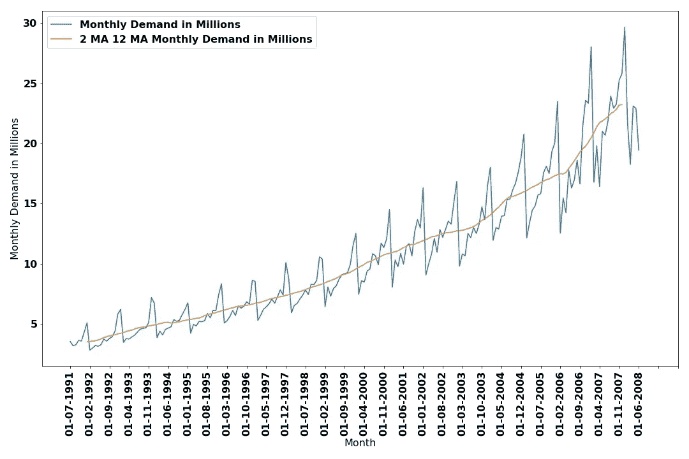

澳大利亚抗糖尿病月度需求数据的 2X12 毫安组成部分。

我们可以清楚地看到，2 X 12 MA 趋势分量比其他 m MA 趋势分量(5，7，9，11，13)平滑得多。

开发人员不需要从头开始编写代码来寻找趋势组件。在实践中，我们使用内置的 python stats 模块来查找趋势组件。

让我们使用内置的 python stats 模块，并将我们的 2 X 12 MA 分量(趋势周期分量)与使用 python stats 模块获得的趋势分量进行比较。

在 stats 模块的帮助下，只需两行代码(一个 import 语句后跟一个函数调用)就可以找到趋势组件。😃

让我们比较一下从内置 python stats 模块获得的趋势和从 m_moving_average()函数获得的(2 X 12 MA)趋势。

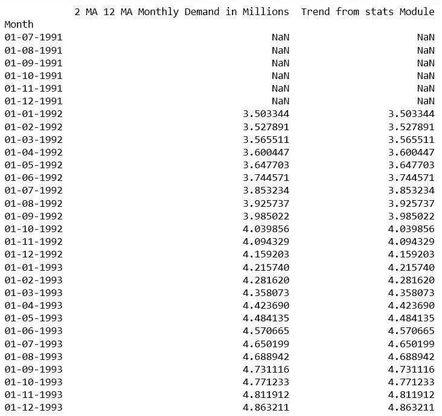

因此，我们可以看到，通过自己计算提取的趋势分量与从内置的 stats 模块中获得的趋势分量相似。

*2 X m* 移动平均法相当于(m+1)阶的加权移动平均法。上述 2 X 12 MA 分解可以表示为 13 阶移动平均。13 个月的权重分别为 *1/24、*1/12、 *1/12* 、 *1/12* 、 *1/12* 、 *1/12* 、 *1/12* 、 *1/12* 、 *1/12* 、 *1/12* 、*因此，2 X m 模型的第一个和最后一个元素的权重为 1/2m，所有其他元素的权重为 1/m。*

通常，加权移动平均法表示为

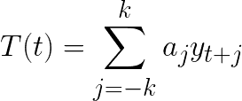

加权 m-MA 方程。

其中权重之和是 1，并且权重应该是对称的，即

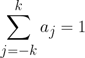

权重之和为一。

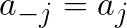

对称权重

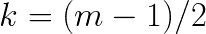

k 和 m 之间的关系。

加权移动平均线给出了趋势周期成分的平滑估计。

现在，我们知道如何使用 m-MA 和 2*m-MA 方法找到趋势分量。在下一篇博客中，我们将使用经典分解找出季节和剩余成分。

参考资料:

 [## 加拿大统计局趋势周期估计的计算细节

### 本文件详细说明了加拿大统计局计算趋势周期估计值的方法。它旨在作为一个技术…

www.statcan.gc.ca](https://www.statcan.gc.ca/eng/dai/btd/trend-cycle)  [## 第 6 章时间序列分解|预测:原理与实践

### 时间序列数据可以表现出各种各样的模式，将一个时间序列分割成几个…

otexts.com](https://otexts.com/fpp2/decomposition.html)