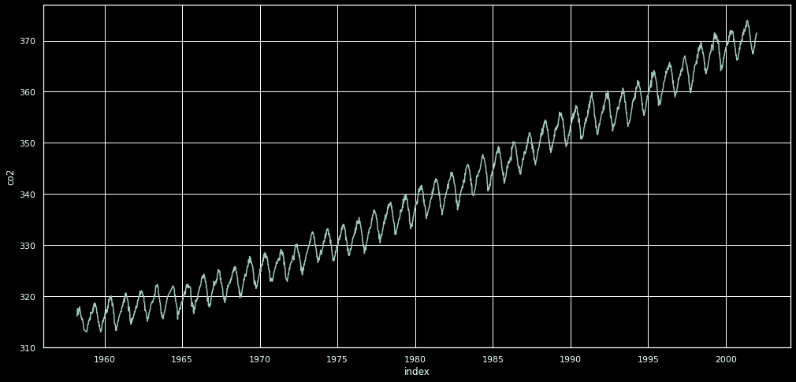
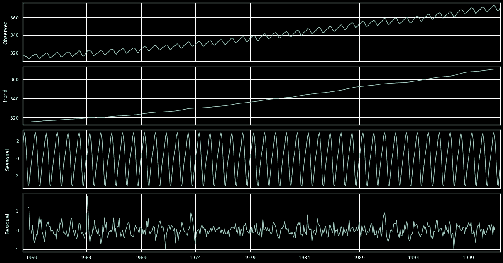
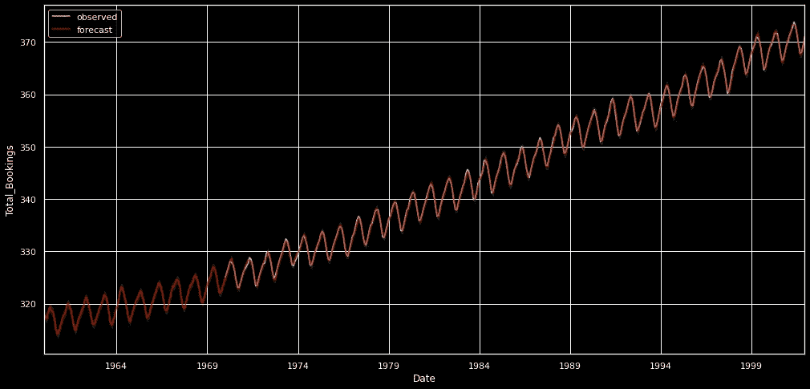
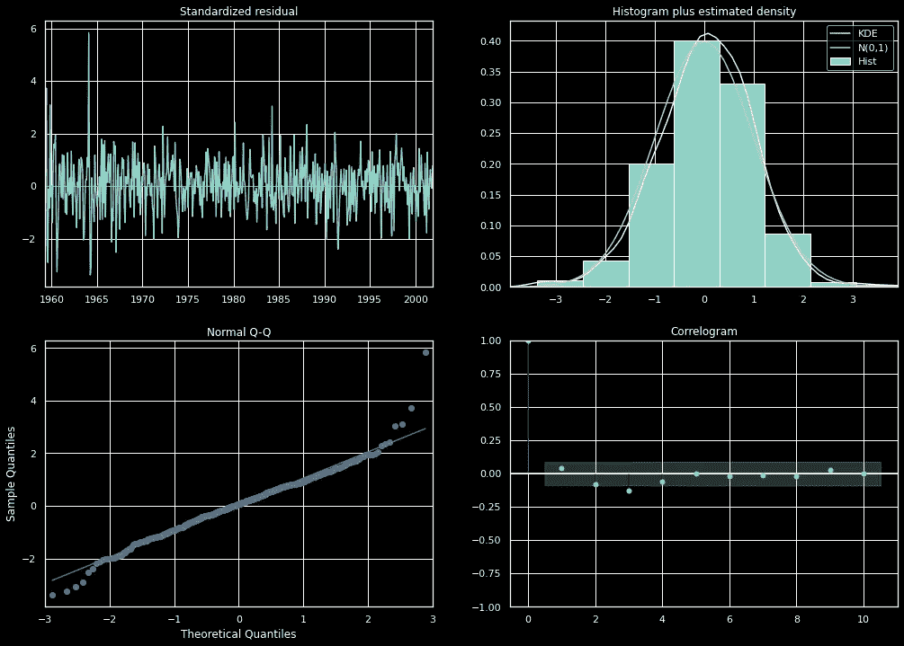
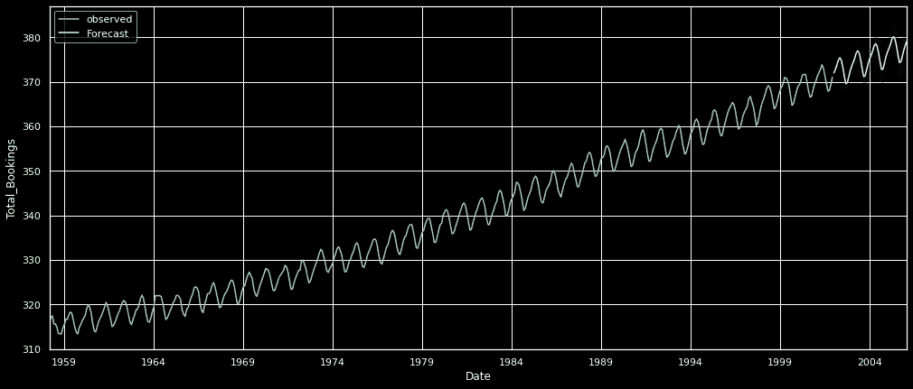
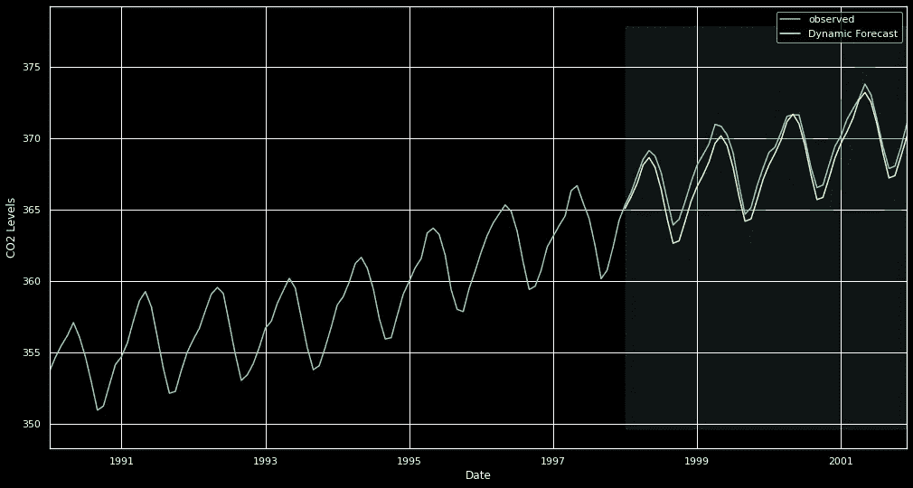

# 时间序列建模-预测之旅。

> 原文：<https://medium.com/analytics-vidhya/time-series-dirty-hands-48e9805c2132?source=collection_archive---------30----------------------->


Jshoots — Unsplash

以固定的时间间隔*记录时间序列数据。*

时间间隔可以是每年、每季度、每月、每周、每天、每小时、分钟、每秒…如果你能有一个更精细的时间间隔，那就多想想。

例如，样本可能代表全年的每日库存水平。

> *一个产品的一系列市场份额数据可能由几年来的每周市场份额组成。*
> 
> *一系列总销售数字可能由多年来每月的一次观察组成。*
> 
> *物联网传感器数据由微米或纳秒级的信息组成，这些信息被分成若干间隔。*

这些例子的共同点是，在一定的时间长度内，以规则的、已知的间隔观察到一些变量。因此，典型时间序列的数据形式是一个单一的序列或观察值列表，代表定期进行的测量。

在这篇博客中，我们将试着看看它们的样子，以及我们应该采取什么方法来得到一个能够预测的模型。

```
import statsmodel as sm#Data Gathering
data = sm.datasets.co2.load_pandas()
co2 = data.data
co2.head()
```


```
y = co2['co2'].resample('MS').mean()
#Check for the null values in the dataset
y.isnull().sum()
```

如果您尝试运行上面的单元格，总共找到 5 个空值，我们必须填补空白。

```
y = y.fillna(y.bfill())
```

当处理时间序列数据时，通过可视化可以揭示很多信息。需要注意的几件事是:

*   季节性:数据是否显示出清晰的周期性模式？
*   趋势:数据遵循一致的上升或下降趋势吗？
*   噪声:是否存在任何与其余数据不一致的异常点或缺失值？

```
df = co2.reset_index()
plt.figure(figsize = (17,8))
sns.lineplot(x="index",
             y="co2",
             data=df,
             err_style="bars",
             markers=True,
             dashes=False,)
plt.show()
```



**明显可辨的图案清晰可见。该时间序列具有明显的季节性，以及总体上升趋势。我们还可以使用一种叫做时间序列分解的方法来可视化我们的数据。**

一个写得很好的关于时间序列数据分解的东西可以在[这里](https://machinelearningmastery.com/decompose-time-series-data-trend-seasonality/#:~:text=Time%20series%20decomposition%20involves%20thinking,time%20series%20analysis%20and%20forecasting.)找到。我们可以尝试加法分解。

```
from pylab import rcParams
rcParams['figure.figsize'] = 17, 9

decomposition = sm.tsa.seasonal_decompose(y, model='additive')
fig = decomposition.plot()
plt.show()
```



```
# ARIMA models are denoted with the notation ARIMA(p, d, q).
# where -:
# p : seasonality
# d : trend
# q : noise
#Let's generate few p,d,q

p = d = q = range(0, 2)
pdq = list(itertools.product(p, d, q))
seasonal_pdq = [(x[0], x[1], x[2], 12) for x in list(itertools.product(p, d, q))]
print('Parameter combinations for Seasonal ARIMA ::')
print('SARIMAX: {} x {}'.format(pdq[1], seasonal_pdq[1]))
print('SARIMAX: {} x {}'.format(pdq[1], seasonal_pdq[2]))
print('SARIMAX: {} x {}'.format(pdq[2], seasonal_pdq[3]))
print('SARIMAX: {} x {}'.format(pdq[2], seasonal_pdq[4]))Parameter combinations for Seasonal ARIMA ::
SARIMAX: (0, 0, 1) x (0, 0, 1, 12)
SARIMAX: (0, 0, 1) x (0, 1, 0, 12)
SARIMAX: (0, 1, 0) x (0, 1, 1, 12)
SARIMAX: (0, 1, 0) x (1, 0, 0, 12)## Grid search way to find optimal parameter aka. p,d,q
for param in pdq:
    for param_seasonal in seasonal_pdq:
        try:
            mod = sm.tsa.statespace.SARIMAX(y,
                                            order=param,
                                            seasonal_order=param_seasonal,
                                            enforce_stationarity=False,
                                            enforce_invertibility=False)

            results = mod.fit()
            print('ARIMA{}x{}12 - AIC:{}'.format(param, param_seasonal, results.aic))
        except:
            continue
```

在运行时:

**ARIMA(0，1，1)x(1，1，1，12)12 具有最低的 AIC，因此它可能是迄今已知的最佳参数信息。**

```
mod = sm.tsa.statespace.SARIMAX(y,
                                order=(0, 1, 1),
                                seasonal_order=(1, 1, 1, 12),
                                enforce_stationarity=True,
                                enforce_invertibility=False)

results = mod.fit()

print(results.summary().tables[1])

####################################################################pred = results.get_prediction(start=pd.to_datetime('1960-01-01'),dynamic=False)

pred_ci = pred.conf_int()
ax = y['1970':].plot(label='observed')pred.predicted_mean.plot(ax=ax, 
                         label='forecast',
                         color="red",
                         alpha=.7,
                         figsize=(17, 8))ax.fill_between(pred_ci.index,
                pred_ci.iloc[:, 0],
                pred_ci.iloc[:, 1], 
                color='yellow', 
                alpha=.1)ax.set_xlabel('Date')
ax.set_ylabel('CO2_Level')
plt.legend()
plt.show()
```



```
results.plot_diagnostics(figsize=(17, 12))
plt.show()
```



```
y_forecasted = pred.predicted_mean
y_truth = y['1960-01-01':]
mse = ((y_forecasted - y_truth) ** 2).mean()
print('The Mean Squared Error of our forecasts is {}'.format(round(mse, 2)))The Mean Squared Error of our forecasts is 0.11print('The Root Mean Squared Error of our forecasts is {}'.format(round(np.sqrt(mse), 2)))The Root Mean Squared Error of our forecasts is 0.33
```

## 静态预测

```
pred_uc = results.get_forecast(steps=50)
pred_ci = pred_uc.conf_int()
ax = y.plot(label='observed', figsize=(17, 7))
pred_uc.predicted_mean.plot(ax=ax, label='Forecast')
ax.fill_between(pred_ci.index,
                pred_ci.iloc[:, 0],
                pred_ci.iloc[:, 1], color='k', alpha=.25)
ax.set_xlabel('Date')
ax.set_ylabel('CO2_Level')
plt.legend()
plt.show()
```



## 动态预测

```
pred_dynamic = results.get_prediction(start=pd.to_datetime('1998-01-01'), dynamic=True, full_results=True)
pred_dynamic_ci = pred_dynamic.conf_int()

ax = y['1990':].plot(label='observed', figsize=(17, 9))
pred_dynamic.predicted_mean.plot(label='Dynamic Forecast', ax=ax)

ax.fill_between(pred_dynamic_ci.index,
                pred_dynamic_ci.iloc[:, 0],
                pred_dynamic_ci.iloc[:, 1], color='k', alpha=.25)

ax.fill_betweenx(ax.get_ylim(), pd.to_datetime('1998-01-01'), y.index[-1],
                 alpha=.1, zorder=-1)

ax.set_xlabel('Date')
ax.set_ylabel('CO2 Levels')

plt.legend()
plt.show()
```



有各种各样的时间序列分析技术，如预测不确定性界限，变点和异常检测，预测时间序列与外部数据源，我们可以探索。这只是题目上的一点擦伤。

对于进一步的学习，资源可能是有帮助的。

1.  [https://www . IBM . com/support/knowledge center/ko/SSL vmb _ 23 . 0 . 0/SPSS/trends/trends _ introduction . html](https://www.ibm.com/support/knowledgecenter/ko/SSLVMB_23.0.0/spss/trends/trends_introduction.html)
2.  [https://www . machine learning plus . com/time-series/time-series-analysis-python/](https://www.machinelearningplus.com/time-series/time-series-analysis-python/)