# [时间序列预测]脸书预言家的异常检测

> 原文：<https://medium.com/analytics-vidhya/time-series-forecast-anomaly-detection-with-facebook-prophet-558136be4b8d?source=collection_archive---------0----------------------->

# **总结**

我们构建了一个方便的时间序列异常检测模块，通过可视化和在`*pyplot*`
- **实验中标记异常值，使用不同的时间窗口和模型参数**如置信区间，快速地:
- **发现和诊断模式，并做出调整**

代码片段分享在 github repo 上，请随时查看[代码](https://github.com/paullo0106/prophet_anomaly_detection/)和[示例笔记本](https://github.com/paullo0106/prophet_anomaly_detection/blob/master/example.ipynb) *(环境:python 3、* `*matplotlib*` *、* `*seaborn*`、 `*fbprophet v0.5*` *)*

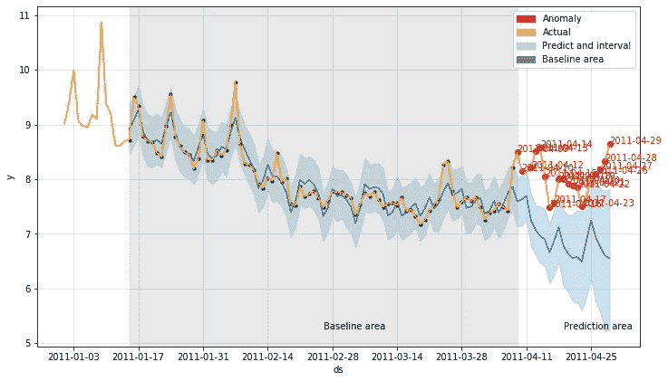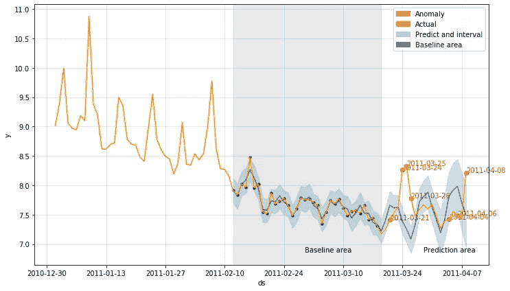

使用不同的训练窗口(灰色基线区域)进行测试，并在图上用红点突出显示异常值

# **背景**

在我最近的一个项目中，我们的团队希望检测成千上万个具有不同特征的时间序列数据中的异常，这些异常是由市场动态和特定区域的应用引起的。由于这些极高或极低的值可能会直接或间接影响我们的客户和业务(以不良方式)，因此开发了检测模型的日常运行，旨在提供警报，以便及时调整系统中断、人为错误等。

# **模型和用例(需求)**

*   **置信区间灵活预测**:我们的项目中主要使用 [Prophet](https://github.com/facebook/prophet) ，是脸书开发的开源库。时间序列预测是一个受欢迎的领域，我们也评估了其他模型，从早期的`ARIMA`到最近的`Neural Network`类型的方法，我们必须将范围缩小到几个模型/框架，这些模型/框架**自然地支持置信区间**(参见[【stack exchange】LSTM 时间序列预测的预测区间](https://datascience.stackexchange.com/questions/24403/prediction-interval-around-lstm-time-series-forecast)中的讨论，指出为什么它可能对某些模型(如神经网络)没有意义)——我们希望在我们的警报系统中灵活地设置`*alpha*`(如异常阈值)。
*   **相当大的数据量**:我们有大量的时间序列数据要处理，**如果我们想回溯几个月以上的时间，存储和数据收集过程可能会效率低下**。因此，我们创建了带有参数的模块，以评估我们拟合和预测 1-3 个月大小的训练窗口的情况，并验证该大小是否可以应用于我们所有的大多数时间序列。

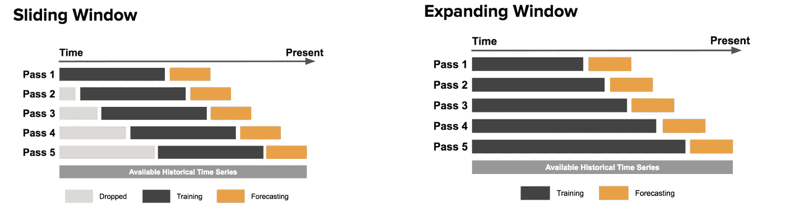

(图摘自优步英语博客优步[天气预报)](https://eng.uber.com/forecasting-introduction/)

*   **监控和可观察性:**我们有多个利益相关者，包括 PM、Eng、营销和运营团队，我们希望使检测结果易于消化，并为模型提供一定程度的可解释性。通过这样做，我们将能够收集反馈并快速迭代。

# 给我看看🖥的代码

**加载数据**

为了说明该模块，我们使用了[example _ WP _ log _ peyton _ manning . CSV](https://github.com/facebook/prophet/tree/master/examples)，这是脸书预言家网站 github 示例文件夹中提供的数据集

```
import pandas as pd
df = pd.read_csv('[https://raw.githubusercontent.com/facebook/prophet/master/examples/example_wp_log_peyton_manning.csv'](https://raw.githubusercontent.com/facebook/prophet/master/examples/example_wp_log_peyton_manning.csv'))
df.head()
```

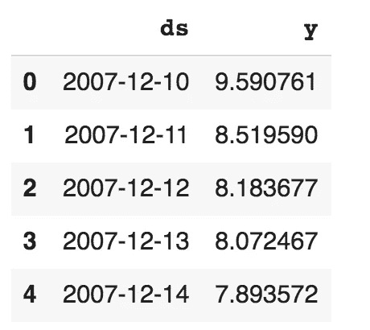

```
import matplotlib.pyplot as plt
df.ds = pd.to_datetime(df.ds) # properly convert to datetime type
df.index = df.ds # make x-axis naturally appear in the datetime format
df.y.plot()
plt.show()
```

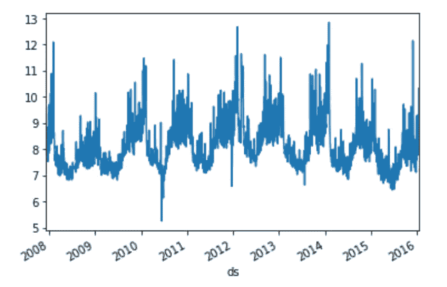

样本数据集包含 2008 年至 2016 年维基百科页面的每日流量

**型号**

```
from fbprophet import Prophet# configure the model
model = Prophet(interval_width=0.98, yearly_seasonality=True, changepoint_prior_scale=0.5)
model.add_seasonality(name=’monthly’, period=30.5, fourier_order=5)
model.add_seasonality(name=’weekly’, period=7, fourier_order=3)

# fit the time-series data
model.fit(df)# predict next 52 weeks
future = model.make_future_dataframe(periods=7*52)  
forecast = model.predict(future)model.plot(forecast)  # visualise the result
```

*(注:详见* [*傅立叶 _ 阶*](https://facebook.github.io/prophet/docs/seasonality,_holiday_effects,_and_regressors.html#fourier-order-for-seasonalities) *(* [*维基*](https://en.wikipedia.org/wiki/Fourier_series#/media/File:Fourier_Series.svg) *)，*[*change point _ scale*](https://facebook.github.io/prophet/docs/trend_changepoints.html)*具体通过先知文档链接)*

我们成功地使用了数据框架`*df*`，数据范围从 2008 年到 2016 年，并用几行代码预测了 2017 年的趋势！正如您在下图中看到的，`Prophet`有一个相当不错的内置可视化功能

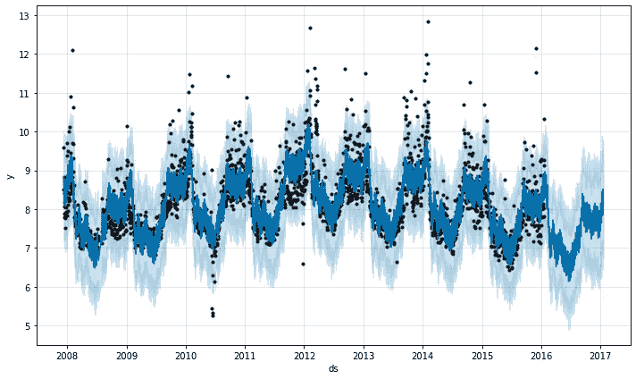

图:用 2008 年到 2016 年的数据点对 2017 年进行预测

为了使这个简单的例子更适合我们的异常检测用例，我们将做一些小的调整，比如说，在`day N`，我们有 1 年的历史数据，即从`day (N-365)`到`day (N-1)`，让我们在`day (N-15)`将这个范围分成两部分，并基于`day (N-365)`到`(N-15)` *构建我们的预测模型。*

在生成最近 2 周的预测:`day (N-14)`到`(N-1)` *，*然后**与最近 2 周的实际值进行比较，并标记出超出预测区间**的值(在 Prophet 的结果数据帧中， *yhat_upper* 和 *yhat_lower* 列)，当用更高的*初始化模型时，预计范围会更大*

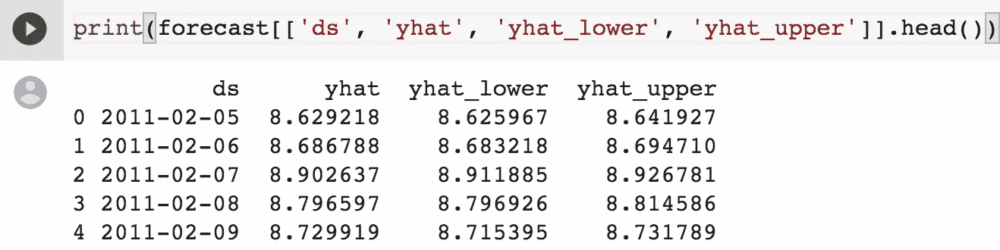

注意:预测是从 model.predict(future)调用中得到的 pandas.dataframe

因此，我们调整代码以适应增加的功能:

*   **窗口参数**:这是我们可以划分训练(第`0`天到`day N-x`天)和预测(`day N-x`到`day N`天)段的地方。
*   **异常值的可视化**:一幅好的图片总是最直观地告诉我们模型是如何工作并做出预测的，事实证明，通过图表从 PM、工程和其他用户那里获得反馈非常有帮助——预测范围、实际值和异常值都可以在异常警报报告中得到很好的说明。

**窗口参数**

我们引入一个名为`prophet_fit()` *(* [*见这里的完整实现*](https://github.com/paullo0106/prophet_anomaly_detection/blob/master/utils.py#L8) *)* 的函数，在这里我们输入数据、模型和时间窗口。`today_index`、`lookback_days`、`predict_days`是定义训练和预测段的参数。

如[示例笔记本](https://github.com/paullo0106/prophet_anomaly_detection/blob/master/example.ipynb)所示，现在用`prophet_fit()`迭代几个模型参数和截止日期非常容易。

```
# Setting 1
alpha=0.95
model = Prophet(interval_width=alpha, 
                yearly_seasonality=False, 
                weekly_seasonality=False,
                changepoint_prior_scale=0.5)
model.add_seasonality(name='monthly', period=30.5, fourier_order=5)
model.add_seasonality(name='weekly', period=7, fourier_order=3, prior_scale=0.1)today_index = 48
print('Cutoff date:', df.index[today_index])
predict_n = 14
results = prophet_fit(df, model, today_index,
                      predict_days=predict_n)# Setting 2
alpha=0.98
model = Prophet(interval_width=alpha, 
                yearly_seasonality=False, 
                weekly_seasonality=False, 
                changepoint_prior_scale=0.1)
model.add_seasonality(name='monthly', period=30.5, fourier_order=5)
model.add_seasonality(name='weekly', period=7, fourier_order=3, prior_scale=0.1)

today_index = 48
print('Cutoff date:', df.index[today_index])
predict_n = 14
lookback_n = 35
results = prophet_fit(df, model, today_index, 
                      lookback_days=lookback_n, 
                      predict_days=predict_n)
```

**异常值的可视化**

1.  过滤离群值

代码片段:

```
def get_outliers(df, forecast, today_index, predict_days=21):
    df_pred = forecast
    df_pred.index = df_pred[‘ds’].dt.to_pydatetime()
    df_pred.columns = [‘ds’, ‘preds’, ‘lower_y’, ‘upper_y’]
    df_pred[‘actual’] = df[‘y’][today_index: today_index+predict_days].values
    print(df_pred.head()) # .... and then flag 'actual' values which fall outside of lower_y and upper_y
    # more code here
```

在同一个数据框架内将预测值和实际值对齐后，我们就能看到什么是“异常”。

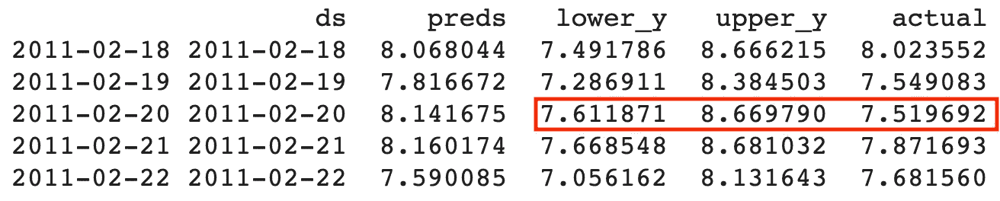

df_pred 数据帧中的异常

在本例中，`02–20`上的 7.51 被标记为异常，因为其值落在预测区间(7.61 至 8.67)之外。我们希望用一个简单的过滤条件突出显示数据帧中的所有异常，并将其放在图像上，如下所示。

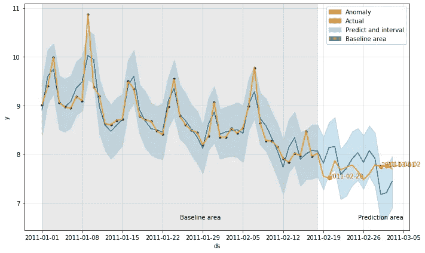

```
print('Predictions')
print(df_pred.head())df_outlier = df_pred[(df_pred.actual > df_pred.upper_y) | (df_pred.actual < df_pred.lower_y)]print('Outliers')
print(df_outlier.head())
```

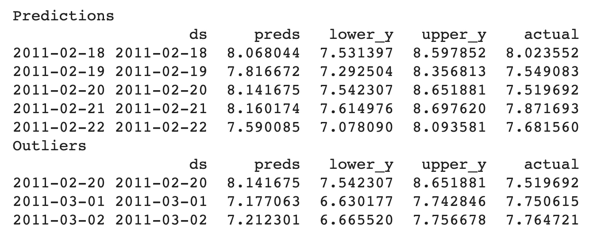

2.将所有信息放在一个图中

如果我们仔细看看，Prophet 的 [*plot()*](https://github.com/facebook/prophet/blob/master/python/fbprophet/plot.py#L41) 返回如下图的 matplotlib 图，我们想在上面添加更多的信息

```
model.plot(forecast)
```

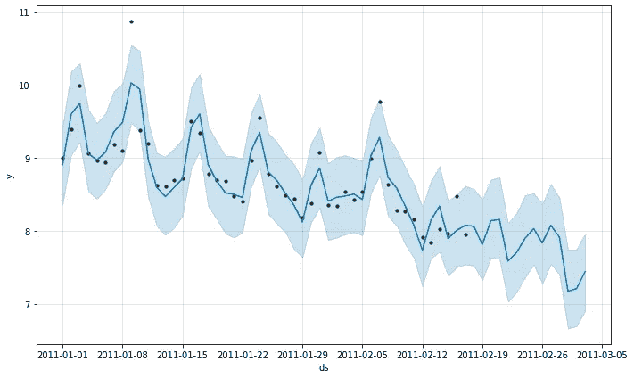

Prophet 的内置绘图功能:该图显示了模型从 1 月到 2 月中旬的流量(点表示实际值),并生成一条到 3 月底的拟合线

```
fig = model.plot(forecast)#add lines, points, text to the figure
ax = fig.get_axes()[0]
ax.plot(.....)
ax.scatter(.....)
ax.text(.....)
```

通过上面的代码，我们获取了`matplotlib figure`对象的第一个(也是唯一的)轴，然后我们就可以给图像添加额外的东西了！

现在，在`[prophet_plot()](https://github.com/paullo0106/prophet_anomaly_detection/blob/master/utils.py#L71)`函数中，我们有了所有的数据来:

a)用红点标出每个异常值，并注明日期

```
# plot each outlier in red dot and annotate the date
foroutlier inoutliers:
    ax.scatter(outlier[0], outlier[1], color='red', label='Anomaly')
    ax.text(outlier[0], outlier[1], str(outlier[0])[:10], color='red')
```

b)用颜色突出显示时间框架，并对区域进行注释

```
# highlight baseline time frame with gray background
iflookback_days:
    start = today_index - lookback_days
ax.axvspan(x_pydatetime[start],
           x_pydatetime[today_index],
           color=sns.xkcd_rgb['grey'],
           alpha=0.2)# annotate the areas with text at the bottom 
ymin, ymax = ax.get_ylim()[0], ax.get_ylim()[1]
ax.text(x_pydatetime[int((start + today_index) / 2)], ymin + (ymax - ymin) / 20, 'Baseline area')
ax.text(x_pydatetime[int((today_index * 2 + predict_days) / 2)], ymin + (ymax - ymin) / 20, 'Prediction area')
```

使用这些函数，我们将能够生成如下所示的直观图形

```
outliers, df_pred = get_outliers(df, forecast, today_index, predict_days=predict_n)

prophet_plot(df, fig, today_index, lookback_days=lookback_n, 
             predict_days=predict_n, outliers=outliers)
```

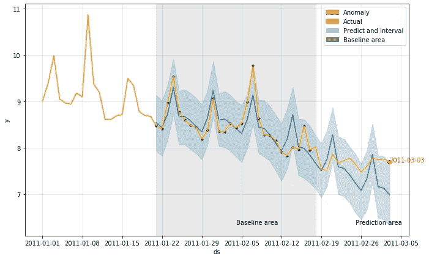

**其他注释🗒**

在开发过程中，我遇到了一些问题，记录了适合我的解决方案

1.  **TypeError: float()参数必须是字符串或数字，而不是“句点”**

这并不总是可重复的，但我在绘制图形时遇到过几次。下面的一行代码解决了我的问题，正如这里的 stackoverflow [中所讨论的。](https://stackoverflow.com/a/57148021/2547739)

```
pd.plotting.register_matplotlib_converters() 
```

**2。根据画布上现有的 x 轴类型绘制(x，y)**

我们重用 Prophet 的拟合函数生成的`matplotlib figure`，x 轴有一个现有的 datetime 格式。因此，当我们向图中添加线条或点时，我们需要确保我们有兼容`x`的 *datetime64[ns] dtype*

```
x_pydatetime = df['ds'].dt.to_pydatetime()
ax.plot(x_pydatetime[start:end],
        df.y[start:end],
        color='orange', label='Actual')
```

同样的概念也适用于异常值可视化，我们使用正确的日期时间格式为稍后的绘图构建 x 坐标的异常值列表

```
# construct outlier list with the right datetime format in x coordinate
df_pred.index = df_pred['ds'].dt.to_pydatetime()
for ......
    outliers.append((df_pred.index[i], actual_value))# and then plot outliers on the figure
for outlier in outliers:
    ax.scatter(outlier[0], outlier[1], color='red', label='Anomaly')
    ax.text(outlier[0], outlier[1], str(outlier[0])[:10], color='red')
```

**3。“‘ds’既是索引级别又是列标签”错误**

为了方便绘图，我们在开始时设置了 *df.index = df.ds* 来制作 data frame*datetime index*的索引(dtype:*datetime 64【ns】*)。我在一些排序和预测任务中遇到了警告/错误:*‘ds’既是索引级别，也是列标签“*”。在 Prophet 项目的第 891 期 中提到的一个非常快速的解决方法是简单地将索引的名称重置为`None`以避免这种歧义。

```
df.index.name = None
```

# **参考资料(对我很有帮助的资源！)**

*   [【Youtube】用 Python 算命:脸书先知介绍——芝加哥 Python 用户组 Jonathan Balaban](https://www.youtube.com/watch?v=95-HMzxsghY)
*   [【书】熊猫食谱:使用 Python 进行科学计算、时间序列分析和数据可视化的食谱](https://amzn.to/2S7xxuV)，作者 Theodore Petrou
*   [【本书】时间序列分析](https://amzn.to/37ADuF5)，作者詹姆斯·d·汉密尔顿
*   [【书】预测:原理与实践](https://bit.ly/forecast_principle_amzn)
*   [[文章]走向数据科学:用脸书的先知预测“未来”](https://towardsdatascience.com/predicting-the-future-with-facebook-s-prophet-bdfe11af10ff)

# **结尾注释**

> 感谢您阅读本文，非常感谢您的任何反馈/问题。请随时寻求进一步的合作😃