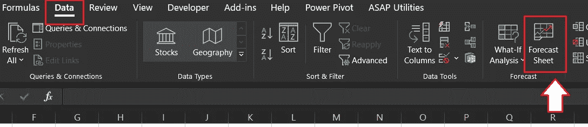
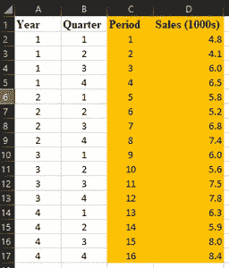
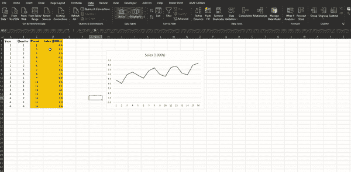
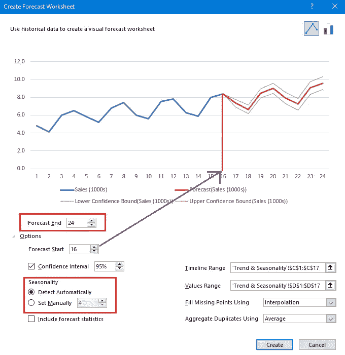
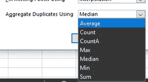
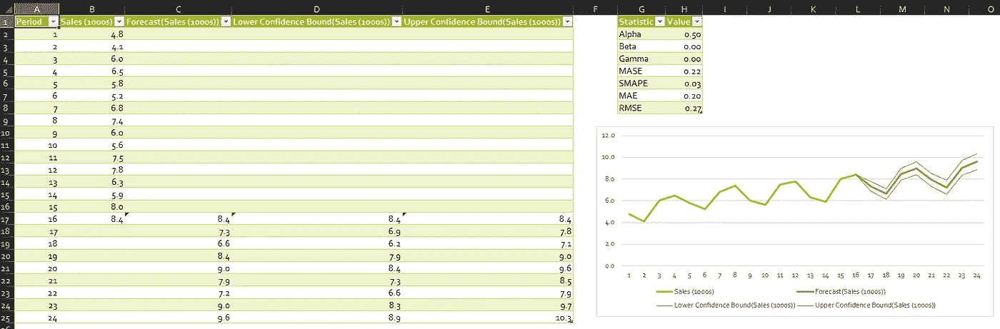

# 用 Excel 进行时间序列预测

> 原文：<https://medium.com/analytics-vidhya/time-series-forecast-with-excel-749515813f77?source=collection_archive---------5----------------------->

2006 年，我加入了管理信息系统团队。我们是这个组织的数据管理员。即使是 Excel(2003 版)对我来说也是全新的、令人着迷的。然后我们开始学习预测技术。一个由六名适马专业人员组成的团队擅长制作年度、月度和每周预测。由于 Excel 功能有限，他们使用 Minitab 通过时间序列技术生成预测。当时我几乎不能理解时间序列。对我来说，这是一个相当迷人的主题:利用历史数据预测未来！

随着时间的推移，我和 Excel 都发展了分析能力。预测模型已经成为我们两个的常规功能。本文解释了使用预测表生成预测所涉及的步骤。

Excel 2016 中引入的预测表(仅适用于 windows)使预测生成成为一个两步流程。

您可以在数据功能区下找到该功能:

# 基本功能:预测。美国教育考试服务中心

预测表使用指数平滑*季节算法(ETS AAA)* 预测，使用内置函数预测。ETS *。*它使用一个等式对时间序列建模，该等式考虑了*加性误差*、*加性趋势*和*加性季节性*。这种算法也就是俗称的 ***霍尔特-温特斯算法*** 。它被广泛用于预测和计划商业需求。

换句话说，当[时间序列数据](https://www.vivran.in/post/what-is-a-time-series)具有趋势和季节性时，预测表可用于预测。

# 使用预测表生成预测

它主要需要两列:

1.要预测的值(预测变量)

2.具有连续时间段的列(可以是每月的第一天、每年的时间线或分配给每个时间段的序列号)

对于一个时间序列，一个一致的时期是必须的。它可以是值在每月 1 日的月间隔、年间隔或数字间隔。

数据集可能有值的空白记录，但这些记录只占总记录的 30%或更少。预测表还处理同一时间戳或时间段的多个记录。但是，建议汇总数据集(以确保相同时间戳的唯一记录)

选择两列>数据>预测表

数据>预测表

它会打开一个预测工作表窗口:

# 预测工作表的组成部分

**预测结束:**定义预测周期数(图中用橙色表示)。Excel 会创建一个包含历史数据和预测值的表格。

**预测开始:**定义预测的开始点。您可以选取历史数据结束之前的一个时间段。当您这样做时，预测工作表会忽略该期间以外的所有值。在本例中，如果我们将预测起始时间从 16 更改为 11，预测工作表将考虑点 1 至 10 来生成预测。

在最后一个历史点之前开始预测可以让您感觉到预测的准确性，因为您可以将预测序列与实际数据进行比较。

*但是，如果过早开始预测，生成的估计不一定代表使用所有历史数据生成的预测。*

使用所有的历史数据会给你一个更准确的预测。

**置信区间:**勾选或取消勾选置信区间显示或隐藏。置信区间是预测值周围的一个范围。95%的置信区间表示 95%的预测值预计落在该范围内。

**季节性:**它是一个完整数据周期所需的时间步长数，在此之后，该周期在整个时间序列中重复。默认情况下，它会自动检测数据集的季节性。你可以使用公式**预测。ETS .季节性**计算数据集中的季节性。

**填充缺失点使用:**当数据集中的值缺少数据点时很有用。

*   如果选择零，则它将缺失值视为 0 并计算预测(不推荐，需要业务判断)
*   如果选择插值，它将使用缺失值周围相邻数据点的加权平均值。当缺失值少于总记录的 30%时，它可以工作。

**聚合重复项使用:**如果数据集在同一期间有多条记录，默认情况下，Excel 使用这些值的平均值进行预测。例如，对于期间 10，如果我们有两个值为 5 & 6 的记录，那么预测表使用 5.5(5&6 的平均值)作为期间 10 的值。

我们可以根据数据和预期预测值更改默认计算:

**包含预测统计:**选中此选项可获取以下统计信息:

*   α，β，γ(平滑系数)
*   梅斯**，**斯马佩，梅伊，RMSE — [预测模型](https://www.vivran.in/post/measuring-forecast-accuracy)的精度度量。

# 预测单的输出

C 列中的值是对未来期间的预测。列 D & E 分别代表估计的下限和上限。因此，对于期间 17，平均预测值为 7.3，可能在 6.9 到 7.8 之间变化(95%的置信度)。

*我写关于*[*MS Excel*](https://www.vivran.in/my-blog/categories/excel)*[*权力查询*](https://www.vivran.in/my-blog/categories/powerquery)*[*权力毕*](https://www.vivran.in/my-blog/categories/powerbi)*[*权力中枢*](https://www.vivran.in/my-blog/categories/power-pivot)*[*DAX*](https://www.vivran.in/my-blog/categories/dax)*[*数据分析【数据*](https://www.vivran.in/my-blog/categories/data-analytics)*****

**[@imVivRan](https://twitter.com/imvivran)**