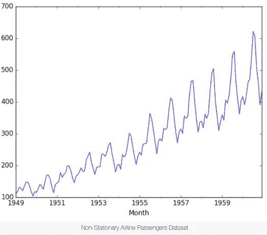

# 时间序列预测和分析:ARIMA 和季节性 ARIMA

> 原文：<https://medium.com/analytics-vidhya/time-series-forecasting-and-analysis-arima-and-seasonal-arima-cacaf61ae863?source=collection_archive---------3----------------------->

**时间序列**不同于更传统的分类和回归预测建模问题。

**时间**性质给观察增加了秩序。这种强加的顺序意味着关于这些观察一致性的重要假设需要特别处理。

T4 根据历史观察做出预测的能力创造了竞争优势。例如，如果一个组织有能力更好地预测一种产品的销售量，它将在优化库存水平方面处于更有利的地位。这可以增加组织现金储备的流动性，减少营运资本，并通过减少积压订单来提高客户满意度。

在机器学习领域，有一组特定的方法和技术特别适合于根据时间预测因变量的值。在前面的文章中，我们将讨论**自回归综合移动平均线(ARIMA)** 。

我们将按时间顺序索引(或绘制)的一系列数据点称为**时间序列**。时间序列可以分解成 3 个部分。

*   **趋势:**向上&数据在很长一段时间内随时间的向下移动(即房屋升值)
*   **季节性:**季节性差异(即夏季对冰淇淋的需求增加)
*   **噪声:**尖峰&低谷随机间隔。

# T 时间序列类型:

## **平稳时间序列:**

*   平稳时间序列中的观测值不依赖于时间。
*   如果时间序列**没有趋势或季节效应**，那么它们就是**平稳的**。根据时间序列计算的汇总统计数据在一段时间内是一致的，比如观察值的**均值或方差。**
*   当一个时间序列是稳定的，它可以更容易建模。统计建模方法假设或要求时间序列是平稳的才有效。

**平稳时间序列**

## 非平稳时间序列:

*   对非平稳时间序列**的观察显示了季节效应、趋势和其他依赖于时间指数**的结构。
*   像**均值和方差这样的汇总统计数据确实会随时间变化**，提供模型可能试图捕捉的概念的漂移。
*   经典的时间序列分析和预测方法**关注的是通过识别和去除趋势以及去除季节性影响**来使非平稳时间序列数据平稳。

**非平稳时间序列**

在对时间序列应用任何统计模型之前，我们希望确保它是平稳的。

## 对于平稳的时间序列，它必须满足以下条件:

*   序列的**表示**应该**不是时间**的函数。下面的红色图形是**而非稳定的** **，因为平均值随时间增加**。

*   序列的**方差**应该**不是时间**的函数。这个性质也被称为**同质性**。下面的红色图表是**不稳定的，因为数据随时间变化**。

*   最后，第 I 项和第(i+m)项的**协方差不应是时间**的函数，即它只是间隙的**函数。在红色图表中，您可以注意到，随着时间的增加，传播变得更近。因此**协方差不随时间变化**。**

# 现在让我们讨论一下 ARIMA 模型:

## 自回归模型

*   自回归模型在过去的值对当前值有影响的前提下运行。AR 模型通常用于分析自然、经济和其他时变过程。只要假设成立，我们就可以建立一个线性回归模型，根据前几天的值，尝试预测因变量今天的值。 ***p 是要取多少滞后观测值的参数。***

AR 模型的阶数对应于公式中包含的天数。

## **综合(一)**:

*   使用原始观测值的**差值**的模型(例如，从之前的时间步长中减去一个观测值)。**统计学中的**差分是应用于时间序列数据的一种变换，目的是使其平稳。这使得属性不依赖于观测时间，消除了趋势性和季节性，稳定了时间序列的均值。
*   例如，一阶差分处理线性趋势，并采用转换`zi = yi — yi-1`。二阶差分处理二次趋势，并采用一阶差分的一阶差分，即`zi = (yi — yi-1) — (yi-1 — yi-2)`，等等。

## 移动平均模型

*   假设当天因变量的值取决于前一天的误差项。该公式可以表示为:

其中μ是级数的平均值， ***θ* 1，…, *θq*** 是模型的参数， ***εt* ，*εt*—1，…,*εt*—q**是白噪声误差项。 ***q*** 的值称为 MA 模型的**阶**。

## 自回归综合移动平均线(ARIMA):

ARIMA(又名 Box-Jenkins)模型增加了 ARMA 模型的差异。差分从以前的值中减去当前值，可用于将时间序列转换为静态时间序列。例如，一阶差分处理线性趋势，并采用转换`zi = yi — yi-1`。二阶差分处理二次趋势，并采用一阶差分的一阶差分，即`zi = (yi — yi-1) — (yi-1 — yi-2)`，等等。

三个整数 **(p，d，q)** 通常用于参数化 ARIMA 模型。

*   ***p:**自回归*项数(AR 顺序)**
*   ***d:**非季节性差异数(差异顺序)***
*   ***问:**移动平均线*项数(MA 顺序)**

# 让我们浏览一些代码，更好地理解时间序列和 ARIMA 模型:

**ARIMA 模型的一般流程如下:**

*   可视化时间序列数据
*   使时间序列数据平稳
*   绘制相关和自相关图表
*   根据数据构建 ARIMA 模型或季节性 ARIMA
*   使用模型进行预测

## **让我们来完成这些步骤吧！**

*   **将数据加载到数据帧中。**

*   **清除销售列 NaN 条目的数据**

*   **因为，我们可以看到月份列不是正确的 python 日期时间格式，所以我们需要首先转换它。**

*   **让我们把数据可视化:**

正如前面提到的 **，在我们建立模型之前，我们必须确保时间序列是平稳的。有两种主要方法来确定给定的时间序列是否是平稳的:**

*   **滚动统计**:绘制滚动平均值和滚动标准差。如果时间序列随时间保持不变，则时间序列是静止的(用肉眼观察这些线是否是直的并且平行于 x 轴)。

*   **增广的 Dickey-Fuller 检验**:如果 p 值较低(根据零假设)，且 1%、5%、10%置信区间的临界值尽可能接近 ADF 统计值，则认为时间序列是平稳的。

**这里，由于 p 值大于显著性水平**，所以接受零假设

*   ADF 统计值远离临界值，p 值大于阈值(0.05)。由此，我们可以得出结论，该时间序列是**非平稳的**。

## 为了使其稳定，我们将使用差分法:

*   **统计学中的**差分是一种应用于时间序列数据的变换，目的是使其平稳。这使得属性不依赖于观测时间，消除了趋势性和季节性，稳定了时间序列的均值。

注释

应用差异后

*   让我们再次执行**扩展的 Dickey-Fuller 测试**来测试序列是否是平稳的或者不是差分后的。

*   现在，我们可以看到 p 值小于 0.05 的显著性水平。因此，**零假设被拒绝**，时间序列为**平稳**。

## *自相关函数图(ACF):*

*   **自相关**指的是时间序列与其过去值的相关程度，而 ACF 是用于查看点之间相关性的图，包括滞后单位。在 ACF 中，相关系数在 x 轴上，而滞后数在 y 轴上显示。
*   自相关函数图将让您了解给定的时间序列如何与其自身相关。
*   **MA 模型的识别通常最好使用 ACF，而不是 PACF。**
*   对于 MA 模型，理论上的 PACF 不会关闭，而是以某种方式逐渐变小至 0。ACF 中有一个更清晰的 MA 模式。ACF 将仅在模型中涉及的滞后处具有非零自相关。

## 部分自相关函数(PACF)

*   顾名思义，PACF 是 ACF 的一个子集。PACF 表示在**两个时间点**进行的观察之间的相关性，同时考虑来自其他数据点的任何影响。我们可以使用 PACF 来确定在 AR 模型中使用的最佳项数。术语的数量决定了模型的顺序。
*   AR 模型的识别通常最好用 PACF 来完成。
*   对于 AR 模型，理论上的 PACF 会“关闭”模型的阶次。短语“切断”意味着理论上部分自相关在该点之后等于 0。换句话说，非零部分自相关的数量给出了 AR 模型的阶数。通过“模型的顺序”,我们指的是用作预测的 x 的最极端的滞后。

## 让我们在数据集上绘制 ACF 和 PACF:

## 让我们用 ARIMA 来预测:

## 让我们来看看使用 ARIMA 的预测:

## 观察:

*   这里我们可以看到，由于时间序列表现出季节性，使用 ARIMA 进行预测并不好。

所以，现在我们将实施季节性 ARIMA

# 季节性-ARIMA(萨里玛):

*   顾名思义，当时间序列表现出季节性时，就使用这种模型。这个模型类似于 ARIMA 模型，我们只需要添加一些参数来解释季节。

## 我们把萨里玛写成

*   **ARIMA(p，D，Q)**，
*   **p**——自回归的次数
*   **d** —差异程度
*   **q** —移动平均项数
*   **m** —指每个季节的周期数
*   **(P，D，Q)**-表示时间序列的季节性部分的 **(p，D，q)**

**季节差异**考虑季节和当前值与上一个季节值的差异，例如:5 月的差异将是 2018 年 5 月的值-2017 年 5 月的值。

## 观察:

*   在这里，我们可以看到使用 SARIMA 的预测给出了令人惊叹的结果，因为数据显示了季节性。

现在，让我们向原始数据集中综合添加一些数据点，以便可以观察未来的预测。

## 让我们描绘一下未来的预测:

## 观察:

*   这产生了漂亮的结果。

***感谢阅读本博客。如果你喜欢它，请鼓掌，关注并分享。***

## 在哪里可以找到我的代码？

**Github**:[https://Github . com/SubhamIO/TimeSeriesForecasting-ARIMA-萨里玛](https://github.com/SubhamIO/TimeSeriesForecasting-ARIMA-SARIMA)

# 结论:

我们学到了什么？

*   与**统计建模方法**甚至某些**现代机器学习方法**一起使用时，时间序列数据保持稳定的重要性。
*   如何使用线图和基本汇总统计来检查一个时间序列是否为**平稳**。
*   如何**计算和解释统计显著性检验，以检查时间序列是否平稳**。
*   如何使用 **ARIMA** 和**萨里玛**模型进行预测？
*   在机器学习的领域中，有一套操作和解释依赖于时间的变量的技术。其中包括 **ARIMA** ，它可以去除趋势成分，以便准确预测未来值。

# 参考资料:

*   **申请课程**
*   https://www.youtube.com/watch?v=2XGSIlgUBDI&list = llovcixqsyfpitee 2 bdqzrbw&index = 17&t = 2s
*   [https://machine learning mastery . com/time-series-data-stationary-python/](https://machinelearningmastery.com/time-series-data-stationary-python/)
*   [https://medium . com/@ kang eugine/time-series-ARIMA-model-11140 BC 08 c 6](/@kangeugine/time-series-arima-model-11140bc08c6)