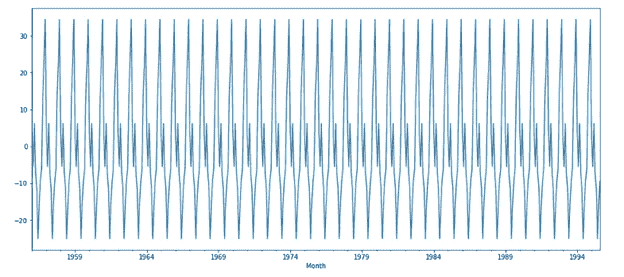

# 时间序列预测——ARIMA vs 预言家

> 原文：<https://medium.com/analytics-vidhya/time-series-forecasting-arima-vs-prophet-5015928e402a?source=collection_archive---------0----------------------->


什么是时间序列？

时间序列是按时间顺序索引(或列出或绘制)的一系列数据点。因此，数据是由相对确定的时间戳组织的，并且与随机样本数据相比，可能包含我们可以提取的附加信息。

时间序列预测在数据分析中有着广泛的应用。这些只是对未来趋势的一些可能有用的预测:

在线服务明年需要的服务器数量。

某一天超市对一种杂货产品的需求。

交易金融资产的明天收盘价。

再比如，我们可以对某个团队的绩效做一个预测，然后以此为基线:先给团队设定目标，然后相对于基线来衡量实际的团队绩效。

在本文中，我们将尝试预测一个基本的时间序列数据。我们将在 Python 中构建两个不同的模型，并检查它们的结果。我们将使用的模型是 ARIMA(自回归综合移动平均)和脸书先知。

# ARIMA(自回归综合移动平均)


ARIMA 是一种用于预测时间序列数据未来趋势的模型。它模拟回归分析形式。

**AR(自回归):**显示变化变量的模型，该变量对其自身的滞后/先前值进行回归。

**I(综合):**原始观测值的差分，以使时间序列变得平稳

**MA(移动平均):**移动平均模型的观测值和残差之间的相关性

对于 ARIMA 模型，标准的符号是带有 p、d 和 q 的 ARIMA，其中用整数值代替参数来表示所使用的 ARIMA 模型的类型。

**p:** 模型中滞后观测值的个数；也称为滞后订单。

**d:** 原始观测值被差分的次数；也称为差异程度。

**问:**移动平均线窗口的大小；也称为移动平均线的顺序。

预测方程的构造如下。首先，让 Y 表示 Y 的 dth 差，这意味着:

如果 d=0: yt = Yt

如果 d=1: yt = Yt — Yt-1

如果 d = 2:Yt =(Yt—Yt-1)—(Yt-1—Yt-2)= Yt—2Yt-1+Yt-2

请注意，Y 的第二个差异(d=2 的情况)不是与 2 个周期之前的差异。相反，它是*一阶差分的一阶差分*，它是二阶导数的离散模拟，即序列的局部加速度而不是其局部趋势。

就 y 而言，一般预测方程为:

**ŷt =μ+ϕ1 yt-1+………+ϕp yt-p—θ1et-1-……-θqet-q，**

其中:

**μ →** 常数

**ϕ1 yt-1 +…+ ϕp yt-p** → AR 条款(y 的滞后值)

**-θ1et-1 -………- θqet-q →** 毫安项(滞后误差)

# 先知

Prophet 是一种基于加法模型预测时间序列数据的过程，在该模型中，非线性趋势与每年、每周和每天的季节性以及假日影响相适应。它最适用于具有强烈季节效应的时间序列和几个季节的历史数据。Prophet 对缺失数据和趋势变化非常稳健，通常能够很好地处理异常值。

由人类行为引起的季节性效应:周、月、年周期，公共假日的低谷和高峰。

新产品和市场事件导致的趋势变化。

离群值。


本质上，Prophet library 利用了由以下组件组成的[加法回归模型](https://en.wikipedia.org/wiki/Additive_model) y(t ):

**y(t)=g(t)+s(t)+h(t)+ϵt，**

其中:

**趋势 g(t):** 建模非周期性变化。

**季节性 s(t):** 代表周期性变化。

**假日组件 h(t):** 提供关于假日和事件的信息。

**数据集**

我们将预测澳大利亚每月的啤酒产量。

首先，我们加载数据集并绘制数据。


**基本数据图**


当我们看这个图时，我们可以说数据有季节性。这就是为什么我们将使用**萨里玛(季节性 ARIMA)** 而不是 ARIMA。

# 季节性 ARIMA(萨里玛)

季节性 ARIMA 是 ARIMA 的扩展，它明确支持带有季节性成分的单变量时间序列数据。它添加了三个新的超参数，以指定序列的季节性成分的自回归(AR)、差分(I)和移动平均(MA)，以及季节性周期的附加参数。

有四个不属于 ARIMA 的季节要素必须进行配置；分别是:
**P:** 季节性自回归序列。
**D:** 季节性差异订单。
**问:**季节性移动平均订单。
**m:** 单个季节周期的时间步数。


**季节分解图**


**季节性地块**



# ARIMA 天气预报

使用 auto_arima()函数，我们得到了最佳的 P，D，Q，P，D，Q 值。将数据分成训练集和测试集后:


我们可以看到 auto_arima()选择的最佳 ARIMA 模型是 SARIMAX(2，1，1)x(4，0，3，12)。

**预测**

```
1994-09-01    134.018548
1994-10-01    157.615416
1994-11-01    181.934389
1994-12-01    183.656573
1995-01-01    144.670429
1995-02-01    136.950141
1995-03-01    151.194319
1995-04-01    133.265705
1995-05-01    138.106430
1995-06-01    120.552373
1995-07-01    128.309618
1995-08-01    138.919283
Freq: MS, Name: ARIMA Predictions, dtype: float64
```

**预测比较**


蓝线代表每月产量数据，橙线代表 ARIMA 预测。

**模型评估**

```
MSE Error: 64.99116627373826RMSE Error: 8.061709885237638Mean: 136.39537815126045
```

# 预言家预测

预测是基于趋势、季节性和 Prophet 模型中使用的其他附加项进行的。


**预测**


**预测对比**


蓝线代表每月产量数据，橙线代表预言家预测。

**车型评测**

```
MSE Error: 131.650946999156RMSE Error: 11.473924655459264Mean: 136.39537815126045
```

# 一场 **RIMA vs Prophet 的比较**


蓝线代表每月产量数据，橙色点划线代表 ARIMA 预测，绿色虚线代表预言家预测。

**评估对比**


**测试数据与预测值的对比**


# 摘要

本文的目的是对 ARIMA、季节性 ARIMA 和 Prophet 等时间序列预测模型有一个基本的了解。从实验中可以看出，SARIMAX 模型预测比 Prophet 模型预测具有更好的准确性。SARIMAX 模型的 RMSE 约为 8%，而 Prophet 模型的 RMSE 为 11.4%。

上述测试只是快速和基本的预测，因此我们可以根据我们的数据和业务知识，通过调整来改进这些模型。

谢谢！

**GitHub 资源库**:[https://GitHub . com/krishvictor 77/Time-Series-Forecasting-ARIMA vs . Prophet](https://github.com/krishvictor77/Time-Series-Forecasting-ARIMA-vs-Prophet)

**参考资料:**[https://www . digital ocean . com/community/tutorials/a-guide-to-time-series-forecasting-with-prophet-in-python-3](https://www.digitalocean.com/community/tutorials/a-guide-to-time-series-forecasting-with-prophet-in-python-3)

[https://www . ka ggle . com/kashnitsky/topic-9-part-1-time-series-analysis-in-python # econometry-approach](https://www.kaggle.com/kashnitsky/topic-9-part-1-time-series-analysis-in-python#Econometric-approach)