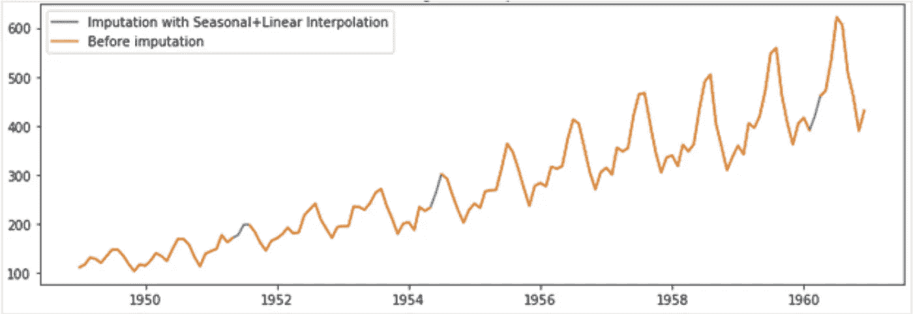

# 时间数列预测法

> 原文：<https://medium.com/analytics-vidhya/time-series-forecasting-c73dec0b7533?source=collection_archive---------7----------------------->

[来源](https://www.lokad.com/public/Upload//Technology/ProbabilisticForecasting/probabilistic-forecasting-graph.png)

> "预测是一门艺术，它先说会发生什么，然后解释为什么没有发生！"

每天我们都会遇到这样的情况，我们预测未来的结果，或者我们希望我们可以早点知道这些。预测并不是什么新东西，而是根据以前的经验来猜测未来的旧概念。在这个博客系列中，我将尝试捕捉一些与时间序列分析和建模相关的基本概念。正如这种预测和过去的行为一样，一切都围绕着时间；它也被称为时间序列分析。

在本系列的第一篇博客中，我将讨论 ts 分析中使用的一些基本概念和技术。让我们首先从用例开始。下面是 TS 的一些最常见的使用案例。

1.  经济前景
2.  销售预测
3.  库存计划
4.  劳动力规划
5.  天气预报
6.  交通/人群预测

有两种主要类型的预测。

a.**定性预测**:当数据不可用或历史模式不重复时使用。这通常是基于专家的观点进行的，并且通常是有偏见的。德尔菲法就是一个例子，专家们坐在一起，根据他们的讨论和反馈达成共识。

b.**定量预测**:这是基于数据和历史数据的重复模式。这种类型的预测可以捕捉看起来不明显的复杂模式。由于这是基于数据，因此是没有偏见的。这种预测的一个例子是时间序列预测。

在这个博客系列中，我们将讨论定量预测。我们先来了解几个与定量预测相关的基本概念。

1.  **时间序列数据**:任何包含时间成分的数据，如每天的温度或每小时的股票价格
2.  **时间序列分析**:这是对 TS 数据进行的分析，以从中获得有意义的见解。
3.  **时间序列预测**:参考过去的数据行为预测未来的过程。

让我们了解一些预测中使用的术语。

**目标**:业务为预测而设定的目标。例如:利润最大化、资源优化等。

**计划**:是企业为实现目标而采取的一系列活动。

**预测**:牢记经营目标，预测未来。

定义明确的目标是预测的关键。有一些与时间序列预测相关的注意事项，时间序列预测围绕您在定义问题陈述时采取的步骤。

1.  **粒度**:你的预测越集中，你就越准确。原因很简单，因为汇总数据的方差更小，因此噪音也更小。例如:如果我们想预测下个月的航空旅客，那么预测下个月的旅客总数将比预测特定路线的旅客更准确。同样，这都是由业务需求派生出来的。
2.  **频率**:您希望多长时间更新一次预测，以保持预测的相关性。久而久之，我们增加了更多的信息(也许是新的信息)来保持预测的相关性。假设我们想要预测电视观看次数，更新预测的频率是 3 个月。由于新冠肺炎病毒，人们被锁在家里 2-3 个月，在这段时间里，看电视的次数显著增加。我们可能会错过这个机会，因为预测更新的频率大于活动持续时间。
3.  **地平线**:对早期时间框架的预测比遥远的未来更准确。假设我们预测未来 6 个月的销售，与未来的后几个月相比，前几个月会更准确。

## 时间序列分析

分析时间序列数据，从中提取有意义的见解。该数据呈现出几个特征:

1.  **水平**:又称基线值。这是我们加到所有其他部分的价值。
2.  **趋势**:从长期来看，TS 表现出某种上升或下降的模式称为趋势。可能会有局部波动，但整体意义上是在某个方向上。
3.  **季节性**:它是数据在一段时间内重复出现的模式。比如说，在圣诞节期间，手机的销量每年都在增长。
4.  **周期性**:这也是一个重复的模式，但不是周期性的。
5.  **噪声**:它是数据中存在的完全随机的波动，我们不能用这个成分来预测未来。

[来源](https://www.google.com/url?sa=i&url=https%3A%2F%2Fwww.slideshare.net%2FRIZWANKHURRAM%2Fheizer-04-15124594&psig=AOvVaw04WqivaPReUlvhkBvMgKJe&ust=1607595018882000&source=images&cd=vfe&ved=0CAIQjRxqFwoTCKj8y6TUwO0CFQAAAAAdAAAAABBn)

## **处理时间序列数据中的缺失值:**

与任何其他数据一样，TS 数据也有一个缺失值。以下是用于 TS 缺失数据插补的一些技术。

1.  **平均值插补:**用数据的平均值填充缺失值。但问题是缺失值插补没有考虑数据的时间性质。

2.**最后一个值向前**:用最后一个已知的观察值填充缺失的值。

3.**线性插值**:在两个缺失的信息之间进行回归。(将最后一次已知观察连接到当前观察)

4.**季节性和线性插值**:做插补时考虑趋势和季节性。

## **异常检测和处理**:

时间序列数据也可能存在异常值。这些观察需要检测和处理。异常值检测的常用方法有

1.  极值检测和消除
2.  使用箱线图或直方图来识别异常值。

有许多消除异常值的策略。下面列出了一些:

1.  用平均值/中值/众数估算异常值
2.  上限和下限
3.  零封顶:有些观察值永远不会是负数，例如售出的商品

到目前为止，在本文中，我们已经了解了什么是时序数据，以及我们如何对时序数据执行基本的 EDA。在本系列接下来的几篇博客中，我们将关注以下主题:

*   主题 2:时间序列分解和误差测量
*   专题 3:基本预测方法
*   主题 4:自回归模型

如果你想阅读与人工智能或人工智能项目管理相关的其他主题，以下是其他文章:

1.  [用于深度学习的 GPU](/analytics-vidhya/gpu-for-deep-learning-7f4ef099b702)
2.  [大规模数据科学](/@apundhir/data-science-at-scale-ac9ec2904f06)
3.  [数据科学项目 KPI](/analytics-vidhya/data-science-project-kpis-b63252e3bc37)
4.  [数据科学中的敏捷框架](/@apundhir/agile-framework-in-data-science-1dcd831f4593)