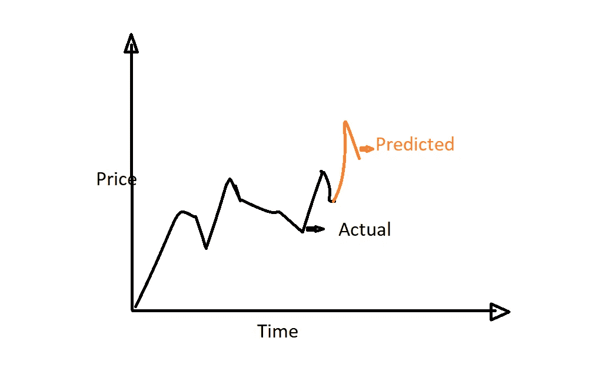
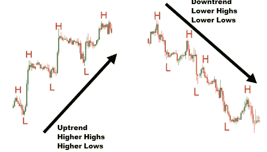
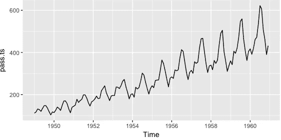
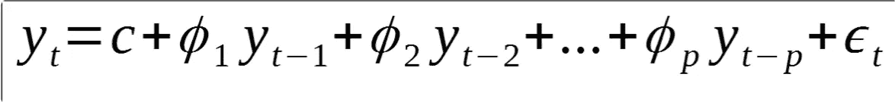

# 时间数列预测法

> 原文：<https://medium.com/analytics-vidhya/time-series-forecasting-d611fa8ae6ca?source=collection_archive---------4----------------------->

时序数据

在这篇文章中，我们将看到

> **什么是时间序列数据？**
> 
> **什么是时间序列预测？**
> 
> **时间序列预测有哪些应用？**
> 
> **如何利用不同的统计预测技术做时间序列预测？**

注意:我将更多地从机器学习的角度而不是统计的角度来讨论这个话题。

# **什么是时间序列数据？**

“时序数据”是一系列数据点，在一段时间内测量同一事物，按时间顺序存储。记录数据的时间间隔取决于手头的任务。

比如:1。股票市场的运动以每毫秒的时间间隔被记录。需要以零延迟的方式收集和处理来自自动驾驶汽车传感器的数据。3.心跳数据可以每秒记录一次。所以我想说的是，时间序列数据依赖于时间，但是数据被捕获的时间间隔随着不同的用例而变化。

通常，时间序列在两个相继的测量值之间具有相等的间距。在时间间隔内，每个时间单位主要有一个数据点。如果数据是在不同的时间间隔范围内记录的，那么该数据可能没有用，或者我们应该使该数据间隔相等，以便预测未来的结果

## 时间序列数据的类型:

1.  **单变量时间序列数据**
2.  **多元时间序列数据**

**单变量时间序列数据**

术语“**单变量时间序列**指的是由在相等的**时间内连续记录的单个(标量)观测值组成的**时间序列**。**

示例:温度是随时间记录的单一变量。

**多元时间序列数据**

在任何给定的时间步记录多个变量。

例如:股票市场数据中的开盘价、最高价、最低价和收盘价。

# **什么是时间序列数据预测？**

时间序列数据预测可以定义为通过在连续的时间间隔查看其先前记录的值来预测即将到来的未来值。

使用时间序列分析预测数据包括使用一些重要的模型，根据已知的过去结果预测未来的结论。

假设我们想要预测时间(t)处的 Y，根据时间序列的定义，预测取决于时间(t-1)处的 Y，时间(t-2)处的 Y 等，因此简单的模型方程变为

**Y**(t)=**Y**(t-1)+**Y**(t-2)/(2)

在上面的等式中，Y 依赖于它自己的前两个值的平均值，所以它可以被称为**单变量时间序列预测。**所以这里我们只取了之前的 2 个值来预测未来的值，所以我们这里的**窗口大小**就是 **2** 。窗口大小可以被认为是一个超参数，这意味着我们需要为模型提供不同的值集，哪个值提供最佳预测，该值将被选为我们的窗口大小。

在阅读本文之前，我们需要了解一些术语。他们是

1.  **趋势**
2.  **季节性**
3.  **周期性模式**

每个时间序列数据在以图形方式绘制时都会表现出某种模式。模式可能有不同的类型，作为从业者，需要理解模式，以便从数据中获得有意义的见解。

**趋势**

趋势是在一段长时间内相对较高的高点或较低的低点的运动。跟随较高低点的较高高点被定义为上升趋势，而跟随较低高点的较低低点被定义为下降趋势。如果运动没有真正产生更高的高点或更低的低点，我们称之为水平趋势。例如，如果我们有一个上升趋势，从统计上看，这个趋势更有可能持续下去。

**季节性**

在一年内以固定时间间隔显示重复模式的时间序列称为季节性模式或季节性。季节性模式可以在多种时间序列中发现。一个例子是，你的取暖费在夏天减少，在冬天增加。公司需要了解季节性，以正确管理他们的库存、员工和许多其他重要的事情。

在上面的图表中，每年都观察到相同的模式。

**周期性模式**

数据中包含非固定周期的上升和下降的模式称为循环模式。因此，不在同一日历年出现的模式，可能是一种循环模式。这些模式持续数年，每年都没有重复的模式。

# 时间序列预测有哪些应用？

时间序列分析有很多应用。这些是时间序列预测的非常少的重要用例。

1.  财务分析
2.  天气分析
3.  零售
4.  语音生成
5.  机器翻译

只要你说得出名字，就会有某种或其他形式的时间序列预测或预报会有它的用例。

> 如何利用不同的统计预测技术做时间序列预测？

有几种统计和机器学习技术可用于预测时间序列数据，但正如我所说，我将在这篇博客中坚持使用基本的统计模型。

# 一个自动回归(AR)模型

在应用任何统计模型之前，我们需要我们的数据是**稳定的。**

**静止数据**

一个**平稳时间序列**的特性不依赖于**序列**被观测的时间。因此，具有趋势或季节性的时间序列**不是静态的** —趋势和季节性将在不同的时间影响时间序列的值。

只有在特定属性(均值、方差、协方差)在任何选定的时间范围内都相同时，模型才能正常工作。如果数据集中有趋势，您必须在继续之前移除趋势(通过求差或减去趋势)。

**静态数据属性**

*   具有恒定的平均值
*   具有恒定的方差
*   协方差平稳

## 自相关

自回归模型假设前一时间步的观测值有助于预测下一时间步的值。变量之间的这种关系叫做相关性。

如果两个变量的变化方向相同，则称为正相关，如果两个变量的变化方向相反，则称为负相关。我们可以使用统计测量来计算输出变量与各种不同滞后的先前时间步长值之间的相关性。输出变量与一个特定的**滞后**变量之间的相关性越强，自回归模型在建模时就可以赋予该变量越大的权重。

**滞后**:这是被考虑的时间间隙值，称为**滞后**。滞后 1 自相关是相隔一个时间段的值之间的相关性。更一般地说，**滞后 *k*** 自相关是相隔 *k* 个时间段的值之间的相关性。

## ACF:

ACF 是一个(完全)自相关函数，它给出任何序列与其滞后值的自相关值。我们将这些值与置信带和 tada 一起绘制出来！我们有一个 ACF 图。简而言之，它描述了序列的当前值与其过去值的关联程度。时间序列可以包含趋势、季节性、周期性和残差等成分。ACF 在寻找相关性时考虑了所有这些成分，因此这是一个“完整的自相关图”。

## PACF:

**PACF** 是一个部分自相关函数。基本上，不是像 ACF 那样寻找当前与滞后的相关性，而是寻找残差(其在移除已经由早期滞后解释的效应之后剩余)与下一个滞后值的相关性，因此是“部分的”而不是“完整的”，因为我们在找到下一个相关性之前移除了已经找到的变化。因此，如果残差中有任何隐藏信息，可以通过下一个滞后进行建模，我们可能会获得良好的相关性，并且我们会在建模时将下一个滞后作为一个特征。请记住，在建模时，我们不希望保留太多相关的要素，因为这会产生多重共线性问题。因此，我们只需要保留相关的特性。

# 一辆反对派回归者

一个**自回归模型**使用目标过去值的线性组合进行预测。当然，回归是针对目标本身进行的。

数学上，AR(p)模型表示为:

这里，Yt 是未来产量，Yt-1，Yt-2…Yt-p 是它之前的 p 值

*   p:这是命令吗
*   c:是常数
*   ε:白噪声

白噪声:它在时间序列数据中起着至关重要的作用。如果一个时间序列是白噪声，那么它就是一个随机数序列，无法预测。如果一系列预测误差不是白噪声，则表明可以对预测模型进行改进。

# **移动平均线(MA):**

*在时间序列中，*我们有时会观察到过去的误差和现在的值之间的相似性。这是因为某些不可预测的事件发生了，它们需要被解释。

换句话说，通过了解我们昨天的估计与实际值相比有多远，我们可以调整我们的模型，使它做出相应的响应。

让我们假设“r”是某个时间序列变量，比如回报率。然后，一个简单的移动平均线(MA)模型如下所示:

***rt = c+θ1 ϵt-1+ϵt*t15】**

rt 是什么？

首先，rt 代表当前期间“r”的值— t。就收益而言，它是我们估计的今天的收益 b

什么是 c？

我们在模型右侧看到的第一个东西是“c”，它代表一个常数因子。当然，这只是一般的表示，当我们实际建模数据时，我们会用一个数值来代替它。

θ1 是什么？

接下来，θ1 是与第一个滞后相关的数值系数。我们不喜欢在自回归模型中使用ϕ1，以避免混淆。

什么是ϵt 和ϵt-1？

然后是ϵt 和ϵt-1，它们分别代表当前和前一时期的残差。

对于不熟悉这个术语的人来说，残差和误差项是一样的，它表示变量的观测值和我们的估计值之间的差异。在这个具体的例子中:ϵt-1 = rt-1 — r̂t-1，其中 r̂t-1 代表我们对前期的估计。

那么，我们如何生成这些残差呢？

很简单。我们从数据集 r1 的开头开始，尝试预测每个值(r̂2、r̂3 等)。根据我们每次的距离，我们得到残差ϵt = rt-r̂t.。因此，我们在遍历集合时生成这些残差，并随着时间的推移(从周期 1，一直到当前周期)创建ϵ变量。

# **自动回归移动平均线(ARMA):**

ARMA 模型是 AR(p)和 MA(q)模型的简单合并:

*   AR(p)模型试图解释在交易市场中经常观察到的动量效应和均值回归效应(市场参与者效应)。
*   MA(q)模型试图捕捉白噪声条件下观察到的冲击效应。这些冲击效应可以被认为是影响观察过程的意外事件，例如意外收入、战争、攻击等。

ARMA 模型试图在对金融时间序列建模时捕捉这两个方面。ARMA 模型没有考虑波动聚类，这是许多金融时间序列的关键经验现象，我们将在后面讨论。

ARMA(1，1)模型为:

*x(t)= a * x(t-1)+b * e(t-1)+e(t*

E[e(t)] = 0 时 e(t)是白噪声吗

# 结论

时间序列分析基本上是以固定的时间间隔记录数据，这可以导致做出成功的决策，对贸易至关重要，因此具有多种应用，如**股票市场和趋势分析、金融预测、库存分析、普查分析、产量预测、销售预测**等。还有更复杂的深度学习技术，如 LSTM，如果我们有大量数据，它可以表现得更好。但是在数据有限的情况下，简单的 AR 和 MA 模型会优于 LSTM 模型。