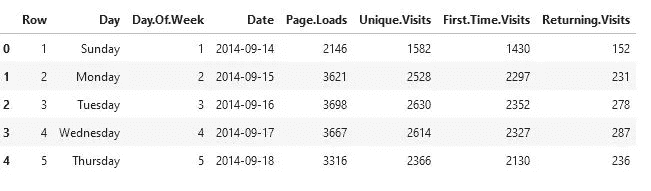
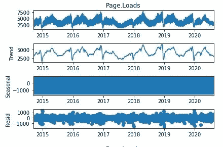
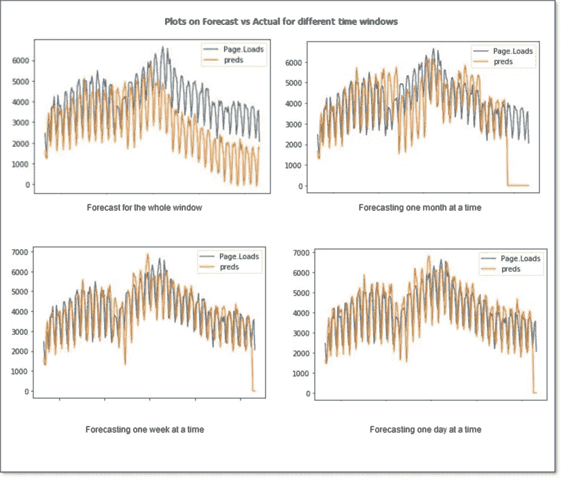
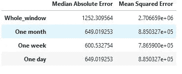

# 用简单的方法进行时间序列预测

> 原文：<https://medium.com/analytics-vidhya/time-series-forecasting-in-a-simple-way-29b363e5be06?source=collection_archive---------15----------------------->


你听过预言这个词吗？如果不是，让我用简单的方式告诉你。如果有人告诉你，你是那个将要拯救世界免于大毁灭的人，而事情就这样发生了，那么那个人就是先知，他说了一个关于你的预言。让我们来看一些真实的案例，在这些案例中，我们试图预测许多部门的大部分需求。其中之一就是网络流量，尽管预测流量的需求是一件棘手的事情。让我们看看这些数据，并尝试预测它的一个需求

我从 kaggle 找到了这个数据集，这里是相同的链接: [kaggle 数据链接](https://www.kaggle.com/bobnau/daily-website-visitors)

**数据集**

*   让我们看看现在的数据，它有 2014 年 9 月到 2020 年 7 月的数据。让我们把页面负载作为目标变量，其他的作为独立变量



资料组

*   让我们来分解这一页。Loads”变量，并查看它们的外观以及它们的季节性模式。通过观察趋势和观察成分，我们可以看到时间序列具有年度季节性。



时间序列

**建模数据**

我将使用常用的自动回归模型之一 ***霍尔特温特斯指数平滑*** 来尝试三种数据建模方法。对于初学者来说，这是一个很好的算法，它指出时间步长 **t** 的值是作为时间步长 **t** 之前的观察值的指数线性函数给出的。但是还有一种方法可以改进你的模型，那就是改变你预测的窗口，增加潜在的回归变量。

现在让我们拟合 2015 年到 2019 年的模型，并对 2020 年进行预测。让我们修复默认的参数，并将这些参数从 statsmodels 库中添加到我们的指数平滑 API 中。我在这里尝试了滚动训练和预测，即假设我们的训练周期是到时间步 ***(t)*** ，我们想预测从 ***(t+1)*** 到 ***(t+28)*** 我们能做的是一次性预测到***【t+28】***或者通过循环训练提前一周预测到 **【T31 我们也可以对一天和一个月的时间窗口重复相同的过程。因此，让我们实现并检查模型在每个场景中的表现**

```
seasonal_periods = 365 # yearly seasonality
seasonal = 'add'
trend = 'add'
```

我已经定义了滚动预测函数如下，你可以编辑它，如你所愿(即改变变量和参数等)，

*   一次性预测整个测试窗口

*   预测一个月，我将 30 作为预测一个月的滚动窗口

```
df_om_es = rolling_forecast_es(df, df_test, 30)
```

*   预测一周，窗口取 7

```
df_ow_es = rolling_forecast_es(df, df_test, 7)
```

*   一天的预测，窗口=1

```
df_od_es = rolling_forecast_es(df, df_test, 1)
```

**分析结果**

让我们看一下每种方法得到的图表和度量。

*   观察这些图，我们可以推断出，一周前的预测似乎比其他预测表现得更好。最糟糕的无疑是对整个窗口进行预测，因为预测值完全错过了实际值的趋势。这对于所有的自回归模型来说都是显而易见的，因为它们对最近的过去比对遥远的过去给予更多的权重。



*   让我们看看错误度量，我们将能够很好地了解发生了什么



误差度量

从图中可以明显看出， ***【中值绝对误差】*** 在提前一周预测的情况下较低，而在整个窗口中非常高，因为模型在预测的后期丢失了趋势。奇怪的是，前一天的预测可能会表现得更好，但在这种情况下可能是由于时间范围的粒度，我相信如果是每小时的水平，它会表现得更好。

感谢您花时间通读它，您也尝试通过调整参数和添加更多的定制，您可以从 Github 链接找到代码:[使用指数平滑的时间序列](https://github.com/Vishnunkumar/traditional-ml/tree/main/time_series/blog)