# Python 中的时间序列预测第 1 部分:数据处理和特征工程

> 原文：<https://medium.com/analytics-vidhya/time-series-forecasting-in-python-part-1-data-processing-feature-engineering-c347cb3d5e9d?source=collection_archive---------18----------------------->

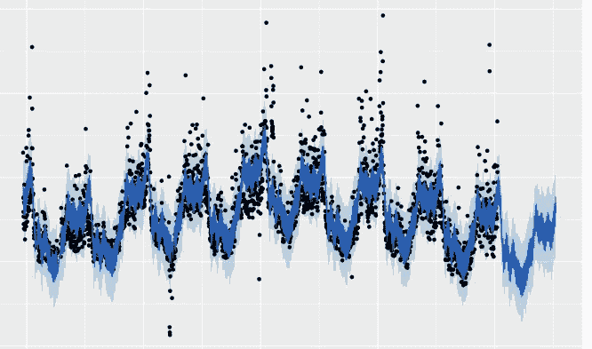

**时间序列预测**是一种预测销售、股票市场、收入等未来变动的方法。基本上，时间序列是一种统计模型，它试图在历史模式的基础上确定未来的粗略数据。时间序列数据必须将日期作为特征之一。预测可以每年、每月、每季度、每周、每天进行。开发一些强大的软件包，如 **fbprophet** 可以进行每小时、分钟甚至每秒的预测。

*   时间序列是一组连续的数据点，通常在连续的时间内测量。
*   它在数学上被定义为一组向量 x(t)，t = 0，1，2，…其中 t 代表经过的时间。
*   变量 x(t)被视为随机变量。
*   在时间序列中的一个事件期间进行的测量按适当的时间顺序排列。
*   包含单个变量记录的时间序列称为单变量时间序列，包含多个变量的时间序列称为多变量时间序列。

如下所述，业务用例可以位于以下领域之一:

*   **销售预测** —零售产品销售预测
*   **需求预测** —用于定价、库存和劳动力管理
*   **交通预测** —交通和路线优化、道路设施设计、客户访问网站
*   **收入预测** —预算、目标设定

在进入任何建模部分之前，我们将进行数据处理并检查时间序列的属性。

# 时间序列数据分析

时间序列的数据分析有点不同，因为我们需要处理不同的时间格式。只需确保没有特定日期或时间的值丢失。否则模型无法建立。类似地，一个时间序列应该是平稳的，以获得更可靠的预测，如果不是，那么需要转换成一个。

下面讨论了对时间序列数据进行探索性数据分析的几种方法以及相应的 Python 代码。用于参考的数据集是一个经典的**航空公司乘客数据集**，可在线获取。

```
#Import the Analysis Libraries
**import** **numpy** **as** **np**
**import** **matplotlib.pyplot** **as** **plt**
**import** **pandas** **as** **pd**
**import** **statsmodels.api** **as** **sm**
**from** **statsmodels.tsa.stattools** **import** adfuller
**import** **matplotlib**
**import** **seaborn** **as** **sns**
**from** **random** **import** random#Data Reading
df = pd.read_csv('international-airline-passengers.csv',header=**None**)
df.columns = ['year','passengers']
df.head(3)
```

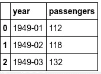

数据包含两列

```
#Converting the column into datetime format
df['year'] = pd.to_datetime(df['year'], format='%Y-%m')#Set index as years
y = df.set_index('year')
y.isnull().sum()#Plot the series
y.plot(figsize=(15, 6))
plt.show()
```

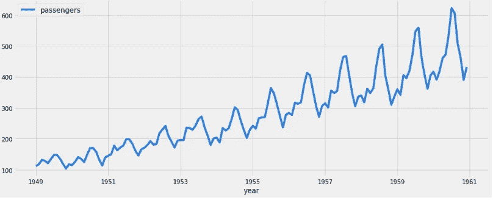

时间序列图

*   **序列分布检查:**时间序列应遵循高斯(正态)分布。如果分布不是正态或偏斜的，那么在建模之前进行转换可能是有用的。

```
**from** **pandas** **import** Series
**from** **matplotlib** **import** pyplot
pyplot.figure(1)
pyplot.subplot(211)
y.passengers.hist()
pyplot.subplot(212)
y.passengers.plot(kind='kde')
pyplot.show()
```

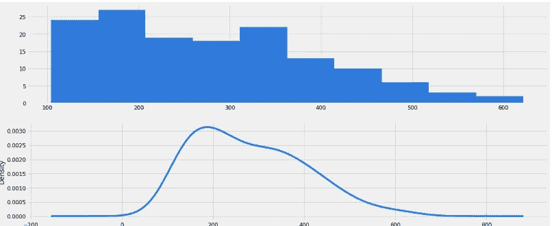

数据略有偏差

*   **平稳性检验:**如果一个时间序列的均值、方差等统计特性随时间保持不变，则称该时间序列是平稳的。大多数时间序列模型都假设 TS 是稳定的。这主要是因为一个序列有许多种非平稳的方式，但只有一种平稳的方式。凭直觉，我们可以说，如果一个时间序列在一段时间内有一个特定的行为，那么它很有可能在未来也会遵循同样的行为。与非平稳序列相比，平稳序列的相关理论更加成熟，也更容易实现。我们可以使用各种技术来检查序列的平稳性，如下所示:

1.  **ACF 和 PACF 图**:如果时间序列是平稳的，ACF/PACF 图会在点与点之间有少量的滞后后显示相关性的**快速下降。**

```
**from** **statsmodels.graphics.tsaplots** **import** plot_acf
**from** **statsmodels.graphics.tsaplots** **import** plot_pacf

pyplot.figure()
pyplot.subplot(211)
plot_acf(y.passengers, ax=pyplot.gca(), lags = 30)
pyplot.subplot(212)
plot_pacf(y.passengers, ax=pyplot.gca(), lags = 30)
pyplot.show()
```

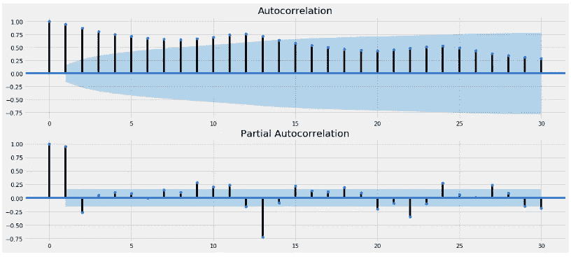

ACF 和 PACF 图

这个数据是不稳定的，因为大量以前的观察值与将来的值相关。置信区间被绘制成一个圆锥。默认情况下，这被设置为 95%的置信区间，表明该圆锥之外的相关值很可能是相关的，而不是统计上的侥幸。滞后 k 处的部分自相关是在去除了由较短滞后处的项引起的任何相关的影响之后得到的相关。

**2。绘制滚动统计**:我们可以绘制移动平均线或移动方差，看它是否随时间变化。移动平均值/方差是指任何时刻“t”的平均值/方差，即过去 12 个月的平均值/方差。

```
*#Determing rolling statistics*
rolmean = pd.rolling_mean(y, window=12)
rolstd = pd.rolling_std(y, window=12)

*#Plot rolling statistics:*
orig = plt.plot(y, color='blue',label='Original')
mean = plt.plot(rolmean, color='red', label='Rolling Mean')
std = plt.plot(rolstd, color='black', label = 'Rolling Std')
plt.legend(loc='best')
plt.title('Rolling Mean & Standard Deviation')
plt.show(block=**False**)
```

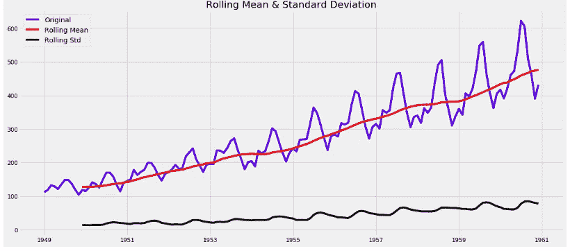

滚动平均值和标准偏差

这里，滚动平均值和标准偏差相对于时间不是常数(增加趋势)。因此，时间序列不是静止的。

**3。增强的 Dickey-Fuller 检验:**这是检验平稳性的统计检验之一。这里的零假设是 TS 是非平稳的。测试结果由测试统计数据和不同置信水平的一些临界值组成。如果“检验统计量”小于“临界值”，我们可以拒绝零假设，说序列是平稳的。

```
**from** **statsmodels.tsa.stattools** **import** adfuller
print ('Results of Dickey-Fuller Test:')
dftest = adfuller(y.passengers, autolag='AIC')
dfoutput = pd.Series(dftest[0:4], index=['Test Statistic','p-value','#Lags Used','Number of Observations Used'])
**for** key,value **in** dftest[4].items():
    dfoutput['Critical Value (**%s**)'%key] = value
print (dfoutput)
```

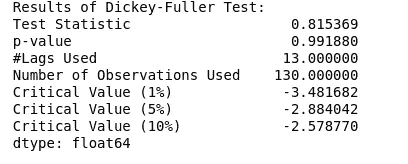

迪基富勒试验

该测试表明，如果对序列进行积分，那么序列 y(t-1)的滞后水平将不会提供预测 y(t)变化的相关信息。零假设:时间序列不是平稳的。拒绝零假设(即非常低的 p 值)将表示稳定。

# **非平稳序列向平稳序列的转换**

在建立任何一种预测模型之前，将非平稳序列转换成平稳序列是非常重要的。时间序列的非平稳性背后有几个主要原因:

1.  **趋势** —随时间变化的平均值。例如，在上面的问题中，我们看到，平均而言，乘客的数量随着时间的推移而增长。
2.  **季节性** —特定时间段的变化。因为夏天或节日，人们可能会在某个特定的月份购买冰淇淋。

下述方法可用于将非平稳序列转换为平稳序列。

*   **对数变换:**对数变换对较高值的惩罚比对较小值的惩罚更大。这些可能需要一段时间。

```
ts_log = np.log(y)
plt.plot(ts_log)
```

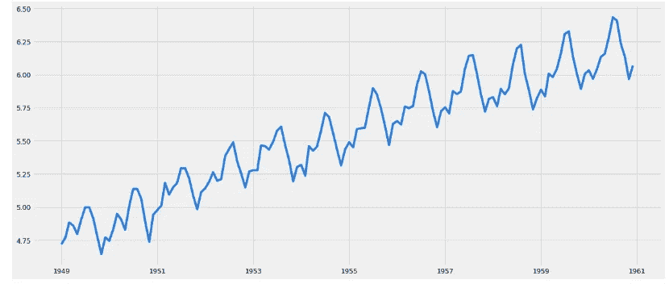

转换系列

*   **趋势去除或平滑:**平滑是在时间窗口内取滚动平均值。我们根据时间序列的频率取“k”个连续值的平均值。这里我们可以取过去 1 年的平均值，即最后 12 个值。这种特定方法的缺点是必须严格定义时间段。

```
moving_avg = pd.rolling_mean(ts_log,12)
plt.plot(ts_log)
plt.plot(moving_avg, color='red')ts_log_moving_avg_diff = ts_log.passengers - moving_avg.passengers
ts_log_moving_avg_diff.head(12)
ts_log_moving_avg_diff.dropna(inplace=**True**)#Using Dickeys Fuller Test
CheckForStationarity(ts_log_moving_avg_diff)
```

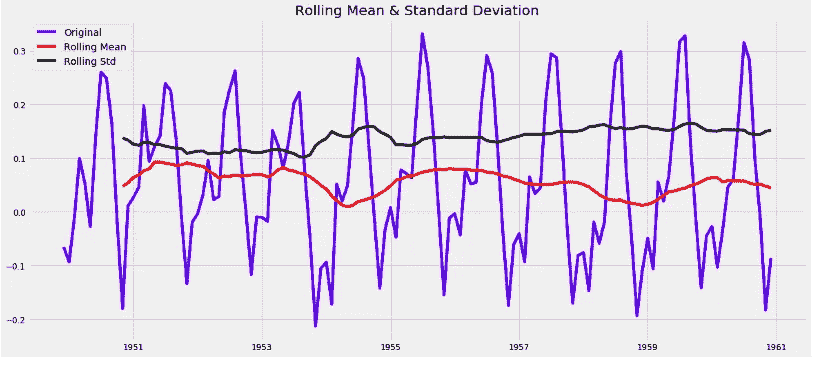

缓和

*   **差异:**之前讨论的简单趋势缩减技术并不适用于所有情况，尤其是季节性较强的情况。在这种技术中，我们取某一特定时刻的观测值与前一时刻的观测值之差。

```
ts_log_diff = ts_log.passengers - ts_log.passengers.shift()
plt.plot(ts_log_diff)
```

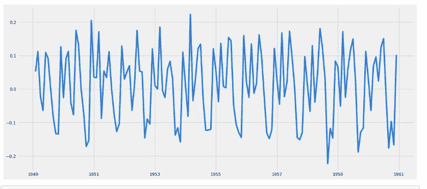

对数列求差使其平稳

做一个迪基的更全面的平稳性测试，结果将是上述系列

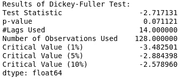

迪基富勒试验

现在，一旦时间序列是稳定的，它就可以作为预测模型的消耗，这将在时间序列预测的下一篇文章中讨论。

如果想了解更多关于模型构建和特征工程的知识，请参考下面提到的文章。

 [## 机器学习模型开发生命周期

### 机器学习开发生命周期是数据科学行业用来设计、开发和测试…

medium.com](/analytics-vidhya/machine-learning-model-development-life-cycle-dcb238a3bd2d) [](/analytics-vidhya/feature-selection-feature-engineering-3bb09c67d8c5) [## 特征选择和特征工程

### 数据科学视角中的特征，也称为维度、自变量、列。选择和处理…

medium.com](/analytics-vidhya/feature-selection-feature-engineering-3bb09c67d8c5) 

你可以通过 Linkedin 联系我:

 [## Utkarsh Kulshrestha -人工智能工程师-银行&金融服务|…

### 在人工智能解决方案、机器/深度学习方面拥有丰富的专业知识——RNN、LSTM、GRU、CNN、DNN、Keras、Tensorflow、文本挖掘……

www.linkedin.com](https://www.linkedin.com/in/utkarsh-kulshrestha-69692666/)