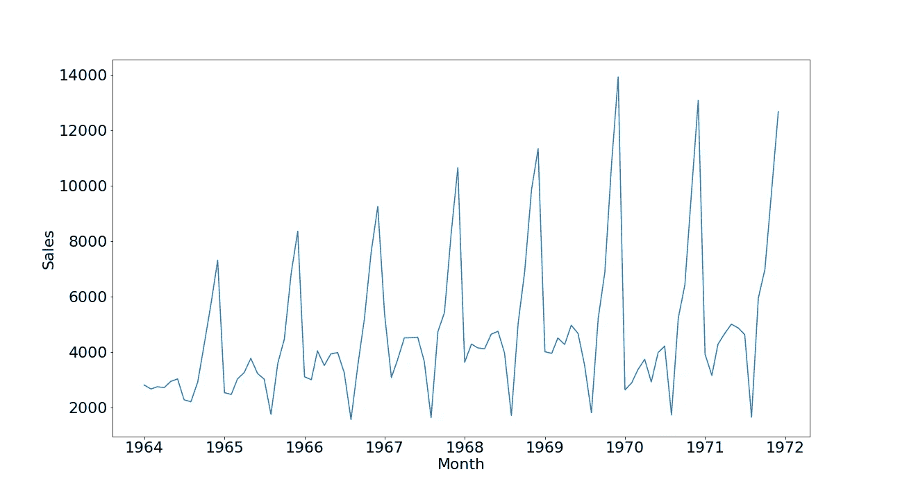
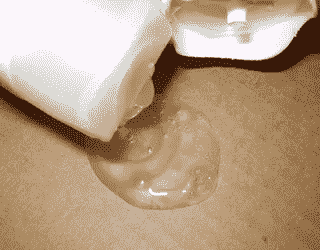
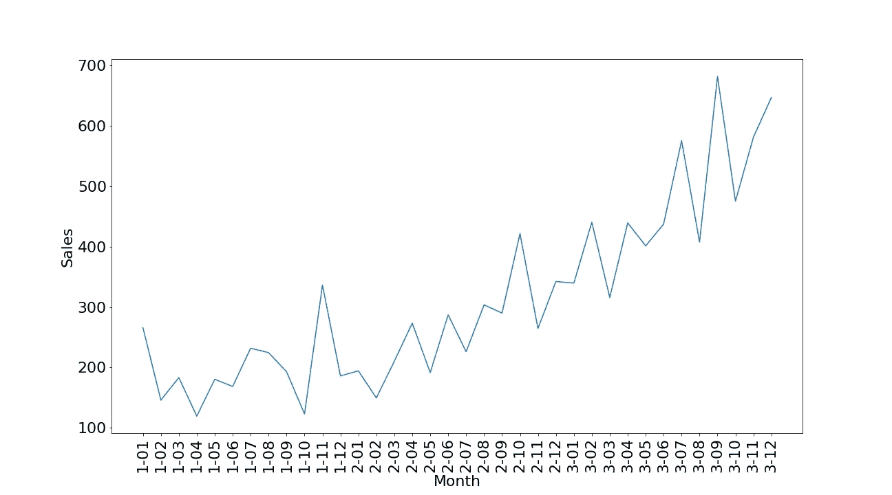
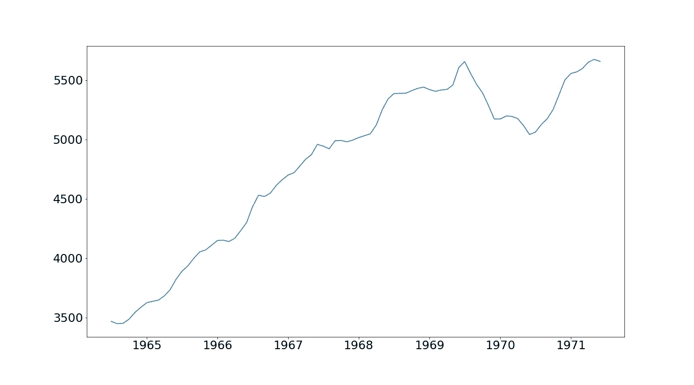

# 时间序列预测:导论

> 原文：<https://medium.com/analytics-vidhya/time-series-forecasting-introduction-7193925354f1?source=collection_archive---------15----------------------->

在这篇博客中，我将给出时间序列数据的概述以及一些与之相关的术语。

首先什么是时间序列数据，根据维基百科:“ *A* ***时间序列*** *是按时间顺序索引(或列出或绘制)的一系列数据点。”*

简而言之，任何随时间顺序记录的数据都是时间序列数据。一些例子是公司的年收入、产品的月需求量、城市的日最高温度、每小时光顾餐馆的顾客数量以及特定网站每分钟或每秒钟的点击数。从上面的例子中，应该清楚的是，时间序列数据可以在任何时期被记录，即每年、每月、每天、每小时、每分钟/每秒或任何其他时间单位。

时间序列数据可用于预测未来值，从而有助于更好地进行规划。例如，如果网站所有者知道他的网站未来的访问者数量，他就可以在管理网站流量方面做出更好的决定，或者如果商店知道一种产品的未来销售数量，他们就可以更好地保持该产品的库存。

让我们试着理解一些与时间序列相关的术语，如季节性、趋势、周期模式和平稳性。

**季节性:**季节性是时间序列数据在固定时间间隔内出现的变化。当一个系列受季节因素影响时，它就存在。时间间隔通常少于一年，如每周、每月、每季度、每半年、每年等。

香槟

让我们用香槟销售数据集的时间序列图来理解这一点。(Makridakis 和 Wheelwright，1989)。该数据集提供了 Perrin Freres 品牌从 1964 年 1 月到 1972 年 9 月的每月香槟销售额。

每月香槟销售的季节性

从上面的图中，我们可以观察到每年年底都有一个销售高峰(这可以归因于圣诞节的庆祝活动)。这是季节性的一个很好的例子，因为这种模式每年都在重复。

检测季节性及其类型非常重要，因为我们需要在决定预测模型时将其考虑在内。例如，使用带有或不带有季节性的 ETS，或者对给定数据使用 ARIMA vs 萨里玛(季节性 ARIMA)。

有多种图形工具来检测季节性，如运行序列图、季节性图、季节性子序列图、多盒图和自相关图( [ACF](https://en.wikipedia.org/wiki/Autocorrelation) )。一些数学测试如 ch、hegy 和 ocsb 也用于检测季节稳定性。我们将不在这里详细讨论它们。

**趋势:**在时间序列分析中，趋势是在一段长时间内逐渐向相对较低或较高的值转变。

如果价值在相当长的一段时间内趋向于向更高的价值增长，这叫做上升趋势，而如果价值在相当长的一段时间内趋向于向更低的价值下降，这叫做下降趋势。如果数值没有向更低或更高的值移动，这被称为水平趋势。

不，是洗发水😉

让我们用洗发水销售数据直观地理解这一点(Makridakis，Wheelwright 和 Hyndman (1998))。我们可以观察到(在下图中),从长远来看，洗发水的销量正在向高价值增长。这是一个上升趋势的例子。

洗发水月销售额的上升趋势

与季节性相似，检测趋势非常重要，因为我们在选择正确的预测模型时需要考虑它。
我们可以通过观察数据分解图中的趋势分量来检测数据的趋势。我们将在另一篇博客中学习更多关于时间序列分解的知识。

香槟数据的趋势成分

**周期模式:**周期模式被描述为长度超过一年的变化。它不应该与季节性混淆。一般来说，周期的平均跨度比季节模式的跨度长，而且周期的幅度与季节模式相比变化更大。