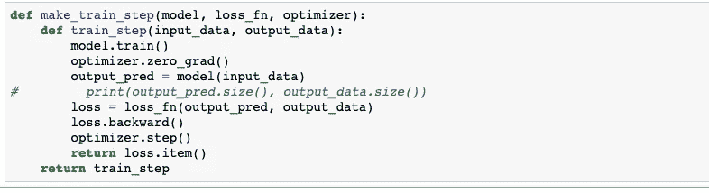

# 时间序列预测— LSTM

> 原文：<https://medium.com/analytics-vidhya/time-series-forecasting-lstm-f45fbc7796e1?source=collection_archive---------10----------------------->

在这篇博客中，我们将了解 RNN 网络的概念，不同类型的网络及其实际应用。我们也看到了 RNN 和人工神经网络之间的性能比较。

**RNN 网络:【RNNs 背后的思想是利用序列信息。在传统的神经网络中，我们假设所有的输入(和输出)都是相互独立的。但是对于许多任务来说，这是一个非常糟糕的主意。如果你想预测一个句子中的下一个单词，你最好知道它前面有哪些单词。rnn 被称为*递归*，因为它们对序列的每个元素执行相同的任务，输出取决于之前的计算，你已经知道它们有一个“记忆”，可以捕捉到目前为止已经计算过的信息。**

RNN 建筑

**应用**

*   [机器翻译](https://en.wikipedia.org/wiki/Machine_Translation)
*   [时间序列预测](https://en.wikipedia.org/wiki/Time_series_prediction)
*   [语音识别](https://en.wikipedia.org/wiki/Speech_recognition)
*   [手写识别](https://en.wikipedia.org/wiki/Handwriting_recognition)
*   预测蛋白质的亚细胞定位

**不同类型的无线网络**

1.  一对一:这个网络通常有一个输入和一个输出节点。它可以有“n”个隐藏节点。该网络用于预测公司/股票的股价。
2.  一对多:这个网络通常有一个输入和多个输出节点。它可以有“n”个隐藏节点。该网络用于图像字幕。
3.  多对一:这个网络通常有多个输入和一个输出节点。它可以有“n”个隐藏节点。这个网络用于情感分析。
4.  多对多:这个网络通常有多个输入和多个输出节点。它可以有“n”个隐藏节点。这个网络用于语言翻译。

**递归神经网络的缺点**

1.  消失渐变和爆炸渐变。
2.  迁移学习是不可能的。
3.  训练 RNN 是一项非常艰巨的任务。

我们来快速看一下什么是消失和爆炸渐变，以及如何解决这个问题。当我们从最后一层回到第一层时，权重更新得太慢。这就是所谓的消失梯度。我们可以通过使用 LSTM、GRU 网络和引入分层辍学来避免这种情况。爆炸梯度是一个权重更新过快的问题，它会导致发散问题。

**LSTM——长短期记忆:** LSTM 人有一种长时间记忆信息的天性，这是他们的默认行为。这个网络有三个用于记忆长序列的门。

遗忘门、输入门和输出门

遗忘门用于决定哪些信息必须记住或忘记。在处理长句时，重要的是要记住旧的状态，直到新的状态出现。例如，在处理句子时，当讨论新的个人信息时，必须忘记老人的性别。输入门用于决定什么信息必须被添加到网络中。输出门用于组合两个门的结果，并将响应转发到下一层。

GRU 有两个门，更新门和复位门。它不太复杂，需要较少的操作，因此比 LSTM 快得多。一般来说，两层已被证明足以检测更复杂的特征。层数越多越好，但也越难训练。作为一般的经验法则，一个隐藏层处理简单的问题，两个隐藏层足以找到相当复杂的特性。

到目前为止，我们讨论了 RNN 建筑和 LSTM。现在让我们进入我最喜欢的，也是最令人兴奋的使用 LSTM 解决实际问题的过程。

**问题:**使用 LSTM 预测股票的开盘价、收盘价、最高价和最低价。这是一个多对多的问题，这里我将解释实现的每一步。这是用 Pytorch 实现的，我们用了 50 年的数据进行预测。

**导入必要的包**

*警告.过滤警告('忽略')*

**利用 CUDA 加快处理速度**

*device = torch . device(' cuda:0 ')if torch . cuda . is _ available()else torch . device(' CPU ')*

这一行将有助于在 GPU 中以更高的速度运行进程。如果我们没有指定 CUDA，那么它将默认运行在 CPU 中。

**创建自定义数据集**

首先，我们选择必要的列，然后，我们对数据应用特征缩放。PyTorch 中的内置包不支持功能扩展，因此必须编写自定义函数来实现这一点。最重要的一步是创建批量数据。这里我们考虑最后三十个样本来预测下一个输出，因为我们已经创建了数据。

**创建模型**

创建 LSTM 层，然后是线性层。在这种情况下，输入和输出大小为 4，因为我们预测开盘价、收盘价、最低价和最高价。LSTM 使用隐藏状态和单元状态来存储先前的输出，因此，我们定义了 ho 和 co。转发函数是默认的 a 函数，用于在一层到另一层之间传递数据。

**培训模式**

该函数用于训练，这些步骤包括预测输出、计算损耗、反向传播和参数优化。

培训过程将从这里开始。这里，我们将反向传播应用于每一步，以使训练更加有效。这个过程叫做随机梯度下降。我们计算了每批和每个时期的损失。

**验证模型**

在训练/验证阶段，我们不应该进行反向传播。模型和输入应该转移到 GPU 进行更快的处理。GPU 只能访问 GPU 内存，因此模型所需的所有输入都必须发送到 GPU。

**性能对比**

LSTM 预言

人工神经网络预测

从上面的预测中，我们可以清楚地看到 RNN 如何比人工神经网络更好地处理时间序列数据。

**结论:**时间序列预测是深度学习领域中一个有趣且活跃的领域。它应用于零售、医疗保健、农业、银行、安全和许多行业。我希望给出的概念已经清楚，可以开始进入时间序列领域。在接下来的博客中，我将解释更多的技术及其实现。