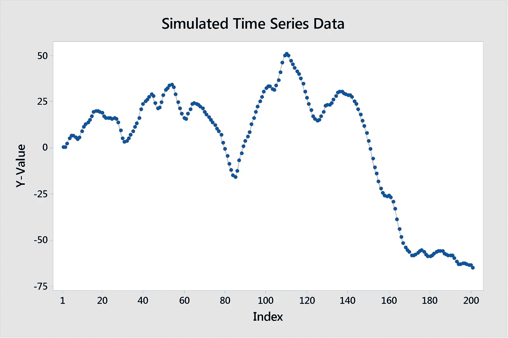
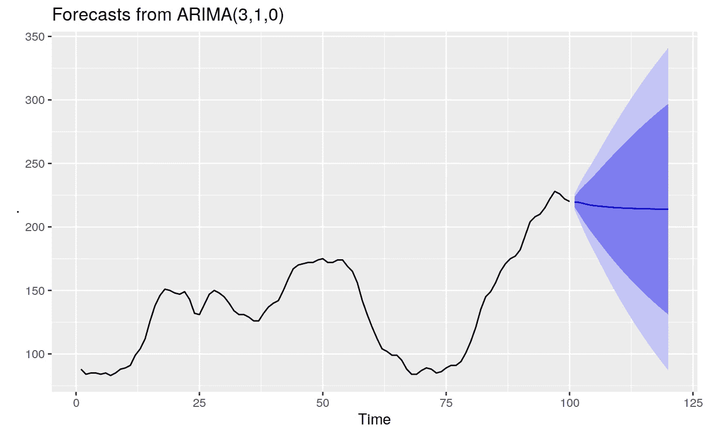
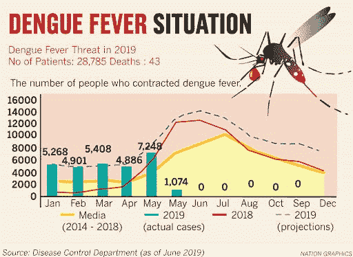
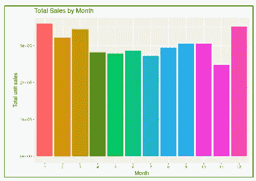

# 时间序列预测模型

> 原文：<https://medium.com/analytics-vidhya/time-series-forecasting-models-726f7968a2c1?source=collection_archive---------2----------------------->

## ARIMA 模型与 ETS 模型

时间！

# *什么是时间序列预测？*

时间序列预测是一种预测数据未来方面的技术，其中我们将过去的数据转化为对未来数据的估计。这种技术通常用于商业，因为公司需要考虑未来的不确定性，而能够预测一段时间内的数据为他们提供了一种为此做准备的方法。

通过分析历史数据，我们可以观察一段时间内的数据模式，并生成对未来数据点的预测。这些预测对公司来说至关重要，因为它们会影响短期和长期决策以及战略前景。

在时间序列预测中，时间的度量被用作我们模型中的独立变量。这些时间测量将出现在连续的周期和许多不同的间隔，包括每小时，每天，每周，每月和每年的间隔。我们的模型将试图产生需求，如果我们可以观察到需求的一致模式，我们就可以从我们的时间序列模型中获得足够的预测。

# 时间序列预测模型的组件

时间序列预测模型由四个常规组件组成:

*   趋势部分:数据随时间变化的趋势
*   周期性成分:观察到的数据因波动而随时间偏离
*   季节性成分:捕捉数据随时间的变化，也是由于波动
*   不规则成分:捕捉数据中无法提前预测的随机变化，这种变化通常是由短期的、未预料到的和偶然发生的因素随着时间的推移而引起的

时间序列数据趋势和随时间的波动

# 时间序列预测方法:ARIMA 模型与 ETS 模型

两种最常用的时间序列预测方法是 ARIMA(自回归综合移动平均)和 ETS(误差趋势和季节性，或指数平滑)。这两种方法将是这篇博文剩余部分的重点。

在选择应用哪种时间序列预测方法时，需要考虑许多因素，包括:

*   我们想要做的预测的背景是什么
*   历史数据的可用性如何
*   我们可以容忍的模型的准确性/不准确性
*   我们预测的时间段是什么
*   该预测给公司带来的成本是多少？它带来了多少价值/收益
*   我们有多少时间来完成这项分析

当考虑所有这些因素时，我们会做出最佳决策，最好地利用可用数据来满足我们的需求，就像我们在任何其他项目中所做的那样。

有一些指标可以帮助我们决定使用哪种时间序列预测方法。大多数时候，我们可以使用模型的 AIC 和 BIC 值来确定哪种方法在我们的模型中更好。如果我们检查数据的时间序列图，我们也可以注意到这些特征，这通常会揭示我们数据的组成部分以及哪种方法可能更有利。虽然这两种方法有许多相似之处，但以下是它们之间的一些主要区别:

## ARIMA 模型

*   有些是静止的
*   没有对应的指数平滑
*   如果您看到数据中的自相关，即过去的数据很好地解释了现在的数据，请使用

## ETS 模型

*   不是静止的
*   使用指数平滑
*   如果数据中存在趋势和/或季节性，则使用，因为此模型明确地模拟了这些组件

时间序列预测示例

# 真实世界时间序列预测模型的示例

现在，为了全面地了解一切，我们可以讨论几个现实世界中使用时间序列预测模型的例子。

*   预测未来的疾病爆发:这是一个相关的例子，现在冠状病毒席卷全球。我们可以使用时间序列预测模型来预测未来的病毒爆发。我个人在以前的项目中完成的另一个例子是预测未来登革热在热带外国的爆发，该疾病在那里很常见并迅速传播。这种疾病通过蚊子叮咬传播，感染会导致死亡。

登革热随着时间的推移。我们可以预测未来登革热的爆发。

*   预测未来的公司销售:所有的企业，尤其是零售企业，都可能采用时间序列预测模型，因为他们希望能够预测他们将从未来的销售预测中产生多少收入。

一段时间内的公司销售。11 月份销售额有所下降——我们可能想知道原因。

*   预测股市趋势:我们可以使用时间序列预测模型来预测未来的股市趋势。

一段时间内的股票市场趋势。