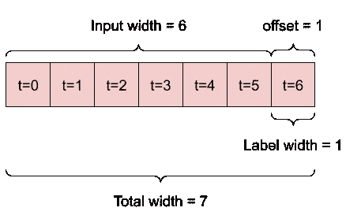
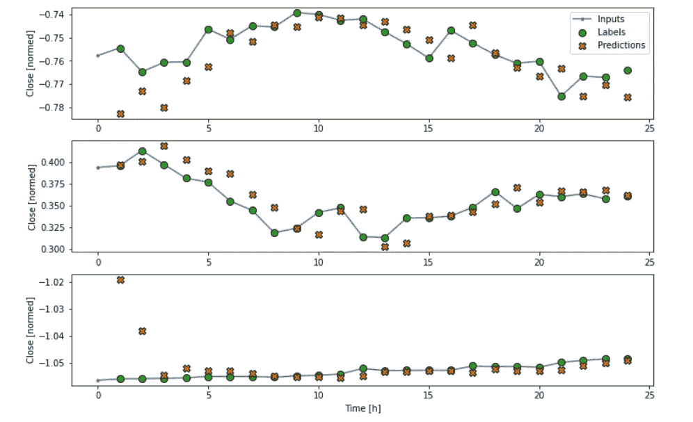
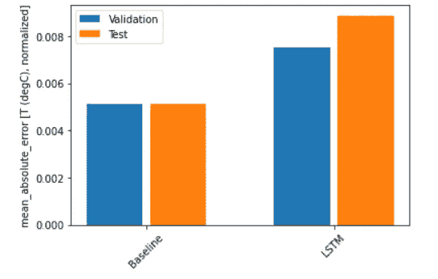

# 基于张量流的外汇时间序列预测

> 原文：<https://medium.com/analytics-vidhya/time-series-forecasting-of-exchange-currency-with-tensor-flow-f475927a68b8?source=collection_archive---------12----------------------->

> 使用 RNN-LSTM 的时间序列预报模式的单步执行的研究实例。


图片来源:[r](https://www.raconteur.net/)aconteur.net

在这篇文章中，我们将涵盖时间序列的概念，但注入一些机器学习。在这篇阅读结束时，我保证你会对机器学习以及如何将时间序列预测应用于任何神经网络模型更感兴趣，谁知道呢？通过预测股票、交易所交易基金、外汇等的价格，你可能会成为下一个华尔街之狼。

如果你是机器学习的新手，请随意阅读我以前的一些[文章](/@edward0rtiz)，我以一种你可以理解而不会感到沮丧的方式全面解释了一些复杂的主题。

## 基础知识

时间序列是*一个变量在相等时间间隔的有序序列*。时间序列的应用现在非常普遍，但这些模型主要是为了了解产生观察数据的潜在力量和结构，并拟合模型，进而进行预测、监测，甚至反馈和前馈控制。

> *时间序列分析说明了这样一个事实，即随着时间推移所采集的数据点可能具有应被考虑的内部结构(如自相关、趋势或季节变化)。*

## 背景

在定义了时间序列的概念之后，是时候看看机器学习应用程序可以适合哪些模型来增强时间序列预测了。将神经网络技术应用于实际问题的主要优势之一是，我们可以生成一个可以自我训练的模型，而不受特定数据范围的限制。换句话说，我们的模型可以接收我们想要的任意多的参数，只要我们的计算开销可以被机器承受。

在时间序列中使用神经网络的另一个优势是输入存储在自己的网络中，而不是数据库中，因此数据的丢失不会受到影响。可以实现时间序列预测的最常见的神经网络是卷积神经网络、深度神经网络和递归神经网络。

使用 ANN(人工神经网络)时的另一个特殊方面是，在进行预测时，模型可以在一种称为单一特征的方法下进行训练，在这种方法中，模型将执行一个变量对多个变量的训练和预测。这种一对多的评估是实现时间序列人工神经网络的第一步。如果你想把模型带到另一个步骤，另一个技巧是通过多个步骤进行预测。

用人工神经网络进行多步预测可以一次对所有参数进行单次预测。例如，在对物流公司的预测中，该模型旨在预测多个变量的相关性，例如供应、需求、库存、同时生产以及它们之间的相关性。这可能看起来没有必要或不连贯，但根据要解决的问题，使用多步人工神经网络进行时间预测可以提供传统模型可以提供的具体见解，甚至可以一次进行一次预测，并将输出反馈给模型。

## 问题是

关于谁创造了这种数字货币，比特币充满了神秘色彩；此外，它是一种高度不稳定的资产，一些政府仍然否认使用这种货币进行分散化商业模式。尽管如此，宣传和分散货币的事实使这种数字货币保持了活力，现在银行正在投资它，并开始采用它来提供比特币相关的服务。

2018 年，比特币的交易价格达到顶峰，许多人开始想办法更多地了解这种货币的趋势，以进行投资，并通过投资获得高额利润。我们将使用 coinbase.com 的数据集，从 2017 年到 2020 年以美元为单位的比特币 BTC 交易的分钟历史数据。基于此，我们将使用人工神经网络来预测基于过去 24 小时的 BTC 下一小时的收盘价。

## EDA 和数据工程

来自 coinbase 的数据集包含大约 1，485，982，000 条记录，分布在 BTC 的开盘价、收盘价、高、低交易量、以美元计的交易量、加权价格和一分钟内的交易时间。这是大量的数据，我们首先需要探索这些数据，以收集尽可能多的准确信息。

通过做这个 EDA (Exploration Data Analysis)，发现了很多 NaN 值，但是那些 NaN 值属于比特币还没有像今天这么普及的前四年。因此，考虑到这一点，处理这些数据的第一步是使用从 2017 年 1 月 1 日到 2020 年 2 月 2 日的记录。

因为该问题旨在根据过去 24 小时预测每小时 BTC 的收盘价，所以该数据将考虑从 01:00:00 到 00:00:00 的每小时价格。这也将减少数据集，但记录的数量不会影响模型的性能。


表 coinbase 的 EDA 基础数据


折线图:每小时 BTC 的时间序列

在这一阶段，任何其他探索都是可能的，从相关热图到分布分析，以识别可用于训练真实 ANN 模型的其他模式。

## 建立模型:数据分割和规范化

一旦执行了数据的初始探索清理，就该决定将什么样的最终数据放入神经网络模型中了。在这种情况下，由于与其他变量的相关性较小，所以删除了货币量一栏。用神经网络模型评估的新的参数总数是 17.687。

模型的数据分割过程是选择总数据的 70%进行训练，20%用于验证，10%用于测试数据。这个比例是一个标准的比例，但如果你想以 80% — 20%的比例工作，这是可能的。要训练的参数的最终数量是:

```
column_indices = {name: i **for** i, name **in** enumerate(df.columns)}
n = len(df)
train_df = df[0:int(n*0.7)]
val_df = df[int(n*0.7):int(n*0.9)]
test_df = df[int(n*0.9):]
```

*   训练集:12380 个参数，六个标签
*   有效集:3538 个参数，六个标签
*   测试集:具有六个标签的 1769 个参数

此外，缩放数据(标准化过程)也很重要，这可以通过减去平均值并除以标准偏差来完成。

```
train_mean = train_df.mean()
train_std = train_df.std()
train_df = (train_df - train_mean) / train_std
val_df = (val_df - train_mean) / train_std
test_df = (test_df - train_mean) / train_std
```

此图形显示只有 Volume_BTC 列具有长尾，但此特征不是最相关的特征，因此它不会影响模型的训练。


规范化日期集 BTC 的小提琴图

## 用 TF 进行预测:引入数据窗口

一旦有了数据集、拆分和规范化，下一步就是定义要在单步模型中评估的变量。对于时间序列预测，做这个实现的库是张量流，使用一个叫做数据开窗的过程需要首先完成。

数据开窗是创建一个窗口(数组)，然后将包含步骤的数量(宽度)的特征。这意味着，如果我们要用过去 24 小时的交易记录来预测 BTC 每小时的收盘价，宽度将是 24。下面的图形示例可以直观地说明这一点。



给定 6 小时的历史，预测未来 1 小时的窗口。图片来源:TensorFlow.org

```
w1 = WindowGenerator(input_width=24, label_width=1, shift=1,                      label_columns=['Close']) w1
Total window size: 25
Input indices: [ 0  1  2  3  4  5  6  7  8  9 10 11 12 13 14 15 16 17 18 19 20 21 22 23]
Label indices: [24]
Label column name(s): ['Close']
```

这段代码显示了以主要特性(收盘价)作为列标签实现数据窗口的输出。

通过识别我们必须构建的窗口，下一步是将窗口分割为成对的要素和标签。为此，最有效的方法是创建一个名为 Windows Generator 的 python 类，然后使用 tf.data.Dataset 从训练、评估和测试数据中生成这些窗口的批处理。

此外，还创建了两个方法，split_window 和 make_dataset。它们都用于处理窗口生成器函数中生成的 label_columns，因此它可以用于使用 ANN 的单步方法训练。

最后，该模型将计算三种不同的预测场景

## 在单步模型中实施架构 RNN-LSTM

最近，对于商业决策、物流监控和金融预测以及其他用途，预测问题的复杂性需要聪明的解决方案来解决这些问题。随着人工神经网络模型的不断改进和正确应用，现在已经有了一种强有力的方法来准确预测和提取这类时间序列问题中的未知特征和关系。

本例中选择的人工神经网络是使用 LSTM 网络的 RNN。这个网络类似于 RNN(递归神经网络)；最大的区别在于 LSTM(长短期记忆)是 RNN 的改良版，可以很容易地记住过去的数据。给定未知持续时间的时滞，LSTM 常用于预测时间序列。训练过程通过使用反向传播来完成。下面是 RNN-LSTM 的示意图


LSTM 图图片来源:[马赫纳克](https://github.com/mahnerak)

对于此次实施，该模型将由一个 16 单元层 LSTM 架构组成，并使用 ADAM 进行了优化。因为生成了一个窗口(24 小时步长)，该窗口将是网络单元中的尺寸输入。此外，模型将具有用于预测输出的密集图层。

最后，选择回调来保存损失 MSE(均方误差),并基于有效集合中完整训练的最小可能误差来收集最准确的预测点。

## 基线结果

基线结果是数据集的时间序列预测，没有实施任何人工神经网络模型。这次训练的绝对误差是 0.0051。要理解这些图表，请查看标签点和预测之间的模式。当两个数据点相互连接时，这意味着该数据点的接近价格将基于计算的 MSE 出现。

然而，三种不同场景的模式是不同的。改善这一点的一个方法是将三个预测合并成一个单线图，看看哪个点最有可能连接起来，那应该就是模型的投资动量(预测)。


基线时间序列预测 BTC 预测

## RNN-LSTM 结果

用于本次预测的人工神经网络模型得到的结果为 0.089。与基线模型相比，除了与 BTC 列车无关的第三条线图之外，没有显著差异。关于这种情况的假设是由于一些输入与 BTC(为预测定义的参数)的接近度相关性不高，因此，当归一化数据时，一些异常值影响了该训练。您可以删除那些没有良好相关性或根本没有相关性的列，但是这种技术的思想是基于对多个变量与 BTC 收盘价的评估来创建预测。



RNN-LSTM 时间序列预测 BTC 预测

## 模型的性能



绩效基线与 RNN-LSTM BTC

没有 ANN 实现的基线模型获得了 0.0051 的损失 MSE 的较好分数。相反，RNN-LSTM 损失是 0.0089，在两个模型中都超过了业绩，请注意，RNN-LSTM 是一个复杂得多的模型，它考虑了多个变量的回归。因此，损失的小差异尊重幼稚的实现。

比较这两种模型的想法是理解传统实施与机器学习方法之间的行为，并基于这两种模型来创建可以实现预测决策的策略，在这种情况下，是未来 24 小时内比特币的高级购买决策。

## 最后的想法

时间序列预测是最近的热门话题，人们似乎掌握这种技术将是梦想的工作，就像华尔街的狼一样。然而，时间序列预测仍然有局限性；使用机器学习方法的简单实现的预测将计算输入到模型中的历史记录的数据。在现实生活中，在股票市场或货币市场的情况下，波动是疯狂的，是一种熵，在这种特定情况下很难测量。因此，在为训练预测模型而创建的环境之外发生的任何新事物，都会产生与预测不同的输出。

我希望你喜欢这篇有趣的文章，如果你因此变得富有，请我喝杯咖啡，为什么不呢？捐我一个比特币，我会有动力用 ML 做更多疯狂的预测

## 浏览代码

请随意使用这个示例的代码，并尝试理解直觉，这样您就可以自己实现对货币、ETF 或股票的系列预测。

## 参考

 [## 理解 LSTM——长短期记忆递归神经网络教程

### 长短期记忆递归神经网络(LSTM-RNN)是最强大的动态分类器之一

arxiv.org](https://arxiv.org/abs/1909.09586) [](https://github.com/keras-team/keras/issues/7600) [## LSTM 输入映射问题#7600 keras-team/keras

### 嗨，我试图在文档中查找信息，但没有找到任何相关的内容。我还看了看…

github.com](https://github.com/keras-team/keras/issues/7600) [](https://www.tensorflow.org/tutorials/structured_data/time_series) [## 时间序列预测|张量流核心

### 本教程是对使用 TensorFlow 进行时间序列预测的介绍。它构建了几种不同风格的…

www.tensorflow.org](https://www.tensorflow.org/tutorials/structured_data/time_series)  [## 6.4.1.定义、应用和技术

### 时间序列的定义时间序列的定义:一个变量的值在相等的时间间隔的有序序列…

itl.nist.gov](https://itl.nist.gov/div898/handbook/pmc/section4/pmc41.htm)