# 时间序列预测-萨里玛与汽车 ARIMA 模型

> 原文：<https://medium.com/analytics-vidhya/time-series-forecasting-sarima-vs-auto-arima-models-f95e76d71d8f?source=collection_archive---------1----------------------->

时间序列是以一致的时间间隔测量的一系列数据点，例如每年、每天、每月、每小时等等。它依赖于时间&时间的进程是数据集的一个重要方面。时间序列预测中最常用的方法之一是 ARIMA 模型，它代表自回归综合移动平均。ARIMA 是一个模型，可以拟合时间序列数据，以预测序列中的未来点。

我们可以把 Arima 项分解成三项，AR，I，ma:

AR(p)代表自回归模型，p 参数是一个整数，它确定了将使用多少滞后序列来预测未来时段。

I(d)是差分部分，d 参数表示将使用多少个差分阶数来使序列平稳。

MA(q)代表移动平均模型，q 是预测方程中滞后预测误差项的个数。SARIMA 是季节性 ARIMA，用于季节性时间序列。

实施 ARIMA 模型有几个步骤:

1.  **加载数据&导入必要的库:**建模的第一步是加载数据集&导入库。

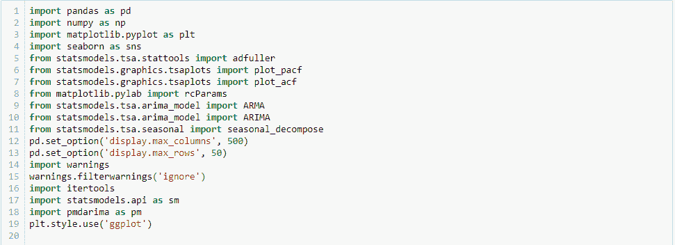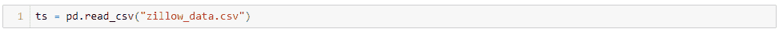

我们将研究特定邮政编码的 Zillow 房屋中位数数据。

**2。数据预处理:**在 Python 中处理时间序列数据时，务必确保日期被用作索引值，并且被 Python 理解为真正的“日期”对象。我们可以通过使用 pandas datestamp 或 to_datetime 方法来做到这一点。

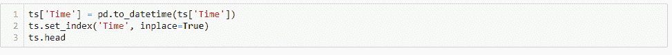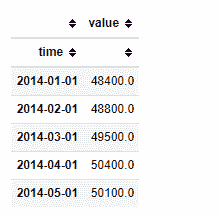

**3。检查平稳性:**大多数时间序列模型都要求数据是平稳的。如果一个时间序列的统计特性(如均值、方差&协方差)随时间保持不变，则称该时间序列是平稳的。检查这一点的正式方法是绘制数据，进行可视化分析，并使用统计测试。

直观:我们可以使用分解方法，这种方法允许我们分别查看季节性(可以是每天、每周、每年等)、趋势和随机性，即在去除季节性和趋势的影响后数据集的可变性。

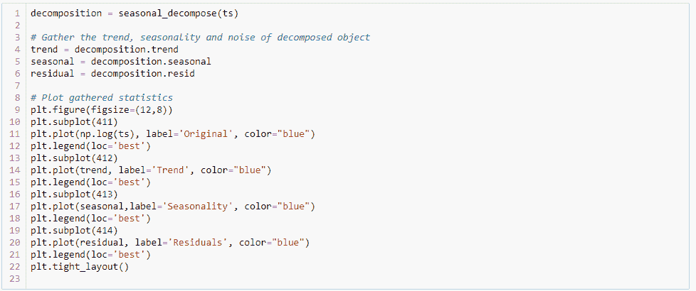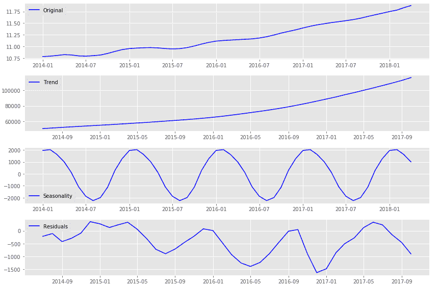

该图显示数据具有趋势性和季节性。这意味着它不是静止的。

*   统计检验:为了证实我们对上述图的直观观察，我们将使用 Dickey-Fuller 假设检验。

**零假设:**数列不是平稳的。

**交替假设:**序列是平稳的。

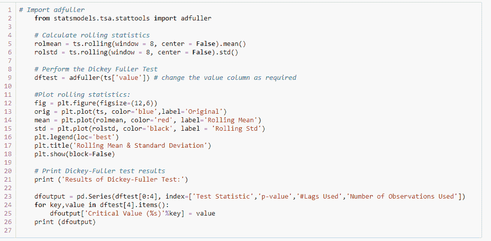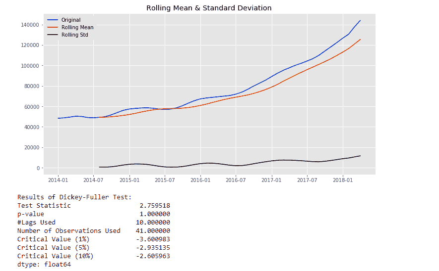

当 p 值 1 大于 0.05 时，我们无法拒绝零假设&这证实了序列不是平稳的。

**4。使数列平稳&确定 d 值**:统计检验确认数列不平稳后，下一步就是去除趋势，使数列平稳。处理去除趋势和季节性的最常见方法之一是差分，为使序列平稳而执行差分的次数是 d 值。

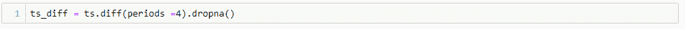

经过几次差分后，测试确认数据是稳定的。这意味着 d 值是 2。

**5。创建 ACF 和 PACF 图&确定 p 和 q 值**:**偏相关函数** ( PACF)给出时间序列与其自身滞后值的偏相关，控制所有较短滞后的时间序列值。自相关函数给出时间序列与其自身滞后值的相关性，但不控制其他滞后值。

AR(p)时间序列的 ACF 图对于 p 的滞后将是强有力的，并且对于随后的滞后值保持停滞，随着效果的减弱，在某个点上逐渐减弱。另一方面，PACF 描述了一个观察和它的滞后之间的直接关系。这通常导致滞后值超过 p 时没有相关性。

MA(q)过程的 ACF 将显示与最近值的强相关性，直到 q 的滞后，然后立即下降到最小或没有相关性。对于 PACF，该图显示了与滞后的强相关性，然后从滞后开始逐渐变弱至无相关性。下面是我们的静态数据的 ACF & PACFplot。

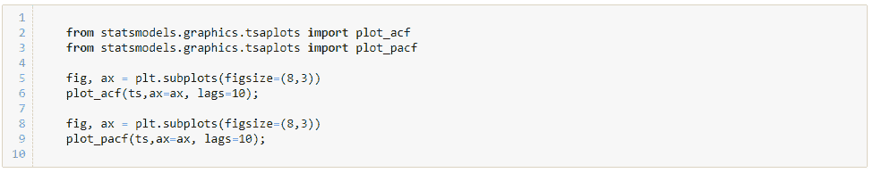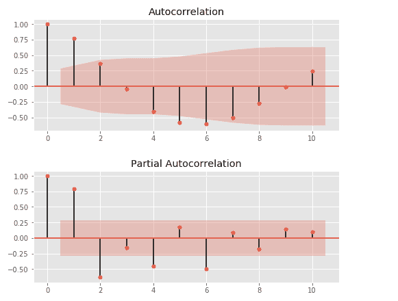

PACF 和 ACF 建议 AR(2)和 MA(2)，下一步是使用 ACF 和 PACF 估计的值范围运行 ARIMA 模型。像 AIC(赤池信息标准)或 BIC(贝叶斯信息标准)这样的信息标准将用于在正确拟合的模型中进行选择。

**6。适合 ARIMA 模式** l:

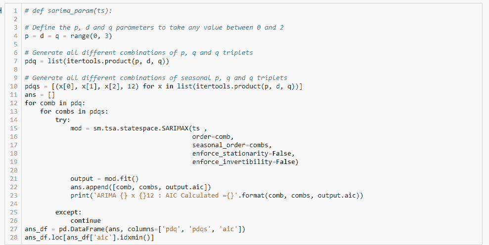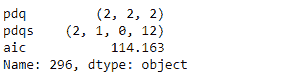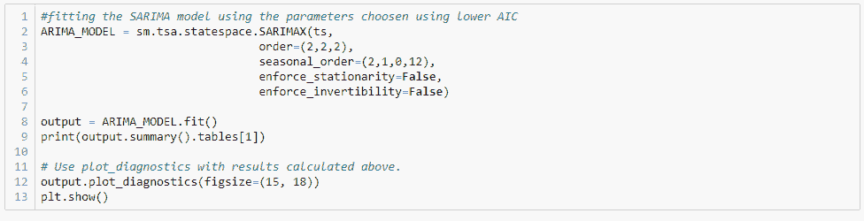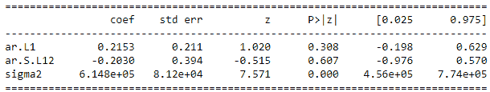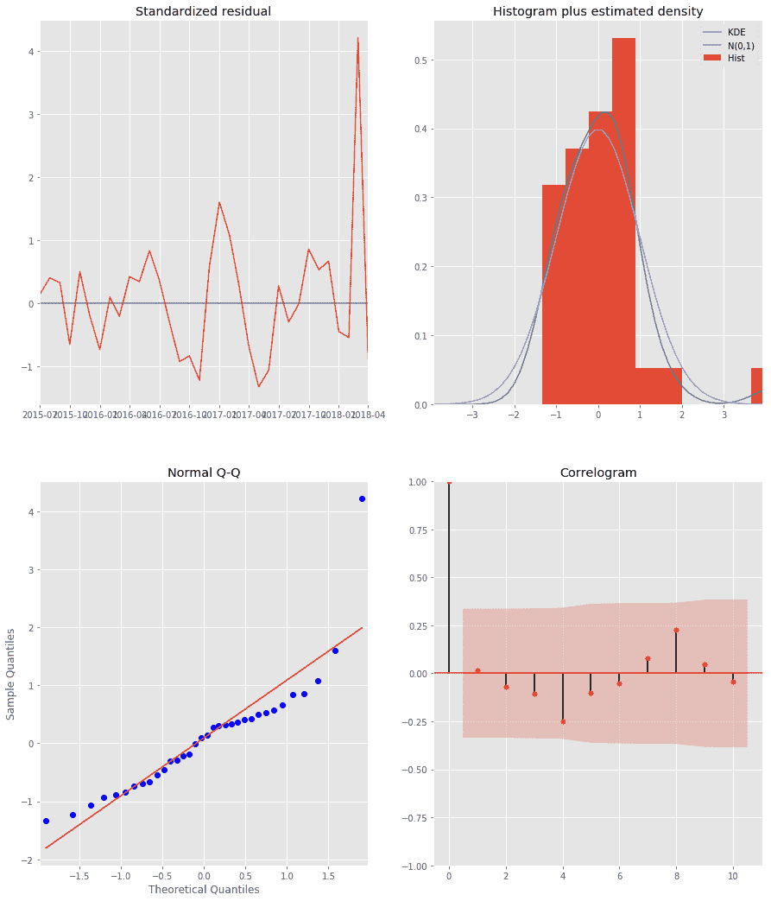

**自动 ARIMA 模型:**与 ARIMA 模型相比，使用自动 ARIMA 的优势在于，在数据预处理步骤之后，我们可以跳过接下来的步骤&直接拟合我们的模型。它使用 AIC(赤池信息标准)& BIC(贝叶斯信息标准)值，通过尝试 p，q & d 值的不同组合来拟合模型。

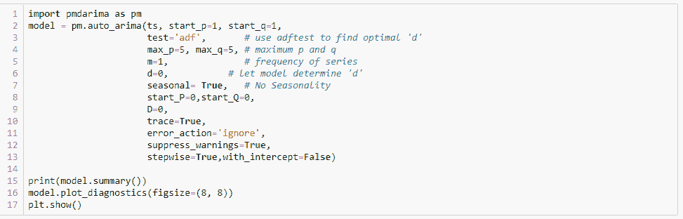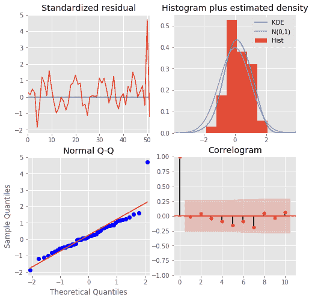

汽车 ARIMA 模型的剩余曲线看起来相当不错。

**直方图加估计密度图:**红色 KDE 线紧跟 N(0，1)线。这很好地表明残差是正态分布的。

**Q-Q 图**:显示残差(蓝点)的有序分布遵循从 N(0，1)的标准正态分布中提取的样本的线性趋势。这表明残差是正态分布的。

**标准化残差图:**一段时间内的残差没有表现出任何明显的季节性，似乎是白噪声。

**相关图:**显示时间序列残差与其滞后版本的相关性较低。

我们的模型还不完美&还需要一些调整。

以下是我们的自动 Arima 模型的全部选项。

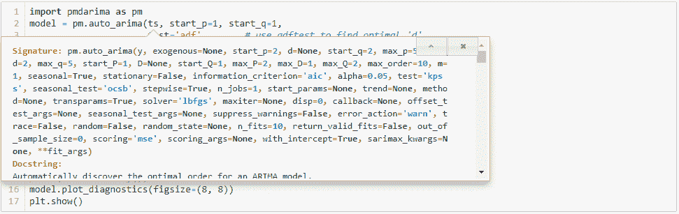

为了在不同的拟合模型之间进行选择，我们计算误差指标，如平均绝对误差、均方误差和中值绝对误差，并在模型之间进行比较。

感谢阅读！

参考

[https://www . analyticsvidhya . com/blog/2016/02/time-series-forecasting-codes-python/](https://www.analyticsvidhya.com/blog/2016/02/time-series-forecasting-codes-python/)

[https://www . analyticsvidhya . com/blog/2018/08/auto-ARIMA-time-series-modeling-python-r/](https://www.analyticsvidhya.com/blog/2018/08/auto-arima-time-series-modeling-python-r/)

[https://data fai . com/auto-ARIMA-using-pyramid-ARIMA-python-package/](https://datafai.com/auto-arima-using-pyramid-arima-python-package/)