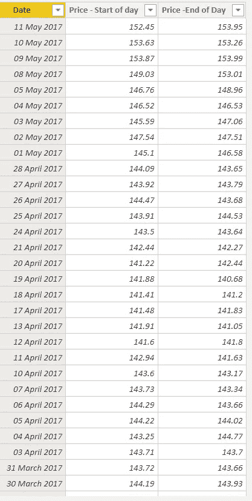
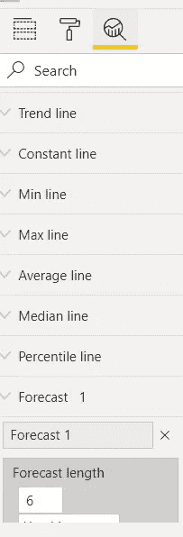
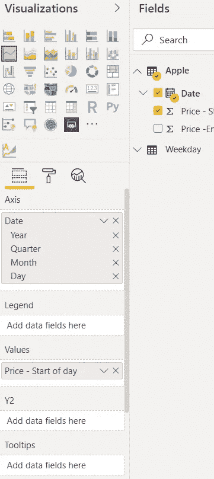
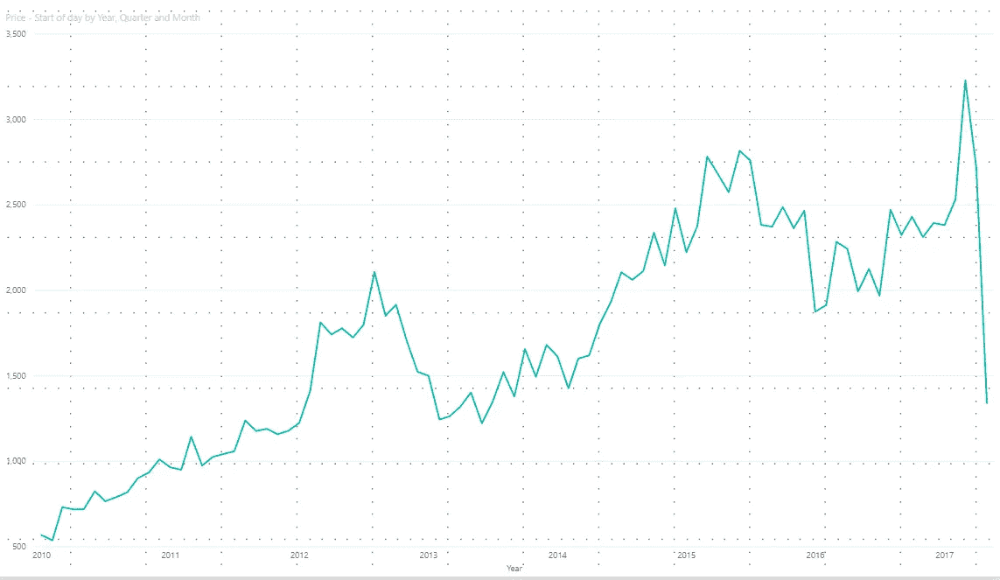
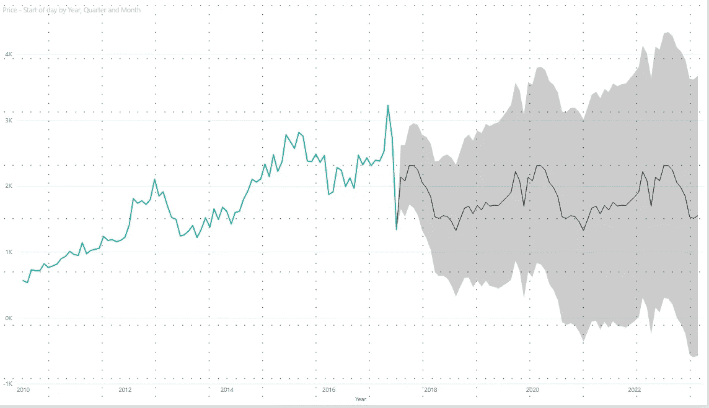

# 使用 Microsoft Power BI 进行时间序列预测

> 原文：<https://medium.com/analytics-vidhya/time-series-forecasting-using-microsoft-power-bi-ecfcf0b4697c?source=collection_archive---------13----------------------->

马库斯·斯皮斯克在 [Unsplash](https://unsplash.com?utm_source=medium&utm_medium=referral) 上的照片

# 介绍

时间序列预测是机器学习的一个非常重要的领域，因为它让你能够提前“看到”并相应地制定业务计划。在这篇博客中，我们将了解什么是时间序列预测，power bi 如何制作时间序列预测图以及 Power BI 用于预测的模块。

# 什么是时间序列预测？

时间序列是以天、小时、月和年为单位定期收集的数据。时间序列预测是机器学习中的一种技术，它分析数据和时间序列来预测未来事件。这种技术基于历史时间序列数据提供了关于未来趋势的近乎精确的假设。

时间序列允许您分析主要模式，如趋势、季节性、周期性和不规则性。它用于各种应用，如股票市场分析、模式识别、地震预测、经济预测、人口普查分析等。

时间序列包括趋势周期和季节性。不幸的是，许多人混淆了季节性行为和周期性行为。为了避免混淆，让我们来理解它们是什么:

*   **趋势:**一段时间内数据的增减称为趋势。
*   季节性:通常，季节性有一个固定和已知的频率。例如，像一年中的时间或一周中的某一天这样的季节性因素，就会出现季节性模式。
*   **循环:**当一个数据表现波动时，就会出现一个循环。但与季节性不同，它没有固定的频率。

# Power View 使用哪种算法进行时间序列预测？

Power BI 提供了两个版本的指数平滑，一个用于[季节性数据(ETS AAA)](https://powerbi.microsoft.com/es-es/blog/describing-the-forecasting-models-in-power-view/#ETSAAA) ，另一个用于[非季节性数据(ETS AAN)](https://powerbi.microsoft.com/es-es/blog/describing-the-forecasting-models-in-power-view/#ETSAAN) 当您根据对历史数据的分析开始预测折线图时，Power BI 会自动使用适当的模型。

# 如何在 Power BI 中创建时间序列预测图？

在本教程中，我使用下面的数据集。

要使用预测功能，我们使用“分析”选项卡,“分析”窗格允许您向视觉效果添加动态参考线，以提供重要趋势或见解的焦点。它位于 Power BI 桌面的**可视化**区域。

创建折线图:

对于预测，转到分析窗格，我们可以看到一个**预测**选项。让我们点击**添加**，将预测长度设置为 6 年，置信区间为 95%，然后点击**应用**。你会注意到，在我们的数据结束后，我们有一条预测线，灰色阴影区域是我们的置信区间。

# 结论

如果您想在同一个框架中快速查看趋势和预测，以了解并做出任何商业决策，Power BI 可以帮助您。

你也可以在 Python 或 R 中使用 Arima 和其他时间序列模块，下一次我将使用 Python 讨论 Arima。

我希望这篇文章能帮助你并节省大量的时间。如果你有任何建议，请告诉我。

快乐编码。

# 关于作者

**Prabhat Pathak —助理分析师**

我是一名工程师，目前在顶级跨国公司工作，是一名助理分析师和创新爱好者。我喜欢学习新事物，我相信每个数据都有一个故事，我喜欢阅读这些故事。

您也可以在我们的移动应用程序上阅读这篇文章

相关文章

*原载于 2020 年 7 月 9 日 https://www.analyticsvidhya.com***。**