# 用 Spark ML 进行时间序列预测:第二部分

> 原文：<https://medium.com/analytics-vidhya/time-series-forecasting-using-spark-ml-part-2-31506514c643?source=collection_archive---------0----------------------->

在最后一部分，我们看了问题的基本公式和相关的数据集。我们还做了一些探索性的数据分析，验证了时间序列数据(股票价格)的*平稳性*。在这一部分中，我们将深入研究我们开发的使用 Spark MLlib 执行时序预测的类和实用函数的细节。

# **代码描述**

我们开发了一些类和实用函数来执行时间序列分析。为了这项工作，这个包是用 Python 编写的。我们开发*我们自己的*功能工程时序包。*本作提到的代码完全是原创*。我们打算将这项工作作为一个机会，从零开始开发一个时间序列包，同时只利用 Spark 的内部数据结构和内置算法。对于较小的时间序列数据，我们根据 *statsmodels* 包中提供的模型对我们的包的准确性进行了基准测试。我们还没有探索我们的包的计算效率和速度。我们打算在今后的工作中继续讨论这个问题。

我们的时序包包含以下组件:

类— *LagGather，MovingAverageSmoothing，TrendGather*

效用函数— *差异、预测、时间序列、检验平稳性、预测、保存预测*

类 LagGather、MovingAverageSmoothing 和 TrendGather 可在文件*timeseriesfeaturesgenerator . py*中找到，函数 Forecast、Difference、TimeSeriesSplit、CheckStationarity、Predict 和 SavePredictions 可在文件 *forecast.py* 中找到。

LagGather、MovingAverageSmoothing 和 TrendGather 类本质上是变形金刚。他们转换数据，并生成可用于 Spark 机器学习算法的特征。我们将在下面的段落中通过示例详细描述每个类。

***班落后***

该类有 4 个方法，即。setLagLength()、setInputCol()、transform()和 getFeatureNames()。该类用于获取给定的*单变量*时间序列的时滞值。我们展示了下面的代码块，

```
class LagGather:# generates features for machine-learning
# previous time-step values are used as featuresdef __init__(self):# this class has 2 data members
self.nLags = 0
self.FeatureNames = []def setLagLength(self, nLags):# this method sets the lag-length
# if we want only previous time-step as feature
# use lag-length = 1
# if we want more lagged time-steps as features
# set higher lag-lengthself.nLags = nLags
return selfdef setInputCol(self, colname):#sets the input col for which features are generated
# this identifies the univariate time-series on
# which machine-learning and forecasting is doneself.columnName = colname
return selfdef transform(self, df):# transforms the spark dataframe and creates columns
# that have time-lagged values
# columns generated as used as features in MLdf = df.withColumn("Series",lit('Univariate'))
mywindow = Window.orderBy("Series")for i in range(self.nLags):
    strLag = self.columnName+'_LagBy_'+str(i+1)
    df = df.withColumn(strLag,lag(\
                       df[self.columnName], i+1).over(mywindow)) self.FeatureNames.append(strLag)df = df.drop("Series")
return dfdef getFeatureNames(self):# this return the names of feature-columns that are
# generated by transform methodreturn self.FeatureNames
```

*setLagLength()* :

这种方法用于设置滞后长度。例如，我们需要先前的时间步长值，我们将滞后长度设置为 1，如果我们需要先前时间步长之前的时间序列值，我们将滞后长度设置为 2。

*setInputCol()* :

此方法用于指定要执行延时操作的列。

*变换()*:

此方法返回一个值为滞后值的列。

*getFeatureNames()* :

此方法返回新创建的包含时滞值的列的名称。

我们用一个例子来演示这个类的工作方式。我们将这个转换应用到刚刚使用 quandl 包下载的 apple_data。我们首先为下载的数据创建一个 Spark 数据帧。接下来，我们创建一个 LagGather 对象，并使用该对象转换 Spark 数据帧。

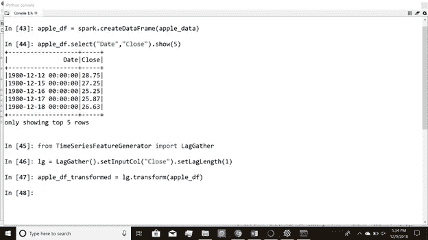

**图 3a。**对苹果股价数据应用 LagGather transformer。

我们看到，在转换 apple_df 数据帧时，我们创建了一个新列“Close_LagBy_1 ”,它包含滞后 1 个时间步长的列“Close”的值。

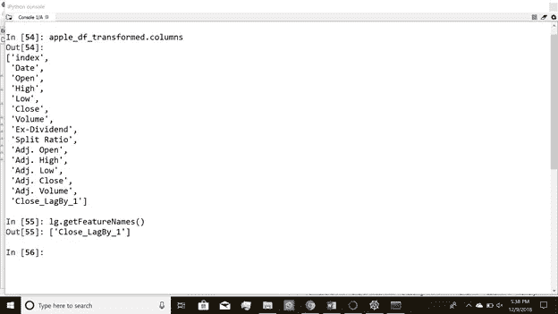

**图 3b。**在 *apple_df* 数据帧的“关闭”列上应用 LagGather transformer 后，我们创建了一个新列“关闭 _LagBy_1”

我们看到列“Close_LagBy_1”包含以前的时间步长值(图 3c)。对于第一行，这将是一个空值。

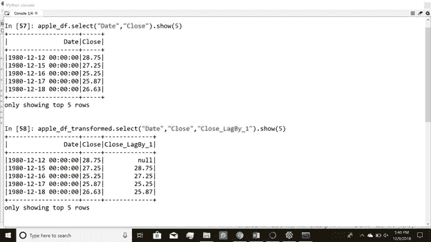

**图 3c。**apple _ df 上 LagGather 变换的结果

类似地，我们可以创建值滞后 2、3 或 4 个时间步长的列。接下来，我们继续上课。

**类移动平均平滑**:

```
class MovingAverageSmoothing:
    # this class is used for performing Moving-average smoothing def __init__(self):
        # this class has 2 data members
        self.nLags= 0
        self.FeatureNames = []

    def setLagLength(self, nLags):
        # this sets the window size over which moving average is performed
        self.nLags = nLags
        return self

    def setInputCol(self, colname):
        #this sets the time-series column on which 
        #moving-average is performed
        self.columnName = colname
        return self

    def transform(self, df):
        # this transforms the spark dataframe (i.e time-series column)
        # and creates column contain the moving-average over created 
        # time-window
        mywindow = Window.rowsBetween(-self.nLags, 0)
        strMovAvg = self.columnName+'_'\
                    + str(self.nLags)+'_MovingAvg'
        df = df.withColumn(strMovAvg,\
                           avg(df[self.columnName]).over(mywindow))
        self.FeatureNames.append(strMovAvg)
        return df 

    def getFeatureNames(self):
        # this returns the name of feature-column 
        # created by transform method    
        return self.FeatureNames
```

MovingAverageSmoothing 类生成包含窗口上移动平均值的列。

*setLagLength()* :

此方法设置移动平均值的窗口大小。窗口大小包括当前时间步长。因此，对于滞后长度 1，我们对由先前时间步长值和当前时间步长值组成的两个值进行平均。

*变换()*:

此方法生成一个列，其中包含的值是 setLagLength()方法设置的大小窗口的移动平均值。

*setInputCol()* :

此方法设置计算移动平均值的列。

*getFeatureNames()* :

该方法获取新创建的包含移动平均值的列的名称。

我们在包含先前时间步长值和当前时间步长值(滞后长度为 1)的窗口上执行移动平均平滑。

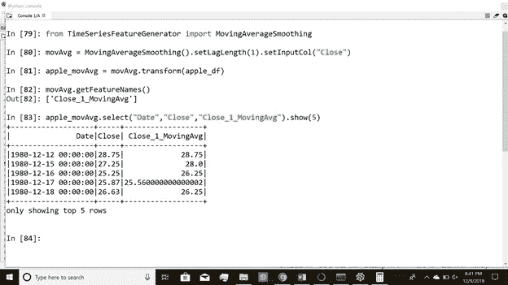

**图 3d。**移动平均平滑，创建的列“Close_1_MovingAvg”具有窗口大小为 2(滞后长度为 1)的列“Close”的移动平均值

接下来，我们看另一个类 TrendGather。此类用于查找单变量时间序列中的趋势。

**班婕**:

```
class TrendGather:

    # this class is used to find trend in time-series data
    def __init__(self):
        # this has 2 data members
        self.nLags= 0 
        self.FeatureNames= []

    def setLagLength(self, nLags):
        # this sets the window-size over which trend is determined
        self.nLags = nLags
        return self

    def setInputCol(self, colname):
        # this sets the time-series column for which trend is to be
        # determined
        self.columnName = colname
        return self

    def transform(self, df):
        # this transforms the spark-dataframe (i.e. time-series column)
        # and generates column containing values +1, or -1 
        # if current value > time-lagged value then column-value = +1.0
        # if current value < time-lagged value then column-value = -1.0
        df = df.withColumn("Series",lit('Univariate'))       
        mywindow = Window.orderBy("Series")
        for i in range(self.nLags):
            strSign = self.columnName +'_Lag_'+str(i+1)+'_Sign'
            df = df.withColumn(strSign,\
                               signum((df[self.columnName] - \
                                       lag(df[self.columnName],i+1)\
                                       .over(mywindow))))
            self.FeatureNames.append(strSign)
        df = df.drop("Series")
        return df

    def getFeatureNames(self):
        # this returns name of feature generted by transform method
        return self.FeatureNames
```

*setLagLength()* :

该方法设置趋势计算的窗口大小。如果 lag 设置为 1，则比较先前的时间步长值和当前的时间步长值，以确定是上升趋势还是下降趋势。

*变换()*:

此方法生成一个包含趋势指示器值的列。趋势指示器值为+1.0 或-1.0。上升趋势由+1.0 表示，而-1.0 表示下降趋势。

*setInputCol()* :

此方法设置确定趋势的列。

*getFeatureNames()* :

此方法获取新创建的包含趋势指标值的列的名称。

例如，我们获得滞后长度为 1 的趋势，这意味着我们比较以前的时间步长值和当前的时间步长值。如果当前时间步长值大于先前时间步长值，则我们得到+1.0，否则为-1.0。

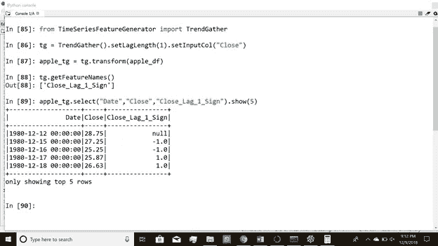

**图 3e。**获取前一个时间步长值和当前时间步长值之间的趋势

以下是对**实用功能**的描述:

*差异*:

该功能用于执行时差计算。进行时间差分是为了使序列平稳。我们不对时间序列进行任何其他的去趋势分析。

```
def Difference(df, inputCol, outputCol):
    # performs first-order differencing
    lag1Window = window.Window.rowsBetween(-1, 0)
    df = df.withColumn(outputCol, \
                       df[inputCol] -  func.first(df[inputCol]).over(lag1Window))
    return df
```

*预测*:

这是执行模型训练的主要功能。我们采用 Spark 的机器学习算法来执行回归。使用前面提到的类生成特征。我们使用具有不同时滞的值作为估计预测的特征。用户可以选择要执行的回归类型；选择是线性回归、决策树回归、随机森林回归和梯度推进树回归。我们使用 RMSE 作为评估指标。

```
def Forecast(df, forecast_days, nLags, \
                     timeSeriesColumn, regressor, sparksession):

    # this performs model training
    # this calls the machine-learning algorithms of Spark ML library #creating labels for machine-learning
    LeadWindow = window.Window.rowsBetween(0,forecast_days)   
    df = df.withColumn("label",func.last(df[timeSeriesColumn]).over(LeadWindow))

    features = [timeSeriesColumn]

    #Auto-regression feature
    LagTransformer = LagGather()\
                     .setLagLength(nLags)\
                     .setInputCol(timeSeriesColumn)
    df = LagTransformer.transform(df)
    featuresGenerated = LagTransformer.getFeatureNames()
    features.extend(featuresGenerated)

    #Other feature generators here:
    #Moving Average Smoothing
    #TrendGather # VECTOR ASSEMBLER
    # this assembles the all the features
    df = df.dropna()
    vA = VectorAssembler().setInputCols(features)\
                          .setOutputCol("features")
    df_m = vA.transform(df) # Splitting data into train, test
    splitratio = 0.7
    df_train, df_test = TimeSeriesSplit(df_m, splitratio, sparksession) # DECISION-TREE REGRESSOR
    if(regressor == "DecisionTreeRegression"):

        dr = DecisionTreeRegressor(featuresCol = "features",\
                                   labelCol = "label", maxDepth = 5)
        model = dr.fit(df_train)
        predictions_dr_test = model.transform(df_test)
        predictions_dr_train = model.transform(df_train) # RMSE is used as evaluation metric        
        evaluator = RegressionEvaluator(predictionCol="prediction",\
                                        labelCol="label",\
                                        metricName ="rmse")
        RMSE_dr_test = evaluator.evaluate(predictions_dr_test)
        RMSE_dr_train = evaluator.evaluate(predictions_dr_train)
        return (df_test, df_train, \
                predictions_dr_test, predictions_dr_train,\
                RMSE_dr_test, RMSE_dr_train) # LINEAR REGRESSOR
    if(regressor == 'LinearRegression'):
        lr = LinearRegression(featuresCol = "features", labelCol="label", \
                              maxIter = 100, regParam = 0.4, \
                              elasticNetParam = 0.1)
        model = lr.fit(df_train)
        predictions_lr_test = model.transform(df_test)
        predictions_lr_train = model.transform(df_train)

        # RMSE is used as evaluation metric
        evaluator = RegressionEvaluator(predictionCol="prediction",\
                                        labelCol="label",\
                                        metricName ="rmse")
        RMSE_lr_test= evaluator.evaluate(predictions_lr_test)
        RMSE_lr_train = evaluator.evaluate(predictions_lr_train)
        return (df_test, df_train, \
                predictions_lr_test, predictions_lr_train,\
                RMSE_lr_test, RMSE_lr_train)

    # RANDOM FOREST REGRESSOR
    if(regressor == 'RandomForestRegression'):
        rfr = RandomForestRegressor(featuresCol="features",\
                                    labelCol="label",\
                                    maxDepth = 5,\
                                    subsamplingRate = 0.8,\
                                    )
        model = rfr.fit(df_train)
        predictions_rfr_test = model.transform(df_test)
        predictions_rfr_train = model.transform(df_train)

        # RMSE is used as evaluation metric
        evaluator = RegressionEvaluator(predictionCol="prediction",\
                                        labelCol="label",\
                                        metricName ="rmse")
        RMSE_rfr_test= evaluator.evaluate(predictions_rfr_test)
        RMSE_rfr_train = evaluator.evaluate(predictions_rfr_train)
        return (df_test, df_train, \
                predictions_rfr_test, predictions_rfr_train,\
                RMSE_rfr_test, RMSE_rfr_train)

    # GRADIENT BOOSTING TREE REGRESSOR
    if(regressor == 'GBTRegression'):
        gbt = GBTRegressor(featuresCol="features",\
                           labelCol="label",\
                           maxDepth=5,\
                           subsamplingRate=0.8)

        model = gbt.fit(df_train)
        predictions_gbt_test = model.transform(df_test)
        predictions_gbt_train = model.transform(df_train)

        # RMSE is used as evaluation metric
        evaluator = RegressionEvaluator(predictionCol="prediction",\
                                        labelCol="label",\
                                        metricName ="rmse")
        RMSE_gbt_test= evaluator.evaluate(predictions_gbt_test)
        RMSE_gbt_train = evaluator.evaluate(predictions_gbt_train)
        return (df_test, df_train, \
                predictions_gbt_test, predictions_gbt_train,\
                RMSE_gbt_test, RMSE_gbt_train)
```

时间序列片段:

该功能用于将数据分为训练和测试数据。由于不能对时间序列数据执行随机分割，我们根据分割率将数据分割为训练和测试，使得训练数据包含较早的时间数据，而测试包含较晚的时间数据。例如，如果数据集包含 100 个样本，并且拆分比率为 0.7，则训练数据包含前 70 个样本，测试数据包含接下来的 30 个样本。

```
def TimeSeriesSplit(df_m, splitRatio, sparksession):

    # Splitting data into train and test
    # we maintain the time-order while splitting
    # if split ratio = 0.7 then first 70% of data is train data
    # and remaining 30% of data is test datanewSchema  = StructType(df_m.schema.fields + \
                [StructField(“Row Number”, LongType(), False)])
    new_rdd = df_m.rdd.zipWithIndex().map(lambda x: list(x[0]) + [x[1]])
    df_m2 = sparksession.createDataFrame(new_rdd, newSchema)
    total_rows = df_m2.count()
    splitFraction  =int(total_rows*splitRatio)
    df_train = df_m2.where(df_m2[“Row Number”] >= 0)\
                   .where(df_m2[“Row Number”] <= splitFraction)
    df_test = df_m2.where(df_m2[“Row Number”] > splitFraction)

    return df_train, df_test
```

*检查平稳性*:

这用于检查时间序列的平稳性。如果一个时间序列具有常数均值和常数方差，则称它是平稳的。我们使用包 *statsmodels* 来执行增强的 Dick-Fuller 平稳性测试。

```
def CheckStationarity(timeSeriesCol):

    # this function works with Pandas dataframe only not with spark dataframes
    # this performs Augmented Dickey-Fuller's test

    test_result = adfuller(timeSeriesCol.values)
    print(‘ADF Statistic : %f \n’ %test_result[0])
    print(‘p-value : %f \n’ %test_result[1])
    print(‘Critical values are: \n’)
    print(test_result[4])
```

*预测*:

该函数用于将差异预测转换为实际预测。

```
def Predict(I, df1, df2, timeSeriesCol, predictionCol, joinCol):

    # this converts differenced predictions to raw predictions
    dZCol = ‘DeltaZ’+str(i) 
    f_strCol = ‘forecast_’+str(i)+’day’
    df = df1.join(df2, [joinCol], how=”inner”)\
                            .orderBy(asc(“Date”))
    df = df.withColumnRenamed(predictionCol, dZCol)
    df = df.withColumn(f_strCol, col(dZCol)+col(timeSeriesCol))
    return df
```

*保存预测*:

该函数调用 forecast 和 predict 函数，这些函数使用 Spark ML 执行机器学习。此外，此功能还用于对结果进行一些后处理，如更改列名、为预测创建新列、生成 RMSE 统计汇总并将结果保存在中。csv 文件。

功能保存预测所需的输入:

1. *df* :包含股价数据的主火花数据帧

2. *timeSeriesCol* :用于预测的时间序列，这里是收盘日价，“收盘”栏

3.*回归类型*:机器学习算法的类型(线性回归、决策树回归、随机森林回归、gbt 回归)

4. *forecast_days* :需要预测的未来时间步长(整数)

5. *num_lags* :用作特征的先前时间步数(整数)

6.*文件名*:保存结果的文件名，创建两个输出文件 filenametest.csv 和 filenametrain.csv

7.*火花时段*:当前火花时段

```
def SavePredictions(df, \
                    timeSeriesCol,\
                    regressionType,\
                    forecast_days, \
                    feature_nLags,\
                    filename, \
                    sparksession):

    # this is the main function which calls forecast and predict
    # this saves predictions in csv files

    #Differencing data to remove non-stationarity
    diff_timeSeriesCol = "Diff_"+timeSeriesCol
    df = Difference(df, timeSeriesCol,diff_timeSeriesCol)

    RMSE_test = {}
    RMSE_train = {}

    #Forecasting and Undifferencing the data
    for i in range(1, forecast_days+1):

        # training with Spark's ML algorithms    
        df_test, df_train, \
        predictions_test, predictions_train,\
        RMSE_ts, RMSE_tr = \
        Forecast(df.select("Date",timeSeriesCol,diff_timeSeriesCol),\
                       i, feature_nLags, \
                       diff_timeSeriesCol,regressionType, sparksession)RMSE_test.update({'forecast_'+str(i)+'day':RMSE_ts})
        RMSE_train.update({'forecast_'+str(i)+'day':RMSE_tr})#predictions for training data            
        if(i == 1):

            #saving the 1-day forecast as separate column
            corr_predict_train = Predict(i, 
                                                         df_train.select("Row Number",
                                                                                 "Date",\
                                                                                 timeSeriesCol),\
                                                         predictions_train.select("Row Number",\
                                                                                                "prediction"),
                                                         timeSeriesCol,\
                                                         "prediction",\
                                                         "Row Number")

            corr_predict_test = Predict(i, \
                                                        df_test.select("Row Number",\
                                                                               "Date",\
                                                                               timeSeriesCol),\
                                                        predictions_test.select("Row Number",\
                                                                                             "prediction"),
                                                        timeSeriesCol,\
                                                       "prediction",\
                                                       "Row Number") 
        else:
            # saving each subsequent forecast as separate column
            strCol_prev= "forecast_" + str(i-1) + "day"corr_predict_train = Predict(i, \
                                                         corr_predict_train,\
                                                         predictions_train.select("Row Number",\
                                                                                                "prediction"),\
                                                         strCol_prev,\
                                                         "prediction",\
                                                         "Row Number")
            corr_predict_test = Predict(i, \
                                                        corr_predict_test,\
                                                        predictions_test.select("Row Number",\
                                                                                             "prediction"),\
                                                        strCol_prev,\
                                                        "prediction",\
                                                        "Row Number")# saving actual labels as separate columns
        LeadWindow = window.Window.rowsBetween(0, i)    
        a_strCol = "actual_"+str(i)+"day"
        corr_predict_test = corr_predict_test.withColumn(\
                                       a_strCol, \
                                       func.last(corr_predict_test[timeSeriesCol])\
                                              .over(LeadWindow))
        corr_predict_train = corr_predict_train.withColumn(\
                                         a_strCol, \
                                         func.last(corr_predict_test[timeSeriesCol])\
                                                .over(LeadWindow))# Saving data into csv files
    corr_predict_test.write.format("csv").option("header","true")\
                               .save(filename+"test.csv")
    corr_predict_train.write.format("csv").option("header","true")\
                                 .save(filename+"train.csv") 

    #error statistics summary  
    print("Error statistics summary for %s " %(filename))
    print("RMSE for train data:\n")
    print(RMSE_train)
    print("RMSE for test data:\n")
    print(RMSE_test)
    print('Two output files created')
    print('Predictions for train data: %s' %(filename+'train.csv'))
    print('Predictions for test data: %s' %(filename +'test.csv'))
    return RMSE_train, RMSE_test
```

**参考文献**
[https://www . stats models . org/dev/generated/stats models . TSA . ARIMA _ model。ARIMA.html](https://www.statsmodels.org/dev/generated/statsmodels.tsa.arima_model.ARIMA.html)
[https://people.duke.edu/~rnau/411diff.htm](https://people.duke.edu/~rnau/411diff.htm)
[https://machine learning mastery . com/time-series-data-stationary-python/](https://machinelearningmastery.com/time-series-data-stationary-python/)
[https://en . Wikipedia . org/wiki/Augmented _ Dickey % E2 % 80% 93 fuller _ test](https://en.wikipedia.org/wiki/Augmented_Dickey%E2%80%93Fuller_test)

# **结果和可视化**

我们探索 Spark ML 库来执行时间序列预测。我们寻求一种形式的*自回归*模型，

Z(t+n) = f(Z(t)，Z(t-1)，Z(t-2) … Z(t-m)

其中 Z(t+n)是 n 天预测值，即时间步长 t+n，Z(t)是时间步长 t 的当前值，Z(t-m)是时间步长 t-m 的值(即滞后长度为 m)。如前所述，Z(t)是通过差分(一阶差分)原始股票价格数据获得的。

我们可以使用线性回归、决策树回归、随机森林回归和梯度推进树回归对函数 *f* 建模。我们进行 1 天、3 天、5 天和 7 天的预测。为了比较，我们使用非差异或原始股票价格数据重复预测。我们看到，使用差分训练数据做出的预测始终比使用原始训练数据做出的预测更好。

工作代码的入口点是

1.*main _ time series _ version 1 . py*(如果要使用 quandl 包)

(或)

2.*main _ time series _ version 2 . py*(如果您想使用本地文件夹中的数据)

我们在这里描述主要功能:

***main _ time series _ version 1 . py***

```
from pyspark.sql import window
from pyspark.sql.functions import col, asc, desc, to_timestamp,\
                                  unix_timestamp, from_unixtime
from pyspark.sql.types import StructType, StructField, LongType
import pyspark.sql.functions as func
from pyspark.sql import SparkSession, SQLContext
from pyspark import SparkConf
from pyspark.ml.regression import LinearRegression, DecisionTreeRegressor
from pyspark.ml.feature import VectorAssembler
from pyspark.ml.evaluation import RegressionEvaluator
import matplotlib.pyplot as plt
import pandas as pd
import numpy as np
import quandl
from forecast import Forecast, Difference, Predict, SavePredictionsif __name__=="__main__":#initializing local variables    
    RMSE_train_df = pd.DataFrame()
    RMSE_test_df = pd.DataFrame()

    #setting up spark environment and create spark session object
    conf = SparkConf()
    spark = SparkSession.builder.appName("TimeSeries").master("local")\
                            .config(conf=conf).getOrCreate()

    #setting up authentication for quandl
    quandl.ApiConfig.api_key = "***" # (get your own key!)                                 

    #obtaining data from Nasdaq.com
    appl = quandl.get("WIKI/AAPL").reset_index()
    fb = quandl.get("WIKI/FB").reset_index()
    googl = quandl.get("WIKI/GOOGL").reset_index()
    nflx = quandl.get("WIKI/NFLX").reset_index()apple_data = spark.createDataFrame(appl)
    fb_data = spark.createDataFrame(fb)
    google_data = spark.createDataFrame(googl)
    netflix_data = spark.createDataFrame(nflx)

    #Performing 1, 2, 3, 4, and 5-day forecasts 
    #Features used:
    #Values at time-step t-3, t-2, t-1, t

    # setting up parameters for simulation
    timeSeriesCol = "Close"
    regressionType = "LinearRegression"
    forecast_days = 5
    num_lags = 3

    # Machine-learning and forecasting for Apple stock
    RMSE_train, RMSE_test = SavePredictions(apple_data,                     timeSeriesCol,                                                             regressionType,                                                            forecast_days,                                                              num_lags,                                                                 "LR_ApplePredictions",                                                      spark)
    RMSE_train_df = RMSE_train_df.append(RMSE_train, ignore_index = True) 
    RMSE_test_df = RMSE_test_df.append(RMSE_test, ignore_index = True)

    # Machine-learning and forecasting for Facebook stock
    RMSE_train, RMSE_test = SavePredictions(fb_data,                        timeSeriesCol,                                                              regressionType,                                                             forecast_days,                                                               num_lags,                                                                    "LR_FacebookPredictions",                                                    spark)
    RMSE_train_df = RMSE_train_df.append(RMSE_train, ignore_index = True) 
    RMSE_test_df = RMSE_test_df.append(RMSE_test, ignore_index = True)

    # Machine-learning and forecasting for Google stock
    RMSE_train, RMSE_test = SavePredictions(google_data,timeSeriesCol,                    regressionType,                                                          forecast_days,                                                                 num_lags,"LR_GooglePredictions",                                                                    spark) RMSE_train_df = RMSE_train_df.append(RMSE_train, ignore_index = True) 
    RMSE_test_df = RMSE_test_df.append(RMSE_test, ignore_index = True)

    # Machine-learning and forecasting for Netflix stock
    RMSE_train, RMSE_test =  SavePredictions(netflix_data,                   timeSeriesCol,                                                               regressionType,                                                              forecast_days,                                                               num_lags,                                                                    "LR_NetflixPredictions",                                                     spark)
    RMSE_train_df = RMSE_train_df.append(RMSE_train, ignore_index = True) 
    RMSE_test_df = RMSE_test_df.append(RMSE_test, ignore_index = True)

    #Saving RMSE statistics
    RMSE_test_df['Ticker']= ['AAPL','FB','GOOGL','NFLX']
    RMSE_train_df['Ticker']=['AAPL','FB','GOOGL','NFLX']
    RMSE_test_df = RMSE_test_df.set_index('Ticker')
    RMSE_train_df = RMSE_train_df.set_index('Ticker')

    fn = regressionType +'.csv'
    RMSE_test_df.to_csv("RMSE_test_"+fn)
    RMSE_train_df.to_csv("RMSE_train_"+fn)
```

如上所示，主程序调用“保存预测”。这个函数调用 forecast 和 predict 来进行机器学习和预测。预测的结果保存在中。csv 文件。此外，函数“SavePredictions”返回用于预测的机器学习算法类型的错误统计的完整摘要。随着模拟的进行，总结也会打印在控制台上。图 4a 中的控制台显示了使用线性回归的包含所有四种股票的训练数据和测试数据的 RMSE 统计的典型输出。RMSE 是针对差异数据的预测而计算的。

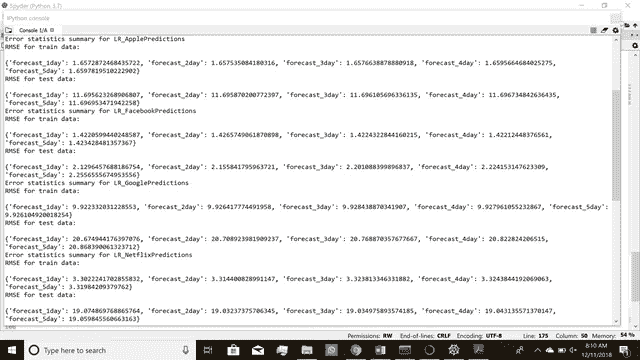

**图 4a。**线性回归的误差统计汇总，根据*差异*数据计算预测 RMSE

一旦模拟完成，它将生成 4 个文件夹，其中包含。csv 文件。每个文件夹对应一种股票。我们提出了几个股票线性回归的代表性结果。全套结果可在 Jupyter 笔记本“*linearregressionresults . ipynb*”中找到。

***main _ time series _ version 2 . py:***

该函数与 main_timeseries_verson1.py 相同，只是我们不使用 quandl 来获取数据，而是读取保存在本地文件夹中的数据。

```
#reading saved data from local folder
    apple_data = spark.read.format("csv").option("inferSchema","true")\
                      .option("header","true")\
                      .load("./apple.csv")
    fb_data =  spark.read.format("csv").option("inferSchema","true")\
                      .option("header","true")\
                      .load("./fb.csv")
    google_data = spark.read.format("csv").option("inferSchema","true")\
                      .option("header","true")\
                      .load("./google.csv")
    netflix_data = spark.read.format("csv").option("inferSchema","true")\
                      .option("header","true")\
                      .load("./netflix.csv")
```

**三天预测:**

我们看到 3 天预报也很好。不出所料，1 天的预报比 3 天的预报要好。我们绘制了所有四只股票的 3 天预测，并将其与实际数据进行比较。

注意:我们没有测试数据中最后 3 个数据点的实际数据。


**图 4i。**谷歌三天预测

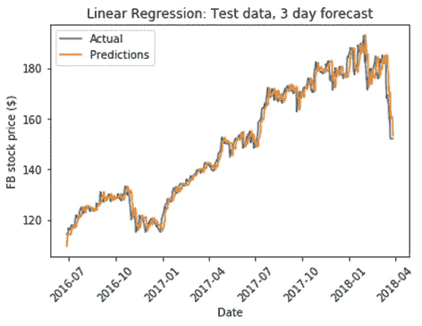

**图 4j。**脸书三天预报

**5 天预报:**

不出所料，5 天预报不如 1 天和 3 天预报好。

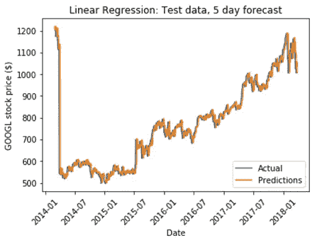

**图 4l。**脸书五天预报

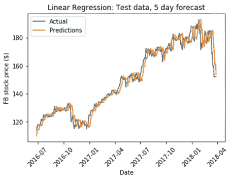

**图 4m。**脸书五天天气预报

我们尝试了其他回归方法，如决策树回归、随机森林回归和梯度推进树回归。

所有算法对 1 天的预测都表现良好。为了比较哪一个更好，我们在这里展示了脸书股票价格 3 天的不同机器学习算法的比较。

*三天对比:*

我们首先比较实际的 3 天预测值、通过线性回归和决策树回归预测的 3 天预测值。在下面的三个图中(图 4p、图 4q 和图 4r)，实际的 3 天未来值用蓝点表示。我们做了一个简短的超参数调整，以获得最佳超参数。详细的超参数调整会给出更好的预测，但是非常耗时并且需要更高的计算能力。这些模型可以在以后进行调整以产生更好的结果。

我们观察到线性回归和随机森林回归在测试的算法中表现最好。梯度推进树回归和决策树回归显示出振荡，并且具有较差的预测。

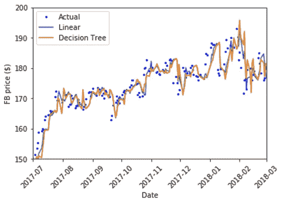

**图 4p。3 天预测 b/w 线性回归和决策树回归的比较**

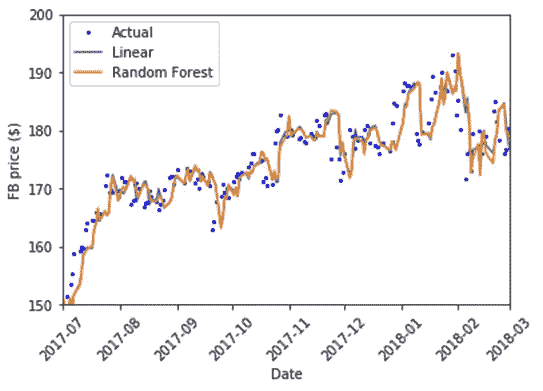

**图 4q。3 天预报 b/w 线性回归和随机森林的比较**

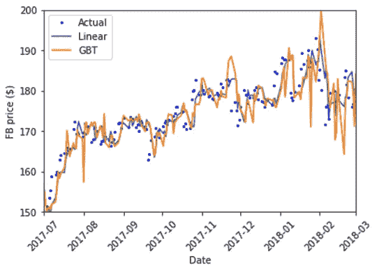

**图 4r。三天预报黑白线性回归和梯度推进树回归的比较**

**总结:**

我们使用 Spark ML 库进行时间序列预测。我们使用了 4 种机器学习算法，即线性回归、决策树回归、随机森林回归和梯度推进树回归，并对脸书、苹果、谷歌、网飞和微软的股价进行了 1 天、2 天、6 天的预测。我们观察到短期预测效果良好(使用之前的 4 个时间步长作为特征)，但是长期预测效果不佳。由于我们没有执行详细的超参数调整，我们可能没有获得最佳参数。此外，我们没有使用多项式特征和从先前时间步长的残差生成的特征(例如，ARIMA 模型)。我们预计使用 ARIMA 模型中的特性会有更好的结果。此外，我们需要通过计算自相关函数和部分自相关函数来确定滞后特征的数量。为了保持分析的原创性，我们故意忽略了这些步骤，否则我们就会开发出另一个 ARIMA 模型。我们将滞后特征的数量视为超参数，并进行了简单的超参数调整。虽然这不是一个标准的方法，但我们想尝试一些新的东西。

**经验教训:**

我们做了很多时间序列数据的统计分析。我们学习了如何对时间序列数据进行机器学习。我们还学会了从头开发一个 python 包。此外，我们还对 Spark ML 库中实现的算法有所了解