# 基于张量流的时间序列预测

> 原文：<https://medium.com/analytics-vidhya/time-series-forecasting-using-tensorflow-rkt109-ea858d8e49c6?source=collection_archive---------0----------------------->


**时间序列**表示实体随时间的变化。例如，你可能听说过天气预报，我们试图预测未来某个特定时间的天气状况，可能是一天中的某个特定时间。时间序列的其他例子有公司股票的每日收盘价、月降雨量数据和年销售额等。

我提供了本教程中使用的代码的 GitHub 库的链接。https://github.com/aryan109/Sunspot_Prediction

# 时间序列的组成部分

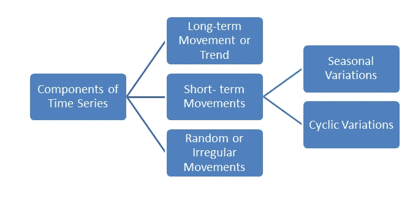

## 趋势

趋势显示了数据在很长一段时间内增加或减少的总体趋势。

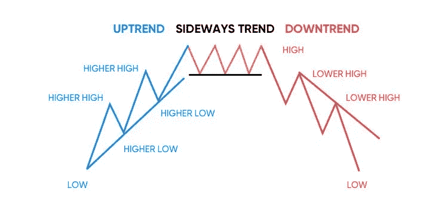

## 周期性波动

时间序列中有一些成分会在一段时间内重复出现。他们以一种有规律的间歇性方式行动。这些变化有两种类型:-
**a)季节性变化:**这些是节奏力，在不到一年的时间内以规则和周期性的方式起作用。
**b)周期性变化:**时间序列中自身运行时间跨度超过一年的变化为周期性变化。

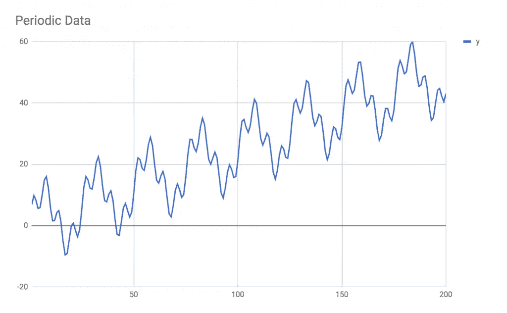

有上升趋势的周期性波动

## 随机或不规则运动(噪音)

这些随机或不规则的变化是不可预见的、不可控的、不可预测的和不稳定的。

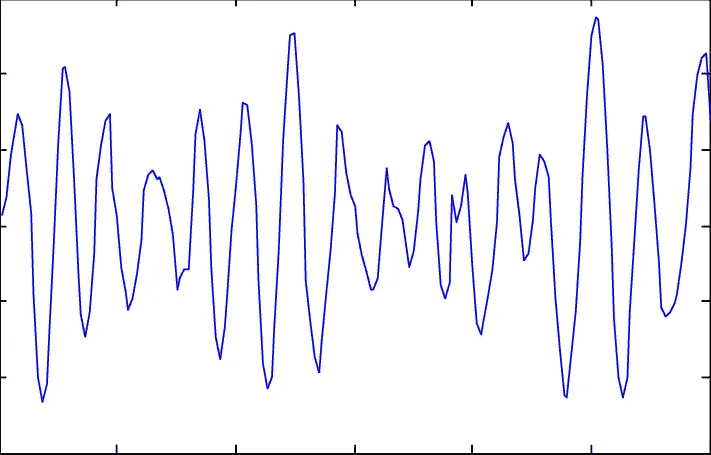

噪声波形

> 一般来说，现实世界中的时间序列既有趋势性又有季节性，还带有一些白噪声。

## 在本教程中，我们将做太阳黑子预测。

你可能在想“什么！孙也得了斑？？?"

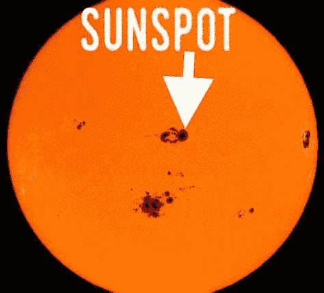

图像显示一个真正的太阳黑子。

**太阳黑子**是太阳表面呈现黑色的区域。它们看起来很暗，因为它们比太阳表面的其他部分更冷。然而，太阳黑子的温度仍然很高——大约 6500 华氏度！太阳黑子被用来记录太阳周期。**太阳周期**是太阳磁场大约每 11 年经历的周期。

# 我们开始吧


由 [Max Duzij](https://unsplash.com/@max_duz?utm_source=medium&utm_medium=referral) 在 [Unsplash](https://unsplash.com?utm_source=medium&utm_medium=referral) 上拍摄的照片

首先，我们需要下载我们的时间序列数据。下面是以 CSV 格式下载数据的代码。

```
!wget — no-check-certificate \
 [https://storage.googleapis.com/laurencemoroney-blog.appspot.com/Sunspots.csv](https://storage.googleapis.com/laurencemoroney-blog.appspot.com/Sunspots.csv) \
 -O /tmp/sunspots.csv
```

下载的 CSV 文件如下所示:

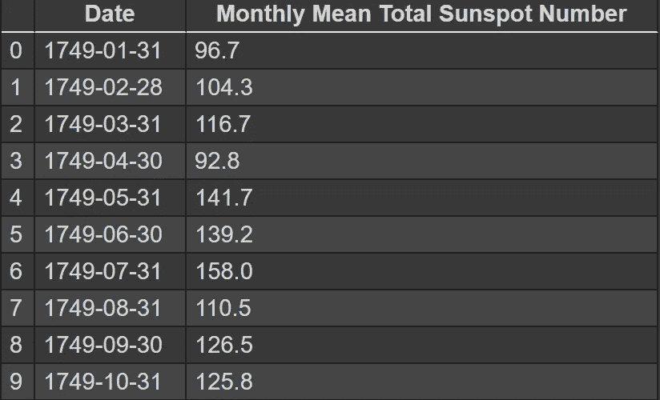

黑子. csv

如您所见，该文件总共包含 3 列，我们将把第 1 列和第 3 列提取到一个 NumPy 数组中。我们已经选择了索引列，这将很容易作出预测，因为我们只需要给索引。

```
import csv
time_step = []
sunspots = []with open(‘/tmp/sunspots.csv’) as csvfile:
 reader = csv.reader(csvfile, delimiter=’,’)
 next(reader)
 for row in reader:
 sunspots.append(float(row[2]))
 time_step.append(int(row[0]))series = np.array(sunspots)
time = np.array(time_step)
print(‘series: {}’.format(series[:5]))
print(‘time: {}’.format(time[:5]))
```

让我们画出这个系列，看看它有什么。

```
plt.figure(figsize=(10, 6))
plot_series(time, series)
```

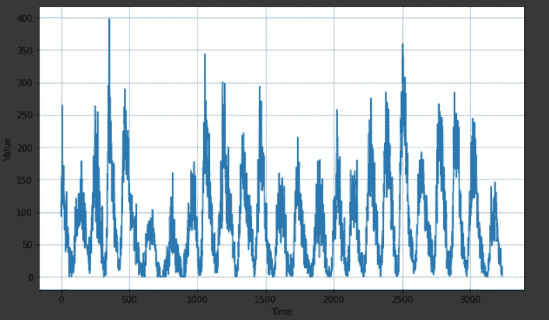

# 正在准备数据集

我们必须将我们的时间序列分成训练期和验证期。

```
split_time = 3000
time_train = time[:split_time]
x_train = series[:split_time]
time_valid = time[split_time:]
x_valid = series[split_time:]
```

分割时间为 3000 意味着从 0 到 3000 将用于训练，3000 到最后用于验证。

现在我们将定义一个函数来创建一个窗口数据集。在一个**窗口数据集中，**前 n 个值可以被视为**输入特征**。而带有任意时间戳的当前值就是**输出标签**。窗口数据集由固定的**窗口大小**组成。

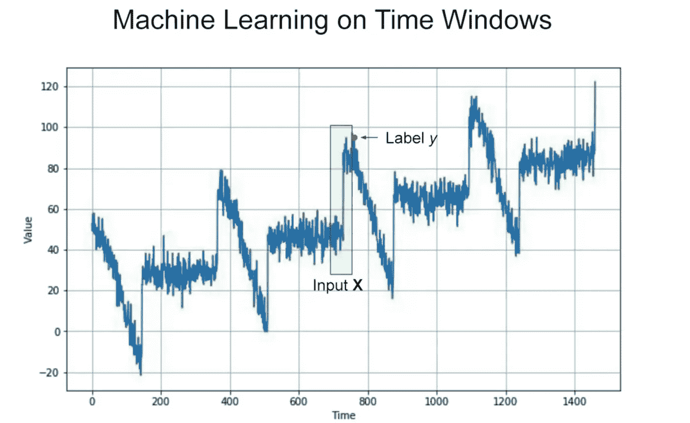

```
def windowed_dataset(series, window_size, batch_size, shuffle_buffer):
 series = tf.expand_dims(series, axis=-1)
 ds = tf.data.Dataset.from_tensor_slices(series)
 ds = ds.window(window_size + 1, shift=1, drop_remainder=True)
 ds = ds.flat_map(lambda w: w.batch(window_size + 1))
 ds = ds.shuffle(shuffle_buffer)
 ds = ds.map(lambda w: (w[:-1], w[1:]))
 return ds.batch(batch_size).prefetch(1)
```

现在让我们使用 **windowed_dataset** 函数创建训练数据集

```
tf.keras.backend.clear_session()
tf.random.set_seed(51)
np.random.seed(51)
shuffle_buffer_size = 1000
window_size = 64
batch_size = 256
train_set = windowed_dataset(x_train, window_size, batch_size, shuffle_buffer_size)
print(x_train.shape)
```

# 创建模型

```
tf.keras.backend.clear_session()
model = tf.keras.models.Sequential([
 tf.keras.layers.Conv1D(filters=60, kernel_size=5,
 strides=1, padding=”causal”,
 activation=”relu”,
 input_shape=[None, 1]),
 tf.keras.layers.LSTM(60, return_sequences=True),
 tf.keras.layers.LSTM(60, return_sequences=True),
 tf.keras.layers.Dense(30, activation=”relu”),
 tf.keras.layers.Dense(10, activation=”relu”),
 tf.keras.layers.Dense(1),
 tf.keras.layers.Lambda(lambda x: x * 400)
])
model.summary()
```

该模型的摘要如下所示:

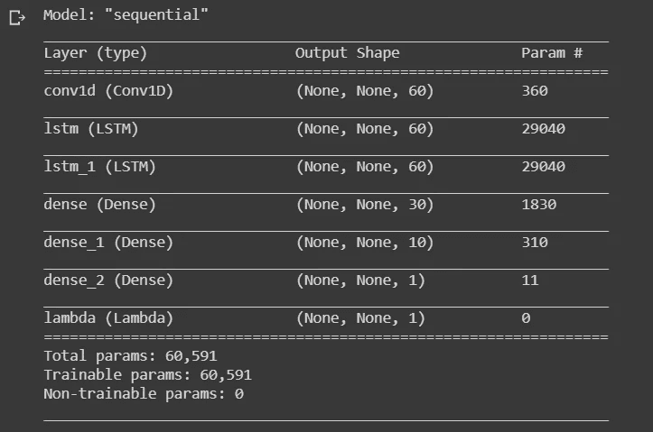

正如你所看到的，这个模型由**卷积层、LSTM 层**和**致密层**组成。如果你不知道这些层到底是做什么的，不要担心，很快我会写一篇文章描述所有不同类型层的功能。

# 现在让我们编译和训练模型


照片由 [Roozbeh Eslami](https://unsplash.com/@roozbeheslami?utm_source=medium&utm_medium=referral) 在 [Unsplash](https://unsplash.com?utm_source=medium&utm_medium=referral) 上拍摄

```
optimizer = tf.keras.optimizers.SGD(lr=1e-5, momentum=0.9)
model.compile(loss=tf.keras.losses.Huber(),
 optimizer=optimizer,
 metrics=[“mae”])
history = model.fit(train_set,epochs=500)
```

训练开始了…..

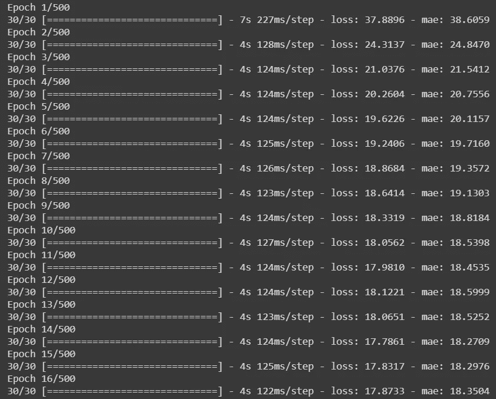

训练需要时间，所以请放松。


Max van den Oetelaar 在 [Unsplash](https://unsplash.com?utm_source=medium&utm_medium=referral) 拍摄的照片

# 评估模型

现在，我们将通过观察训练损失来了解我们的模型有多好

```
# — — — — — — — — — — — — — — — — — — — — — — — — — — — — — -
# Retrieve a list of list results on training and test data
# sets for each training epoch
# — — — — — — — — — — — — — — — — — — — — — — — — — — — — — -
loss=history.history[‘loss’]
epochs=range(len(loss)) # Get number of epochs
# — — — — — — — — — — — — — — — — — — — — — — — — 
# Plot training and validation loss per epoch
# — — — — — — — — — — — — — — — — — — — — — — — — 
plt.plot(epochs, loss, ‘r’)
plt.title(‘Training loss’)
plt.xlabel(“Epochs”)
plt.ylabel(“Loss”)
plt.legend([“Loss”])
plt.figure()zoomed_loss = loss[200:]
zoomed_epochs = range(200,500)
# — — — — — — — — — — — — — — — — — — — — — — — — 
# Plot training and validation loss per epoch
# — — — — — — — — — — — — — — — — — — — — — — — — 
plt.plot(zoomed_epochs, zoomed_loss, ‘r’)
plt.title(‘Training loss’)
plt.xlabel(“Epochs”)
plt.ylabel(“Loss”)
plt.legend([“Loss”])plt.figure()
```

图表应该与此类似。

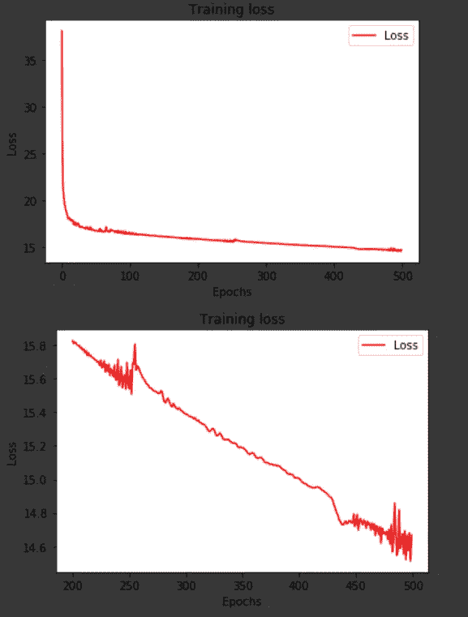

第二个图只是放大了第一个图的最后一部分。通过这一点，我们可以清楚地了解过去 300 年的训练状况。

# 让我们预测一下

现在，随着你的模型被训练，准备好看到未来。


照片由 [Elena Koycheva](https://unsplash.com/@lenneek?utm_source=medium&utm_medium=referral) 在 [Unsplash](https://unsplash.com?utm_source=medium&utm_medium=referral) 上拍摄

我们将创建一个函数来帮助我们做预测。

```
def model_forecast(model, series, window_size):
 ds = tf.data.Dataset.from_tensor_slices(series)
 ds = ds.window(window_size, shift=1, drop_remainder=True)
 ds = ds.flat_map(lambda w: w.batch(window_size))
 ds = ds.batch(32).prefetch(1)
 forecast = model.predict(ds)
 return forecast
```

现在我们将使用这个函数来做预测。

```
rnn_forecast = model_forecast(model, series[…, np.newaxis], window_size)
rnn_forecast = rnn_forecast[split_time — window_size:-1, -1, 0]
plt.figure(figsize=(10, 6))
plot_series(time_valid, x_valid)
plot_series(time_valid, rnn_forecast)
```

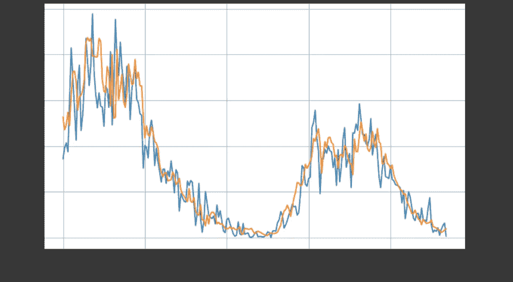

蓝色是原始系列，橙色是预测系列，结果看起来相当不错😃。


希望你明白如何用 TensorFlow 做时间序列预测。

请给出您的反馈或建议。谢谢你🙂