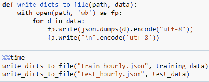

# 用 DeepAR 进行时间序列预测

> 原文：<https://medium.com/analytics-vidhya/time-series-forecasting-with-deepar-cbdae8abab8a?source=collection_archive---------3----------------------->

随着时间序列数据的巨大来源和数量，检测数据中的及时模式正在成为许多业务中分析和决策的关键部分。预先了解未来有助于决策者根据客户获得巨大优势的意图来规划他们的战略。

预测模型的改进增加了复杂性，以及捕捉以前未被注意到的相关性的能力。在这篇博客中，我们将讨论深度自回归模型(DeepAR)，这是亚马逊 Sagemaker 的内置算法之一。

**亚马逊 SageMaker**

首先，让我们在进入 DeepAR 之前先了解一些关于 Amazon SageMaker 的信息。每个开发人员和数据科学家都花费数小时来安装特定项目所需的框架和库，但最终还是与安装经理发生了争执。为了消除 ML 开发步骤中的这些障碍，Amazon Sagemaker 已经出现了。Amazon SageMaker 是一个完全托管的服务，提供快速构建、训练和部署模型的能力。它是一个基于 web 的可视化界面，以较低的成本使 ML 开发步骤更容易、更快。Amazon SageMaker 笔记本是 EC2 实例中的 Jupyter 笔记本，专用于运行您的环境，以及构建模型的功能工程代码。笔记本实例自动配置 AWS 配置，以便从笔记本实例访问其他 AWS 服务。

EC2 实例可以根据特征工程和培训工作需求进行选择和调整大小。AWS 控制台记录所有训练作业，我们可以看到它在哪里，模型在哪里，以及使用的数据集。SageMaker 创建 RESTful API，无论模型在哪里训练，预训练的模型都可以使用 Docker 容器托管在 SageMaker 上。Amazon 已经提供了 Amazon SageMaker Studio，它提供了实验管理，可以轻松地查看和跟踪项目的进展。

**DeepAR**

在这篇博文中，我们将借助 DeepAR 算法，基于多个因素的过去趋势来预测时间序列。AWS 的 DeepAR 算法是一种使用递归神经网络(RNN)的时间序列预测，具有生成点和概率预测的能力。

我们将使用的数据集是尼泊尔 2016 年消耗的电力负荷概况，以一小时为间隔记录。这是来自尼泊尔电力局的真实数据集，这里的负荷以兆瓦为单位。由于我们的数据集只有一个时间序列，所以我们不会处理“规模”问题，但是 DeepAR 也能够在一个模型中处理多个时间序列，从而创建一个全局模型。它甚至有可能解决一个冷启动问题，即生成新的时间序列的预测，这些时间序列没有历史时间序列，但与它所训练的时间序列相似。

我们开始吧，

**加载数据集**

根据尼泊尔日历，发现的电力数据集每月以. csv 格式存储。在清理数据并将粒度调整为每小时后，预处理后的数据以 pickle 格式存储。让我们快速浏览一下我们的数据集。

**分割数据集**

处理时间序列时，拆分数据集是不同的。与其他数据集不同的是，我们不会像以前那样进行 80-20 分割。

通过从每个样本中移除某些数据点来准备训练数据集。而对于测试集，可以使用完整的数据集。

**用 JSON 格式写作**

DeepAR 接受 JSON 行形式的输入:每行一个样本，比如

[{ ' start ':' 2016–04–13 01:00:00 '，' target': [682.14，717.49，707.64，706.44，737.34，1520.08，1568.08，…]}]

JSON 格式然后被上传到 s3 bucket。

**培训工作配置**

对于内置算法，我们需要选择容器作为我们运行的相同区域，然后创建一个估计器。

**训练模型**

只需将输入数据放入我们最近配置的估计器中。

在训练完成后，为训练模型提供不同的度量，如 RMSE、平均绝对分位数损失、不同分位数的损失等。

**部署模型**

现在，我们需要创建一个端点来托管我们的模型，并创建一个预测器来发送请求。

**获取预测**

为了获得预测，我们发送 JSON 格式的样本和一个分位数列表作为可选配置。DeepAR 的推理格式可以在这里找到[。](https://docs.aws.amazon.com/sagemaker/latest/dg/deepar-in-formats.html)

**绘制预测结果**

策划是每个人都喜欢和理解正在发生的事情的一种方式。让我们将我们的预测与地面真实值一起绘制出来，看看训练好的模型预测得有多好。

**结论**

使用 deepAR，我们可以专注于实验我们的时间序列，以获得最好的结果，而不用担心内部基础设施。我们可以很快完成这项工作，因为没有必要写任何培训代码。我们所需要做的就是准备数据，如果需要的话，做必要的调整来改进模型。

当我们有数百个相关的时间序列时，结果会更好，而且我们还会对所有的时间序列使用单一的模型(虽然这里不是这样，但在真实世界的数据中就是这样)。

没有 [*阿尤什·巴特拉伊*](https://medium.com/u/7897ec9b8fe1?source=post_page-----cbdae8abab8a--------------------------------) *的支持，我是写不出这篇文章的。谢谢！*

*原帖*[*https://www . gritfeat . com/time-series-forecasting-with-deepar/*](https://www.gritfeat.com/time-series-forecasting-with-deepar/)