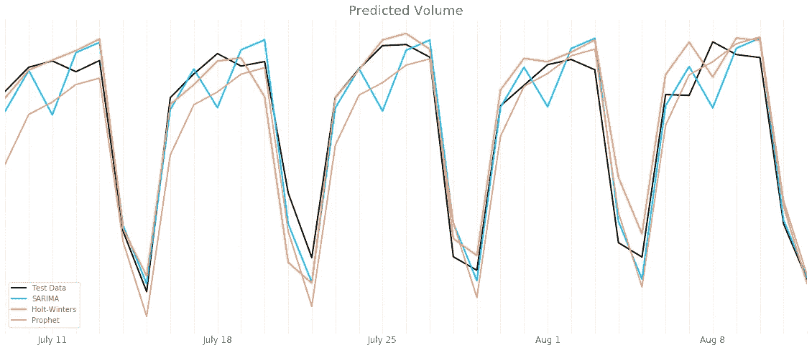

# 用 SARIMA、Holt-Winters 和 Prophet 进行时间序列预测

> 原文：<https://medium.com/analytics-vidhya/time-series-forecasting-with-sarima-holt-winters-and-prophet-d6539fbdebe6?source=collection_archive---------3----------------------->

## 结合熨斗学校的一个项目介绍这三种模式

对我的测试数据运行不同的测试

在 Flatiron 的数据科学训练营中，我的最新项目是运行时间序列预测。我选择了从 UCI 机器上找到的从圣保罗到明尼阿波利斯的 94 号州际公路上的交通量数据…