# 用 Spark ML 进行时间序列预测:第一部分

> 原文：<https://medium.com/analytics-vidhya/time-series-forecasting-with-spark-ml-part-1-4e888144ad27?source=collection_archive---------2----------------------->

在这个由两部分组成的系列中，我们将探索如何使用 Apache Spark ML 库创建简单的时间序列预测模型。第一部分包括介绍、软件/工具描述和探索性数据分析。第二部分包括代码描述、结果和总结。

**目录**

1.  介绍
2.  软件/工具描述
3.  数据描述和探索性数据分析
4.  代码描述(自定义时序包)
5.  结果
6.  摘要
7.  参考

1.  **简介**

动量投资/交易策略是一种策略，投资者买入价格呈上升趋势的流动证券(如股票)，卖出价格呈下降趋势的证券。动量投资的主要目标之一是预测股票的价格趋势，以便制定及时进入和退出投资的策略。

在这项工作中，我们寻求发展*短期*动量交易策略来投资股票。我们研究最受欢迎的蓝筹股称为方(脸书，苹果，和谷歌)的股票。目标是使用 *Apache Spark* 机器学习库和从获得的 2008 年到 2018 年的历史日价格数据来预测方股票的*近期*价格(1 天、3 天、5 天和 7 天预测)。这些预测将被用来制定简单的*短期*交易策略

2.**软件/工具描述**

**Quandl 包**

我们使用 Nasdaq.com 的数据。为此，我们使用一个名为*quandl*【1】的包。这个包裹已经被 Nasdaq.com 收购了。这是一个流行的金融时间序列数据数据库，提供 Python 和 R APIs 来下载数据和对数据执行简单的操作[2]。我们使用 Python-time-series API 来获取数据[3]。

安装:

我们可以从 PyPI 或 github 库使用

*$pip 安装 quandl*

使用软件包:

我们只需在 Python 客户端程序中使用 import 命令导入 quandl 包。

*进口 quandl*

认证:

为了使用*quandl*API 访问数据，我们需要在 *quandl* 网站[1]中创建一个帐户，并生成一个认证密钥。我们需要在 python 客户机程序中如下设置认证密钥，

*quandl。ApiConfig.api_key = "您的 API key"*

查询数据:

我们使用 quandl python API 查询数据。查询的数据作为 *pandas* dataframe 获得。例如，我们可以获得苹果股票价格的时间序列数据如下:

*apple_data = quandl.get("维基/AAPL")*

*apple_data* 是一个 pandas 数据帧，有“Date”列作为它的索引(datetime 数据类型)。如果我们需要在计算中使用“日期”列，我们需要重置索引(图 1a)。

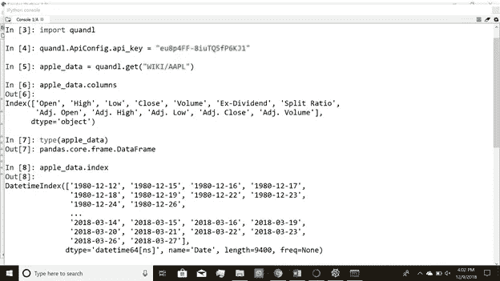

**图 1a。**使用 *quandl* 包从 Nasdaq.com 获取苹果股票价格数据

如果我们需要从一个特定的时间范围内获得数据(图 1b)，我们可以进行过滤时间序列调用[3]，

*apple _ data _ time frame = quandl . get("维基/AAPL "，start _ date = ' 2014–09–01 '，end _ date = ' 2015–09–01 ')*

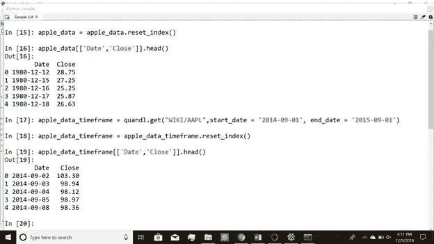

**图 1b。**获取指定时间窗的时间序列数据，这里我们获取 2014 年 9 月 1 日到 2015 年 9 月 1 日之间的苹果股票价格。

此外，如果我们需要在查询时对数据进行任何转换，我们可以在调用中添加转换类型[3]。例如，如果我们需要差异数据(即 yt — yt-1)，命令是(图 1c)，

apple_data_diff = quandl.get("维基/AAPL "，transformation = 'diff ')

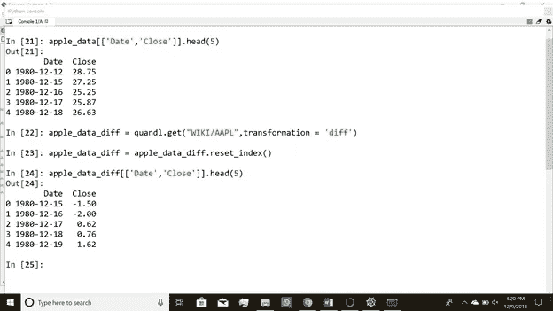

**图 1c。**获得数据经过小的操作，这里我们对苹果股票价格数据进行一阶差分(即当前值—先前时间步长值)

此外，我们可以更改时间序列数据的频率，但是要在 get 调用中附加 frequency 参数。例如，我们可以每天、每周、每月等频率获取数据。我们还可以使用 Excel 插件下载 CSV 格式的数据文件。因此， *quandl* 包提供了一组易于使用的 API，用于从 Nasdaq.com 获取金融时间序列数据。

除了 quandl 包，我们还在 Anaconda 中使用 py spark(Spyder 版本 3.3.2，Jupyter 版本 5.6.0 ),并在 CentOS 7.5 VM 中使用 VMWare Workstation

3.**数据描述和探索性数据分析**

我们观察了苹果、脸书、网飞和谷歌四只股票的股价，并进行了简短的探索性数据分析。我们执行简单的测试来确定时间序列的平稳性。我们将每个股票价格视为一个单变量时间序列。

我们首先检查数据集中的空值。我们首先研究脸书的股票价格数据。我们看到，我们有从 2012 年 5 月 18 日到 2018 年 3 月 27 日的每日收盘价数据，并且数据集中没有空值。

同样，我们检查了苹果、网飞和谷歌股票价格的数据集。

我们有网飞股票从 2002 年 5 月 23 日到 2018 年 3 月 27 日的每日收盘价数据。网飞数据集中没有空值。对于苹果股票，我们有从 1980 年 12 月 12 日到 2018 年 3 月 27 日的每日收盘价数据，并且苹果数据集中没有空值。最后，对于谷歌股票，我们有从 2004 年 8 月 19 日到 2018 年 3 月 27 日的每日收盘价数据。Google 数据集中没有空值。

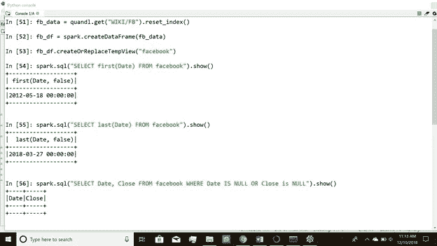

**图 2a。**检查脸书股票价格数据中的空值

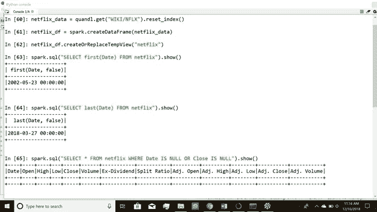

**图 2b。**检查网飞股票价格数据集中的空值。

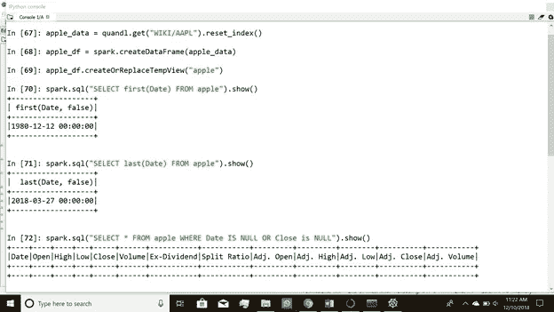

**图 2c。**检查苹果股票价格数据集中的空值。

**图 2d。**检查 Google 股票价格数据集中的空值

**检查时间序列的平稳性:**

我们执行扩展的 Dickey-Fuller 检验，以确定时间序列数据是否是平稳的。我们观察到这四个股票价格时间序列都是非平稳的。

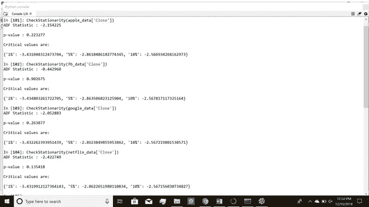

**图 2e。我们看到四个股票价格时间序列都是非平稳的**

我们接受零假设，即如果 p 值> 0.05，时间序列数据是平稳的。以下是结果摘要:

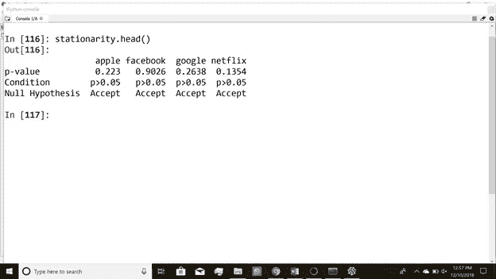

**图 2f。**对所有股票价格进行的增强 Dickey-Fuller 检验汇总

尽管完整的时间序列数据是不稳定的，但也可能有部分数据是稳定的。

我们通过获得数据的一阶差分使时间序列数据近似平稳。第一个差异定义如下:

如果 St 是时间步长 t 时的股价，那么一阶差分 Zt = St-St-1

这种使序列平稳的方法是一种近似的方法，只有当时间序列为*差分平稳*时才有效。然而，众所周知，股票价格数据是非平稳的。它们可以展示趋势、季节性等。我们在本书中不探讨这些方面。

在对原始股票价格数据执行第一次差分之后，我们对差分数据采用机器学习算法。众所周知，这种方法可以产生稳定可靠的预测。为了检查差异数据是否是稳定的，我们再次对差异数据执行增强的 Dickey-Fuller 检验。我们看到差异数据是稳定的。所有 p 值均小于 0.05，ADF 统计值为高度负值，小于 1%临界值(见图 2h、2i)。这表明我们应该使用差分数据进行时间序列预测。

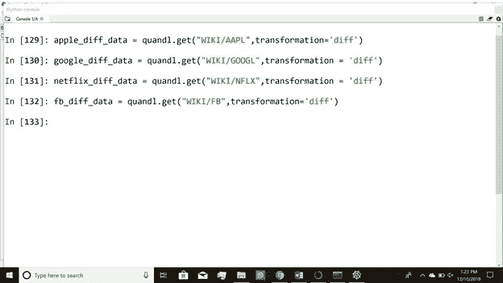

**图 2g。**使用 quandl API 获取差异数据

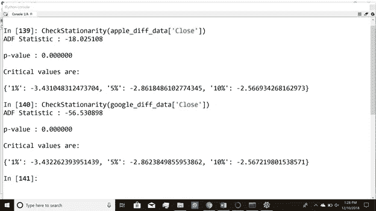

**图 2h。**苹果和谷歌股价的差异数据是稳定的，表现为 p 值< 0.05 和 ADF 统计数据高度负值且小于 1%临界值

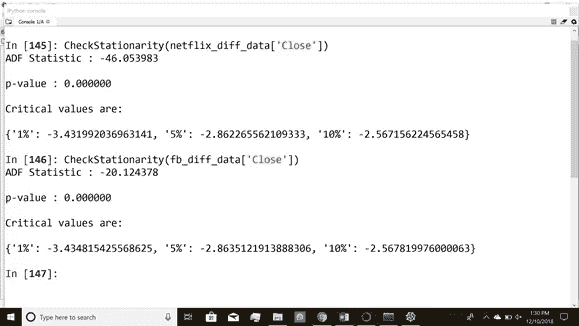

**图 2i。**网飞和脸书股票价格的差异数据是稳定的，由 p 值< 0.05 和 ADF 统计高度负且小于 1%临界值表示

我们比较了谷歌股票的原始价格数据和差异股价数据的滚动平均值。我们看到，在进行差异计算时，差异数据的 30 天滚动平均值在某种程度上是恒定的(这意味着差异数据是稳定的，我们已经对其进行了趋势分析)。

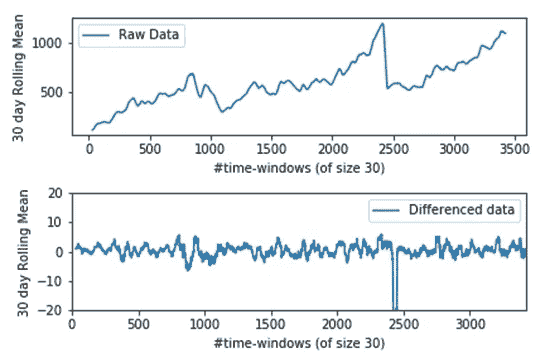

**图 2j。**谷歌股票原始价格数据(上图)和差异价格数据(下图)的 30 天滚动平均值比较；x 轴是时间窗的数量。

但是，标准差没有太大差别。

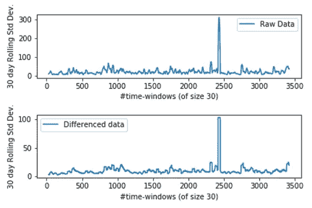

**图 2k。**谷歌股票原始价格数据(上图)和差异价格数据(下图)的 30 天滚动标准差比较；x 轴是时间窗的数量

类似地，对于苹果股票，我们看到，在对数据进行差分后，我们移除了股票价格的趋势，并使其保持平稳。我们看到，差异数据的 30 天滚动平均值大部分是恒定的(除了最后)。

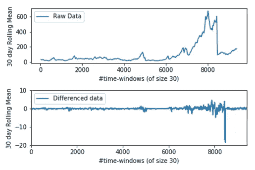

**图 2l。**苹果股票原始价格数据(上图)和差异价格数据(下图)的 30 天滚动平均值比较；x 轴是大小为 30 天的时间窗的数量。

我们看到苹果股价的方差在数据差异上没有太大变化(就像我们在谷歌股价之前看到的那样)。

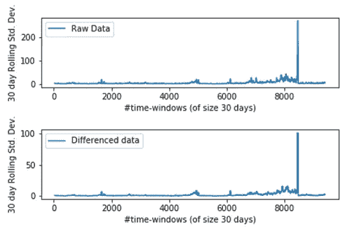

**图 2m。**苹果股票原始价格数据(上图)和差异价格数据(下图)的 30 天滚动标准差比较；x 轴是时间窗的数量。

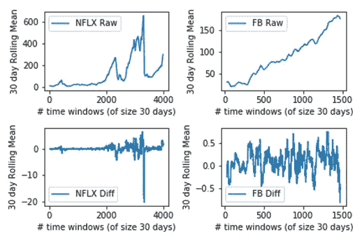

**图 2n。**网飞和脸书股票价格的原始数据和差异数据之间的 30 天滚动平均值比较。

因此，我们得出结论，通过差分时间序列数据，我们可以使其平稳，从而避免虚假回归。在本系列的下一部分，我们将详细描述我们开发的使用 Spark MLlib 执行时间序列预测的类和实用函数。

**参考文献:**

[1][www.quandl.com](http://www.quandl.com)

[http://docs.quandl.com](http://docs.quandl.com)

[3][https://docs.quandl.com/docs/python-time-series](https://docs.quandl.com/docs/python-time-series)