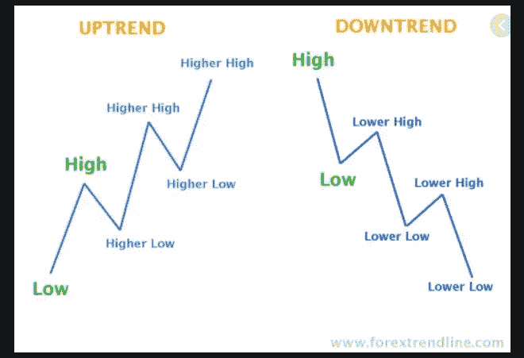
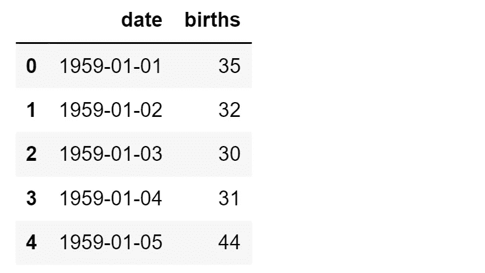
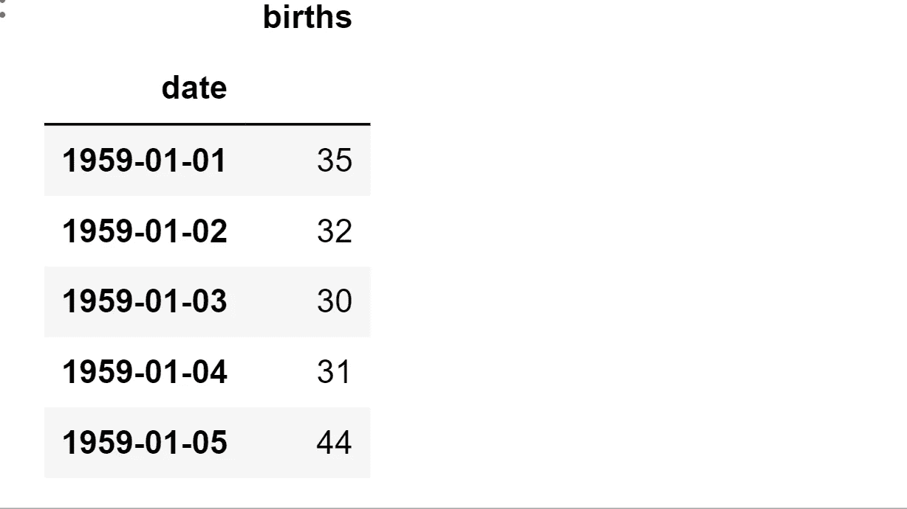
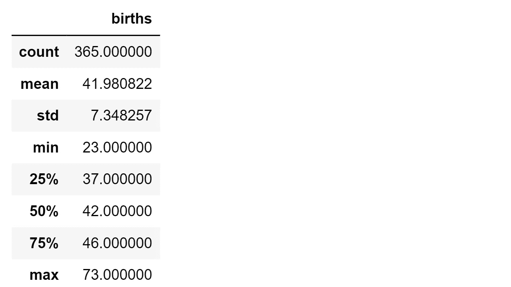
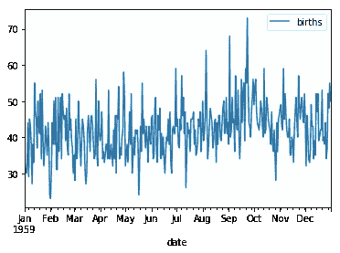
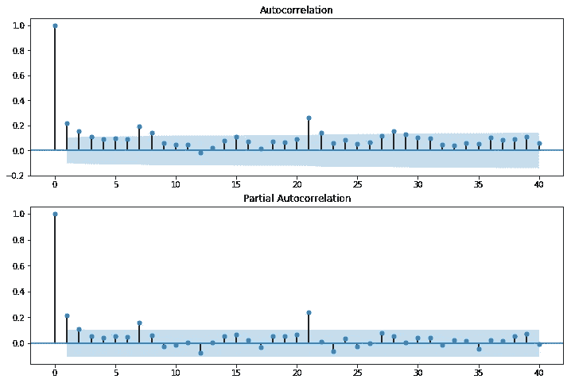
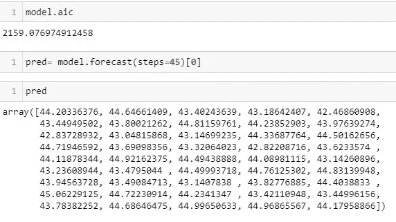

# 机器学习中的时间序列

> 原文：<https://medium.com/analytics-vidhya/time-series-in-machine-learning-c3299742b2e1?source=collection_archive---------15----------------------->

**什么是时间序列？**


时间序列是按时间顺序索引(或列出或绘制)的一系列数据点。最常见的是，时间序列是在连续的等间隔时间点取得的序列。因此，它是一个离散时间数据序列。例如，固定时间段内的股票价格、酒店预订、电子商务销售、天气周期报告等。

时间序列分析包括用于分析时间序列数据的方法，以便提取有意义的统计数据和数据的其他特征。时间序列预测是使用模型根据以前观察到的值来预测未来值。

我们先讨论几个与时间序列相关的定义。

**定义**

*   **级别:**级别是系列值的平均值。
*   **趋势:**趋势显示数据中的模式。例如，股票价格是随时间上升(上升趋势)，还是随时间下降(下降趋势)，或者时间对价格没有太大影响(水平趋势)



*   **季节性:**当数据显示一年以上的重复模式时，可称为季节性模式。例如，空调的销售在夏季每年都会增加，而在冬季会减少。
*   **循环模式:**这些是在较长时间内(一年以上)显示的重复模式。例如，每隔五年，由于大选，股票市场就会有一些波动。
*   **噪声:**不显示任何模式的变化。

现在让我们举一个例子来看看在时间序列分析出现之前都做了些什么。

假设我们手头有一个问题，我们被要求为一家体育制造商预测滑雪产品的销售。您可以使用以下方法进行预测:

**旧方法**

*   **使用 Average:** 您可以将预测作为所有先前值的平均值。
*   **使用移动平均:**这是一段固定时间内以前值的平均值。例如，您可以根据过去 3 个月的平均值来预测 11 月的销售额。过去的三个月将是八月、九月和十月。如果你预测 12 月份的销售额，那么过去的三个月将是 9 月、10 月和 11 月。虽然考虑的月数相同，但是窗口从一组月移到另一组月。因此得名移动平均线。
*   **使用朴素方法:**朴素方法认为预测将与最后一个数字相同。例如，11 月的预测将是 10 月的销售额。
*   **使用季节性朴素法:**季节性朴素法类似于朴素法。这里，新的预测等于上一季度的销售额。

让我们看看 Python 中时间序列的编码部分

# ARIMA(自动回归综合移动平均)

```
**import** numpy **as** np
**from** scipy **import** stats
**import** pandas **as** pd
**import** matplotlib.pyplot **as** plt
**import** statsmodels.api **as** sm
**from** statsmodels.graphics.api **import** qqplot
**%**matplotlib inlineIn[]:
female_birth_data**=**pd.read_csv("daily-total-female-births-CA.csv")*# This is a free datset*
```

 [## 每日-女性分娩总数-CA.csv

### 编辑描述

drive.google.com](https://drive.google.com/file/d/1ZZZz82rgYc1cWPoAdXjI6z2nwlLUpK59/view?usp=sharing) 

```
In [ ]:female_birth_data.head()
```

Out[ ]:



```
In [ ]:birth_data**=**pd.read_csv("daily-total-female-births-CA.csv", index_col**=**[0], parse_dates**=**[0])birth_data.head()
```

Out[ ]:



```
In [ ]:
birth_data.describe()
```

Out[ ]:



```
In[]:
birth_data.plot() *#almost a stationary series*
```

Out[ ]:



```
In[]:*# also called as smoothing*moving_average_birth**=**birth_data.rolling(window**=**20).mean() *# window: This is the number of observations used for calculating the statistic.*In []:moving_average_birth
```

Out[22]:

```
In [ ]:
moving_average_birth.plot() *# we can see that there is a peak in the month of october*
```

Out[ ]:


```
<matplotlib.axes._subplots.AxesSubplot at 0x1f150907b00>
```

在[25]中:

```
sm.stats.durbin_watson(birth_data) *# very less correlation*
```

Out[25]:

```
array([0.04624491])In [ ]:
*# show plots in the notebook* **%**matplotlib inline
fig **=** plt.figure(figsize**=**(12,8))
ax1 **=** fig.add_subplot(211)
fig **=** sm.graphics.tsa.plot_acf(birth_data.values.squeeze(), lags**=**40, ax**=**ax1)
ax2 **=** fig.add_subplot(212)
fig **=** sm.graphics.tsa.plot_pacf(birth_data, lags**=**40, ax**=**ax2)
```



```
In []:training_data**=**birth_data[0:320]
test_data**=**birth_data[320:]In []:from sklearn.model_selection import train_test_splitt_x,t=train_test_split(birth_data) In []:
**from** statsmodels.tsa.arima_model **import** ARIMAIn []:
arima**=** ARIMA(training_data,order**=**(2,1,3))model**=**arima.fit()
model.aicOut[ ]:
2159.076974912458In []:pred**=** model.forecast(steps**=**45)[0]pred
```

Out[ ]:



```
In []:**from** sklearn.metrics **import** mean_squared_errornp.sqrt(mean_squared_error(test_data,pred))Out[]:
6.419420721712673
```

我们将通过预测股票价格来进一步讨论 RNN 的时间序列。

如果你喜欢这篇文章

请喜欢，喜欢的话查看我的其他内容

那就跟我来