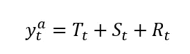

# 预测投资基金回报的时间序列模型

> 原文：<https://medium.com/analytics-vidhya/time-series-modeling-for-forecasting-returns-on-investments-funds-c4784a2eb115?source=collection_archive---------12----------------------->

时间序列分析，讨论了 ARIMA，自动 ARIMA，自相关(ACF)，部分自相关(PACF)，平稳性和差分。


来源: [Pixabay](https://cdn.pixabay.com/photo/2017/03/10/23/13/oracle-girl-2133976_1280.jpg)

# 数据在哪里？

大多数金融时间序列示例使用内置数据集。有时这些数据并不符合您的需求，如果您不知道如何获得您需要的确切数据，您将面临一个障碍。

在这篇文章中，我将演示如何直接从互联网上提取数据。有的包已经做了，但是如果需要另外的相关数据，就自己做了。我会告诉你如何从网站上直接提取资金信息。为了便于演示，我们选择了位于 CVM(comisso de Valores mobiliáRios)网站上的巴西基金，该网站是监管巴西金融业的政府机构。

大概每个国家都有一些类似的机构，存储金融数据，免费提供给公众使用，你可以针对他们。

# 从网站下载数据

要从网站下载数据，我们可以使用 RCurlpackage 中的 getURL 函数。只需在控制台中运行 install.package("RCurl ")命令，就可以从 CRAN 下载该软件包。

下载数据，网址【http://dados.cvm.gov.br/dados/FI/DOC/INF_DIARIO/DADOS/】[T3](http://dados.cvm.gov.br/dados/FI/DOC/INF_DIARIO/DADOS/)

```
library(tidyverse) # a package to handling the messy data and organize it
library(RCurl) # The package to download a spreadsheet from a website
library(forecast) # This package performs time-series applications
library(PerformanceAnalytics) # A package for analyze financial/ time-series data
library(readr) # package for read_delim() function

#creating an object with the spreadsheet url url <- "http://dados.cvm.gov.br/dados/FI/DOC/INF_DIARIO/DADOS/inf_diario_fi_202006.csv"

#downloading the data and storing it in an R object
 text_data <- getURL(url, connecttimeout = 60)

#creating a data frame with the downloaded file. I use read_delim function to fit the delim pattern of the file. Take a look at it!
df <- read_delim(text_data, delim = ";")

#The first six lines of the data
head(df)### A tibble: 6 x 8
##   CNPJ_FUNDO DT_COMPTC  VL_TOTAL VL_QUOTA VL_PATRIM_LIQ CAPTC_DIA RESG_DIA
##   <chr>      <date>        <dbl>    <dbl>         <dbl>     <dbl>    <dbl>
## 1 00.017.02~ 2020-06-01 1123668\.     27.5      1118314\.         0        0
## 2 00.017.02~ 2020-06-02 1123797\.     27.5      1118380\.         0        0
## 3 00.017.02~ 2020-06-03 1123923\.     27.5      1118445\.         0        0
## 4 00.017.02~ 2020-06-04 1124052\.     27.5      1118508\.         0        0
## 5 00.017.02~ 2020-06-05 1123871\.     27.5      1118574\.         0        0
## 6 00.017.02~ 2020-06-08 1123999\.     27.5      1118639\.         0        0
## # ... with 1 more variable: NR_COTST <dbl>
```

# 处理混乱

这个数据集包含了在 CVM 注册的所有基金的大量信息。首先，我们必须选择其中之一来应用我们的时间序列分析。

巴西市场有很多资金。为了计算它的数量，我们必须运行下面的代码:

```
#get the unique identification code for each fund
 x <- unique(df$CNPJ_FUNDO)

length(x) # Number of funds registered in Brazil.##[1] 17897
```

我选择了识别代码(CNPJ)为 12 . 987 . 743/0001–86 的阿拉斯加黑色 FICFI Em es-Bdr nível I 进行分析。

在开始之前，我们需要更多的观察来做好分析。为了扩大时间窗口，我们需要从 CVM 网站下载更多数据。可以通过向数据中添加其他月份来实现这一点。

为此，我们必须采取一些措施:

首先，我们必须生成一系列循环和下载数据的路径。使用下面的命令，我们将获取 2018 年 1 月到 2020 年 7 月的数据。

```
# With this command we generate a list of urls for the years of 2020, 2019, and 2018 respectively.

 url20 <- c(paste0("http://dados.cvm.gov.br/dados/FI/DOC/INF_DIARIO/DADOS/inf_diario_fi_", 202001:202007, ".csv"))
 url19 <- c(paste0("http://dados.cvm.gov.br/dados/FI/DOC/INF_DIARIO/DADOS/inf_diario_fi_", 201901:201912, ".csv"))
 url18 <- c(paste0("http://dados.cvm.gov.br/dados/FI/DOC/INF_DIARIO/DADOS/inf_diario_fi_", 201801:201812, ".csv"))
```

获得路径后，我们必须循环遍历这个路径向量，并将数据存储到 R 环境中的一个对象中。请记住，在所有 17897 只基金中，我选择了其中的一只，阿拉斯加黑人投资基金

```
# creating a data frame object to fill of funds information
 fundoscvm <- data.frame()

 # Loop through the urls to download the data and select the chosen investment fund.
 # This loop could take some time, depending on your internet connection.
 for(i in c(url18,url19,url20)){
   csv_data <- getURL(i, connecttimeout = 60)
   fundos <- read_delim(csv_data, delim = ";")

   fundoscvm <- rbind(fundoscvm, fundos)
   rm(fundos)
 }
```

现在，我们可以看看名为 fundoscvm 的新数据框。这是一个巨大的数据集，有 10056135 行。

现在让我们选择要预测的基金。

```
alaska <- fundoscvm%>%
     filter(CNPJ_FUNDO == "12.987.743/0001-86") # filtering for the `Alaska Black FICFI Em Ações - Bdr Nível I` investment fund.# The first six observations of the time-series
 head(alaska)## # A tibble: 6 x 8
 ##   CNPJ_FUNDO DT_COMPTC  VL_TOTAL VL_QUOTA VL_PATRIM_LIQ CAPTC_DIA RESG_DIA
 ##   <chr>      <date>        <dbl>    <dbl>         <dbl>     <dbl>    <dbl>
 ## 1 12.987.74~ 2018-01-02   6.61e8     2.78    630817312\.  1757349\. 1235409.
 ## 2 12.987.74~ 2018-01-03   6.35e8     2.78    634300534\.  5176109\. 1066853.
 ## 3 12.987.74~ 2018-01-04   6.50e8     2.82    646573910\.  3195796\.  594827.
 ## 4 12.987.74~ 2018-01-05   6.50e8     2.81    647153217\.  2768709\.  236955.
 ## 5 12.987.74~ 2018-01-08   6.51e8     2.81    649795025\.  2939978\.  342208.
 ## 6 12.987.74~ 2018-01-09   6.37e8     2.78    646449045\.  4474763\.   27368.
 ## # ... with 1 more variable: NR_COTST <dbl># The las six observations...
 tail(alaska)## # A tibble: 6 x 8
 ##   CNPJ_FUNDO DT_COMPTC  VL_TOTAL VL_QUOTA VL_PATRIM_LIQ CAPTC_DIA RESG_DIA
 ##   <chr>      <date>        <dbl>    <dbl>         <dbl>     <dbl>    <dbl>
 ## 1 12.987.74~ 2020-07-24   1.89e9     2.46   1937895754\.   969254\.  786246.
 ## 2 12.987.74~ 2020-07-27   1.91e9     2.48   1902905141\.  3124922\. 2723497.
 ## 3 12.987.74~ 2020-07-28   1.94e9     2.53   1939132315\.   458889\.       0 
 ## 4 12.987.74~ 2020-07-29   1.98e9     2.57   1971329582\.  1602226\.  998794.
 ## 5 12.987.74~ 2020-07-30   2.02e9     2.62   2016044671\.  2494009\. 2134989.
 ## 6 12.987.74~ 2020-07-31   1.90e9     2.47   1899346032\.   806694\. 1200673.
 ## # ... with 1 more variable: NR_COTST <dbl>
```

CVM 网站提供了大量关于所选基金的信息。我们只对基金份额价值感兴趣。这一信息在 VL_QUOTAvariable。有了股票价值，我们可以计算几个财务指标，并执行其预测。

数据维度是 649，8。期间范围是:

```
# period range:
 range(alaska$DT_COMPTC)## [1] "2018-01-02" "2020-07-31"
```

让我们看看基金的股价。

```
ggplot(alaska, aes( DT_COMPTC, VL_QUOTA))+ geom_line()+
   scale_x_date(date_breaks = "3 month") +
   theme(axis.text.x=element_text(angle=60, hjust=1))
```


新冠肺炎带来很多麻烦，不是吗？

一个金融原始序列可能包含一些问题，这些问题以模式的形式重复出现，或者根据经济周期出现。

由于一周中的交易日，每日金融时间序列通常具有 5 个周期的季节性。有些人应该考虑到金融市场不运转的假日和其他日子。为了简化分析，我将省略这些情况。

我们可以在中观察到，该系列似乎在一段时间内上升，之后下降。这是在数据中观察到的趋势模式的一个很好的例子。

有趣的是,*分解*序列以查看序列的“内部”,并分离每个影响，以捕捉金融时间序列的确定性(趋势和季节性)和随机(剩余)部分。

# 分解系列

时间序列可以分解为三个部分:趋势、季节和余数(随机)。

有两种方法可以做到这一点:加法形式和乘法形式。

设 y_t 是我们的时间序列，T_t 代表趋势，S_t 是季节分量，R_t 是余数，或随机分量。
在加法形式中，我们假设数据结构是其组成部分的总和:



在**乘法**形式中，我们假设数据结构是其组件的乘积:


这些结构是相关的。乘法结构的对数是(对数)分量的加法结构:


设置*频率 5* 的季节性成分，我们可以考虑基金回报的周日效应。我们用 5 是因为没有周末的数据。你也应该考虑假期，但是因为它根据国家的分析而变化，我忽略了这个影响。

```
library(stats) # a package to perform and manipulate time-series objects
 library(lubridate) # a package to work with date objects
 library(TSstudio) # A package to handle time-series data

 # getting the starting point of the time-series data
 start_date <- min(alaska$DT_COMPTC)

 # The R program does not know that we are working on time-series. So we must tell the software that our data is a time-series. We do this using the ts() function

 ## In the ts() function we insert first the vector that has to be handle as a time-series. Second, we tell what is the starting point of the time series. Third, we have to set the frequency of the time-series. In our case, it is 5.
 share_value <- ts(alaska$VL_QUOTA, start =start_date, frequency = 5)

 # the function decompose() performs the decomposition of the series. The default option is the additive form.
 dec_sv <- decompose(share_value)

 # Take a look!
 plot(dec_sv)
```


可加时间序列的分解。

上图显示了观察到的完整序列，以及其三个组成部分趋势，季节性趋势和随机趋势，以**相加**的形式分解。

下图显示了观察到的完整序列，以及其三个组成部分趋势、季节性趋势和随机趋势，以**乘法**形式分解。

这两种形式非常相关。季节性成分略有变化。

```
dec2_sv <- decompose(share_value, type = "multiplicative")

 plot(dec2_sv)
```


在时间序列应用程序中，我们对基金的回报感兴趣。相关数据集中的另一个信息对我们毫无用处。

基金的日收益率(R *t* )是从份额价值的(对数)第一个差值中得到的。在你的数据里，他的变量叫 VL _ 配额。日志很重要，因为它为我们提供了每日回报的百分比。


其算法是:

```
R1 <- log(alaska$VL_QUOTA)%>% # generate the log of the series
   diff() # take the first difference

 plot.ts(R1) # function to plot a time-series
```


return(对数第一差)系列在之前的分解中扮演余数的角色。

分解数据的随机成分不受季节影响。我们可以手动计算 5 个周期的差值:


```
R5 <- R1 %>% diff(lag = 5)
 plot.ts(R5)
```


这两幅图相似。但是第二种可能没有季节效应。

我们可以使用 forecast 软件包的 ggsubseriesplot 函数绘制一个图表来直观地识别序列的季节性。

```
ggsubseriesplot(share_value)
```


哦，看来我们对季节性数据的假设是错误的！在这个时间序列中没有明显的季节性模式。

# 预测

在预测之前，我们必须验证数据是随机的还是自相关的。为了验证数据的自相关性，我们可以首先使用自相关函数(ACF)和偏自相关函数(PACF)。

# 自相关函数和偏自相关函数

如果我们使用原始数据，自相关是明显的。蓝线表示滞后自相关的显著性极限。在下面的 ACF 图中，黑色垂直线超过水平蓝线意味着自相关在 5%的置信水平下是显著的。向上的线序列表示测试系列的正自相关。

为了知道自相关的顺序，我们必须看一看偏自相关函数(PACF)。

```
library(TSstudio)

 R <- alaska$VL_QUOTA #extract the fund share value from the data
 Racf <- acf(R, lag.max = 12) # compute the ACF
```


基金份额价值的自相关函数。

```
Rpacf <- pacf(R, lag.max = 12) # compute the PACF
```


偏相关函数确认滞后 1、6 和 8 的数据中的自相关。

大多数时候，在财务分析中，我们感兴趣的是基金份额的回报。要使用它，可以对回报进行预测分析，而不是使用基金股价。我给你补充一下，这个程序是处理基金份额价格非平稳性的好方法。

因此，我们可以执行回报的(部分)自相关函数:

```
library(TSstudio)

 Racf <- acf(R1, lag.max = 12) # compute the ACF
```


基金份额(日志)回报的 ACF。

```
Racf <- acf(R5, lag.max = 12) # compute the ACF
```


上面的 ACF 图显示了负自相关模式，但无法直观地确定确切的顺序，或者数据中是否存在额外的移动平均成分。

```
Rpacf <- pacf(R1, lag.max = 12) # compute the PACF
```


基金份额(对数)回报的 PACF。

```
Rpacf <- pacf(R5, lag.max = 12) # compute the PACF
```


收益率的自相关函数对我们没有太大的帮助。我们唯一能确定的是存在一种负的自相关模式。

一种确定要使用的组件类型的方法是(自相关或移动平均)。我们可以执行各种型号规格，并选择具有更好的 AIC 或 BIC 标准的型号。

# 用 ARIMA 模型预测

执行预测模型的一个好选择是使用 ARIMA 模型族。对于那些不熟悉 ARIMA 模型甚至自相关函数理论的人，我推荐 Brooks 的书《金融计量经济学导论》。

为了对 ARIMA(p，d，q)规格建模，我们必须知道自相关分量的阶数(p)、积分的阶数(d)和移动平均过程的阶数(q)。

好吧，但是，怎么做呢？

第一种策略是查看自相关函数和偏自相关函数。因为我们不能只根据我们在图表中看到的来陈述一种模式，我们必须测试一些模型规格，并选择一个具有更好的 AIC 或 BIC 标准的模型。

我们已经知道收益是平稳的，所以我们不需要验证平稳条件(如果你不相信我，你可以这么做:)。

```
# The ARIMA regression
 arR <- Arima(R5, order = c(1,0,1)) # the auto.arima() function automatically choose the optimal lags to AR and MA components and perform tests of stationarity and seasonality

 summary(arR) # now we can see the significant lags## Series: R5 
 ## ARIMA(1,0,1) with non-zero mean 
 ## 
 ## Coefficients:
 ##           ar1     ma1    mean
 ##       -0.8039  0.6604  0.0000
 ## s.e.   0.0534  0.0636  0.0016
 ## 
 ## sigma^2 estimated as 0.001971:  log likelihood=1091.75
 ## AIC=-2175.49   AICc=-2175.43   BIC=-2157.63
 ## 
 ## Training set error measures:
 ##                        ME       RMSE        MAE      MPE     MAPE      MASE
 ## Training set 9.087081e-07 0.04429384 0.02592896 97.49316 192.4589 0.6722356
 ##                     ACF1
 ## Training set 0.005566003
```

如果希望进行快速分析，而不是执行多个模型并比较 AIC 标准，可以使用 auto.arima()函数，该函数自动选择自相关、积分的顺序，并测试数据中的季节成分。

我用它来知道 ARIMA(1，0，1)最适合我的数据！！

有趣的是检查残差以验证模型是否考虑了数据的所有非随机成分。我们可以用 forecast 软件包的 checkresiduals 函数来实现。

```
checkresiduals(arR)# checking the residuals
```


```
 ## 
 ##  Ljung-Box test
 ## 
 ## data:  Residuals from ARIMA(1,0,1) with non-zero mean
 ## Q* = 186.44, df = 7, p-value < 2.2e-16
 ## 
 ## Model df: 3\.   Total lags used: 10
```

看看残差 ACF。该模型似乎没有考虑所有非随机成分，可能是由于条件异方差。由于这不是本文的重点，你可以谷歌一下 Arch-Garch 家族模型

# 现在，预测！

预测可以很容易地用一个单一的功能预测。您应该只插入 auto.arima()函数给定的模型对象和要预见的未来期间。

```
farR <-forecast(arR, 15)

 ## Fancy way to see the forecasting plot

 plot_forecast(farR)
```


TSstudio 包的函数 plot_forecast 是查看绘图预测的好方法。如果您将鼠标光标放在图上，您可以看到基金份额的笛卡尔坐标位置。

现在你可以去预测你想要的一切。祝你好运！